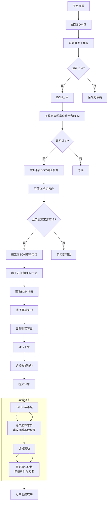
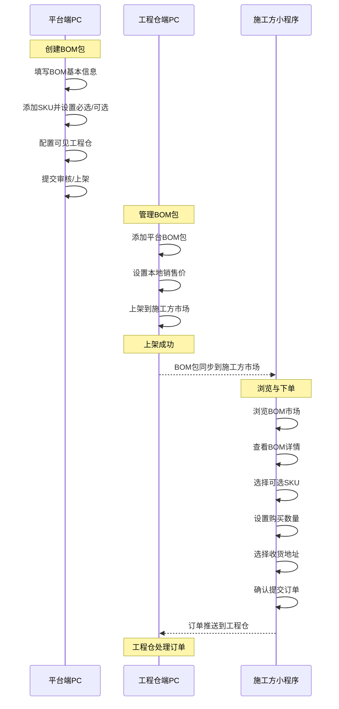
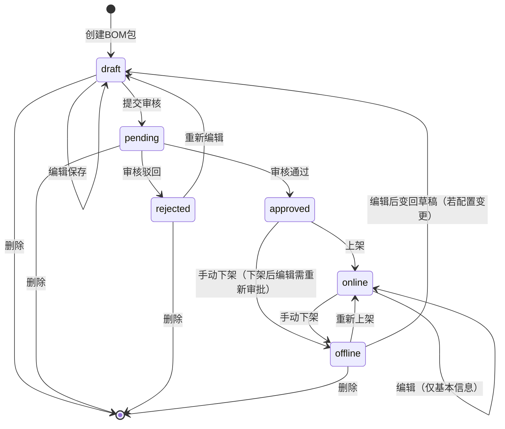
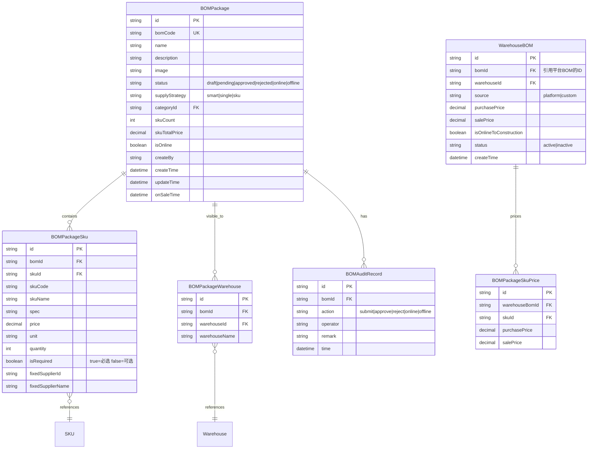

# BOM基装包完整功能设计

> 版本：v1.0  
> 文档状态：初稿  
> 所属模块：商品市场 - BOM基装包  
> 覆盖端：平台端（PC）→ 工程仓端（PC）→ 施工方端（小程序）

## 版本历史

| 版本 | 日期 | 修订内容 |
|:----:|:----:|---------|
| v1.0 | 2026-05-22 | 初始创建，覆盖BOM基装包全链路三个端完整功能设计 |

---

## 术语表

| 术语 | 全称 | 说明 |
|:---:|:----|------|
| BOM | Bill of Materials | 物料清单，本系统中指预设的材料套餐组合包 |
| BOM基装包 | BOM Base Package | 平台/工程仓创建的标准材料套餐，包含多个SKU商品，施工方可一键下单 |
| 平台BOM包 | Platform BOM | 由平台运营在平台端创建的官方BOM包，可被工程仓引用 |
| 自建BOM包 | Custom BOM | 由工程仓管理员自行创建的本地BOM包 |
| 供应商策略 | Supplier Strategy | BOM包中SKU的供应商分配方式（智能分配/单一供应商/SKU级指定） |
| 施工方市场 | Construction Market | 施工方小程序中展示BOM包的市场页面 |

---

## 一、业务背景与目标

### 1.1 业务背景

在建筑工程材料采购场景中，施工方在项目不同阶段需要采购多品类、多规格的建筑材料。目前存在以下痛点：

- **采购效率低**：施工方需要逐一搜索和选择每个SKU商品，下单流程繁琐，容易漏买/错买
- **配置经验难复用**：常用材料组合（如水电工程包、防水套餐等）每次都需要重新选品
- **价格不透明**：套餐组合缺乏标准定价机制，施工方难以预估项目材料成本
- **多端协同断层**：平台创建的标准化BOM包无法便捷同步到工程仓和施工方端

### 1.2 核心目标

| 指标 | 当前值 | 目标值 | 衡量方式 |
|:----|:------:|:------:|---------|
| BOM包下单占比 | 0%（新功能） | 施工方总订单的30%以上 | 订单统计 |
| 施工方单次下单时间 | 30分钟（逐SKU选购） | 5分钟以内（BOM一键下单） | 用户操作计时 |
| SKU错采/漏采率 | 约15% | 5%以下 | 售后申请中"漏买"类占比 |

### 1.3 非目标

- 不涉及BOM包内SKU的库存管理（库存由库存模块独立管理）
- 不涉及BOM包的物流配送（物流由订单模块处理）
- 不涉及BOM包内物料的现场消耗跟踪
- 本期不支持施工方自定义创建BOM包

---

## 二、用户与角色

### 2.1 用户角色定义

| 角色 | 系统标识 | 所属端 | 职责说明 |
|:----|:--------:|:------:|---------|
| 平台运营 | `platform_admin` | 平台端PC | 创建/管理官方BOM包，配置工程仓可见权限 |
| 工程仓管理员 | `warehouse_admin` | 工程仓端PC | 引用平台BOM或自建BOM，设置销售价，上架到施工方市场 |
| 施工方人员 | `construction_worker` | 施工方小程序 | 浏览BOM市场，查看BOM详情，选择SKU并下单 |
| 系统管理员 | `sys_admin` | 平台端PC | 查看所有BOM包，处理异常 |

### 2.2 权限矩阵

| 操作 | 平台运营 | 工程仓管理员 | 施工方人员 | 系统管理员 |
|:----|:--------:|:------------:|:----------:|:---------:|
| 查看BOM列表 | ✅ | ✅ | ✅ | ✅ |
| 创建BOM包 | ✅ | ✅ | ❌ | ✅ |
| 编辑BOM包 | ✅ | ✅（仅自建） | ❌ | ✅ |
| 删除BOM包 | ✅ | ✅（仅自建） | ❌ | ✅ |
| 配置BOM权限 | ✅ | ❌ | ❌ | ✅ |
| BOM定价 | ❌ | ✅ | ❌ | ❌ |
| 上架到施工方市场 | ❌ | ✅ | ❌ | ❌ |
| 浏览BOM市场 | ❌ | ❌ | ✅ | ❌ |
| BOM下单 | ❌ | ❌ | ✅ | ❌ |
| 同步平台BOM | ❌ | ✅ | ❌ | ❌ |

---

## 三、业务流程

### 3.1 业务总流程图



### 3.2 跨端泳道图



### 3.3 BOM包状态机图



### 3.4 状态转换矩阵

| 当前状态 | 触发事件 | 操作角色 | 前置条件 | 下一状态 | 数据变更 |
|:--------:|---------|:--------:|:--------:|:--------:|---------|
| draft | 提交审核 | 平台运营 | 名称非空、至少1个SKU | pending | status→pending, submitTime更新 |
| draft | 编辑保存 | 平台运营 | 名称非空 | draft | 更新基本信息/SKU列表 |
| pending | 审核通过 | 平台运营/系统管理员 | 无 | approved | status→approved, auditTime更新 |
| pending | 审核驳回 | 平台运营/系统管理员 | 驳回原因非空 | rejected | status→rejected, rejectReason记录 |
| rejected | 重新编辑 | 平台运营 | 名称非空 | draft | status→draft, 清除驳回原因 |
| approved | 上架 | 平台运营 | 已配置可见工程仓 | online | status→online, onSaleTime更新, isOnline=true |
| online | 下架 | 平台运营 | 无 | offline | status→offline, isOnline=false |
| online | 编辑 | 平台运营 | 仅基本信息变更 | online | 更新基本信息，生成变更记录 |
| offline | 重新上架 | 平台运营 | 无 | online | status→online, isOnline=true |
| offline | 编辑 | 平台运营 | 无 | draft | status→draft，清除上架状态 |

---

## 四、数据模型

### 4.1 ER图



### 4.2 核心字段说明

#### BOMPackage（BOM包主表）

| 字段 | 类型 | 必填 | 说明 | 默认值 |
|:----|:----|:----:|------|:------:|
| id | varchar(32) | 是 | 主键ID | UUID |
| bomCode | varchar(32) | 是 | BOM编码，自动生成：BOM-{分类缩写}-{序列号} | - |
| name | varchar(100) | 是 | BOM包名称，唯一 | - |
| description | varchar(500) | 否 | BOM包说明 | '' |
| image | varchar(500) | 否 | BOM包展示图片URL | '' |
| status | varchar(20) | 是 | 状态枚举 | 'draft' |
| supplyStrategy | varchar(20) | 是 | 供应商策略：smart/single/sku | 'smart' |
| skuCount | int | 是 | SKU种类数 | 0 |
| skuTotalPrice | decimal(12,2) | 是 | SKU单价总计 | 0 |
| isOnline | tinyint(1) | 是 | 是否上架 | 0 |
| createBy | varchar(50) | 是 | 创建人 | - |
| createTime | datetime | 是 | 创建时间 | NOW() |

#### BOMPackageSku（BOM-SKU关联表）

| 字段 | 类型 | 必填 | 说明 | 默认值 |
|:----|:----|:----:|------|:------:|
| id | varchar(32) | 是 | 主键ID | UUID |
| bomId | varchar(32) | 是 | BOM包ID，外键 | - |
| skuId | varchar(32) | 是 | SKU ID，外键 | - |
| isRequired | tinyint(1) | 是 | 是否必选：1=必选，0=可选 | 1 |
| quantity | int | 是 | 套餐内包含数量（单位数量） | 1 |
| price | decimal(12,2) | 是 | 单品价格（创建时锁定快照） | - |

#### WarehouseBOM（工程仓BOM关联表）

| 字段 | 类型 | 必填 | 说明 | 默认值 |
|:----|:----|:----:|------|:------:|
| id | varchar(32) | 是 | 主键ID | UUID |
| bomId | varchar(32) | 是 | 关联平台BOM ID | - |
| warehouseId | varchar(32) | 是 | 工程仓ID | - |
| source | varchar(20) | 是 | 来源：platform/custom | - |
| purchasePrice | decimal(12,2) | 是 | 采购价（平台BOM取快照价） | 0 |
| salePrice | decimal(12,2) | 否 | 工程仓设置的销售价 | NULL |
| isOnlineToConstruction | tinyint(1) | 是 | 是否上架到施工方市场 | 0 |

### 4.3 枚举值定义

#### BOM包状态

| 值 | 含义 | 说明 |
|:--:|:----|------|
| draft | 草稿 | 创建中尚未提交审核 |
| pending | 待审核 | 已提交审核，等待审批 |
| approved | 已通过 | 审核通过，可上架 |
| rejected | 已驳回 | 审核不通过，需重新编辑 |
| online | 已上架 | 施工方可正常浏览购买 |
| offline | 已下架 | 施工方不可见 |

#### 供应商策略

| 值 | 含义 | 说明 |
|:--:|:----|------|
| smart | 智能分配 | 系统自动选择最优供应商，各供应商分别发货 |
| single | 单一供应商 | 统一从指定供应商采购，统一发货 |
| sku | SKU级指定 | 每个SKU已指定供应商，各供应商分别发货 |

#### 工程仓BOM来源

| 值 | 含义 | 说明 |
|:--:|:----|------|
| platform | 平台BOM包 | 从平台端创建的官方BOM包同步到工程仓 |
| custom | 自建BOM包 | 工程仓管理员自行创建的本地BOM包 |

---

## 五、功能清单

### 5.1 平台端功能树

```
商品市场
└── BOM基装包管理
    ├── BOM列表
    │   ├── 搜索（BOM名称）
    │   ├── 筛选（上架状态 Tab）
    │   ├── 列表展示（BOM编码/名称/SKU数/总价/标签/可见工程仓/上架状态/创建时间）
    │   └── 操作（查看/编辑/权限配置/删除）
    ├── 创建BOM包
    │   ├── 第一步：基本信息（名称/图片/标签/说明）
    │   ├── 第二步：SKU明细（搜索添加SKU/设置必选/单价/批量导入）
    │   └── 权限配置弹窗
    │       ├── 选择可见工程仓（穿梭框）
    │       └── 上架开关
    ├── BOM详情
    │   ├── 基本信息展示
    │   ├── SKU明细表格
    │   ├── 审核记录时间线
    │   └── 操作（编辑/权限配置/上架/下架/删除）
    └── BOM编辑
        ├── 基本信息编辑
        ├── SKU增删
        └── 重新计算总价
```

### 5.2 工程仓端功能树

```
商品市场
└── BOM包管理
    ├── BOM列表
    │   ├── Tab切换（全部/平台BOM包/自建BOM包/已上架市场）
    │   ├── 列表展示（BOM信息/SKU数/采购价/销售价/库存/上架开关/状态）
    │   └── 操作（查看/编辑/同步/定价/删除）
    ├── 添加平台BOM包（弹窗）
    │   ├── 搜索平台BOM包
    │   ├── 分类筛选
    │   └── 多选 + 确认添加
    ├── 创建自建BOM包
    │   ├── 选择商品SKU
    │   └── 设置套餐内容
    └── BOM定价（弹窗）
        ├── 设置销售价
        ├── 利润率计算
        └── 上架到施工方市场开关
```

### 5.3 施工方端功能树

```
商品市场
└── BOM市场
    ├── BOM市场首页
    │   ├── 搜索（BOM名称）
    │   ├── 分类筛选（水电/防水/木工/油漆/泥瓦）
    │   ├── 排序（综合/销量/价格）
    │   └── BOM卡片列表（图片/名称/描述/SKU数/销量/价格）
    ├── BOM详情
    │   ├── BOM信息（图片/名称/描述/价格/标签）
    │   ├── 供应商策略展示
    │   ├── SKU明细列表（全选/清空+单项选择+必选标记）
    │   ├── 底部汇总（已选SKU数/总价/购买数量+立即购买）
    │   └── 立即购买 → 跳转下单页
    └── BOM下单
        ├── 选择门店
        ├── 选择收货地址
        ├── 选择工程仓库
        ├── 材料清单（调整数量+库存展示）
        ├── 金额汇总
        ├── 同意采购协议
        └── 提交订单 → 支付弹窗
```

---

## 六、详细功能说明

### 6.1 平台端 - BOM列表

#### 入口与前置条件

- **入口路径**：商品市场 → BOM基装包
- **前置条件**：用户已登录且拥有平台运营角色

#### 字段说明

| 字段 | 组件 | 必填 | 校验规则 | 错误提示 | 默认值 | 数据来源 |
|:----|:----|:----:|:--------:|:--------:|:------:|:--------:|
| BOM编码 | 文本 | - | - | - | - | 接口返回 |
| BOM包信息 | 图文混合 | - | - | - | - | 接口返回（图片+名称） |
| SKU数量 | 文本 | - | - | - | - | 接口返回 |
| SKU单价总计 | 金额文本 | - | - | - | - | 接口返回 |
| 标签 | Tag组 | - | - | - | - | 接口返回 |
| 可见工程仓 | Tag组 | - | - | - | - | 接口返回 |
| 上架状态 | Switch | - | - | - | false | 接口返回 |
| 创建时间 | 时间文本 | - | - | - | - | 接口返回 |

#### 交互说明

1. **搜索**：输入BOM名称关键词 → 按回车触发搜索 → 表格数据过滤
2. **Tab切换**：全部/已上架/已下架 → 切换时更新表格数据 → Tab高亮
3. **翻页**：支持分页，每页10条 → 点击页码切换
4. **操作按钮**：
   - 查看：跳转详情页
   - 编辑：跳转编辑页（复用创建页，回填数据）
   - 权限配置：弹窗显示工程仓穿梭框
   - 删除：二次确认 → 删除成功Toast
5. **上架状态Switch**：点击触发上架/下架 → 成功更新状态
6. **创建按钮**：页面右上角 → 跳转创建页

#### 排序/筛选/分页规则

- **默认排序**：按创建时间倒序
- **Tab筛选**：全部(不筛选)/已上架(isOnline=true)/已下架(isOnline=false)
- **关键词搜索**：模糊匹配BOM名称

---

### 6.2 平台端 - 创建BOM包

#### 第一步：基本信息

| 字段 | 组件 | 必填 | 校验规则 | 错误提示 | 默认值 | 数据来源 |
|:----|:----|:----:|:--------:|:--------:|:------:|:--------:|
| BOM包名称 | 输入框 | 是 | 1-50字符, 不可重复 | "BOM名称已存在" | '' | 用户输入 |
| BOM图片 | 图片上传 | 否 | 仅图片格式，≤5MB | "图片格式不正确" | '' | 用户上传 |
| BOM标签 | 标签输入 | 否 | 每标签≤10字符，最多5个 | - | [] | 用户输入 |
| BOM说明 | 文本域 | 否 | ≤500字符 | - | '' | 用户输入 |

#### 第二步：SKU明细

| 字段 | 组件 | 必填 | 校验规则 | 错误提示 | 默认值 | 数据来源 |
|:----|:----|:----:|:--------:|:--------:|:------:|:--------:|
| SKU搜索 | 搜索输入框 | - | - | - | - | 用户输入 |
| SKU列表 | 表格 | 是 | 至少选择1个SKU | "请至少选择1个商品" | [] | 商品中心 |
| 必选开关 | Switch | 是 | - | - | true | 用户设置 |
| 数量 | 数字 | 是 | ≥1 | "数量必须大于0" | 1 | 用户输入 |

#### 交互说明

1. **两步步骤条**：基本信息(step0) → SKU明细(step1)
2. **Step0 → Step1**：点击"下一步" → 校验基本信息 → 通过后进入
3. **SKU添加**：点击"添加SKU" → 弹出SKU选择器 → 勾选后确认 → 追加到列表
4. **批量导入**：点击"批量导入" → CSV模板下载 → 上传文件 → 解析并追加
5. **必选开关**：控制该SKU是否为施工方必选项目
6. **移除SKU**：点击行内"移除"按钮 → 从列表删除（无二次确认）
7. **总价计算**：根据SKU单价实时累加
8. **提交**：点击"提交" → 校验至少1个SKU → 成功后跳转详情页

---

### 6.3 平台端 - BOM权限配置

| 字段 | 组件 | 必填 | 校验规则 | 错误提示 | 默认值 | 数据来源 |
|:----|:----|:----:|:--------:|:--------:|:------:|:--------:|
| 可选工程仓 | 穿梭框左侧 | - | - | - | - | 接口返回 |
| 已选工程仓 | 穿梭框右侧 | - | 至少选1个（上架时校验） | "请至少选择一个工程仓" | [] | 用户选择 |
| 上架到市场 | Switch | 否 | - | - | false | 用户设置 |

#### 交互说明

1. **穿梭框**：左侧为未选工程仓列表 → 右侧为已选工程仓列表
2. **全选/清空**：右侧上方提供全选和清空快捷按钮
3. **搜索**：穿梭框内支持搜索工程仓名称
4. **上架开关**：关闭时仅保存权限配置不立即上架；开启时校验→直接上架
5. **确认**：点击"确定" → 保存配置 → Toast提示成功

---

### 6.4 平台端 - BOM详情

#### 展示内容

**基本信息卡片**：BOM名称、状态Tag、创建时间、BOM标签、可见工程仓数量、更新时间

**描述区**：BOM说明文字

**SKU明细表格**：SKU编码、商品名称、规格、单价、单位、必选Tag

**审核记录时间线**：每次状态变更记录（操作、操作人、时间、备注）

#### 交互说明

1. **状态Tag**：draft(灰色)、pending(橙色)、approved(绿色)、rejected(红色)、online(蓝色)、offline(灰色)
2. **操作按钮**：根据状态动态显示
   - 草稿/驳回状态：显示"编辑"按钮
   - 已通过状态：显示"权限配置"、"上架"按钮
   - 已上架状态：显示"下架"按钮
3. **返回按钮**：页面左上角 → 返回BOM列表

---

### 6.5 工程仓端 - BOM包管理列表

#### 入口与前置条件

- **入口路径**：商品市场 → BOM包管理
- **前置条件**：工程仓管理员已登录

#### 字段说明

| 字段 | 组件 | 说明 |
|:----|:----|:-----|
| BOM包信息 | 图文混合 | 图片+名称+来源Tag(平台/自建) |
| SKU数量 | 文本 | N 种 |
| 采购价 | 金额文本 | 从平台同步或创建时设置 |
| 销售价 | 金额文本 | 工程仓设置的售价，未设置显示'-' |
| 库存 | 数字 | 取仓库内各SKU最小库存 |
| 施工方市场 | Switch | 控制是否上架到施工方市场 |
| 状态 | Tag | 启用(绿色)/停用(灰色) |

#### 交互说明

1. **Tab切换**：全部/平台BOM包(source=platform)/自建BOM包(source=custom)/已上架市场(isOnlineToConstruction=true)
2. **添加平台BOM包**：弹窗搜索选择 → 确认后添加到列表
3. **创建BOM包**：跳转创建页（与平台端创建流程一致）
4. **查看**：查看BOM详细信息
5. **编辑**：仅自建BOM包可编辑
6. **同步**：仅平台BOM包，点击重新拉取最新数据
7. **定价**：弹窗设置销售价 → 上架到施工方市场
8. **删除**：仅自建BOM包可删除 → 二次确认

---

### 6.6 工程仓端 - BOM定价弹窗

| 字段 | 组件 | 必填 | 校验规则 | 错误提示 | 默认值 | 数据来源 |
|:----|:----|:----:|:--------:|:--------:|:------:|:--------:|
| 销售价 | 输入数字 | 是 | >0 | "销售价格必须大于0" | '' | 用户输入 |
| 利润率 | 文本展示 | - | - | - | 自动计算 | 采购价基准 |
| 上架到施工方市场 | Switch | 否 | - | - | false | 用户设置 |

#### 业务逻辑

1. **利润率计算**：`(销售价 - 采购价) / 采购价 × 100%`
2. **建议售价**：采购价 × 120%（默认20%毛利建议）
3. **价格校验**：销售价 ≤ 0 → 弹窗提示；销售价 < 采购价 → 黄色警告"售价低于采购价，可能导致亏损"
4. **上架开关**：开启后BOM包在施工方BOM市场可见

---

### 6.7 施工方端 - BOM市场

#### 入口与前置条件

- **入口路径**：施工方小程序 → 底部导航"商品市场" → BOM包 Tab
- **前置条件**：施工方用户已登录，且关联项目有工程仓权限

#### 字段说明

| 字段 | 组件 | 说明 |
|:----|:----|:-----|
| 搜索框 | 搜索输入 | 关键词搜索BOM名称 |
| 分类导航 | 横向滚动Tab | 全部/水电工程/防水工程/木工工程/油漆工程/泥瓦工程 |
| 排序栏 | 按钮组 | 综合/销量/价格（升降序切换） |
| BOM卡片 | 卡片 | 图片+名称+描述+SKU数+销量+价格 |

#### 交互说明

1. **搜索**：输入关键词 → 过滤BOM列表（模糊匹配名称）
2. **分类筛选**：点击分类 → 过滤对应类别BOM包 → 分类Tab高亮
3. **排序**：综合（默认）/ 销量（按销量倒序）/ 价格（点击切换升降序）
4. **卡片点击**：进入BOM详情页
5. **底部导航**：商品市场 / BOM包(高亮) / 购物车 / 我的

---

### 6.8 施工方端 - BOM详情

#### 展示内容

**BOM信息区**：大图、名称、描述、价格(¥X/套)、已售数量、标签(热门/推荐/SKU数)

**供应商策略区**：策略Tag + 说明文案

**SKU明细区**：标题"SKU明细（可选择性购买）"+ 全选/清空 + SKU列表（图片/名称/规格/单价×数量/必选Tag）

**底部汇总栏**：已选SKU数、合计总价、购买数量选择器、立即购买按钮

#### 业务逻辑

1. **SKU选择规则**：
   - 必选SKU（isRequired=true）：默认勾选且不可取消，显示橙色"必选"Tag
   - 可选SKU（isRequired=false）：默认不勾选，用户可自由选择，显示灰色"可选"Tag
2. **全选/清空**：全选所有可选SKU / 清空所有可选SKU（必选始终勾选）
3. **总价计算**：`(必选SKU总价 + 已选可选SKU总价) × 购买套数`
4. **数量选择**：底部栏提供 - / 数字 / + 选择器，最小为1

#### 交互说明

1. **SKU勾选**：点击SKU行 → 切换选中状态 → 底部汇总实时更新
2. **立即购买**：至少勾选所有必选SKU（天然满足） → 跳转BOM下单页
3. **分享**：右上角分享按钮（预留）

---

### 6.9 施工方端 - BOM下单

#### 字段说明

| 分区 | 字段 | 组件 | 必填 | 数据来源 |
|:----|:----|:----|:----:|:--------:|
| BOM信息 | BOM图片+名称+规格+价格 | 展示卡片 | - | BOM详情 |
| 门店选择 | 选择门店 | 展示+箭头 | 是 | 用户关联门店 |
| 收货地址 | 联系人/电话/地址 | 卡片+箭头 | 是 | 地址管理 |
| 工程仓库 | 仓库列表 | 单选列表 | 是 | 可见仓库 |
| 材料清单 | 每种SKU名称/规格/数量 | 列表 | - | BOM+用户调整 |
| 金额汇总 | 材料种类/总数量/合计金额 | 展示 | - | 自动计算 |

#### 交互说明

1. **门店选择**：显示当前默认门店 → 点击可切换
2. **收货地址**：显示默认地址 → 点击弹出地址选择弹窗
3. **工程仓库**：列出所有可选仓库 → 单选 → 选中后展示该仓库库存
4. **数量调整**：每种SKU可单独调整数量（+/- 按钮）
5. **库存展示**：显示仓库中各SKU实时库存 → 库存不足红色警告 → 显示其他有货仓库名
6. **合计金额**：`∑(各SKU单价 × 调整后数量)`
7. **采购协议**：勾选"我已阅读并同意《采购协议》" → 否则提交按钮禁用
8. **提交订单**：→ 弹出确认弹窗（订单编号/门店/仓库/材料/金额/支付方式） → 上传支付凭证 → 确认下单

#### 边界情况

| 场景 | 处理逻辑 |
|:----|---------|
| SKU库存不足 | 红色"库存不足"提示，显示其他有货仓库名，可切换仓库 |
| 地址未配置 | 提示"请先添加收货地址" → 跳转地址管理页 |
| 未勾选协议 | 提交按钮灰色禁用 |
| 订单提交失败 | Toast提示错误原因，保留用户已填信息 |

---

## 七、接口契约

### 7.1 平台端 - BOM列表查询

**接口**：`GET /api/platform/bom/list`

**Request**：
```json
{
  "keyword": "水电",
  "isOnline": true,
  "page": 1,
  "pageSize": 10
}
```

**Response 成功**：
```json
{
  "code": 0,
  "data": {
    "list": [
      {
        "id": "1",
        "bomCode": "BOM-SD-001",
        "name": "水电材料标准包",
        "image": "https://xxx.com/image.png",
        "skuCount": 12,
        "skuTotalPrice": "3280.00",
        "tags": ["热门", "推荐"],
        "isOnline": true,
        "visibleWarehouses": [{"id": "w1", "name": "华东工程仓"}],
        "createTime": "2024-01-15 10:30:00"
      }
    ],
    "total": 50,
    "page": 1,
    "pageSize": 10
  }
}
```

**Response 失败**：
```json
{
  "code": 40001,
  "message": "参数错误",
  "data": null
}
```

**错误码表**：

| 错误码 | HTTP状态码 | 含义 | 前端处理 |
|:-----:|:---------:|:----|---------|
| 0 | 200 | 成功 | - |
| 40001 | 400 | 参数错误 | Toast提示 |
| 401 | 401 | 未登录 | 跳转登录页 |
| 403 | 403 | 无权限 | Toast"无操作权限" |
| 50001 | 500 | 服务器错误 | Toast"系统繁忙" |

### 7.2 平台端 - 创建BOM包

**接口**：`POST /api/platform/bom/create`

**Request Body**：
```json
{
  "name": "水电材料标准包",
  "image": "https://xxx.com/image.png",
  "tags": ["热门", "推荐"],
  "description": "适用于标准住宅水电改造工程",
  "supplyStrategy": "smart",
  "skuList": [
    {
      "skuId": "sku001",
      "isRequired": true,
      "quantity": 10
    },
    {
      "skuId": "sku002",
      "isRequired": false,
      "quantity": 5
    }
  ]
}
```

**Response 成功**：
```json
{
  "code": 0,
  "data": {
    "id": "1",
    "bomCode": "BOM-SD-001",
    "name": "水电材料标准包",
    "status": "draft",
    "createTime": "2024-01-15 10:30:00"
  }
}
```

### 7.3 平台端 - 配置BOM权限

**接口**：`POST /api/platform/bom/config-permission`

**Request Body**：
```json
{
  "bomId": "1",
  "warehouseIds": ["w1", "w2", "w3"],
  "isOnline": true
}
```

### 7.4 工程仓端 - 添加平台BOM包

**接口**：`POST /api/warehouse/bom/add-platform`

**Request Body**：
```json
{
  "bomIds": ["1", "2"],
  "warehouseId": "w1"
}
```

### 7.5 工程仓端 - BOM定价

**接口**：`POST /api/warehouse/bom/set-price`

**Request Body**：
```json
{
  "warehouseBomId": "wb001",
  "salePrice": 4500.00,
  "isOnlineToConstruction": true
}
```

### 7.6 施工方端 - BOM市场列表

**接口**：`GET /api/construction/bom/market`

**Request**：
```json
{
  "categoryId": "1",
  "keyword": "水电",
  "sortBy": "default|sales|price",
  "sortOrder": "asc|desc",
  "page": 1,
  "pageSize": 20
}
```

### 7.7 施工方端 - BOM详情

**接口**：`GET /api/construction/bom/detail/{bomId}`

**Response 成功**：
```json
{
  "code": 0,
  "data": {
    "id": "1",
    "name": "水电材料标准包",
    "image": "https://xxx.com/image.png",
    "description": "适用于标准住宅水电改造工程",
    "price": "3580.00",
    "salesCount": 156,
    "isHot": true,
    "isRecommend": true,
    "strategy": "smart",
    "skuList": [
      {
        "skuId": "1",
        "name": "水泥 P.O 42.5",
        "spec": "50kg/袋",
        "price": 420.00,
        "quantity": 10,
        "unit": "吨",
        "isRequired": true,
        "image": "https://xxx.com/sku1.png"
      }
    ]
  }
}
```

### 7.8 施工方端 - BOM下单

**接口**：`POST /api/construction/bom/order`

**Request Body**：
```json
{
  "bomId": "1",
  "warehouseId": "w1",
  "addressId": "addr001",
  "quantity": 1,
  "selectedSkuIds": ["1", "3", "4"],
  "skuQuantities": {
    "1": 10,
    "3": 20,
    "4": 5
  },
  "remark": ""
}
```

---

## 八、异常边界与容错

### 8.1 异常场景处理表

| 场景 | 触发条件 | 系统行为 | 用户提示 | 数据一致性 | 恢复方式 |
|:----|:--------|---------|:--------:|:---------:|:--------:|
| BOM名重复 | 创建时名称已存在 | 拒绝提交 | Toast"BOM名称已存在" | 无影响 | 用户修改名称 |
| 未选择SKU提交 | 创建/编辑提交时SKU列表为空 | 按钮禁用+提示 | "请至少选择1个商品" | 无影响 | 用户添加SKU |
| 上架无可见仓库 | 上架操作时未配置权限 | 阻止上架 | "请先配置可见工程仓" | 无影响 | 用户先配置权限 |
| SKU已被下架 | BOM中SKU被商品中心下架 | BOM详情标红预警 | "该SKU已下架，请及时替换" | 仅展示预警 | 用户编辑替换SKU |
| 库存不足 | 施工方下单时SKU库存不足 | 提示库存不足 | "XX库存不足，仅剩N件" | 订单不创建 | 用户减少数量或切换仓库 |
| 价格变动 | BOM中SKU供货价变动 | 系统通知工程仓 | "BOM包中有N个SKU价格变动" | 价格以最新为准 | 工程仓重新确认定价 |
| 并发删除 | 多人同时操作同一BOM | 乐观锁冲突 | "操作过于频繁，请刷新重试" | 数据不会错乱 | 用户刷新后重试 |
| 数据不存在 | BOM被删除后访问详情 | 404页面 | "BOM包不存在或已删除" | 无影响 | 返回列表页 |

### 8.2 降级策略

| 场景 | 降级策略 |
|:----|---------|
| 商品中心不可用 | BOM创建时无法搜索SKU，提示"商品中心暂时不可用，请稍后再试" |
| 库存服务不可用 | 下单页库存展示为"--"，不校验库存直接提交（后台兜底校验） |
| 图片服务不可用 | 展示默认占位图 |

---

## 九、非功能性需求

### 9.1 性能要求

| 接口 | P95响应时间 | P99响应时间 | 并发要求 |
|:----|:----------:|:----------:|:--------:|
| BOM列表查询 | ≤500ms | ≤1s | 50 QPS |
| BOM创建/编辑 | ≤1s | ≤2s | 10 QPS |
| BOM详情查询 | ≤300ms | ≤500ms | 100 QPS |
| BOM市场列表 | ≤500ms | ≤1s | 200 QPS |
| BOM下单 | ≤2s | ≤3s | 50 QPS |

### 9.2 安全要求

- **鉴权**：所有接口需校验登录态，基于JWT Token
- **数据隔离**：工程仓只能查看本仓BOM数据；施工方只能看到上架到其关联工程仓的BOM
- **防重复提交**：创建/下单接口需做幂等处理（前端按钮防重复点击 + 后端唯一键校验）
- **操作日志**：BOM创建/编辑/上架/下架/删除等关键操作记录操作日志

### 9.3 数据一致性要求

| 场景 | 保证机制 |
|:----|---------|
| BOM包价格快照 | 创建BOM时锁定SKU单价快照，后续SKU价格变动不影响已创建的BOM |
| 权限配置原子性 | 配置工程仓可见权限时，批量写入使用事务 |
| 订单库存扣减 | 使用乐观锁 + 事务，避免超卖 |

### 9.4 兼容性要求

- **平台端/工程仓端**：Chrome ≥ 90、Edge ≥ 90、分辨率 1366×768 以上
- **施工方小程序**：微信基础库 ≥ 2.20.0、iOS ≥ 12、Android ≥ 8

---

## 十、测试用例矩阵

### 10.1 功能测试用例

#### BOM创建

| 用例ID | 模块 | 场景 | 前置条件 | 输入 | 预期结果 | 预期数据变化 |
|:-----:|:----|:----|:--------:|:----|:--------|:-----------|
| BOM-C-001 | 创建BOM | 正向-完整创建BOM | 平台运营已登录 | 名称"测试BOM"、图片、标签、SKU×3 | 创建成功，跳转详情页 | bom表中新增1条记录，bom_sku新增3条 |
| BOM-C-002 | 创建BOM | 异常-名称为空 | 平台运营已登录 | 名称""、SKU×1 | 按钮禁用/提示"请输入BOM名称" | 无数据变更 |
| BOM-C-003 | 创建BOM | 异常-无SKU | 平台运营已登录 | 名称"测试"、SKU列表为空 | 提示"请至少选择1个商品" | 无数据变更 |
| BOM-C-004 | 创建BOM | 异常-名称重复 | 已存在同名BOM | 名称=已存在的BOM名 | Toast"BOM名称已存在" | 无数据变更 |
| BOM-C-005 | 创建BOM | 边界-SKU数量最大 | 平台运营已登录 | 名称"边界测试"、SKU×50 | 创建成功 | 创建1个BOM+50条关联 |

#### BOM权限配置

| 用例ID | 模块 | 场景 | 前置条件 | 输入 | 预期结果 | 预期数据变化 |
|:-----:|:----|:----|:--------:|:----|:--------|:-----------|
| BOM-P-001 | 权限配置 | 正向-配置仓库权限并上架 | BOM状态为approved | 选3个仓库、isOnline=true | 保存成功，BOM上架 | bom_warehouse新增3条，bom状态→online |
| BOM-P-002 | 权限配置 | 异常-不选仓库直接上架 | BOM状态为approved | 仓库为空、isOnline=true | 提示"请至少选择一个工程仓" | 无变更 |

#### BOM定价

| 用例ID | 模块 | 场景 | 前置条件 | 输入 | 预期结果 | 预期数据变化 |
|:-----:|:----|:----|:--------:|:----|:--------|:-----------|
| BOM-R-001 | BOM定价 | 正向-设置售价并上架 | 工程仓已添加平台BOM | 售价5000、上架=true | 保存成功，施工方市场可见 | warehouse_bom更新salePrice=5000, isOnlineToConstruction=true |
| BOM-R-002 | BOM定价 | 异常-售价≤0 | 工程仓已添加平台BOM | 售价0 | 提示"销售价格必须大于0" | 无变更 |
| BOM-R-003 | BOM定价 | 异常-售价低于采购价 | 采购价4000 | 售价3500 | 黄色警告"售价低于采购价" | 可强制提交 |

#### 施工方BOM下单

| 用例ID | 模块 | 场景 | 前置条件 | 输入 | 预期结果 | 预期数据变化 |
|:-----:|:----|:----|:--------:|:----|:--------|:-----------|
| BOM-O-001 | BOM下单 | 正向-完整下单 | 施工方已登录，有地址 | 选择仓库、地址、全选SKU、勾选协议 | 下单成功，跳转支付 | 创建订单+订单明细 |
| BOM-O-002 | BOM下单 | 异常-未勾选协议 | 施工方已登录 | 所有信息完整但未勾选协议 | 提交按钮灰色禁用 | 无变更 |
| BOM-O-003 | BOM下单 | 异常-库存不足 | 选中SKU库存为0 | 勾选该SKU | 红色"库存不足"提示 | 无变更 |
| BOM-O-004 | BOM下单 | 边界-最小购买量 | 施工方已登录 | 购买套数=1 | 下单成功 | 创建订单1套 |

### 10.2 状态机覆盖用例

| 用例ID | 起始状态 | 操作 | 期望状态 | 测试方法 |
|:-----:|:--------:|:----|:--------:|---------|
| BOM-S-001 | draft | 提交审核 | pending | 创建BOM后点击"提交审核" |
| BOM-S-002 | draft | 编辑保存 | draft | 编辑草稿后保存 |
| BOM-S-003 | pending | 审核通过 | approved | 管理员执行审核通过 |
| BOM-S-004 | pending | 审核驳回 | rejected | 管理员执行审核驳回（需填写驳回原因） |
| BOM-S-005 | rejected | 重新编辑 | draft | 点击"重新编辑"按钮 |
| BOM-S-006 | approved | 上架（配置仓库） | online | 配置可见仓库后上架 |
| BOM-S-007 | online | 下架 | offline | 点击"下架"按钮 |
| BOM-S-008 | offline | 重新上架 | online | 点击"上架"按钮 |
| BOM-S-009 | draft | 删除 | [*] | 点击删除→确认 |
| BOM-S-010 | pending | 删除 | [*] | 待审核状态直接删除 |

---

## 十一、待澄清问题清单

| 编号 | 问题 | 代码位置 | 建议方案 | 负责人 | 状态 |
|:---:|:----|:--------:|---------|:----:|:----:|
| 1 | BOM包SKU价格快照机制：创建BOM后，SKU在商品中心的价格变动是否影响已有BOM？ | market/bom/create.vue | 创建时锁定SKU单价快照，之后价格变动不影响已有BOM包 | TBD | 待确认 |
| 2 | 供应商策略"智能分配"的具体分配算法规则是什么？ | market/bom/create.vue line 104-130 | 建议按价格优先+历史合作评分综合排序 | TBD | 待确认 |
| 3 | BOM审核流程：是否需要走完整的审核流程？还是创建即生效？ | market/bom/index.vue | 建议保留审核流程，平台BOM需审核后上架，工程仓自建BOM无需审核 | TBD | 待确认 |
| 4 | 施工方BOM下单时是否支持修改SKU单价？ | bom-order.vue | 不改价，以工程仓定价为准 | TBD | 待确认 |
| 5 | BOM包删除后，已关联的订单如何处理？ | market/bom/index.vue "删除" | 物理删除或逻辑删除？建议逻辑删除，已生成订单不受影响 | TBD | 待确认 |

---

## 十二、附录

### 12.1 依赖文档清单

| 文档名 | 关联说明 |
|:-------|:--------|
| 07-商品中心功能设计.md | BOM包中的SKU数据来源于商品中心 |
| 02-业务流程设计.md | BOM包整体在系统业务流程中的定位 |
| 03-数据模型与表结构.md | 数据库表结构的完整定义 |
| 08-商品市场管理功能设计.md | 商品市场模块中BOM部分的概述 |
| 施工方小程序架构.md | 施工方小程序整体架构和页面结构 |

### 12.2 代码证据索引

| PRD章节 | 代码位置 | 说明 |
|:-------:|:--------|:----|
| 6.1 BOM列表 | market/bom/index.vue | 平台端BOM列表页面 |
| 6.2 创建BOM | market/bom/create.vue | 两步BOM创建页面 |
| 6.3 权限配置 | market/bom/index.vue line ~176-203 | BOM权限配置弹窗 |
| 6.4 BOM详情 | market/bom/detail.vue | BOM详情页 |
| 6.5 工程仓BOM管理 | warehouse/bom-manage/index.vue | 工程仓BOM管理页面 |
| 6.6 BOM定价 | warehouse/bom-manage/index.vue line ~214-275 | BOM定价弹窗 |
| 6.7 BOM市场 | mp-preview/pages/construction/bom-market.vue | 施工方BOM市场 |
| 6.8 BOM详情(施工方) | mp-preview/pages/construction/bom-detail.vue | 施工方BOM详情 |
| 6.9 BOM下单 | mp-preview/pages/construction/bom-order.vue | 施工方BOM下单 |
