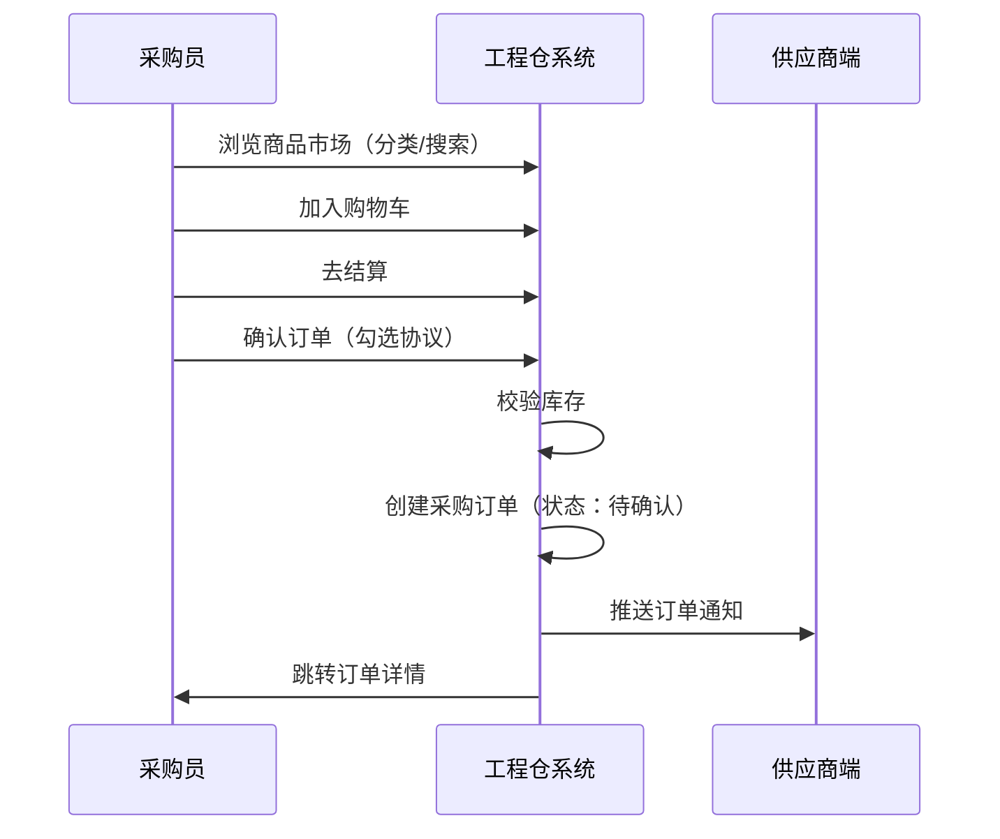
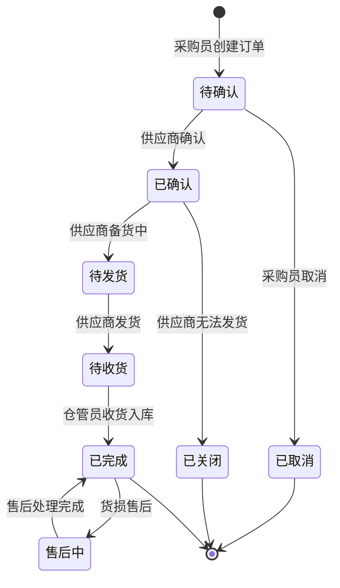
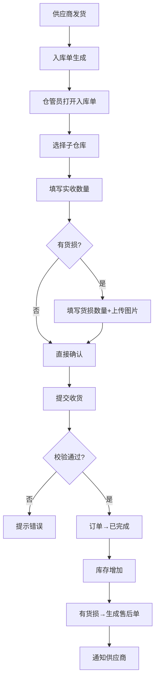
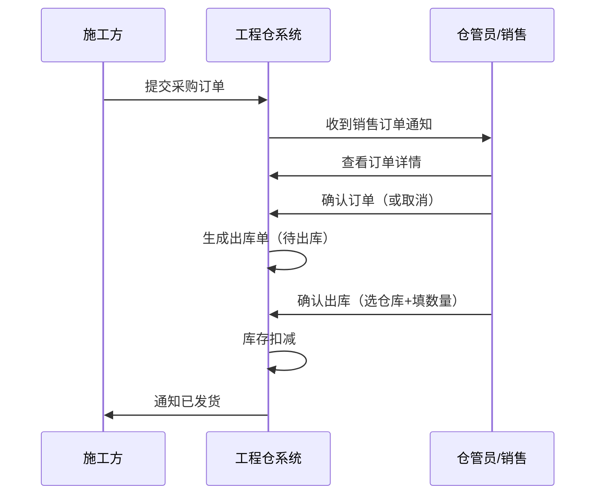
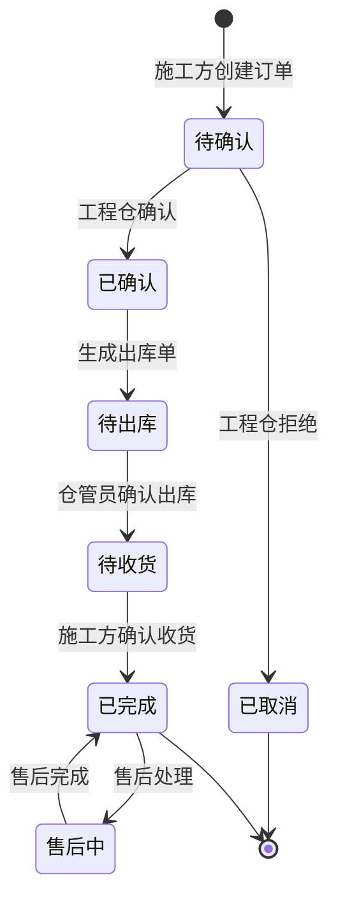
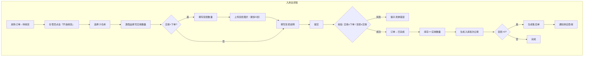
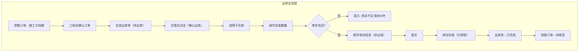
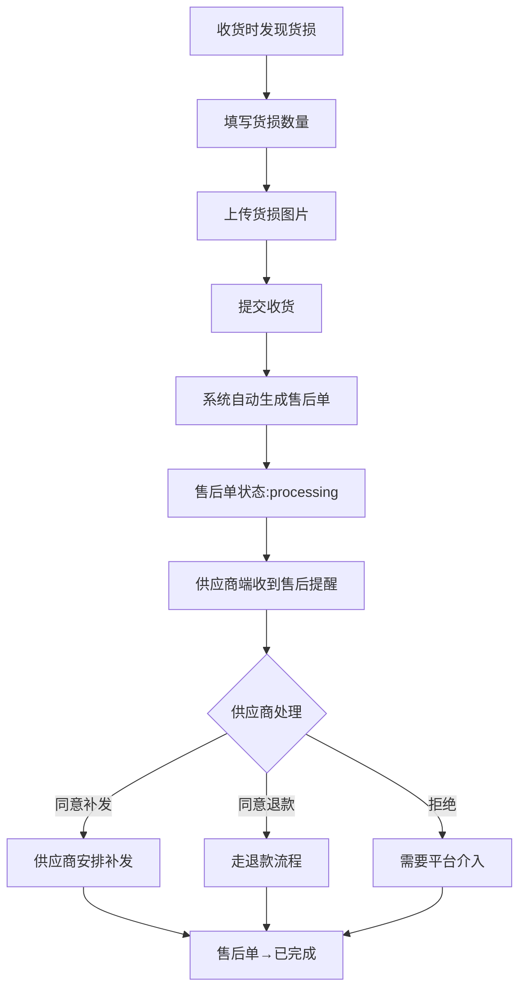

# 工程仓端 - 业务流程设计

> 版本：v1.0  
> 文档状态：初稿  
> 所属章节：第二章

## 版本历史

| 版本 | 日期 | 修订内容 |
|:----:|:----:|---------|
| v1.0 | 2026-04-24 | 初始创建，补充功能定位、核心概念、业务规则等详细内容 |

---

## 一、功能概述

### 1.1 功能定位

业务流程设计是工程仓端所有功能模块的**业务操作指南**，描述从采购到销售、从入库到出库的完整业务流转。本文档面向产品、开发、测试团队，帮助理解工程仓在双交易链路中的位置和各流程的业务规则。

### 1.2 核心概念

| 概念 | 说明 | 涉及链路 |
|-----|------|:--------:|
| 链路一（采购） | 工程仓向供应商采购商品的全流程 | 采购 |
| 链路二（销售） | 施工方向工程仓采购商品的全流程 | 销售 |
| 入库 | 采购订单到货后验收入库 | 采购 |
| 出库 | 销售订单确认后发货出库 | 销售 |
| 货损售后 | 收货时发现货物损坏后的处理流程 | 采购/销售 |
| 发票对账 | 订单完成后的财务结算流程 | 采购/销售 |

### 1.3 目标用户

- **产品经理**：理解业务链路，指导功能设计
- **开发工程师**：了解业务上下文，指导数据库设计和接口开发
- **测试工程师**：基于流程设计测试用例
- **运营人员**：了解操作流程，指导日常使用

---

## 二、双交易链路概述

工程仓端在平台中处于**中枢位置**，同时参与两条核心交易链路：

```
链路一：工程仓采购（工程仓→供应商）
═════════════════════════════════════════════════════
    ┌──────────┐    采购订单    ┌──────────┐
    │  工程仓端  │ ───────────▶ │  供应商端  │
    │ (买方→采购)│◀───────────│  (卖方→发货)│
    └──────────┘      发货      └──────────┘

链路二：施工方采购（施工方→工程仓）
═════════════════════════════════════════════════════
    ┌──────────┐    销售订单    ┌──────────┐
    │  施工方端  │ ───────────▶ │  工程仓端  │
    │ (买方→下单)│◀───────────│  (卖方→发货)│
    └──────────┘      发货      └──────────┘
```

### 2.1 双链路业务规则

| 规则 | 链路一（采购） | 链路二（销售） |
|:----:|:-------------:|:-------------:|
| 买方 | 工程仓 | 施工方 |
| 卖方 | 供应商 | 工程仓 |
| 订单类型 | 采购订单 | 销售订单 |
| 支付方向 | 工程仓→供应商 | 施工方→工程仓 |
| 开票方向 | 供应商开给工程仓（进项） | 工程仓开给施工方（销项） |
| 核心操作 | 采购员加购下单→仓管员收货 | 销售确认订单→仓管员发货 |

---

## 三、链路一：工程仓采购流程（核心流程）

### 3.1 采购下单流程



**采购下单业务规则：**
1. 采购员浏览商品市场 → 支持分类/搜索/价格过滤多种筛选方式
2. 加入购物车 → 跨供应商选购，购物车按供应商分组
3. 结算 → 按供应商拆分为多个独立采购订单
4. 提交前二次校验库存（防止库存变化）
5. 创建成功 → 通知供应商端

### 3.2 采购订单状态流转



**状态流转规则：**
- 待确认（pending）→ 供应商48小时内确认，超时自动提醒
- 已确认（confirmed）→ 订单锁定，采购员不可取消
- 待收货（shipped）→ 仓管员联系供应商安排收货
- 已完成（completed）→ 三状态各自独立：订单完成/支付可能未付/发货已完结

### 3.3 采购入库流程



**入库校验规则：**
- 实收数量 ≤ 下单数量（不允许多收）
- 货损数量 ≤ 实收数量
- 货损 > 0 → 自动生成售后单

---

## 四、链路二：施工方采购流程（销售链路）

### 4.1 销售订单流转



**销售流转规则：**
1. 施工方提交 → 工程仓销售/主管收到通知
2. 确认订单 → 自动生成出库单（待出库）
3. 出库发货 → 库存校验 → 扣减库存
4. 物流可选（自提场景）

### 4.2 销售订单状态流转



---

## 五、仓储作业流程

### 5.1 入库全流程



**入库关键业务规则：**
- 入库单由采购订单自动生成（供应商发货后）
- 实收数量可小于下单（允许部分到货/少发）
- 有货损必须拍照留证
- 入库后库存实时增加

### 5.2 出库全流程



**出库关键业务规则：**
- 出库单由销售订单确认后自动生成
- 库存扣减使用乐观锁防止超卖
- 物流信息非必填（适配自提场景）
- 允许部分发货（实发≤应发）

---

## 六、货损售后流程



**售后规则：**
- 售后单在入库时自动生成（货损>0）
- 供应商必须处理售后（补发/退款/拒绝）
- 拒绝时需平台介入仲裁

---

## 七、对账与发票流程

### 7.1 链路一发票流程（工程仓→供应商）


### 7.2 链路二发票流程（施工方→工程仓）


---

## 八、业务流程索引

| 编号 | 流程名称 | 涉及角色 | 关键节点 |
|:----:|---------|---------|---------|
| WH-BP-01 | 采购下单流程 | 采购员、供应商 | 浏览→加购→结算→确认 |
| WH-BP-02 | 采购收货入库流程 | 仓管员、供应商 | 收货→实收→货损→入库 |
| WH-BP-03 | 采购订单履约流程 | 采购员、供应商 | 确认→发货→收货→完成 |
| WH-BP-04 | 销售订单履约流程 | 销售、仓管员、施工方 | 确认→出库→发货→完成 |
| WH-BP-05 | 销售出库发货流程 | 仓管员、施工方 | 出库→实发→减库存→发货 |
| WH-BP-06 | 货损售后流程 | 仓管员、供应商 | 记录→售后→处理→完成 |
| WH-BP-07 | 发票管理流程 | 财务、供应商/施工方 | 申请→开票→上传→确认 |
| WH-BP-08 | 采购计划流程 | 采购员 | 创建→选品→转订单 |
| WH-BP-09 | 库存盘点流程 | 仓管员 | 盘点→记录→差异→调整 |
| WH-BP-10 | 库存调拨流程 | 仓管员 | 调出→调入→入仓确认 |

