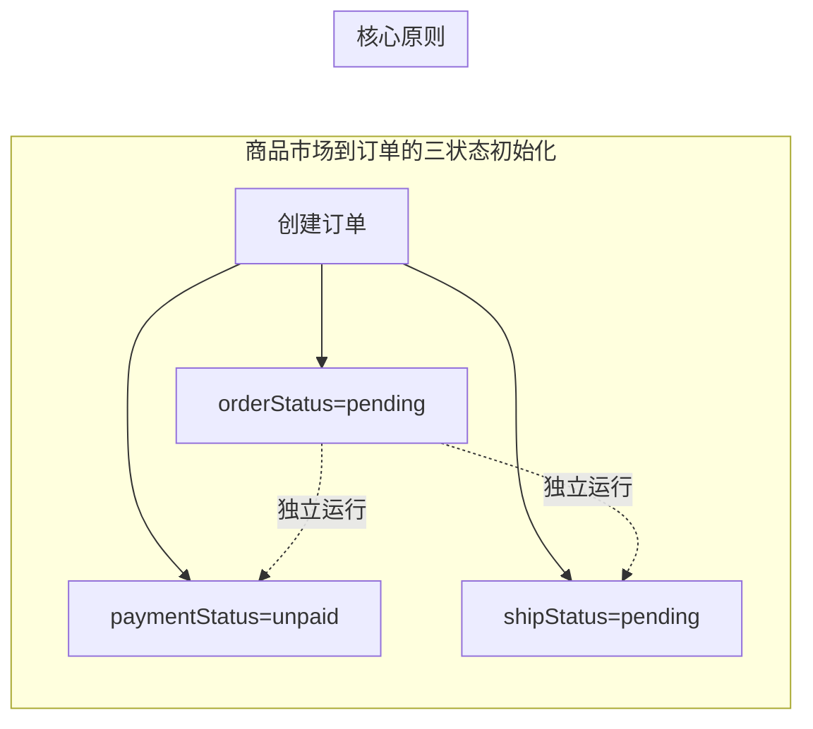

# 工程仓端 - 商品市场功能详细设计

> 版本：v1.0  
> 文档状态：初稿  
> 所属章节：第六章

---

## 一、功能概述

### 1.1 功能定位

商品市场是工程仓采购的**入口级功能**，为采购员提供供应商商品的浏览、搜索、选购、购物车管理和下单提交通道。商品市场连接平台商品库与工程仓采购需求，是双交易链路中"链路一（工程仓→供应商）"的起点。

### 1.2 核心概念

| 概念 | 说明 | 示例 |
|-----|------|------|
| 商品市场 | 工程仓查看和选购供应商商品的集中页面 | 类似B2B采购商城 |
| SPU | 标准产品单元，商品定义最上层 | "海螺325水泥" |
| SKU | 库存量单位，具体规格商品最小颗粒度 | "海螺325水泥/50kg装" |
| 供货价 | 供应商向工程仓提供的销售价格 | 420元/吨 |
| 购物车 | 暂存待采购商品的容器，支持跨供应商 | 类似电商购物车 |
| 结算下单 | 从购物车选中商品创建正式采购订单 | 购物车→确认→订单 |

### 1.3 目标用户

- **采购员**：核心用户，负责浏览商品、加购、下单，PC端操作
- **主管**：可查看商品市场，但不做下单操作
- **仓管员**：无需进入商品市场（无库存商品采购权限）

### 1.4 模块范围

| 功能分类 | 主要功能 | 涉及角色 |
|---------|---------|---------|
| 商品浏览 | 分类切换、关键词搜索、价格区间过滤、排序 | 采购员、主管 |
| 商品详情 | 图片轮播、规格属性、价格库存、供应商信息 | 采购员 |
| 购物车 | 增删改、全选、数量调整、已下架处理 | 采购员 |
| 结算下单 | 确认商品、备注、勾选协议、提交订单 | 采购员 |

---

## 二、业务规则

### 2.1 商品展示规则

- **默认排序**：商品列表默认按综合排序（热度+销量+上架时间综合权重）降序展示
  - 支持切换排序方式：价格升序、价格降序、销量优先、上架时间
  - 切换排序时保持当前分类和搜索条件
- **分类筛选**：一级分类Tab切换，二级分类展开在侧边栏
  - 切换分类时重置搜索关键词和价格区间
  - 分类Tab显示该分类下的商品数量
- **价格区间**：支持输入最低价和最高价进行范围过滤
  - 价格区间与分类条件叠加
  - 区间输入后自动触发查询（防抖300ms）
- **分页加载**：采用滚动加载方式，每页20条
  - 首次加载20条，滚动到底部自动加载下一页
  - 加载中显示骨架屏，加载完成替换为商品卡片
- **商品卡片展示**：每个商品显示缩略图、名称、规格属性、供货价、库存
  - 库存为0时显示"暂时缺货"灰色标签，不可加购
  - 商品已下架时显示"已下架"红色标签，不可点击

### 2.2 购物车规则

- **跨供应商**：购物车支持不同供应商的商品共存
  - 结算时按供应商拆分为多个订单
  - 商品列表按供应商分组展示
- **数量限制**：单个SKU加购数量不能超过库存数量
  - 加购数量≥1
  - 库存变动时，下次打开购物车自动刷新校验
- **商品状态**：已下架商品在购物车中置灰不可选
  - 置灰商品不参与全选计算
  - 置灰商品显示"已下架"标签，点击提示"该商品已下架"
- **有效期**：购物车商品超过30天未操作自动清空
  - 清空前通过toast提示"部分商品已超过30天未操作，已自动移除"

### 2.3 结算下单规则

- **订单拆分**：不同供应商的商品自动拆分为多个采购订单
  - 每个供应商一个独立订单，各自独立流程
- **库存校验**：下单前重新校验所有商品的库存
  - 库存不足→提示"XXX库存不足，当前仅剩N件"
  - 库存变化→提示"XXX价格/库存已变更，请重新确认"
- **协议确认**：必须勾选"同意采购协议"才能提交
  - 协议内容超链接打开新页面查看
  - 未勾选时提交按钮置灰

### 2.4 商品搜索规则

- **搜索范围**：支持按商品名称、规格属性、供应商名称搜索
  - 关键词模糊匹配
  - 搜索结果高亮显示匹配关键词
- **搜索历史**：记录最近10条搜索历史
  - 搜索框聚焦时展示历史记录
  - 支持手动清除搜索历史

---

## 三、功能点详细设计

### 3.1 商品浏览/搜索/分类筛选（P0）

#### 功能说明
以商品市场首页为中心，提供分类导航、关键词搜索、价格区间过滤、排序等多种筛选方式的综合商品浏览功能。

#### 入口路径
左侧导航「商品市场」→ 默认进入商品列表

#### 交互逻辑
1. 页面加载：默认选中"全部"分类Tab → 调用商品搜索接口（page=1, size=20）→ 渲染商品卡片列表
2. 切换分类：点击分类Tab → 重置page=1 → 按分类ID重新查询 → 商品列表更新
3. 搜索：输入关键词+回车/点击搜索按钮 → 防抖300ms → 调用搜索接口 → 更新列表
4. 价格区间：输入最低价/最高价 → 防抖300ms → 调用接口 → 更新列表
5. 排序切换：选择排序方式 → 重新查询 → 按新排序渲染
6. 滚动加载：滚动到底部 → 当前page+1 → 加载下一页 → 追加到列表（loading动画）
7. 下拉刷新：下拉触发 → 回到顶部 → page=1 → 重新加载

#### 字段说明

| 字段名称 | 字段说明 | 组件类型 | 必填 | 校验规则 | 默认值 | 数据来源 |
|---------|---------|---------|:----:|---------|:------:|---------|
| 分类Tab | 商品分类切换 | Tab切换 | 否 | 最多显示一级分类（后台配置） | 全部 | 分类接口 |
| 搜索框 | 关键词搜索 | Input | 否 | 最大50字符，过滤特殊字符 | 空 | 前端输入 |
| 价格最低价 | 价格区间下限 | Input | 否 | 数字≥0 | 空 | 前端输入 |
| 价格最高价 | 价格区间上限 | Input | 否 | 数字≥最低价 | 空 | 前端输入 |
| 排序方式 | 商品排序 | Select | 否 | 综合/价格升/价格降/销量/上架时间 | 综合 | 前端选择 |
| 商品卡片 | 商品展示单元 | Card | 只读 | - | - | 商品搜索接口 |

#### 业务规则
- 分类Tab最多支持一级分类显示，二级分类在搜索结果中过滤
- 搜索关键词与分类条件取交集
- 价格区间必须最低价≤最高价
- 不同筛选条件组合时，API参数叠加

#### 界面元素
- 顶部搜索栏：搜索图标+输入框+搜索按钮
- 分类Tab栏：水平滚动Tab，每个Tab显示分类名称+商品数量
- 排序工具栏：排序方式下拉选择
- 价格区间输入：两个输入框（最低价-最高价）+ 确定按钮
- 商品卡片网格：2列/3列自适应，每张卡片包含图片/名称/规格/价格/库存/加购按钮
- 骨架屏：加载中显示8个灰色卡片占位
- 空状态：无结果时显示"找不到相关商品"插画
- 滚动加载指示器：底部loading菊花

#### 异常处理
| 异常场景 | 处理方式 | 提示信息 |
|---------|---------|---------|
| 接口超时（>5s） | 显示重试按钮 | "加载失败，请检查网络后重试" |
| 分类无数据 | 显示空状态 | "该分类暂无商品" |
| 搜索无结果 | 显示空状态 | "找不到相关商品，试试其他关键词" |
| 价格区间不合法 | 输入框边框变红 | "最低价不能大于最高价" |
| 后续页加载失败 | 底部显示重试按钮 | "加载失败，点击重试" |

#### 权限控制
采购员/主管可见，仓管员/财务/销售无权限。

---

### 3.2 商品详情查看（P0）

#### 功能说明
展示单个商品的完整信息，包括图片、规格、价格、库存、供应商信息，并提供加入购物车入口。

#### 入口路径
点击商品卡片 → 商品详情页

#### 交互逻辑
1. 页面加载：根据SKU ID → 调用商品详情接口 → 渲染所有信息区域
2. 图片轮播：左右滑动/点击缩略图切换主图
   - 支持手势缩放（双指放大/缩小）
   - 图片加载失败显示默认占位图
3. SKU规格切换：多规格商品显示规格选择器 → 切换规格 → 更新价格/库存/图片
4. 数量选择：点击数量加减按钮 → 最小值1，最大值=库存
   - 可直接输入数字（校验≥1且≤库存）
5. 加入购物车：点击"加入购物车" → 弹出确认动画 → toast提示
6. 已下架商品：显示"已下架"覆盖层，加购按钮置灰

#### 字段说明

| 展示项 | 组件 | 数据来源 | 展示规则 |
|-------|------|---------|---------|
| 商品主图 | 图片轮播 | 商品接口 | 支持多图，首图优先展示 |
| 商品名称 | 文本 | 商品接口 | 完整名称展示 |
| 规格属性 | 标签/选择器 | 商品接口 | 多规格可切换 |
| 供货价 | 数字 | 商品接口 | 红色加粗显示，含单位 |
| 库存 | 数字 | 库存接口 | 库存≤5显示"仅剩N件" |
| 供应商信息 | 文本/链接 | 商品接口 | 名称+联系方式 |
| 商品描述 | 富文本/RichText | 商品接口 | 图文混排展示 |

#### 业务规则
- 多规格商品：切换规格时同步更新图片、价格、库存
- 库存实时查询：每次打开详情调用库存接口获取最新库存
- 供货价脱敏：非签约供应商显示"需登录查看"

#### 界面元素
- 图片轮播区域：当前主图+底部缩略图列表+左右箭头
- SKU规格选择器：标签组形式，选中高亮
- 数量选择器：减号+数字输入+加号
- 操作栏：固定底部，"加入购物车"按钮（主色调）+ "立即购买"按钮
- 供应商信息区：头像+名称+联系电话图标
- 商品描述区：富文本展示，可折叠展开

#### 异常处理
| 异常场景 | 处理方式 | 提示信息 |
|---------|---------|---------|
| 商品已下架/删除 | 页面显示灰色覆盖层 | "该商品已下架" |
| 图片加载失败 | 显示默认占位图 | - |
| 库存接口超时 | 显示"--" | 不影响页面其他内容加载 |
| SKU不存在 | 页面提示 | "该规格不存在" |

#### 权限控制
采购员/主管可见可操作。

---

### 3.3 加入购物车（P0）

#### 功能说明
将选中商品添加到购物车，支持从商品卡片和商品详情页两种入口。

#### 入口路径
- 商品卡片 → 点击"加入购物车"图标按钮
- 商品详情页 → 点击"加入购物车"按钮

#### 交互逻辑
1. 从商品卡片加入：点击加购图标（购物车+） → 弹出数量选择浮层 → 选择数量 → 点击确认 → 调用添加接口
2. 从商品详情加入：已选择规格和数量 → 点击"加入购物车" → 直接调用添加接口
3. 添加成功：toast"已加入购物车"（持续2s） → 导航栏购物车图标角标+1
4. 添加失败：toast错误信息

#### 字段说明

| 字段 | 组件 | 必填 | 校验规则 | 数据来源 |
|------|------|:----:|---------|---------|
| SKU ID | 隐藏 | 是 | 商品市场接口返回 | 商品接口 |
| 数量 | 数字选择 | 是 | ≥1，≤库存，整数 | 前端输入 |
| 供应商ID | 隐藏 | 是 | 商品市场接口返回 | 商品接口 |

#### 业务规则
- 同一个SKU重复加购：购物车中该SKU数量累加（≤库存上限）
- 不同供应商的商品可同时加入购物车（跨供应商购物车）
- 库存变动：加购时实时校验库存

#### 界面元素
- 卡片加购图标：购物车图标+角标（小尺寸）
- 数量选择浮层：底部弹出，半屏高度，包含减号+输入+加号+确认按钮

#### 异常处理
| 异常场景 | 处理方式 | 提示信息 |
|---------|---------|---------|
| 库存不足 | toast提示，不允许添加 | "库存不足，仅剩N件" |
| 商品已下架 | 按钮置灰不可点击 | "该商品已下架，无法购买" |
| 网络错误 | toast提示 | "加入失败，请重试" |

#### 权限控制
仅采购员可操作，主管仅可查看。

---

### 3.4 购物车管理（P0）

#### 功能说明
集中管理所有已加入购物车的商品，支持数量调整、删除、全选、结算等功能。

#### 入口路径
顶部购物车图标 / 侧边购物车入口

#### 交互逻辑
1. 页面加载：调用购物车列表接口 → 按供应商分组渲染 → 自动计算总价
2. 数量调整：点击加减/输入数字 → 实时更新小计和总价（防抖300ms）
3. 选中/取消：点击商品左侧复选框 → 实时更新合计金额
4. 全选：点击顶部全选复选框 → 所有可选商品选中/取消
   - 已下架商品不参与全选
5. 删除：左滑商品 → 出现红色"删除"按钮 → 点击 → 二次确认弹窗 → 确认删除
   - 也可点击编辑模式 → 批量勾选 → 批量删除
6. 结算：点击"去结算" → 校验选中商品 → 跳转结算页

#### 字段说明

| 字段 | 组件 | 数据来源 | 展示规则 |
|------|------|---------|---------|
| 商品信息 | 卡片 | 购物车接口 | 图片+名称+规格 |
| 单价 | 数字 | 购物车接口 | 右对齐 |
| 数量 | 数字输入 | 前端交互 | 最小值1，最大值=库存 |
| 小计 | 数字 | 自动计算 | 单价×数量，右对齐 |
| 复选框 | Checkbox | 前端交互 | 可选/不可选（已下架） |
| 合计金额 | 数字 | 自动计算 | 所有选中商品小计之和 |

#### 业务规则
- 跨供应商商品按供应商分组展示，组间有分割线
- 已下架商品置灰不可选，但保留在列表中（提示用户清理）
- 每次打开购物车自动刷新商品状态（下架/价格变动）
- 购物车商品数量上限50个

#### 界面元素
- 顶部栏：标题"购物车" + 编辑/完成按钮
- 供应商分组头：供应商名称（灰色背景）
- 商品卡片：复选框+图片+名称+规格+单价+数量选择器+小计
- 底部操作栏：全选复选框 + 合计金额 + "去结算(N)"按钮
- 空购物车：居中插画 + "购物车是空的" + "去逛逛"按钮
- 左滑删除：手指左滑露出红色删除按钮

#### 异常处理
| 异常场景 | 处理方式 | 提示信息 |
|---------|---------|---------|
| 删除失败 | toast提示 | "删除失败，请重试" |
| 数量修改超库存 | 自动恢复为最大值 | "数量不能超过库存" |
| 商品批量下架 | 自动置灰 | "以下商品已下架：XXX" |
| 清空购物车 | 弹窗二次确认 | "确定清空购物车吗？" |

#### 权限控制
仅采购员可操作（增删改），主管仅查看。

---

### 3.5 结算下单（P0）

#### 功能说明
从购物车选中商品进入结算页，确认商品信息、输入备注、勾选协议后提交创建正式采购订单。

#### 入口路径
购物车 → 选中商品 → "去结算"

#### 交互逻辑
1. 进入结算页：获取选中商品的购物车数据 → 按供应商分组 → 渲染订单预览
2. 确认商品：展示商品明细（只读），数量已固定（不可在结算页修改）
3. 填写备注：可选输入订单备注信息
4. 勾选协议：必须勾选"同意采购协议"
5. 提交订单：点击"提交订单" → 调用下单接口（按供应商拆单） → 库存二次校验 → 创建订单 → 成功跳转订单详情
6. 订单拆分：不同供应商自动生成独立采购订单

#### 字段说明

| 字段名称 | 字段说明 | 组件类型 | 必填 | 校验规则 | 默认值 | 数据来源 |
|---------|---------|---------|:----:|---------|:------:|---------|
| 商品明细 | 选中商品列表 | 只读表格 | - | - | - | 购物车接口 |
| 供应商分组 | 按供应商分组展示 | 分栏 | - | - | - | 自动分组 |
| 合计金额 | 该供应商商品总金额 | 数字 | 只读 | - | - | 自动计算 |
| 订单备注 | 备注信息 | TextArea | 否 | 最多200字 | 空 | 前端输入 |
| 采购协议 | 协议确认 | Checkbox | 是 | 必须勾选 | 未勾选 | 前端操作 |
| 提交按钮 | 提交订单 | Button | - | 未勾选协议时置灰 | 置灰 | 前端控制 |

#### 业务规则
- 按供应商拆分订单：每个供应商生成一个独立采购订单
- 提交前重新校验所有商品库存（二次校验）
- 提交后清空购物车中已下单的商品
- 订单创建后跳转到采购订单详情页

#### 界面元素
- 地址/仓库信息：待确认（后续优化，V1默认无）
- 商品分组卡片：供应商名称（标题）+商品明细表格（SKU/名称/数量/单价/小计）
- 金额汇总：商品金额 + 运费（默认0）= 总计
- 备注输入区：文本域
- 协议确认：复选框+"我已阅读并同意"+"《采购协议》"（超链接）
- 底部操作栏：合计金额 + "提交订单"按钮
- 提交loading：按钮显示加载中动画，防止重复点击

#### 异常处理
| 异常场景 | 处理方式 | 提示信息 |
|---------|---------|---------|
| 库存不足 | 禁用该商品所在组提交 | "XXX库存不足，当前仅剩N件，请返回购物车调整" |
| 商品已下架 | 禁用该商品所在组提交 | "XXX已下架，请返回购物车移除" |
| 价格变动 | toast提醒 | "XXX价格已变更，请重新确认" |
| 提交失败 | toast提示 | "提交失败，请稍后重试" |
| 网络超时 | 弹窗提示 | "提交超时，请检查网络后重试" |
| 协议未勾选 | 按钮置灰 | 提示"请先同意采购协议" |

#### 权限控制
仅采购员可提交订单，主管仅查看。

---

## 四、三状态分离说明（商品市场相关）

> 采购订单创建时三状态初始化

---

## 五、版本历史

| 版本 | 日期 | 修订内容 |
|:----:|:----:|---------|
| v1.0 | 2026-04-24 | 初始创建，覆盖商品市场全部6个功能点的完整详细设计 |
