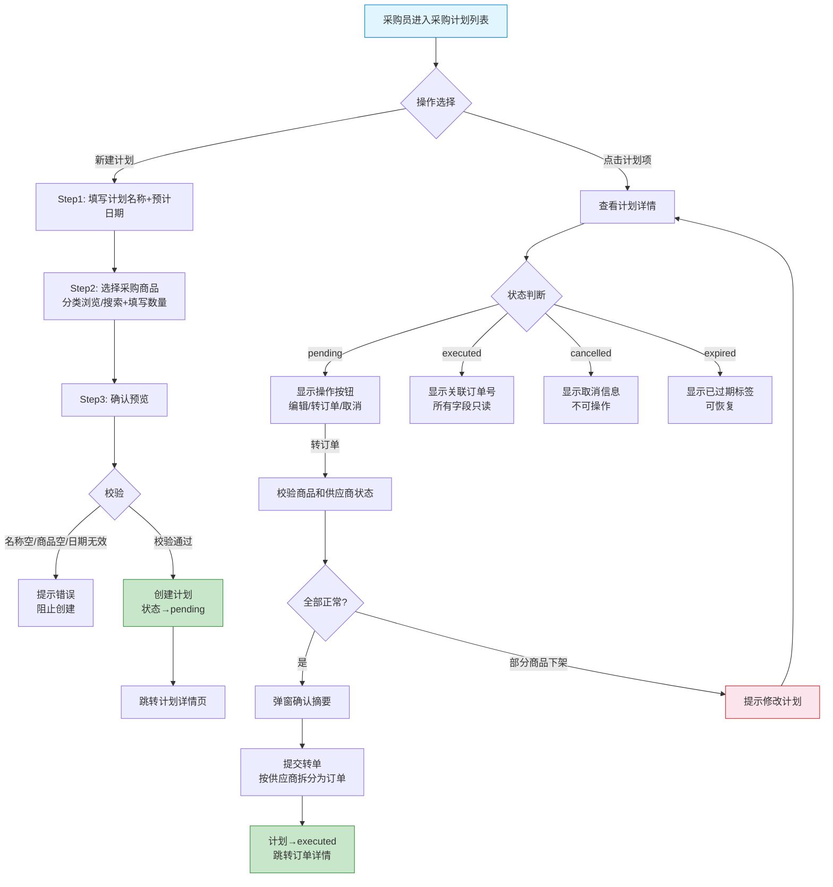
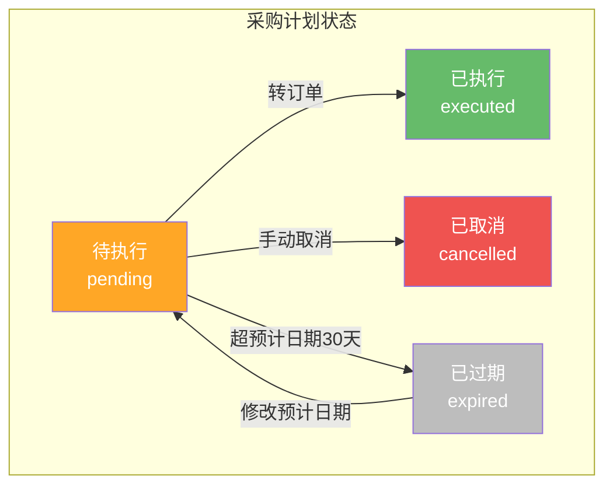

# 工程仓端 - 采购计划功能详细设计

> 版本：v2.0  
> 文档状态：已定稿  
> 所属章节：第七章

## 版本历史

| 版本 | 日期 | 修订内容 | 修订人 |
|:----:|:----:|---------|:-----:|
| v1.0 | 2026-04-24 | 初始创建，覆盖采购计划全部4个功能点 | PM |
| v1.1 | 2026-04-24 | 追加状态×操作×角色矩阵、错误提示汇总 | PM |
| v2.0 | 2026-04-24 | 重构为新版11章模板，新增设计原则、流程图、非功能性需求、接口依赖建议，原子字段新增必填列 | PM |

<!-- ============================================================ -->
<!-- PRD六层模型：                                                    -->
<!--                                                              -->
<!-- 核心层(必写)： 功能概述 → 设计原则 → 业务规则(含流程图) → 功能点详情   -->
<!-- 扩展层(推荐)： 权限矩阵 → 非功能性需求 → 异常汇总 → 接口依赖      -->
<!-- 治理层(状态模块必写)： 状态流转图 → 状态治理矩阵 → 版本历史       -->
<!-- ============================================================ -->

---

## 一、功能概述

### 1.1 功能定位

采购计划是工程仓提前规划采购需求的功能模块。班组长/采购员可以根据工地用料需求提前创建采购计划，后续一键转为正式采购订单。解决"先计划后采购"的业务场景，帮助工程仓提前锁定需求、控制采购节奏。

### 1.2 核心概念

| 概念 | 说明 | 示例 |
|:----|------|------|
| 采购计划 | 工程仓提前编制的采购需求清单 | "3月水泥采购计划" |
| 计划转订单 | 将已确认的采购计划一键生成正式采购订单 | 计划→校验→生成订单 |
| 计划状态 | 采购计划的生命周期状态 | 待执行 / 已执行 / 已取消 / 已过期 |
| 预计采购日期 | 计划执行的目标采购时间 | 2026-04-30 |

### 1.3 目标用户

- **采购员**（核心用户）：创建采购计划、转订单操作
- **主管**：查看采购计划，了解采购需求趋势
- **班组长**：提报现场用料需求（由采购员代为录入）

### 1.4 模块范围

| 功能分类 | 主要功能 | 涉及角色 |
|:--------|---------|---------|
| 计划查询 | 采购计划列表、状态Tab筛选、时间筛选 | 采购员、主管 |
| 计划创建 | 新建采购计划、选择商品、设置日期 | 采购员 |
| 计划查看 | 计划详情、商品明细 | 采购员、主管 |
| 计划执行 | 计划转订单 | 采购员 |

---

## 二、核心设计原则

> **采购计划遵循"计划先行、转单后锁定"原则。**

### 2.1 计划与订单分离

- 采购计划是需求清单，采购订单是执行单据，两者在生命周期上解耦
- 一个采购计划只能转一次订单（唯一关联）
- 转单后计划变为只读状态，不可再修改

### 2.2 计划过期机制

- 超过预计采购日期30天未操作的待执行计划自动标记"已过期"
- 过期计划可手动恢复操作（延长预计日期）

### 2.3 跨供应商聚合

- 一条采购计划可包含不同供应商的商品（聚合提需）
- 转单时按供应商自动拆分为多个独立采购订单

---

## 三、业务规则

### 3.1 采购计划状态规则

- **待执行（pending）**：创建后默认状态，可编辑/转订单/取消
  - 超过预计采购日期30天未操作→系统标记"已过期"
- **已执行（executed）**：已成功转为采购订单，所有字段只读
  - 详情页显示关联的采购订单号（可点击跳转）
- **已取消（cancelled）**：手动取消，不可再操作
  - 显示取消时间和取消人
- **已过期（expired）**：超过预计日期30天自动标记
  - 支持手动恢复（修改预计日期后回到pending）

### 3.2 转订单规则

- **商品校验**：转单时校验所有商品是否在可售状态
- **供应商停用校验**：校验商品所属供应商是否正常合作
- **数量传递**：计划中的商品数量和规格直接传递到订单
- **订单来源标记**：生成的采购订单 source 标记为 "plan"
- **唯一关联**：一个采购计划只能转一次订单

### 3.3 查询规则

- **默认排序**：按创建时间倒序排列
- **分页展示**：每页10条，传统分页控件
- **状态Tab**：全部（默认）/ 待执行 / 已执行 / 已取消
- **时间筛选**：支持按创建时间范围筛选

### 3.4 核心业务流程图

#### 流程图1：采购计划创建→转订单全流程

---

## 四、权限矩阵

### 4.1 功能权限总表

| 功能模块 | 具体操作 | 采购员 | 主管 | 说明 |
|:--------|---------|:------:|:----:|------|
| **计划查询** | 查看计划列表 | ✅ | ✅ | - |
| | 查看计划详情 | ✅ | ✅ | - |
| **计划创建** | 新建计划 | ✅ | ✅ | - |
| | 编辑计划（pending） | ✅ | ✅ | - |
| **计划执行** | 转订单 | ✅ | ❌ | 仅采购员 |
| | 取消计划 | ✅ | ❌ | 仅采购员 |
| | 恢复过期计划 | ✅ | ❌ | 仅采购员 |

### 4.2 权限校验方式

- **前端**：按钮级权限控制，无权限的操作按钮直接隐藏
- **后端**：每个接口校验用户角色和操作人归属

---

## 五、非功能性需求

### 5.1 性能要求

| 接口/场景 | 指标 | P95要求 | 说明 |
|:---------|:----|:-------:|------|
| 计划列表 | 响应时间 | ≤ 300ms | 含状态Tab计数 |
| 计划详情 | 响应时间 | ≤ 200ms | - |
| 创建计划 | 响应时间 | ≤ 500ms | 含商品校验 |
| 转订单 | 响应时间 | ≤ 1s | 含商品校验+按供应商拆分 |

### 5.2 埋点需求

| 页面 | 事件名 | 触发时机 | 上报字段 |
|:----|:------|---------|---------|
| 计划列表 | plan_list_view | 进入列表页 | `tabStatus` |
| 计划创建 | plan_create | 创建成功 | `itemCount`, `supplierCount` |
| 计划转单 | plan_convert | 转单成功 | `itemCount`, `orderCount` |
| 计划取消 | plan_cancel | 取消操作 | `cancelReason` |

---

## 六、功能点详细设计

### 6.1 采购计划列表（P1）

#### 交互逻辑

1. 页面加载：默认选中"全部"Tab → 调用计划列表接口（page=1, size=10）→ 渲染计划卡片列表
2. 切换Tab：点击对应状态Tab → 重置page=1 → 按状态筛选重新查询
3. 时间筛选：选择创建时间范围 → 与Tab条件叠加查询
4. 点击计划项：跳转采购计划详情页
5. 新建计划：点击"新建计划"按钮 → 跳转新建计划页

#### 原子字段定义

| 字段 | 类型 | 必填 | 来源 | 校验规则 | 展示规则 | 默认值 |
|:----|:----|:----:|:----|:--------|:--------|:-----:|
| 计划名称 | String(50) | 是 | 计划接口 | 非空 | 文本超链接 | - |
| 商品数量 | Integer | 是 | 计划接口 | ≥1 | 数字 | - |
| 预计采购日期 | Date | 是 | 计划接口 | 合法日期 | YYYY-MM-DD，过期=红色 | - |
| 创建人 | String(20) | 是 | 计划接口 | 非空 | 文本 | - |
| 创建时间 | DateTime | 是 | 计划接口 | 非空 | YYYY-MM-DD HH:mm | - |
| 计划状态 | Enum | 是 | 计划接口 | pending/executed/cancelled/expired | 状态标签（橙/绿/红/灰） | pending |

#### 边界情况覆盖

| 场景 | 处理逻辑 | 提示文案 |
|:----|:--------|---------|
| 加载失败 | 显示重试按钮 | "加载失败，请重试" |
| 无数据 | 空状态展示+新建按钮 | "暂无采购计划" |
| 筛选无结果 | 空状态展示 | "未找到符合条件的计划" |

---

### 6.2 新建采购计划（P1）

#### 交互逻辑

1. Step1 - 基本信息：填写计划名称（2-50字必填）+ 预计采购日期（≥当前日期必填）+ 备注（选填200字）
2. Step2 - 选择商品：打开商品选择器 → 分类浏览/搜索 → 勾选商品 → 填写计划数量 → 确认选择
3. Step3 - 确认预览：展示计划名称、日期、商品清单和数量 → 确认无误 → 点击"创建"
4. 创建成功：Toast提示 → 跳转到计划详情页

#### 原子字段定义

| 字段 | 类型 | 必填 | 来源 | 校验规则 | 展示规则 | 默认值 |
|:----|:----|:----:|:----|:--------|:--------|:-----:|
| 计划名称 | String(50) | 是 | 前端输入 | 2-50个字符 | Input框 | 空 |
| 预计采购日期 | Date | 是 | 前端选择 | ≥当前日期 | DatePicker，禁用过去日期 | 空 |
| 备注 | Text(200) | 否 | 前端输入 | 最多200字 | TextArea | 空 |
| 采购商品 | Array | 是 | 商品选择器 | 至少1个SKU | 表格展示 | 空 |
| 计划数量 | Integer | 是 | 前端输入 | ≥1, ≤99999 | NumberInput | 1 |

#### 边界情况覆盖

| 场景 | 处理逻辑 | 提示文案 |
|:----|:--------|---------|
| 计划名称重复 | 输入框实时校验 | "该计划名称已存在" |
| 商品为空 | 阻止进入下一步 | "请至少选择一个商品" |
| 日期早于今天 | 日期选择器禁用 | "预计采购日期不能早于今天" |
| 创建失败 | Toast提示 | "创建失败，请稍后重试" |

---

### 6.3 采购计划详情（P1）

#### 交互逻辑

1. 页面加载：获取计划详情 → 展示基本信息区 + 商品明细区
2. 基本信息区：计划名称/状态/创建人/创建时间/预计采购日期/备注
3. 商品明细区：SKU/名称/规格/计划数量/供应商
4. 操作按钮区：根据状态动态显示（pending→显示转订单/取消按钮）

#### 原子字段定义

同列表字段定义。

#### 边界情况覆盖

| 场景 | 处理逻辑 | 提示文案 |
|:----|:--------|---------|
| 计划不存在 | 404页面 | - |
| 已执行显示关联订单 | 关联订单号可点击跳转 | - |

---

### 6.4 计划转订单（P2）

#### 交互逻辑

1. 前置条件：计划状态=pending，当前用户=采购员
2. 点击"转成订单" → 系统校验所有商品可售状态 + 供应商状态
3. 校验通过 → 弹窗展示转单摘要（商品数量+供应商拆分预览）
4. 确认转单 → 调用转单接口 → 按供应商拆分为多个采购订单 → 计划状态→executed
5. 跳转到新创建的采购订单详情页

#### 原子字段定义

| 字段 | 类型 | 必填 | 来源 | 校验规则 | 展示规则 | 默认值 |
|:----|:----|:----:|:----|:--------|:--------|:-----:|
| 转单确认 | Boolean | - | 用户操作 | 需确认 | 弹窗确认按钮 | false |
| 商品验证结果 | Object | - | 转单接口 | 全部可售 | 只读摘要表格 | - |

#### 边界情况覆盖

| 场景 | 处理逻辑 | 提示文案 |
|:----|:--------|---------|
| 商品已下架 | 弹窗提示，阻止转单 | "以下商品已下架，请修改计划：XXX" |
| 供应商已停用 | 弹窗提示 | "供应商XXX已暂停合作，无法转单" |
| 转单失败 | Toast提示 | "转单失败，请稍后重试" |
| 状态已变更（非pending） | 提示刷新 | "计划状态已变更，请刷新后重试" |

---

## 七、异常处理汇总表

| 异常场景 | 触发条件 | 前端处理 | 后端处理 | 提示文案 |
|:--------|:--------|:--------|:--------|---------|
| 计划名称重复 | 新建时输入已存在的名称 | 输入框实时标红 | 返回已存在 | "该计划名称已存在" |
| 商品为空 | 下一步时商品列表=0 | 阻止步骤前进 | - | "请至少选择一个商品" |
| 日期早于今天 | 选择器默认禁用 | DatePicker禁用过去日期 | - | "预计采购日期不能早于今天" |
| 创建失败 | 网络异常/后端错误 | Toast提示 | 回滚事务 | "创建失败，请稍后重试" |
| 加载失败 | 列表/详情接口超时 | 重试按钮 | - | "加载失败，请重试" |
| 转单→商品下架 | 商品已不可售 | 弹窗提示 | 返回下架商品列表 | "以下商品已下架，请修改计划：XXX" |
| 转单→供应商停用 | 供应商已暂停 | 弹窗提示 | 返回停用供应商 | "供应商XXX已暂停合作，无法转单" |
| 转单失败 | 转单接口异常 | Toast提示 | 回滚 | "转单失败，请稍后重试" |

---

## 八、接口依赖建议

| 接口 | 用途 | 核心字段/逻辑 | 性能要求 |
|:----|:----|:-------------|:--------:|
| `/api/purchase-plan/list` | 计划列表 | 输入：status/dateRange/page；输出：计划名称/状态/商品数/日期 | P95 ≤ 300ms |
| `/api/purchase-plan/create` | 创建计划 | 输入：name/expectedDate/remark/items[skuId,quantity] | P95 ≤ 500ms |
| `/api/purchase-plan/detail` | 计划详情 | 输入：planId；输出：完整信息+商品明细+关联订单号 | P95 ≤ 200ms |
| `/api/purchase-plan/convert` | 转订单 | 输入：planId；输出：新创建的订单ID列表 | P95 ≤ 1s |
| `/api/purchase-plan/cancel` | 取消计划 | 输入：planId/cancelReason | P95 ≤ 200ms |
| `/api/purchase-plan/update` | 编辑计划 | 输入：planId/name/date/items | P95 ≤ 500ms |

---

## 九、状态流转图

---

## 十、状态治理矩阵

### 10.1 动作定义表

| 动作ID | 动作名称 | 触发方式 | 触发角色 | 说明 |
|:-----:|---------|---------|:-------:|------|
| PLAN-01 | 查看列表 | 页面加载/切换Tab | 采购员、主管 | - |
| PLAN-02 | 查看详情 | 点击计划项 | 采购员、主管 | - |
| PLAN-03 | 新建计划 | 列表页「新建计划」 | 采购员 | - |
| PLAN-04 | 编辑计划 | 详情页「编辑」 | 采购员 | 仅pending |
| PLAN-05 | 转订单 | 详情页「转成订单」 | 采购员 | 仅pending |
| PLAN-06 | 取消计划 | 详情页「取消计划」 | 采购员 | 仅pending |
| PLAN-07 | 恢复计划 | 详情页「恢复」 | 采购员 | 仅expired |

### 10.2 状态×操作矩阵

| 状态 \ 操作 | 查看列表 | 查看详情 | 新建计划 | 编辑计划 | 转订单 | 取消计划 | 恢复计划 |
|:----------:|:--------:|:--------:|:--------:|:--------:|:------:|:--------:|:--------:|
| **pending** | ✅ | ✅ | ✅ | ✅ | ✅ | ✅ | ❌ |
| **executed** | ✅ | ✅ | ➡创建后进入 | ❌（只读） | ❌（已转） | ❌ | ❌ |
| **cancelled** | ✅ | ✅ | ❌ | ❌ | ❌ | ❌ | ❌ |
| **expired** | ✅ | ✅ | ❌ | ❌ | ✅ | ❌ | ✅ |

### 10.3 每状态角色权限

#### pending（待执行）

| 操作 | 采购员 | 主管 |
|:----:|:------:|:----:|
| 查看列表 | ✅ | ✅ |
| 查看详情 | ✅ | ✅ |
| 编辑计划 | ✅ | ✅ |
| 转订单 | ✅ | ❌ |
| 取消计划 | ✅ | ❌ |

#### expired（已过期）

| 操作 | 采购员 | 主管 |
|:----:|:------:|:----:|
| 查看列表 | ✅ | ✅ |
| 查看详情 | ✅ | ✅ |
| 恢复计划 | ✅ | ❌ |

