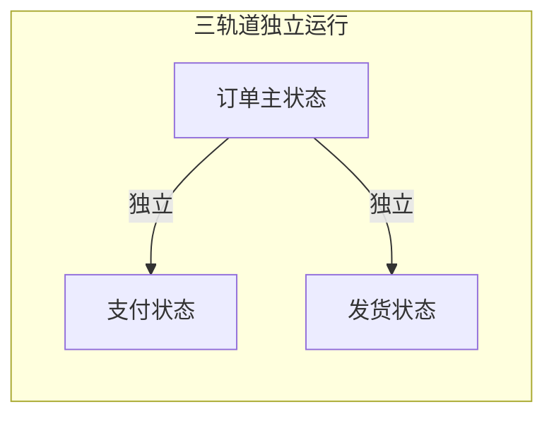

# 工程仓端 - 采购订单管理功能详细设计

> 版本：v2.0  
> 文档状态：已定稿  
> 所属章节：第九章

## 版本历史

| 版本 | 日期 | 修订内容 | 修订人 |
|:----:|:----:|---------|:-----:|
| v1.0 | 2026-04-24 | 初始创建，覆盖采购订单全部5个功能点 | PM |
| v1.1 | 2026-04-24 | 追加状态×操作×角色矩阵、每状态角色权限表、错误提示汇总 | PM |
| v2.0 | 2026-04-24 | 重构为新版11章模板，新增设计原则、流程图、非功能性需求、异常汇总表、接口依赖、状态流转图 | PM |

<!-- ============================================================ -->
<!-- PRD六层模型：                                                    -->
<!--                                                              -->
<!-- 核心层(必写)： 功能概述 → 设计原则 → 业务规则(含流程图) → 功能点详情   -->
<!-- 扩展层(推荐)： 权限矩阵 → 非功能性需求 → 异常汇总 → 接口依赖      -->
<!-- 治理层(状态模块必写)： 状态流转图 → 状态治理矩阵 → 版本历史       -->
<!-- ============================================================ -->

---

## 一、功能概述

### 1.1 功能定位

采购订单管理是工程仓**采购链路（链路一）的核心功能**，覆盖从订单创建到收货完成的完整生命周期。采购订单连接商品市场与仓库入库，是工程仓"买货"环节的载体。系统遵循**三状态分离设计原则**，订单状态、支付状态、发货状态独立运行。

### 1.2 核心概念

| 概念 | 说明 | 示例 |
|:----|------|------|
| 采购订单 | 工程仓向供应商发起的采购请求单据 | PO202604240001 |
| 订单主状态 | 订单生命周期的主干状态 | pending→confirmed→completed |
| 支付状态 | 线下转账的标记状态（独立于订单） | unpaid / paid / refunded |
| 发货状态 | 供应商发货进度标记（独立于订单） | pending / partial / shipped |
| 三状态分离 | 三个状态轨道各自独立运行，互不影响 | 订单已完成但支付可能仍为unpaid |
| 入库单 | 采购订单到货后生成的入库凭证 | 关联采购订单 |

### 1.3 目标用户

- **采购员**：核心操作角色，创建订单、取消订单
- **仓管员**：操作收货入库（与仓库管理联动）
- **主管**：查看所有采购订单，监控采购进度
- **财务**：查看采购订单，上传支付凭证
- **供应商（外部）**：确认订单、发货、处理售后

### 1.4 模块范围

| 功能分类 | 主要功能 | 涉及角色 |
|:--------|---------|---------|
| 订单查询 | 采购订单列表、多状态Tab筛选、搜索 | 采购员、仓管员、主管、财务 |
| 订单详情 | 订单基本信息、商品明细、操作日志 | 所有角色 |
| 订单操作 | 取消订单、开始收货（联动入库） | 采购员、仓管员 |
| 订单创建 | 新建采购订单（手动模式） | 采购员 |

---

## 二、核心设计原则

> **这是本系统的灵魂设计原则——三状态分离，贯穿所有订单相关模块。**

### 2.1 三状态独立运行

```typescript
interface Order {
  orderStatus: 'pending' | 'confirmed' | 'shipped' | 'completed' | 'cancelled';
  paymentStatus: 'unpaid' | 'paid' | 'refunded';   // 独立标记，不影响其他状态
  shipStatus: 'pending' | 'partial' | 'shipped';     // 独立运行，不依赖支付
}
```

| 状态轨道 | 状态值 | 核心规则 |
|:--------|:-------|:--------|
| **订单主状态** | pending→confirmed→shipped→completed | 独立运行，不管支付状态如何 |
| **支付状态** | unpaid→paid→refunded | 只做凭证记录不做强校验 |
| **发货状态** | pending→partial→shipped | 独立运行，支付与否不影响发货 |



### 2.2 校验黄金准则

```typescript
// ❌ 绝对禁止 - 支付状态强校验
if (order.order_status === 'confirmed' && order.payment_status === 'paid') {
  canShip = true
}

// ✅ 正确写法 - 三状态独立判断
const canShip = computed(() => {
  return order.order_status === 'confirmed' 
      && order.ship_status !== 'shipped'
})
```

---

## 三、业务规则

### 3.1 订单主状态规则

- **待确认（pending）**：订单已创建，等待供应商确认
  - 采购员可取消，供应商可确认/关闭
  - 超48小时未确认→系统自动提醒供应商（V2自动取消）
- **已确认（confirmed）**：供应商已确认，准备发货
  - 供应商可发货，采购员不再可取消
- **待收货（shipped）**：供应商已发货，等待工程仓收货
  - 仓管员可操作收货，可查看物流信息
- **已完成（completed）**：收货入库完成
  - 所有操作按钮隐藏，可关联查看售后单
- **已取消（cancelled）**：采购员取消
  - 若已支付→显示已支付标记和退款状态
- **已关闭（closed）**：供应商无法发货关闭
  - 关闭方为供应商，不可恢复

### 3.2 支付状态规则

- **未支付（unpaid）**：订单创建后默认状态，订单完成仍可能为unpaid
- **已支付（paid）**：财务上传支付凭证后标记，不影响订单任何操作
- **已退款（refunded）**：取消订单后退款完成，仅当状态=paid且订单取消时触发

### 3.3 发货状态规则

- **待发货（pending）**：供应商尚未发货
- **部分发货（partial）**：供应商分批发货
- **全部发货（shipped）**：所有商品已发货

### 3.4 查询规则

- **默认排序**：按创建时间倒序
- **分页**：每页20条，滚动加载
- **状态Tab**：全部/待确认/已确认/已发货/已完成/已取消
- **搜索筛选**：订单号+供应商名称+时间范围
- **超3个月查询**：提示"查询范围超过3个月，数据量较大"

### 3.5 核心业务流程图

#### 流程图1：采购订单全生命周期流转

```mermaid
flowchart TD
    subgraph 订单创建
        A1[购物车结算] --> A2[生成订单<br/>状态=pending]
        A3[采购计划转单] --> A2
        A4[手动创建] --> A2
    end

    subgraph 订单履约
        A2 --> B1{供应商操作}
        B1 -->|确认| C1[状态=confirmed]
        B1 -->|关闭| C2[状态=closed]
        B1 -->|发货| C3[状态=shipped<br/>shipStatus更新]

        C1 --> B1

        C3 --> D1[仓管员收货<br/>库存+=实收]
        D1 --> D2{货损>0?}
        D2 -->|是| D3[自动生成售后单]
        D2 -->|否| D4[状态=completed]

        C2 --> E[终态]
        D4 --> E
    end

    subgraph 支付（独立轨道）
        F1[财务上传凭证] --> F2[支付状态=paid]
        F2 -->|订单取消且已支付| F3[支付状态=refunded]
    end

    style A2 fill:#ffa726,color:#fff
    style C1 fill:#42a5f5,color:#fff
    style C3 fill:#66bb6a,color:#fff
    style D4 fill:#66bb6a,color:#fff
    style E fill:#bdbdbd,color:#fff
```

---

## 四、权限矩阵

### 4.1 功能权限总表

| 功能模块 | 具体操作 | 采购员 | 仓管员 | 主管 | 财务 | 说明 |
|:--------|---------|:------:|:------:|:----:|:----:|------|
| **订单列表** | 查看列表 | ✅ | ✅ | ✅ | ✅ | - |
| | 导出订单 | ❌ | ❌ | ✅ | ✅ | - |
| **订单详情** | 查看详情 | ✅ | ✅ | ✅ | ✅ | - |
| **取消订单** | 取消待确认订单 | ✅ | ❌ | ✅ | ❌ | 仅pending |
| **收货操作** | 开始收货 | ❌ | ✅ | ✅ | ❌ | shipped后 |
| **支付凭证** | 上传凭证 | ❌ | ❌ | ✅ | ✅ | 随时可上传 |
| **创建订单** | 手动创建 | ✅ | ❌ | ✅ | ❌ | - |

---

## 五、非功能性需求

### 5.1 性能要求

| 接口/场景 | 指标 | P95要求 | 说明 |
|:---------|:----|:-------:|------|
| 订单列表 | 响应时间 | ≤ 300ms | 含状态计数 |
| 订单详情 | 响应时间 | ≤ 200ms | - |
| 取消订单 | 响应时间 | ≤ 500ms | 含供应商通知 |
| 创建订单 | 响应时间 | ≤ 1s | 含库存锁定+事务 |
| 收货操作 | 响应时间 | ≤ 500ms | 含库存更新+批次生成 |

### 5.2 埋点需求

| 页面 | 事件名 | 触发时机 | 上报字段 |
|:----|:------|---------|---------|
| 订单列表 | po_order_list | 进入列表 | `tabStatus` |
| 订单详情 | po_order_detail | 查看详情 | `orderStatus` |
| 取消订单 | po_cancel | 取消操作 | `cancelReason` |
| 收货 | po_receive | 收货完成 | `receivedCount`, `damageCount` |
| 创建订单 | po_create | 创建成功 | `source`, `supplierCount` |

---

## 六、功能点详细设计

### 6.1 采购订单列表（P0）

#### 交互逻辑

1. 页面加载：默认选中"全部"Tab → 调用订单列表接口（page=1, size=20）→ 渲染订单卡片列表
2. 切换Tab：点击状态Tab → 重置page=1 → 按状态筛选
3. 搜索：输入订单号/供应商名称 → 与Tab条件叠加
4. 时间筛选：选择日期范围 → 与Tab条件叠加
5. 滚动加载：滚动到底部 → 加载下一页 → 追加渲染
6. 点击卡片：跳转订单详情

#### 原子字段定义

| 字段 | 类型 | 必填 | 来源 | 展示规则 | 默认值 |
|:----|:----|:----:|:----|:--------|:-----:|
| 订单编号 | String(32) | 是 | 订单接口 | 超链接，可点击 | - |
| 供应商 | String(50) | 是 | 订单接口 | 文本 | - |
| 订单金额 | Decimal(12,2) | 是 | 订单接口 | 红色加粗，单位"元" | - |
| 订单主状态 | Enum | 是 | 订单接口 | 标签（橙/蓝/绿/灰/红） | pending |
| 支付状态 | Enum | 是 | 订单接口 | 标签（蓝/灰） | unpaid |
| 发货状态 | Enum | 是 | 订单接口 | 标签 | pending |
| 创建时间 | DateTime | 是 | 订单接口 | YYYY-MM-DD HH:mm | - |

#### 边界情况覆盖

| 场景 | 处理逻辑 | 提示文案 |
|:----|:--------|---------|
| 加载失败 | 重试按钮 | "加载失败，请重试" |
| 搜索无结果 | 空状态 | "未找到匹配的订单" |
| 超3个月查询 | 弹窗提示 | "查询范围超过3个月，数据量较大" |

---

### 6.2 采购订单详情（P0）

#### 交互逻辑

1. 页面加载：获取订单详情 → 分区域渲染
2. 订单信息区：展示所有状态标签（订单主状态/支付/发货/售后）
3. 供应商信息区：供应商名称+联系人+联系电话（只读）
4. 商品明细表：SKU/名称/规格/单价/数量/小计（只读）
5. 支付凭证区：展示已上传的支付凭证图片，财务可操作"上传凭证"
6. 操作日志区：时间线展示所有操作记录
7. 操作按钮区：根据订单状态动态显示

#### 边界情况覆盖

| 场景 | 处理逻辑 | 提示文案 |
|:----|:--------|---------|
| 订单不存在 | 404页面 | "订单不存在" |
| 支付凭证图片加载失败 | 默认占位图 | - |
| 操作日志为空 | 显示"暂无操作记录" | - |

---

### 6.3 取消采购订单（P0）

#### 交互逻辑

1. 前置条件：订单状态=pending，当前用户=采购员
2. 点击取消 → 弹出取消原因选择弹窗
3. 若已支付（paymentStatus=paid）→ 强提示二次确认
4. 确认提交 → 调用取消接口 → 订单状态→cancelled
5. 通知供应商端

#### 原子字段定义

| 字段 | 类型 | 必填 | 来源 | 校验规则 | 展示规则 | 默认值 |
|:----|:----|:----:|:----|:--------|:--------|:-----:|
| 取消原因 | Enum+Text | 是 | 用户选择 | 至少选择一项 | Select+输入框 | - |
| 二次确认 | Boolean | - | 用户操作 | 已支付时必弹 | Dialog弹窗 | false |

#### 边界情况覆盖

| 场景 | 处理逻辑 | 提示文案 |
|:----|:--------|---------|
| 状态已变更（非pending） | Toast提示，刷新页面 | "订单状态已变更，请刷新后重试" |
| 取消失败 | Toast提示 | "取消失败，请稍后重试" |
| 已支付→取消 | 二次确认弹窗 | "订单已支付，取消后将生成退款凭证" |
| 网络超时 | Toast提示 | "操作超时，请重试" |

---

### 6.4 新建采购订单（P1）

#### 交互逻辑

1. 选择供应商：搜索选择供应商
2. 选择商品：根据供应商筛选可售商品 → 添加到订单
3. 设置仓库：选择收货子仓库
4. 填写备注（选填，200字）
5. 提交：创建采购订单（状态→pending），通知供应商端

#### 原子字段定义

| 字段 | 类型 | 必填 | 来源 | 校验规则 | 默认值 |
|:----|:----|:----:|:----|:--------|:-----:|
| 选择供应商 | String(32) | 是 | 供应商接口 | 必须为入驻供应商 | 空 |
| 选择商品 | Array | 是 | 商品市场接口 | 至少1种商品 | 空 |
| 商品数量 | Integer | 是 | 前端输入 | ≥1, 整数 | 1 |
| 收货仓库 | String(32) | 是 | 仓库接口 | 必须从子仓库选择 | 空 |
| 订单备注 | Text(200) | 否 | 前端输入 | 最大200字 | 空 |

#### 边界情况覆盖

| 场景 | 处理逻辑 | 提示文案 |
|:----|:--------|---------|
| 供应商无可用商品 | 阻止下一步 | "该供应商暂无可用商品" |
| 切换供应商 | 弹窗警告清空已选商品 | "切换供应商将清空已选商品，是否继续？" |
| 提交失败 | Toast提示 | "创建订单失败，请重试" |

---

## 七、异常处理汇总表

| 异常场景 | 触发条件 | 前端处理 | 后端处理 | 提示文案 |
|:--------|:--------|:--------|:--------|---------|
| 取消→状态已变更 | 并发操作 | Toast提示+刷新 | 返回冲突 | "订单状态已变更，请刷新后重试" |
| 取消失败 | 接口异常 | Toast提示 | 返回错误 | "取消失败，请稍后重试" |
| 已支付取消→二次确认 | payment=paid | Modal警告弹窗 | - | "订单已支付，取消后将生成退款凭证" |
| 创建→切换供应商 | 重新选择 | 弹窗确认 | - | "切换供应商将清空已选商品，是否继续？" |
| 供应商无商品 | 商品列表=0 | 阻止步骤 | - | "该供应商暂无可用商品" |
| 创建失败 | 接口异常 | Toast提示 | 回滚 | "创建订单失败，请重试" |
| 超3个月查询 | dateRange>3m | 弹窗提示 | 无特殊处理 | "查询范围超过3个月，数据量较大" |

---

## 八、接口依赖建议

| 接口 | 用途 | 核心字段/逻辑 | 性能要求 |
|:----|:----|:-------------|:--------:|
| `/api/purchase-order/list` | 订单列表 | 输入：status/dateRange/keyword/page | P95 ≤ 300ms |
| `/api/purchase-order/detail` | 订单详情 | 输入：orderId；输出：三状态+供应商+商品明细+日志 | P95 ≤ 200ms |
| `/api/purchase-order/cancel` | 取消订单 | 输入：orderId/reason；已支付时联动退款标记 | P95 ≤ 500ms |
| `/api/purchase-order/create` | 创建订单 | 输入：supplierId/items/warehouse/remark；输出：orderId | P95 ≤ 1s |
| `/api/purchase-order/export` | 导出订单 | 基于当前筛选条件 | P95 ≤ 5s |

---

## 九、状态流转图

```mermaid
graph TB
    subgraph 订单主状态
        PENDING[待确认] -->|供应商确认| CONFIRMED[已确认]
        PENDING -->|采购员取消| CANCELLED[已取消]
        CONFIRMED -->|供应商发货| SHIPPED[待收货]
        CONFIRMED -->|供应商关闭| CLOSED[已关闭]
        SHIPPED -->|仓管员收货| COMPLETED[已完成]
        COMPLETED -->|售后| AFTERSALE[售后中]
        AFTERSALE -->|售后完成| COMPLETED
    end

    subgraph 支付状态（独立轨道）
        UNPAID[未支付] -->|上传凭证| PAID[已支付]
        PAID -->|退款| REFUNDED[已退款]
    end

    subgraph 发货状态（独立轨道）
        SPENDING[待发货] -->|部分发货| SPARTIAL[部分发货]
        SPENDING -->|全部发货| SSHPPED[全部发货]
        SPARTIAL -->|全部发货| SSHPPED
    end

    style PENDING fill:#ffa726,color:#fff
    style COMPLETED fill:#66bb6a,color:#fff
    style CANCELLED fill:#ef5350,color:#fff
    style PAID fill:#42a5f5,color:#fff
    style SSHPPED fill:#ab47bc,color:#fff
```

---

## 十、状态治理矩阵

### 10.1 动作定义表

| 动作ID | 动作名称 | 触发方式 | 触发角色 | 说明 |
|:-----:|---------|---------|:-------:|------|
| PUR-01 | 查看列表 | 页面加载/切换Tab | 采购员、仓管员、主管、财务 | - |
| PUR-02 | 查看详情 | 点击订单项 | 所有角色 | - |
| PUR-03 | 创建订单 | 「新建采购订单」 | 采购员 | - |
| PUR-04 | 取消订单 | 详情页「取消订单」 | 采购员 | 仅pending |
| PUR-05 | 开始收货 | 详情页「开始收货」 | 仓管员 | 仅shipped |
| PUR-06 | 上传凭证 | 详情页「上传凭证」 | 财务 | 随时 |
| PUR-07 | 导出列表 | 列表页「导出」 | 主管、财务 | - |

### 10.2 状态×操作矩阵

| 状态 \ 操作 | 查看列表 | 查看详情 | 创建订单 | 取消订单 | 开始收货 | 上传凭证 | 导出 |
|:----------:|:--------:|:--------:|:--------:|:--------:|:--------:|:--------:|:----:|
| **pending** | ✅ | ✅ | ✅ | ✅ | ❌ | ✅ | ✅ |
| **confirmed** | ✅ | ✅ | ➡创建后进入 | ❌ | ❌ | ✅ | ✅ |
| **shipped** | ✅ | ✅ | ❌ | ❌ | ✅ | ✅ | ✅ |
| **completed** | ✅ | ✅ | ❌ | ❌ | ❌ | ✅ | ✅ |
| **cancelled** | ✅ | ✅ | ❌ | ❌ | ❌ | ✅ | ✅ |
| **closed** | ✅ | ✅ | ❌ | ❌ | ❌ | ❌ | ✅ |

### 10.3 每状态角色权限

#### pending（待确认）

| 操作 | 采购员 | 仓管员 | 主管 | 财务 | 供应商端 |
|:----:|:------:|:------:|:----:|:----:|:--------:|
| 查看列表 | ✅ | ✅ | ✅ | ✅ | ✅ |
| 查看详情 | ✅ | ✅ | ✅ | ✅ | ✅ |
| 取消订单 | ✅ | ❌ | ✅ | ❌ | —（供应商可关闭） |
| 上传凭证 | ❌ | ❌ | ✅ | ✅ | ❌ |
| 导出 | ❌ | ❌ | ✅ | ✅ | ❌ |

#### shipped（待收货）

| 操作 | 采购员 | 仓管员 | 主管 | 财务 | 供应商端 |
|:----:|:------:|:------:|:----:|:----:|:--------:|
| 查看列表 | ✅ | ✅ | ✅ | ✅ | ✅ |
| 查看详情 | ✅ | ✅ | ✅ | ✅ | ✅ |
| 开始收货 | ❌ | ✅ | ✅ | ❌ | ❌ |
| 上传凭证 | ❌ | ❌ | ✅ | ✅ | ❌ |
| 导出 | ❌ | ❌ | ✅ | ✅ | ❌ |

