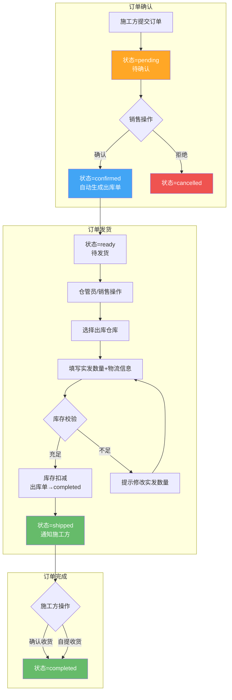
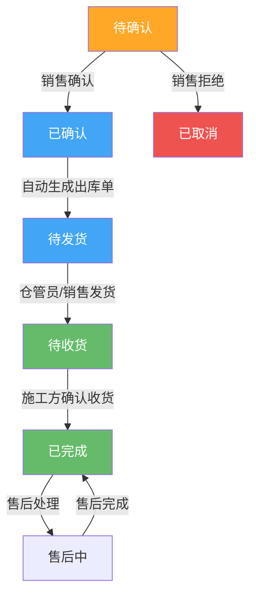

# 工程仓端 - 销售订单管理功能详细设计

> 版本：v2.0  
> 文档状态：已定稿  
> 所属章节：第十章

## 版本历史

| 版本 | 日期 | 修订内容 | 修订人 |
|:----:|:----:|---------|:-----:|
| v1.0 | 2026-04-24 | 初始创建，覆盖销售订单全部6个功能点 | PM |
| v1.1 | 2026-04-24 | 追加状态×操作×角色矩阵、每状态角色权限表 | PM |
| v2.0 | 2026-04-24 | 重构为新版11章模板，新增设计原则、流程图、非功能性需求、异常汇总表、接口依赖、状态流转图 | PM |

<!-- ============================================================ -->
<!-- PRD六层模型：                                                    -->
<!--                                                              -->
<!-- 核心层(必写)： 功能概述 → 设计原则 → 业务规则(含流程图) → 功能点详情   -->
<!-- 扩展层(推荐)： 权限矩阵 → 非功能性需求 → 异常汇总 → 接口依赖      -->
<!-- 治理层(状态模块必写)： 状态流转图 → 状态治理矩阵 → 版本历史       -->
<!-- ============================================================ -->

---

## 一、功能概述

### 1.1 功能定位

销售订单管理是工程仓**销售链路（链路二）的核心功能**，覆盖施工方提交销售订单到工程仓发货完成的完整生命周期。工程仓在此链路中作为**卖方**角色，负责确认订单、安排出库发货。

### 1.2 核心概念

| 概念 | 说明 | 示例 |
|:----|------|------|
| 销售订单 | 施工方向工程仓发起的采购请求单据 | SO202604240001 |
| 施工方 | 向工程仓采购材料的施工项目方 | "深圳湾项目施工组" |
| 出库单 | 销售订单发货时生成的出库凭证 | 关联销售订单 |
| 自提 | 施工方自行到仓库提货（无需物流） | 物流信息非必填 |
| 三状态分离 | 主状态/支付/发货独立运行 | 同采购订单原则 |

### 1.3 目标用户

- **销售**：核心操作角色，确认/取消销售订单
- **仓管员**：安排出库发货（与仓库管理联动）
- **主管**：查看所有销售订单
- **施工方（外部）**：创建订单、查看进度、确认收货

### 1.4 模块范围

| 功能分类 | 主要功能 | 涉及角色 |
|:--------|---------|---------|
| 订单查询 | 销售订单列表、状态Tab筛选、搜索 | 销售、仓管员、主管 |
| 订单操作 | 确认订单、取消/拒绝订单 | 销售 |
| 订单发货 | 选择仓库、填写实发数量、物流信息 | 仓管员、销售 |
| 订单导出 | 按条件导出Excel | 主管、财务 |

---

## 二、核心设计原则

> **销售订单与采购订单共享"三状态分离"原则。**

### 2.1 三状态独立运行

- 订单主状态、支付状态、发货状态三轨道独立运行（与采购订单一致）
- 支付状态只做记录，不影响发货和确认操作
- 发货状态支持部分发货（分批出库）

### 2.2 自提适配

- 物流信息非必填，适配施工方自提场景
- 自提场景下，施工方指定提货人+身份证号（V2）

### 2.3 库存前置校验

- 确认订单时不扣减库存（仅锁定预留）
- 发货时才实际扣减库存
- 发货前必须校验库存是否充足

---

## 三、业务规则

### 3.1 订单状态规则

- **待确认（pending）**：施工方已提交，工程仓可确认或拒绝
  - 超24小时未确认→自动提醒施工方（V2）
- **已确认（confirmed）**：工程仓已确认，自动生成出库单
- **待发货（ready）**：已生成出库单，等待仓管员发货
- **待收货（shipped）**：已出库发货，等待施工方确认收货
- **已完成（completed）**：施工方确认收货
- **已取消（cancelled）**：工程仓拒绝

### 3.2 发货规则

- **库存校验**：发货前校验库存是否充足；允许部分发货
- **物流信息**：非必填，适配自提场景
- **出库仓库**：必须选择出库子仓库（不同SKU可发不同仓库V2）
- **发货后回执**：发货后生成出库记录，通知施工方

### 3.3 查询规则

- **默认排序**：按创建时间倒序
- **状态Tab**：全部/待确认/待发货/待收货/已完成
- **搜索**：订单号+施工方名称
- **时间范围**：创建时间区间筛选

### 3.4 核心业务流程图

#### 流程图1：销售订单确认→发货全流程

---

## 四、权限矩阵

| 功能模块 | 具体操作 | 销售 | 仓管员 | 主管 | 财务 | 施工方 |
|:--------|---------|:----:|:------:|:----:|:----:|:------:|
| **订单列表** | 查看列表 | ✅ | ✅ | ✅ | ❌ | ✅ |
| **订单详情** | 查看详情 | ✅ | ✅ | ✅ | ❌ | ✅ |
| **确认/拒绝** | 操作订单 | ✅ | ❌ | ✅ | ❌ | ❌ |
| **发货** | 出库发货 | ✅ | ✅ | ❌ | ❌ | ❌ |
| **查看物流** | 物流跟踪 | ✅ | ✅ | ✅ | ❌ | ✅ |
| **导出** | 导出Excel | ❌ | ❌ | ✅ | ✅ | ❌ |

---

## 五、非功能性需求

### 5.1 性能要求

| 接口/场景 | 指标 | P95要求 | 说明 |
|:---------|:----|:-------:|------|
| 销售订单列表 | 响应时间 | ≤ 300ms | 含状态计数 |
| 订单详情 | 响应时间 | ≤ 200ms | - |
| 确认订单 | 响应时间 | ≤ 500ms | 含出库单生成 |
| 发货操作 | 响应时间 | ≤ 500ms | 含库存扣减 |
| 导出 | 响应时间 | ≤ 5s | 最大10000条 |

### 5.2 埋点需求

| 页面 | 事件名 | 触发时机 | 上报字段 |
|:----|:------|---------|---------|
| 订单列表 | so_order_list | 进入列表 | `tabStatus` |
| 确认订单 | so_confirm | 确认操作 | `sourceOrderId` |
| 发货 | so_delivery | 发货提交 | `warehouseId`, `itemCount` |
| 导出 | so_export | 导出操作 | `filterCondition` |

---

## 六、功能点详细设计

### 6.1 销售订单列表（P0）

#### 交互逻辑

1. 页面加载：默认选中"全部"Tab → 调用销售订单列表接口 → 渲染列表
2. 切换Tab：点击状态Tab → 按状态筛选
3. 搜索+时间筛选：叠加筛选条件
4. 点击订单：跳转订单详情
5. 导出：点击"导出"→基于当前筛选条件导出Excel

#### 原子字段定义

| 字段 | 类型 | 必填 | 来源 | 展示规则 | 默认值 |
|:----|:----|:----:|:----|:--------|:-----:|
| 订单编号 | String(32) | 是 | 订单接口 | 超链接 | - |
| 施工方 | String(50) | 是 | 订单接口 | 文本 | - |
| 订单金额 | Decimal(12,2) | 是 | 订单接口 | 红色加粗 | - |
| 订单状态 | Enum | 是 | 订单接口 | 标签 | pending |
| 创建时间 | DateTime | 是 | 订单接口 | YYYY-MM-DD HH:mm | - |

#### 边界情况覆盖

| 场景 | 处理逻辑 | 提示文案 |
|:----|:--------|---------|
| 加载失败 | 重试按钮 | "加载失败，请重试" |
| 无数据 | 空状态 | "暂无销售订单" |
| 导出失败 | Toast提示 | "导出失败，请稍后重试" |
| 待确认>24h | 订单高亮+待处理标记 | - |

---

### 6.2 销售订单详情（P0）

#### 交互逻辑

1. 页面加载：获取订单详情 → 分区域渲染
2. 订单信息区：订单号+创建时间+状态标签
3. 施工方信息区：名称/联系人/电话/项目名称（只读）
4. 商品明细表：SKU/名称/规格/单价/数量/小计（只读）
5. 操作日志区：时间线展示操作记录
6. 操作按钮区：根据状态动态显示

#### 边界情况覆盖

| 场景 | 处理逻辑 | 提示文案 |
|:----|:--------|---------|
| 订单不存在 | 404页面 | - |
| 发货后物流为空 | 显示"自提" | - |
| 操作日志为空 | "暂无操作记录" | - |

---

### 6.3 确认/拒绝销售订单（P0）

#### 交互逻辑

1. 前置条件：订单状态=pending，当前用户=销售
2. 点击"确认" → 弹窗展示订单摘要 → 确认 → 订单→confirmed，自动生成出库单
3. 点击"拒绝" → 弹窗输入拒绝原因 → 确认 → 订单→cancelled
4. 通知施工方端

#### 边界情况覆盖

| 场景 | 处理逻辑 | 提示文案 |
|:----|:--------|---------|
| 订单已变更 | Toast+刷新 | "订单状态已变更，请刷新后重试" |
| 确认失败 | Toast | "确认失败，请稍后重试" |
| 拒绝原因必填 | 弹窗校验 | "请填写拒绝原因" |

---

### 6.4 销售订单发货（P1）

#### 交互逻辑

1. 前置条件：订单状态=待发货，当前用户=仓管员/销售
2. 选择子仓库：下拉选择出库仓库
3. 填写实发数量：各SKU实发数量（≤应发数量，≤库存）
4. 填写物流信息（可选）：物流公司+物流单号
5. 提交：调用出库接口 → 库存扣减 → 出库单→completed → 订单→待收货
6. 通知施工方

#### 原子字段定义

| 字段 | 类型 | 必填 | 来源 | 校验规则 | 默认值 |
|:----|:----|:----:|:----|:--------|:-----:|
| 选择子仓库 | String(32) | 是 | 仓库接口 | 从已有子仓库选择 | 空 |
| 实发数量 | Integer | 是 | 前端输入 | ≥0, ≤应发, ≤库存 | 应发数量 |
| 物流公司 | String(20) | 否 | 前端输入 | 最大20字 | 空 |
| 物流单号 | String(50) | 否 | 前端输入 | 最大50字 | 空 |

#### 边界情况覆盖

| 场景 | 处理逻辑 | 提示文案 |
|:----|:--------|---------|
| 库存不足 | 输入框标红 | "库存不足，当前仅剩N件" |
| 仓库库存不足 | 阻止提交 | "该仓库库存不足，请选择其他仓库" |
| 提交失败 | Toast提示 | "发货失败，请稍后重试" |

---

### 6.5 订单导出（P2）

#### 交互逻辑

1. 点击"导出" → 调用导出接口 → 展示loading进度条
2. 导出完成 → 自动下载Excel文件
3. 导出失败 → Toast提示

#### 业务规则

- 导出数据基于当前筛选条件
- 最大导出10000条，超出提示缩小筛选范围
- 导出文件名：销售订单_YYYYMMDD_HHmmss.xlsx

#### 边界情况覆盖

| 场景 | 处理逻辑 | 提示文案 |
|:----|:--------|---------|
| 数据量超限 | 阻止导出 | "导出数据超过1万条，请缩小筛选范围" |
| 导出超时 | 提示 | "导出超时，请缩小范围后重试" |

---

## 七、异常处理汇总表

| 异常场景 | 触发条件 | 前端处理 | 后端处理 | 提示文案 |
|:--------|:--------|:--------|:--------|---------|
| 确认→状态已变更 | 并发操作 | Toast+刷新 | 返回冲突 | "订单状态已变更，请刷新后重试" |
| 确认失败 | 接口异常 | Toast | - | "确认失败，请稍后重试" |
| 发货→库存不足 | 实发>库存 | 输入框标红 | - | "库存不足，当前仅剩N件" |
| 发货→仓库库存不足 | 总库存不足 | Toast | - | "该仓库库存不足，请选择其他仓库" |
| 发货失败 | 接口异常 | Toast | 回滚库存 | "发货失败，请稍后重试" |
| 导出超限 | >10000条 | 阻止导出 | - | "导出数据超过1万条，请缩小筛选范围" |
| 导出超时 | 响应>5s | 提示 | - | "导出超时，请缩小范围后重试" |
| 导出失败 | 接口异常 | Toast | - | "导出失败，请稍后重试" |

---

## 八、接口依赖建议

| 接口 | 用途 | 核心字段/逻辑 | 性能要求 |
|:----|:----|:-------------|:--------:|
| `/api/sale-order/list` | 销售订单列表 | 输入：status/dateRange/keyword/page | P95 ≤ 300ms |
| `/api/sale-order/detail` | 订单详情 | 输入：orderId | P95 ≤ 200ms |
| `/api/sale-order/confirm` | 确认订单 | 输入：orderId；自动生成出库单 | P95 ≤ 500ms |
| `/api/sale-order/reject` | 拒绝订单 | 输入：orderId/reason | P95 ≤ 200ms |
| `/api/sale-order/delivery` | 发货 | 输入：orderId/warehouse/items/logistics | P95 ≤ 500ms |
| `/api/sale-order/export` | 导出 | 基于当前筛选条件 | P95 ≤ 5s |

---

## 九、状态流转图

---

## 十、状态治理矩阵

### 10.1 动作定义表

| 动作ID | 动作名称 | 触发方式 | 触发角色 | 说明 |
|:-----:|---------|---------|:-------:|------|
| SAL-01 | 查看列表 | 页面加载/切换Tab | 销售、仓管员、主管 | - |
| SAL-02 | 查看详情 | 点击订单项 | 所有角色 | - |
| SAL-03 | 确认订单 | 详情页「确认」 | 销售 | 仅pending |
| SAL-04 | 取消/拒绝 | 详情页「拒绝」 | 销售 | 仅pending |
| SAL-05 | 发货 | 详情页「发货」 | 仓管员、销售 | 仅ready |
| SAL-06 | 查看物流 | 物流区 | 所有角色 | shipped后 |
| SAL-07 | 导出 | 列表页「导出」 | 主管、财务 | - |

### 10.2 状态×操作矩阵

| 状态 \ 操作 | 查看列表 | 查看详情 | 确认订单 | 取消/拒绝 | 发货 | 查看物流 | 导出 |
|:----------:|:--------:|:--------:|:--------:|:---------:|:----:|:--------:|:----:|
| **pending** | ✅ | ✅ | ✅ | ✅ | ❌ | ❌ | ✅ |
| **confirmed/ready** | ✅ | ✅ | ❌ | ❌ | ✅ | ❌ | ✅ |
| **shipped** | ✅ | ✅ | ❌ | ❌ | ❌(已发) | ✅ | ✅ |
| **completed** | ✅ | ✅ | ❌ | ❌ | ❌ | ✅ | ✅ |
| **cancelled** | ✅ | ✅ | ❌ | ❌ | ❌ | ❌ | ✅ |

### 10.3 每状态角色权限

#### pending（待确认）

| 操作 | 销售 | 仓管员 | 主管 | 施工方 |
|:----:|:----:|:------:|:----:|:------:|
| 查看列表 | ✅ | ✅ | ✅ | ✅ |
| 查看详情 | ✅ | ✅ | ✅ | ✅ |
| 确认订单 | ✅ | ❌ | ✅ | ❌ |
| 拒绝 | ✅ | ❌ | ✅ | ❌ |
| 导出 | ❌ | ❌ | ✅ | ❌ |

#### confirmed / ready（待发货）

| 操作 | 销售 | 仓管员 | 主管 | 施工方 |
|:----:|:----:|:------:|:----:|:------:|
| 查看列表 | ✅ | ✅ | ✅ | ✅ |
| 查看详情 | ✅ | ✅ | ✅ | ✅ |
| 发货 | ✅ | ✅ | ❌ | ❌ |
| 导出 | ❌ | ❌ | ✅ | ❌ |

