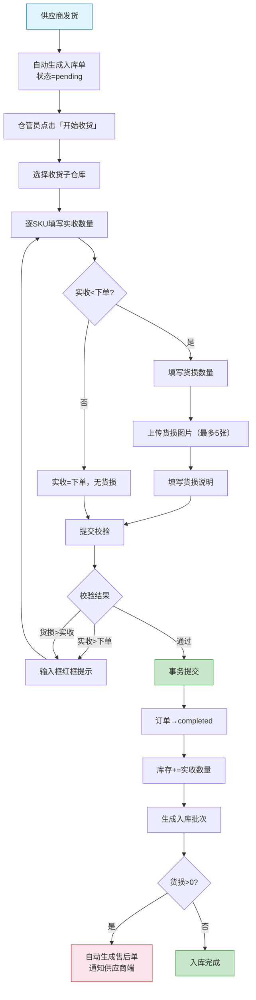
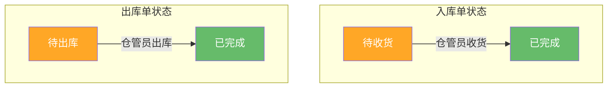

# 工程仓端 - 仓库管理功能详细设计

> 版本：v2.0  
> 文档状态：已定稿  
> 所属章节：第十一章

## 版本历史

| 版本 | 日期 | 修订内容 | 修订人 |
|:----:|:----:|---------|:-----:|
| v1.0 | 2026-04-24 | 初始创建，覆盖仓库管理全部12个功能点 | PM |
| v1.1 | 2026-04-24 | 追加入库单/出库单状态×操作×角色矩阵 | PM |
| v2.0 | 2026-04-24 | 重构为新版11章模板，新增设计原则、流程图、非功能性需求、异常汇总表、接口依赖、状态流转图 | PM |

<!-- ============================================================ -->
<!-- PRD六层模型：                                                    -->
<!--                                                              -->
<!-- 核心层(必写)： 功能概述 → 设计原则 → 业务规则(含流程图) → 功能点详情   -->
<!-- 扩展层(推荐)： 权限矩阵 → 非功能性需求 → 异常汇总 → 接口依赖      -->
<!-- 治理层(状态模块必写)： 状态流转图 → 状态治理矩阵 → 版本历史       -->
<!-- ============================================================ -->

---

## 一、功能概述

### 1.1 功能定位

仓库管理是工程仓**功能最多、业务最重**的模块，覆盖入库、出库、库内管理的全链路。工程仓可管理多个子仓库，每个子仓库独立库存。仓库管理是连接采购订单（入库）和销售订单（出库）的枢纽，也是库存数据准确性的保障。

### 1.2 核心概念

| 概念 | 说明 | 示例 |
|:----|------|------|
| 子仓库 | 工程仓下的独立物理仓库 | "深圳湾主仓"、"龙岗分仓" |
| 入库单 | 采购到货后生成的收货凭证 | IN20260424001 |
| 出库单 | 销售发货时生成的出货凭证 | OUT20260424001 |
| 入库批次 | 每次收货的独立批次记录 | 按时间+商品维度 |
| 货损 | 运输/装卸中发生的货物损坏 | 数量+图片+说明 |
| 库存盘点 | 周期性核对实物与系统库存 | 盘点差异调整 |
| 库存调拨 | 子仓库之间的库存转移 | A仓→B仓 |

### 1.3 目标用户

- **仓管员**（核心）：负责入库/出库/盘点/调拨全部操作
- **采购员**：查看入库状态和库存
- **主管**：查看全局库存状况和管理操作

### 1.4 模块范围

| 功能分类 | 主要功能 | 涉及角色 | 优先级 |
|:--------|---------|---------|:------:|
| 入库管理 | 入库单列表、批次详情、开始收货、货损记录 | 仓管员 | P0 |
| 出库管理 | 出库单列表、确认出库 | 仓管员 | P0 |
| 仓库配置 | 仓库列表、仓库详情 | 所有角色 | P1 |
| 打印 | 打印单据 | 仓管员 | P2 |
| 盘点 | 库存盘点列表、创建盘点单 | 仓管员 | P2 |
| 调拨 | 库存调拨 | 仓管员 | P2 |

---

## 二、核心设计原则

> **仓库管理遵循"事务一致性"核心原则，所有库存变动必须在事务中执行。**

### 2.1 事务一致性

- 入库：库存增加 + 批次生成 + 货损售后单生成 → 同一事务
- 出库：库存扣减 + 出库单完成 → 同一事务，使用乐观锁防超卖
- 调拨：调出扣减 + 调入增加 → 事务拆分（非原子，调出立即生效）

### 2.2 乐观锁防并发

```sql
UPDATE inventory SET quantity = quantity - ?, version = version + 1
WHERE sku_id = ? AND warehouse_id = ? AND quantity >= ? AND version = ?
```
- 所有减库存操作必须使用乐观锁
- 更新影响行数=0时回滚事务，提示操作重试

### 2.3 货损分离处理

- 收货时货损数量独立记录，不影响实收数量
- 货损>0自动生成售后单，触发供应商端处理流程

---

## 三、业务规则

### 3.1 入库规则

- **入库关联**：入库单由采购订单生成（供应商发货后自动生成）
- **实收限制**：实收数量 ≤ 下单数量
- **货损限制**：货损数量 ≤ 实收数量
- **库存更新**：入库完成后库存 += 实收数量
- **批次生成**：每次入库生成独立批次记录
- **货损处理**：货损 > 0 → 自动生成售后单

### 3.2 出库规则

- **出库关联**：出库单由销售订单确认后自动生成
- **实发限制**：实发数量 ≤ 库存数量 且 实发数量 ≤ 应发数量
- **库存更新**：出库完成后库存 -= 实发数量
- **物流信息**：非必填（适配自提场景）

### 3.3 盘点规则

- 盘点期间该仓库冻结出库操作
- 盘点差异 → 生成盘点调整单 → 主管审批后生效（V2）
- 盘点频率：建议每月至少一次

### 3.4 调拨规则

- 调出仓库 → 扣减库存（立即生效）
- 调入仓库 → 增加库存（需入库确认后生效）
- 调拨中库存状态 → "在途"
- 同工程仓内调拨，不影响总库存

### 3.5 核心业务流程图

#### 流程图1：入库全流程（采购订单→收货→批次）



---

## 四、权限矩阵

| 功能模块 | 具体操作 | 采购员 | 仓管员 | 主管 | 销售 |
|:--------|---------|:------:|:------:|:----:|:----:|
| **入库管理** | 查看入库单列表 | ✅ | ✅ | ✅ | ❌ |
| | 查看批次详情 | ✅ | ✅ | ✅ | ❌ |
| | 开始收货 | ❌ | ✅ | ✅ | ❌ |
| | 查看货损记录 | ✅ | ✅ | ✅ | ❌ |
| **出库管理** | 查看出库单列表 | ❌ | ✅ | ✅ | ✅ |
| | 确认出库 | ❌ | ✅ | ❌ | ✅ |
| **仓库配置** | 查看仓库列表 | ✅ | ✅ | ✅ | ✅ |
| | 查看仓库详情 | ✅ | ✅ | ✅ | ✅ |
| **打印** | 打印单据 | ❌ | ✅ | ❌ | ❌ |
| **盘点** | 查看盘点列表 | ❌ | ✅ | ✅ | ❌ |
| | 创建盘点单 | ❌ | ✅ | ❌ | ❌ |
| **调拨** | 库存调拨 | ❌ | ✅ | ❌ | ❌ |

---

## 五、非功能性需求

### 5.1 性能要求

| 接口/场景 | 指标 | P95要求 | 说明 |
|:---------|:----|:-------:|------|
| 入库单列表 | 响应时间 | ≤ 300ms | - |
| 开始收货（提交） | 响应时间 | ≤ 500ms | 含库存更新事务 |
| 出库单列表 | 响应时间 | ≤ 300ms | - |
| 确认出库（提交） | 响应时间 | ≤ 500ms | 含乐观锁库存扣减 |
| 盘点列表 | 响应时间 | ≤ 500ms | - |
| 库存调拨 | 响应时间 | ≤ 500ms | 含两仓更新 |

### 5.2 埋点需求

| 页面 | 事件名 | 触发时机 | 上报字段 |
|:----|:------|---------|---------|
| 入库 | inbound_receive | 收货完成 | `orderId`, `itemCount`, `damageCount` |
| 出库 | outbound_confirm | 出库完成 | `orderId`, `itemCount` |
| 盘点 | stock_check_create | 创建盘点单 | `warehouseId`, `scope` |
| 调拨 | stock_transfer | 提交调拨 | `fromWarehouse`, `toWarehouse` |

---

## 六、功能点详细设计

### 6.1 入库单列表（P0）

#### 交互逻辑

1. 页面加载：默认显示全部入库单（按创建时间倒序）
2. 状态Tab切换：全部/待收货/已完成
3. 搜索：入库单号+来源订单号筛选
4. 点击入库单 → 跳转入库单批次详情
5. 状态=待收货 → 显示「开始收货」按钮

#### 边界情况覆盖

| 场景 | 处理逻辑 | 提示文案 |
|:----|:--------|---------|
| 加载失败 | 重试按钮 | "加载失败，请重试" |
| 无数据 | 空状态 | "暂无入库单" |
| 货损>0 | 显示红色货损标记 | - |

---

### 6.2 开始收货（P0）- 核心入库功能

#### 交互逻辑

1. 前置条件：入库单状态=待收货，当前用户=仓管员
2. 选择子仓库：下拉选择收货仓库
3. 逐SKU填写实收数量（默认=下单数量，可修改）
4. 货损处理：若实收<下单→填写货损数量(≤实收)+上传货损图片(最多5张)+货损说明
5. 提交：校验通过 → 事务提交（订单→completed，库存+=实收，生成批次，货损>0→生成售后单）

#### 原子字段定义

| 字段 | 类型 | 必填 | 来源 | 校验规则 | 默认值 |
|:----|:----|:----:|:----|:--------|:-----:|
| 选择子仓库 | String(32) | 是 | 仓库接口 | 从已有子仓库选择 | 空 |
| 实收数量 | Integer | 是 | 前端输入 | ≥0, ≤下单数量, 整数 | 下单数量 |
| 货损数量 | Integer | 否 | 前端输入 | ≥0, ≤实收数量, 整数 | 0 |
| 货损图片 | Array<File> | 否 | 前端文件 | jpg/png ≤5M, 最多5张 | 无 |
| 货损说明 | Text(200) | 否 | 前端输入 | 最大200字 | 无 |

#### 边界情况覆盖

| 场景 | 处理逻辑 | 提示文案 |
|:----|:--------|---------|
| 实收>下单 | 输入框红框 | "实收数量不能大于下单数量" |
| 货损>实收 | 输入框红框 | "货损数量不能大于实收数量" |
| 未选仓库 | 阻止提交 | "请选择收货仓库" |
| 图片超5张 | 阻止上传 | "最多上传5张图片" |
| 提交失败 | Toast提示 | "收货失败，请重试" |

---

### 6.3 出库单列表（P0）

#### 交互逻辑

1. 页面加载：默认显示全部出库单（按创建时间倒序）
2. 状态Tab切换：全部/待出库/已完成
3. 搜索：出库单号+关联订单号
4. 待出库→显示「确认出库」按钮
5. 点击出库单→跳转详情

#### 边界情况覆盖

| 场景 | 处理逻辑 | 提示文案 |
|:----|:--------|---------|
| 加载失败 | 重试按钮 | "加载失败，请重试" |
| 无数据 | 空状态 | "暂无出库单" |

---

### 6.4 确认出库（P0）- 核心出库功能

#### 交互逻辑

1. 前置条件：出库单状态=待出库，当前用户=仓管员
2. 选择子仓库：下拉选择出库仓库
3. 逐SKU确认实发数量（默认=应发数量，可修改）
4. 填写物流信息（可选）
5. 提交：乐观锁库存扣减 → 出库单→completed → 销售订单→待收货

#### 原子字段定义

| 字段 | 类型 | 必填 | 来源 | 校验规则 | 默认值 |
|:----|:----|:----:|:----|:--------|:-----:|
| 选择子仓库 | String(32) | 是 | 仓库接口 | 从已有子仓库选择 | 空 |
| 实发数量 | Integer | 是 | 前端输入 | ≥0, ≤库存, ≤应发, 整数 | 应发数量 |
| 物流公司 | String(20) | 否 | 前端输入 | 最大20字 | 空 |
| 物流单号 | String(50) | 否 | 前端输入 | 最大50字 | 空 |

#### 边界情况覆盖

| 场景 | 处理逻辑 | 提示文案 |
|:----|:--------|---------|
| 实发>库存 | 输入框红框 | "库存不足，当前仅剩N件" |
| 提交失败 | Toast提示 | "出库失败，请重试" |

---

### 6.5 仓库列表/详情（P1）

#### 交互逻辑

1. 列表页：展示所有子仓库概况（名称/地址/仓管员/状态）
2. 详情页：仓库信息 + 该仓库存商品列表

#### 边界情况覆盖

| 场景 | 处理逻辑 |
|:----|:--------|
| 仓库停用 | 不在下拉选择器中显示 |
| 仓库名称过长 | 省略号截断，Tooltip展示全称 |
| 仓库无商品 | 显示"暂无库存商品" |

---

### 6.6 打印单据（P2）/ 盘点（P2）/ 调拨（P2）

#### 打印单据

- 入库单/出库单详情页 → 「打印」→ 获取模板数据 → 浏览器打印
- 模板内容：标题/单号/日期/商品明细/供应商/施工方/仓管员签名

#### 库存盘点

- 创建盘点单 → 选择仓库+范围 → 生成盘点商品列表
- 逐商品填写实际库存 → 系统计算差异 → 提交差异调整

#### 库存调拨

- 选择调出/调入仓库 → 选择商品 + 数量 → 提交
- 调出仓立即扣减库存，调入仓需入库确认后生效

#### 边界情况覆盖（调拨）

| 场景 | 处理逻辑 | 提示文案 |
|:----|:--------|---------|
| 调出=调入 | 阻止提交 | "调出仓库和调入仓库不能相同" |
| 库存不足 | 阻止提交 | "调出仓库库存不足，当前仅剩N件" |

---

## 七、异常处理汇总表

| 异常场景 | 触发条件 | 前端处理 | 后端处理 | 提示文案 |
|:--------|:--------|:--------|:--------|---------|
| 入库→实收>下单 | 输入值超范围 | 输入框红框 | - | "实收数量不能大于下单数量" |
| 入库→货损>实收 | 输入值超范围 | 输入框红框 | - | "货损数量不能大于实收数量" |
| 入库→图片超5张 | 超过限制 | 阻止上传 | - | "最多上传5张图片" |
| 入库→提交失败 | 接口异常 | Toast提示 | 回滚 | "收货失败，请重试" |
| 出库→实发>库存 | 输入值超范围 | 输入框红框 | - | "库存不足" |
| 出库→乐观锁冲突 | version不匹配 | Toast提示 | 回滚 | "操作冲突，请刷新后重试" |
| 出库→提交失败 | 接口异常 | Toast提示 | 回滚 | "出库失败，请重试" |
| 调拨→调出=调入 | 相同仓库 | Toast | - | "调出仓库和调入仓库不能相同" |
| 调拨→库存不足 | 库存<调拨数量 | Toast | - | "当前仅剩N件" |
| 盘点→提交失败 | 接口异常 | Toast提示 | 回滚 | "盘点数据提交失败" |

---

## 八、接口依赖建议

| 接口 | 用途 | 核心字段/逻辑 | 性能要求 |
|:----|:----|:-------------|:--------:|
| `/api/inbound/list` | 入库单列表 | 输入：status/dateRange/page | P95 ≤ 300ms |
| `/api/inbound/receive` | 开始收货 | 输入：inboundId/warehouse/items/damage；事务提交 | P95 ≤ 500ms |
| `/api/inbound/batch` | 批次详情 | 输入：inboundId | P95 ≤ 200ms |
| `/api/outbound/list` | 出库单列表 | 输入：status/dateRange/page | P95 ≤ 300ms |
| `/api/outbound/confirm` | 确认出库 | 输入：outboundId/warehouse/items/logistics；乐观锁库存扣减 | P95 ≤ 500ms |
| `/api/warehouse/list` | 仓库列表 | 输出：所有子仓库信息 | P95 ≤ 200ms |
| `/api/inventory/transfer` | 库存调拨 | 输入：from/to/skuId/quantity | P95 ≤ 500ms |
| `/api/inventory/check` | 盘点提交 | 输入：checkId/differences | P95 ≤ 500ms |

---

## 九、状态流转图



---

## 十、状态治理矩阵

### 10.1 入库单状态×操作矩阵

| 状态 \ 操作 | 查看列表 | 查看详情 | 开始收货 | 查看批次 | 货损记录 |
|:----------:|:--------:|:--------:|:--------:|:--------:|:--------:|
| **pending** | ✅ | ✅ | ✅ | ❌ | ❌ |
| **completed** | ✅ | ✅ | ❌（已收） | ✅ | ✅ |

### 10.2 入库单操作×角色权限

| 操作 | 采购员 | 仓管员 | 主管 | 销售 |
|:----:|:------:|:------:|:----:|:----:|
| 查看列表 | ✅ | ✅ | ✅ | ❌ |
| 查看详情 | ✅ | ✅ | ✅ | ❌ |
| 开始收货 | ❌ | ✅ | ✅ | ❌ |
| 查看批次 | ✅ | ✅ | ✅ | ❌ |

### 10.3 出库单操作×角色权限

| 操作 | 销售 | 仓管员 | 主管 | 采购员 |
|:----:|:----:|:------:|:----:|:------:|
| 查看列表 | ✅ | ✅ | ✅ | ❌ |
| 查看详情 | ✅ | ✅ | ✅ | ❌ |
| 确认出库 | ✅ | ✅ | ❌ | ❌ |

