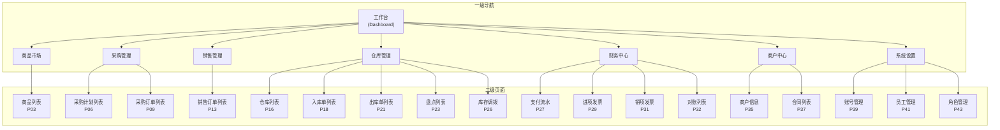
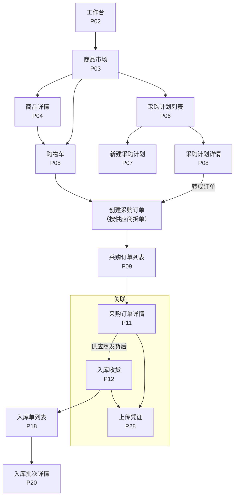
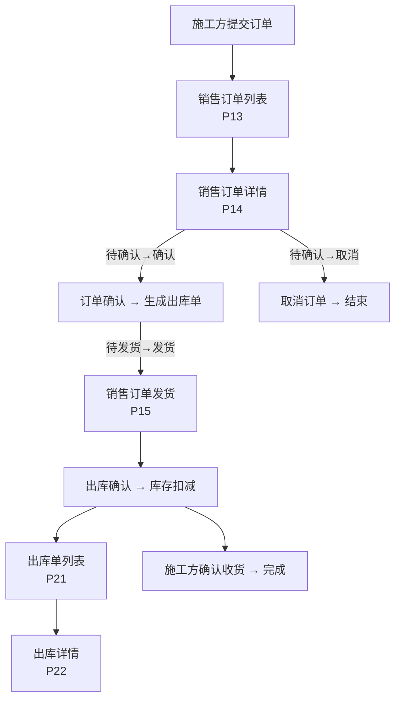
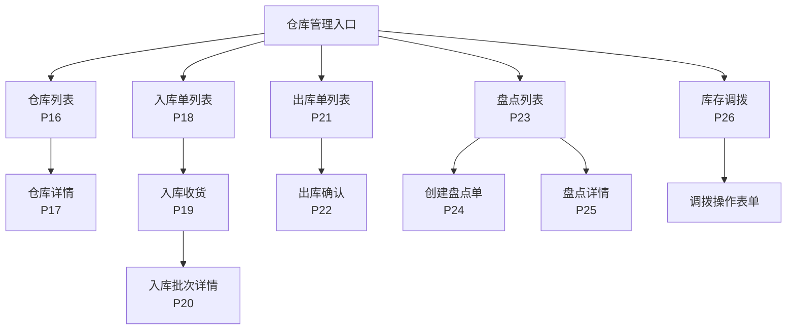
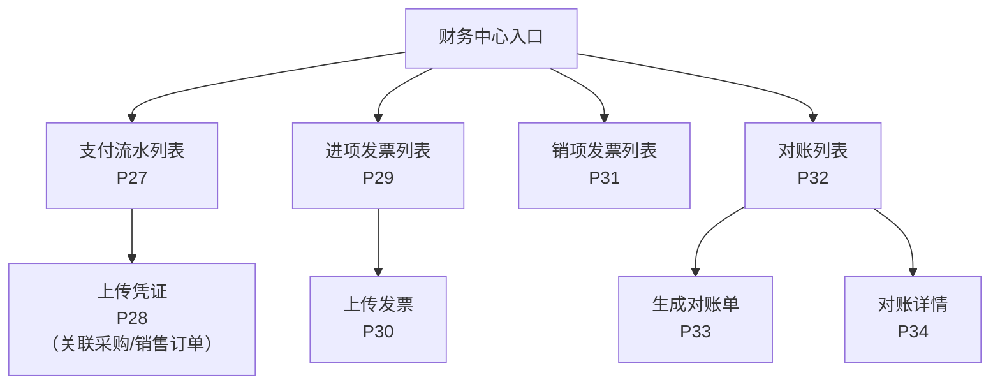
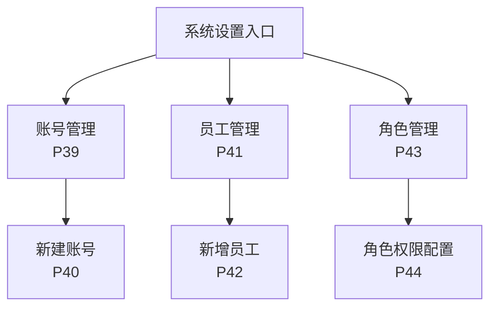

# 工程仓端 - 页面导航设计

> 版本：v1.0  
> 文档状态：正式版  
> 所属章节：第十五章  
> 面向角色：前端开发

## 版本历史

| 版本 | 日期 | 修订内容 |
|:----:|:----:|---------|
| v1.0 | 2026-04-24 | 初始创建，覆盖44个页面索引、6张导航关系图、页面跳转交互规则 |

---

## 一、页面清单

### 1.1 页面索引

| 编号 | 页面名称 | 路由Path（参考） | 所属模块 | 布局 |
|:----:|---------|:--------------:|---------|:----:|
| P01 | 登录页 | /login | — | 独立布局 |
| P02 | 工作台 | /dashboard | 工作台 | 主布局 |
| P03 | 商品市场 | /market/list | 商品管理 | 主布局 |
| P04 | 商品详情 | /market/detail/:id | 商品管理 | 主布局 |
| P05 | 购物车 | /market/cart | 商品管理 | 主布局 |
| P06 | 采购计划列表 | /purchase-plan/list | 采购管理 | 主布局 |
| P07 | 新建采购计划 | /purchase-plan/create | 采购管理 | 主布局 |
| P08 | 采购计划详情 | /purchase-plan/detail/:id | 采购管理 | 主布局 |
| P09 | 采购订单列表 | /purchase-order/list | 采购管理 | 主布局 |
| P10 | 手动创建订单 | /purchase-order/create | 采购管理 | 主布局 |
| P11 | 采购订单详情 | /purchase-order/detail/:id | 采购管理 | 主布局 |
| P12 | 采购订单收货 | /purchase-order/receive/:id | 采购管理 | 主布局 |
| P13 | 销售订单列表 | /sale-order/list | 销售管理 | 主布局 |
| P14 | 销售订单详情 | /sale-order/detail/:id | 销售管理 | 主布局 |
| P15 | 销售订单发货 | /sale-order/delivery/:id | 销售管理 | 主布局 |
| P16 | 仓库列表 | /warehouse/list | 仓库管理 | 主布局 |
| P17 | 仓库详情 | /warehouse/detail/:id | 仓库管理 | 主布局 |
| P18 | 入库单列表 | /warehouse/inbound/list | 仓库管理 | 主布局 |
| P19 | 入库收货 | /warehouse/inbound/receive/:id | 仓库管理 | 主布局 |
| P20 | 入库批次详情 | /warehouse/inbound/batch/:id | 仓库管理 | 主布局 |
| P21 | 出库单列表 | /warehouse/outbound/list | 仓库管理 | 主布局 |
| P22 | 出库确认 | /warehouse/outbound/confirm/:id | 仓库管理 | 主布局 |
| P23 | 盘点列表 | /warehouse/stock-check/list | 仓库管理 | 主布局 |
| P24 | 创建盘点单 | /warehouse/stock-check/create | 仓库管理 | 主布局 |
| P25 | 盘点详情 | /warehouse/stock-check/detail/:id | 仓库管理 | 主布局 |
| P26 | 库存调拨 | /warehouse/transfer | 仓库管理 | 主布局 |
| P27 | 支付流水列表 | /finance/flow/list | 财务中心 | 主布局 |
| P28 | 上传凭证 | /finance/flow/upload/:orderId | 财务中心 | 主布局 |
| P29 | 进项发票列表 | /finance/invoice-input/list | 财务中心 | 主布局 |
| P30 | 上传发票 | /finance/invoice-input/upload | 财务中心 | 主布局 |
| P31 | 销项发票列表 | /finance/invoice-output/list | 财务中心 | 主布局 |
| P32 | 对账列表 | /finance/reconciliation/list | 财务中心 | 主布局 |
| P33 | 生成对账单 | /finance/reconciliation/create | 财务中心 | 主布局 |
| P34 | 对账详情 | /finance/reconciliation/detail/:id | 财务中心 | 主布局 |
| P35 | 商户信息 | /merchant/info | 商户中心 | 主布局 |
| P36 | 编辑商户信息 | /merchant/edit | 商户中心 | 主布局 |
| P37 | 合同列表 | /merchant/contract/list | 商户中心 | 主布局 |
| P38 | 合同详情 | /merchant/contract/detail/:id | 商户中心 | 主布局 |
| P39 | 账号管理 | /system/account | 系统设置 | 主布局 |
| P40 | 新建账号 | /system/account/create | 系统设置 | 主布局 |
| P41 | 员工管理 | /system/employee | 系统设置 | 主布局 |
| P42 | 新增员工 | /system/employee/create | 系统设置 | 主布局 |
| P43 | 角色管理 | /system/role | 系统设置 | 主布局 |
| P44 | 角色权限配置 | /system/role/permission/:id | 系统设置 | 主布局 |

### 1.2 弹窗/抽屉清单（非独立页面）

| 编号 | 弹窗名称 | 触发页面 | 说明 |
|:----:|---------|:--------:|------|
| D01 | 商品选择器弹窗 | 新建计划/手动创建订单 | 选择商品+数量 |
| D02 | 转单确认弹窗 | 采购计划详情→转成订单 | 确认转单摘要 |
| D03 | 确认订单弹窗 | 销售订单详情→确认订单 | 摘要确认 |
| D04 | 发货表单弹窗 | 销售订单详情→发货 | 填写仓库+实发数量+物流 |
| D05 | 二次确认弹窗 | 取消订单/停用账号/离职 | 通用二次确认 |
| D06 | 上传凭证弹窗 | 支付流水→上传 | 选择文件+上传 |
| D07 | 上传发票弹窗 | 进项发票→上传 | 选择文件+填写信息 |
| D08 | 权限配置弹窗 | 角色管理→编辑权限 | 权限树选择 |
| D09 | 账号新建/编辑弹窗 | 账号管理→新建/编辑 | 表单 |

---

## 二、页面导航关系图

### 2.1 一级菜单到二级页面

### 2.2 采购交易链路（链路一：采购）页面流转

### 2.3 销售交易链路（链路二：销售）页面流转

### 2.4 仓库管理页面流转

### 2.5 财务中心页面流转

### 2.6 系统设置页面流转

---

## 三、页面跳转交互规则

### 3.1 全局交互规则

| 规则 | 说明 |
|:----:|------|
| **Tab切换** | 列表页顶部状态Tab → 切换不刷新整页，仅更新列表数据（前端保留Tab状态） |
| **详情跳转** | 列表项点击 → 路由push到详情页（浏览器可回退） |
| **新建跳转** | 新建按钮点击 → 路由push到新建页（表单提交后回退到列表页） |
| **弹窗操作** | 确认/取消/上传等操作 → 使用Modal弹窗（不跳转页面） |
| **返回路径** | 详情页返回 → 回到列表页并保持之前筛选条件 |

### 3.2 操作后跳转

| 当前操作 | 跳转目标 | 跳转方式 |
|---------|---------|:--------:|
| 新建采购计划→创建成功 | 计划详情页 | router.push |
| 计划转订单→成功 | 采购订单详情页 | router.push |
| 购物车结算→创建订单成功 | 采购订单详情页 | router.push |
| 手动创建订单→成功 | 采购订单详情页 | router.push |
| 销售订单发货→成功 | 销售订单详情页（刷新） | router.replace 当前页+刷新 |
| 上传凭证/发票→成功 | 返回上个列表页 | router.back |
| 盘点创建→成功 | 盘点详情页 | router.push |
| 生成对账单→成功 | 对账详情页 | router.push |
| 新建/编辑账号/员工→成功 | 对应列表页 | router.back |
| 角色权限配置保存→成功 | 角色管理列表 | router.back |

### 3.3 弹窗 vs 跳转页决策

| 场景 | 使用方式 | 理由 |
|:----:|:--------:|------|
| 确认/取消订单 | 当前页弹窗 | 操作简单，无需新页 |
| 发货/收货 | 新页（P12/P15/P19） | 操作步骤多（选择仓库+填写数量+物流） |
| 创建订单/计划 | 新页（P10/P07） | 多步骤流程（选择商品+填写信息+确认） |
| 上传文件 | 弹窗（D06/D07） | 操作简单，不改变页面 |
| 权限配置 | 弹窗（D08） | 树形选择，保持上下文 |

