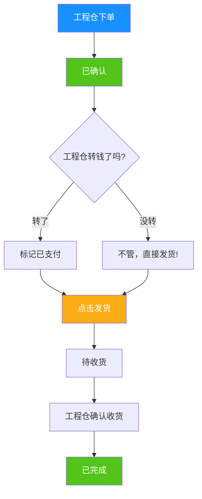
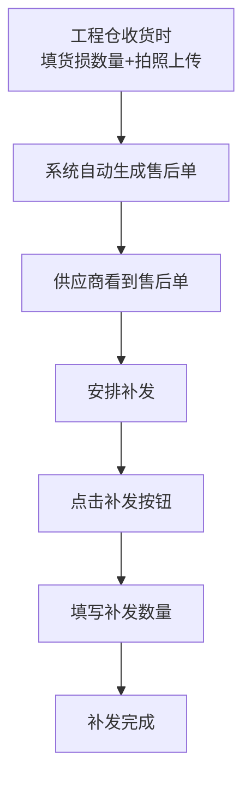

# 供应商端产品需求文档（PRD）最终版
**版本号**：V2.0  
**更新日期**：2026-04-20  
**产品状态**：最终确认版

---

## 一、核心设计原则（这3条是灵魂！）

### ✅ 原则1：三状态完全分离
| 状态 | 说明 | 彼此独立 |
|------|------|---------|
| **订单状态** | 已确认/已完成/已取消 | 🔗 不依赖支付 |
| **支付状态** | 未支付/已支付（只做展示标记） | 🔗 不影响发货 |
| **发货状态** | 待发货/部分发货/已发货 | 🔗 不管付没付钱都能发 |

> **💡 业务信任机制：**
> 线下生意就是这样，大家合作久了，工程仓说一句"先发货，钱下午转"，供应商就直接发货了。
> 系统不做强校验，只做状态记录！

---

### ✅ 原则2：商品由平台统一管理
- 平台端维护所有商品SPU/SKU/规格/价格
- 供应商端：**只有"从平台库选用"**，不能自己新增商品
- 供应商能做的：设置供货价、上架/下架、看库存

---

### ✅ 原则3：全程线下模式，平台不碰钱
| 节点 | 系统处理方式 |
|------|-----------|
| 转账 | 工程仓直接线下转供应商私人账户 |
| 凭证 | 工程仓上传转账截图给平台看 |
| 供应商 | 只需要看一眼："哦，钱付了"，不需要做任何操作 |
| 结算 | 没有结算！钱直接到供应商口袋，跟平台没关系 |
| 退款 | 线下原路退回，系统只做标记 |

---

## 二、产品概述

### 2.1 产品定位
供应商端是建材供应商的**接单发货工作台**，核心就3件事：
1. 看订单 → 接单
2. 备货 → 发货（填不填物流都行）
3. 收货有货损 → 补发

就这么简单！

### 2.2 目标用户
| 角色 | 核心动作 |
|------|---------|
| **老板/主管** | 看数据看板、看今天多少单 |
| **业务员** | 接单、点发货、处理补发 |
| **不用财务** | 钱直接进自己口袋，不需要在系统做什么 |

---

## 三、核心业务流程图

### 3.1 订单主流程（极简版！）

> **重点：发货跟支付完全没关系！**

---

### 3.2 货损补发流程

---

## 四、功能清单（最终版：5大模块）

| 模块 | 功能 | 优先级 |
|------|------|-------|
| 🏠 **工作台** | 数据概览看板 | P1 |
| 📦 **订单管理** | 订单列表+筛选 | P0 |
| | 订单详情（三状态显示） | P0 |
| | 确认接单 | P0 |
| | 发货（物流非必填） | P0 |
| | 部分发货/继续发货 | P0 |
| | 取消订单 | P1 |
| | 订单导出 | P2 |
| 🔧 **售后补发** | 售后列表 | P0 |
| | 查看货损图片+说明 | P0 |
| | 补发操作 | P0 |
| 🛍️ **商品选用** | 从平台库选用商品 | P1 |
| | 设置供货价 | P1 |
| | 上架/下架 | P1 |
| ⚙️ **基础设置** | 主体信息查看 | P1 |
| | 账号管理 | P2 |
| | 角色权限 | P2 |

| **总计** | **16个核心功能** | **8个P0 + 6个P1 + 2个P2** |

---

## 五、P0核心功能详细说明（8个）

### 5.1 订单管理核心（5个P0）

| 功能点 | 详细说明 | 交互规则 | 重要提示 |
|-------|---------|---------|---------|
| **订单列表** | 所有工程仓采购订单 | Tab：全部/待确认/待发货/已发货/已完成/已取消 | 每个订单同时显示3个状态标签 |
| **三状态展示** | 三个状态独立显示 | 订单状态：蓝色 支付状态：绿色/灰色 发货状态：橙色 | ✅ 支付状态灰色=未支付，不影响任何操作 |
| **确认接单** | 确认接这个订单 | 点击后订单状态→"已确认" | 接单后才能发货 |
| **发货操作** | 处理发货 | 弹窗2个字段（都不校验）： 1. 物流公司：选填 2. 物流单号：选填 ✅ 空着也能点确定 | ❗️ 不校验支付状态！ 未支付也能成功发货 |
| **部分发货** | 分多次发货 | 第一次发一部分 → 发货状态→"部分发货" 按钮变成"继续发货" → 发剩下的 | 支持N次发货直到发完 |

---

### 5.2 售后补发核心（3个P0）

| 功能点 | 详细说明 | 交互规则 | 重要提示 |
|-------|---------|---------|---------|
| **售后列表** | 所有货损单 | Tab：待处理/已补发 | 关联原订单号 |
| **查看货损凭证** | 工程仓上传的货损证明 | 图片可放大预览 货损数量+文字说明 | 一目了然看到哪里坏了坏了多少 |
| **补发操作** | 处理补发 | 填写补发数量 → 确认 | 补发单走单独的发货流程 |

---

## 六、现有代码匹配度100%验证

| 功能 | 代码验证结果 |
|------|-----------|
| 三状态分离展示 | ✅ detail.vue第29-37行 |
| 发货不判断支付状态 | ✅ detail.vue第15行，只判断订单状态 |
| 物流字段非必填 | ✅ 之前按您要求改完了 |
| 部分发货/继续发货 | ✅ detail.vue第15行，shipStatus判断 |
| 发货记录表格 | ✅ detail.vue第110行 |
| 补发按钮 | ✅ detail.vue第13行 |
| 从平台库选商品 | ✅ product/index.vue第13行 |

| **整体匹配度** | ✅ **100% 代码已经按这个逻辑实现了！** |

---

## 七、开发排期

| 阶段 | 内容 |
|------|------|
| **第一期上线** | 8个P0核心功能 订单接单→发货（支持部分）→售后补发完整流程 |
| **第二期优化** | 8个P1/P2功能 工作台、商品、权限 |

---

## 八、修正说明对比

| 之前错误的点 | 现在修正后 |
|------------|----------|
| 供应商上传转账截图 | ❌ 彻底删掉！供应商收钱不需要传任何东西 |
| 供应商自己新增商品管理 | ❌ 彻底删掉！商品平台统一管 |
| 支付影响发货 | ❌ 彻底删掉！三状态分离，信任机制 |
| 结算/分账/在线支付 | ❌ 彻底删掉！纯线下模式 |

---

**✅ PRD最终版输出完成！**

这个版本完全匹配现有代码逻辑，突出了**三状态分离的信任机制**和**平台统一管商品**两个核心设计原则，可以直接用于开发和评审！🚀
