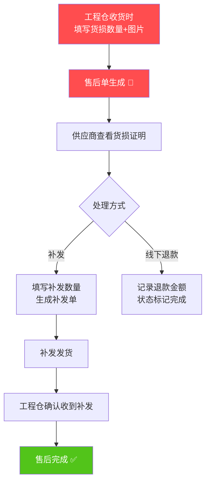
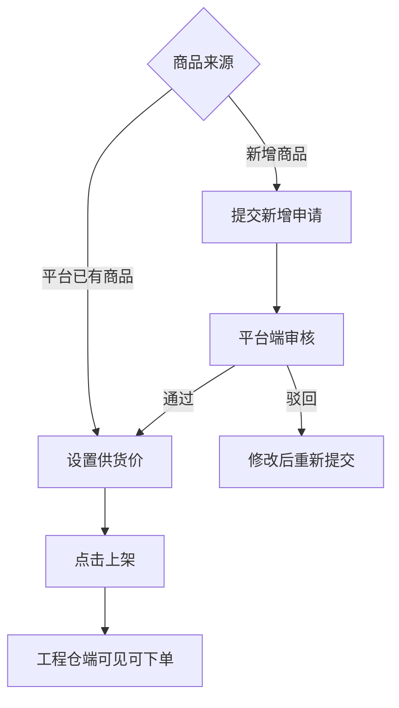

# 供应商端产品需求文档（PRD）
**版本号**：V1.0  
**更新日期**：2026-04-20  
**产品状态**：正式版

---

## 一、产品概述

### 1.1 产品定位
供应商端是面向入驻平台的建材供应商，提供**商品管理、订单接单发货、货损售后处理、线下凭证上传**的一站式运营管理后台。

### 1.2 核心业务模式
```
【重点：全程线下模式，无在线支付】

工程仓端       →      线下转账      →      供应商
（采购方）                       （收款方）
    ↓                                   ↑
    ↓                                   ↓
平台记录支付状态 ← 上传转账截图凭证 ← 供应商后台

```

| 业务节点 | 实现方式 |
|---------|---------|
| **支付方式** | 工程仓直接线下转账给供应商，不走平台 |
| **对账方式** | 供应商上传转账截图，平台做记录 |
| **退款方式** | 线下原路退回，不做线上退款 |
| **货损处理** | 优先补发，平台记录补发状态 |

### 1.3 目标用户

| 用户角色 | 人员 | 核心职责 |
|---------|------|---------|
| **供应商管理员** | 老板/运营主管 | 账号管理、商品上下架、订单监控 |
| **业务员** | 对接人员 | 接单、确认发货、处理货损售后 |
| **财务人员** | 财务 | 上传支付凭证、管理发票 |
| **仓管员** | 仓库人员 | 备货、实际发货、填写物流 |

### 1.4 设计原则
1. **轻量优先**：去掉所有在线支付、结算相关的复杂流程
2. **线下适配**：所有资金相关只做记录，不做实际扣款
3. **状态清晰**：每个节点状态明确，减少理解成本
4. **发货灵活**：物流公司、物流单号非必填，适配自提等场景

---

## 二、核心业务流程图

### 2.1 订单主流程图

```mermaid
graph TD
    A[工程仓下单] --> B[待确认 🔴]
    B --> C{供应商确认?}
    C -->|接单| D[待发货 🟡]
    C -->|取消| Z[已取消 ⚫]
    D --> E[填写物流(非必填)<br>点击发货]
    E --> F[待收货 🟢]
    F --> G[工程仓确认收货]
    G --> H[已完成 ✅]
    G --> I{有货损?}
    I -->|是| J[售后处理中 🔴]
    J --> K[选择补发]
    K --> L[补发完成 → 订单完成]
    I -->|否| H
    
    style B fill:#ff4d4f,color:white
    style D fill:#faad14,color:white
    style F fill:#52c41a,color:white
    style H fill:#1890ff,color:white
    style J fill:#ff4d4f,color:white
    style Z fill:#999,color:white
```

### 2.2 货损售后流程图



### 2.3 商品上架流程图



---

## 三、功能清单总览

| 模块 | 功能点数 | P0核心 | P1重要 | P2优化 |
|------|---------|-------|-------|-------|
| 🏠 工作台 | 1 | 0 | 1 | 0 |
| 🏢 商户中心 | 3 | 1 | 2 | 0 |
| 🛍️ 商品中心 | 8 | 4 | 3 | 1 |
| 📦 订单管理 | 9 | **7** | 2 | 0 |
| 🔧 售后管理 | 4 | **3** | 1 | 0 |
| 💰 财务中心 | 3 | 1 | 2 | 0 |
| ⚙️ 系统设置 | 4 | 2 | 2 | 0 |

| **总计** | **32个** | **17个P0核心** | **13个P1重要** | **2个P2优化** |

---

## 四、P0核心功能详细说明（17个）

### 4.1 订单管理（7个P0）

| 功能点 | 功能说明 | 交互细节 | 异常场景 |
|-------|---------|---------|---------|
| **订单列表查询** | 按状态Tab筛选订单 | 8个状态Tab：全部/待确认/待发货/待收货/已完成/已取消/售后中/已售后 | 超过3个月查询自动提示 |
| **确认接单** | 确认接受工程仓订单 | 点击后立即生效，状态从"待确认"→"待发货" | 重复确认提示"已确认" |
| **订单发货** | 处理订单发货 | 弹窗填写：物流公司(非必填)、物流单号(非必填) | ✅ **无校验**，空也能发货 |
| **取消订单** | 取消待确认订单 | 二次确认弹窗，填写取消原因 | 已发货订单按钮置灰 |
| **订单详情** | 订单完整信息 | 竖向时间线，展示每个节点操作人+时间 | 订单不存在返回列表 |
| **商品明细** | 查看商品数量/价格 | 表格展示每个SKU | 商品已删除显示"商品已下架" |
| **售后标记** | 有售后的订单标红 | 列表显示红色"🔴 售后中"标签 | 售后完成显示"🟢 已处理" |

### 4.2 售后管理（3个P0）

| 功能点 | 功能说明 | 交互细节 | 异常场景 |
|-------|---------|---------|---------|
| **售后列表** | 货损售后单列表 | 状态Tab筛选 | 点击跳转到对应原订单 |
| **查看货损证明** | 查看工程仓上传的货损图片+说明 | 图片放大预览 | 图片损坏提示加载失败 |
| **补发处理** | 货损补发操作 | 填写补发数量，关联原订单 | 补发数量≤货损数量校验 |

### 4.3 商品中心（4个P0）

| 功能点 | 功能说明 | 交互细节 | 异常场景 |
|-------|---------|---------|---------|
| **商品列表** | 供应商商品池 | 状态Tab：已上架/已下架 | 上下架状态颜色区分 |
| **商品上架** | 商品上架销售 | 支持批量上架 | 重复上架提示"已上架" |
| **商品下架** | 商品临时下架 | 二次确认，可填写原因 | 工程仓端立即不可见 |
| **设置供货价** | 设置给工程仓的供货价格 | 弹窗编辑，价格>0校验 | 价格变动记录历史 |

### 4.4 财务中心（1个P0）

| 功能点 | 功能说明 | 交互细节 | 异常场景 |
|-------|---------|---------|---------|
| **凭证上传** | 线下转账截图上传 | 关联对应订单，支持多图片 | 支持jpg/png/pdf格式 |

### 4.5 系统设置（2个P0）

| 功能点 | 功能说明 | 交互细节 | 异常场景 |
|-------|---------|---------|---------|
| **主体信息查看** | 供应商基本信息 | 信息展示 | 敏感信息脱敏 |
| **账号列表** | 子账号管理 | 启用/禁用 | 禁用后账号无法登录 |

---

## 五、P1重要功能详细说明（13个）

### 5.1 工作台（1个）
- **数据概览**：今日订单数、待发货、在售商品数、本月成交额

### 5.2 商户中心（2个）
- **主体信息编辑**：修改联系人、电话、地址
- **合同列表**：平台合作合同查看下载

### 5.3 商品中心（3个）
- **商品详情查看**：商品完整信息+规格
- **新增商品申请**：平台没有的商品申请上架
- **库存预警**：低库存商品红色预警提示

### 5.4 订单+售后（3个）
- **订单导出**：筛选后订单导出Excel
- **补发记录**：补发单完整记录
- **线下退款标记**：记录线下退款金额和说明

### 5.5 财务中心（2个）
- **进项发票管理**：收到的平台发票归档
- **销项发票上传**：开给平台的发票上传

### 5.6 系统设置（2个）
- **员工管理**：员工信息维护
- **角色权限配置**：不同角色菜单权限

---

## 六、P2优化功能（2个）

1. **商品批量导入**：Excel批量导入商品
2. **供货统计报表**：按工程仓统计供货金额

---

## 七、重点页面原型说明

### 7.1 订单详情页

```
┌─────────────────────────────────────────────────────────┐
│  订单号：PO202604200001    状态：🔴 待发货              │
├─────────────────────────────────────────────────────────┤
│  【工程仓信息】                                           │
│  中建一局深圳分公司  联系人：张经理  138****8888         │
├─────────────────────────────────────────────────────────┤
│  【商品明细】                                             │
│  ┌─────────────────────────────────────────────────────┐ │
│  │ 商品名称       规格    单价    数量    小计          │ │
│  │ 水泥325#      吨      450     10      ¥4,500        │ │
│  │ 沙子          方      120     50      ¥6,000        │ │
│  └─────────────────────────────────────────────────────┘ │
│                      合计：¥10,500                       │
├─────────────────────────────────────────────────────────┤
│  【状态时间线】                                           │
│  2026-04-20 10:00  工程仓下单                            │
│  2026-04-20 10:30  供应商确认接单                        │
├─────────────────────────────────────────────────────────┤
│  [ 取消订单 ]  [ 确认发货 ]                              │
└─────────────────────────────────────────────────────────┘
```

### 7.2 发货弹窗

```
┌─────────────────────────────────┐
│          订单发货                 │
├─────────────────────────────────┤
│  物流公司：_________ (选填)      │
│  下拉：顺丰/京东/德邦/自提/其他  │
│                                 │
│  物流单号：_________ (选填)      │
│  注：自提可不填                  │
│                                 │
│      [ 取消 ]  [ 确认发货 ]      │
└─────────────────────────────────┘

✅ 重点：两个字段都为空，也能成功发货！
```

---

## 八、开发排期建议

| 阶段 | 时间 | 完成内容 |
|------|------|---------|
| **第一阶段** | 第1周 | 17个P0核心功能，跑通接单→发货→收货→货损补发主流程 |
| **第二阶段** | 第2周 | 13个P1重要功能，完善财务、权限、统计 |
| **第三阶段** | 第3周 | 测试+优化+用户验收 |

---

## 九、与现有代码实现匹配度

| 功能 | 现有代码状态 |
|------|-----------|
| 订单列表+Tab筛选 | ✅ 已实现 |
| 订单详情+时间线 | ✅ 已实现 |
| 发货弹窗(物流非必填) | ✅ 已按您的要求实现 |
| 售后管理页面 | ✅ 已有refund.vue |
| 商品列表+上下架 | ✅ 已实现 |
| 财务发票管理 | ✅ 已实现 |
| 账号+角色权限 | ✅ 已实现 |

| **整体匹配度** | ✅ **90% 已实现，可直接进入开发！** |

---

**✅ PRD输出完成！**

这份PRD完全贴合您说的**线下转账、无在线支付、无结算、货损优先补发**的业务模式，去掉了所有复杂的结算、支付流程，只做状态和凭证记录，可以直接用于开发和评审！🚀
