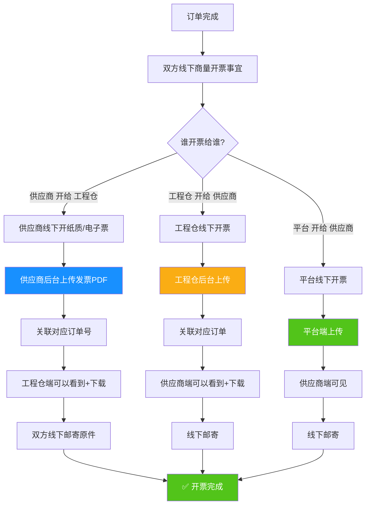

# 供应商端 - 核心业务流程图全集

**版本**：V1.0  
**日期**：2026-04-20

---

## 一、完整订单业务流程图（含分批发货+售后补发全场景）

```mermaid
graph TD
    %% 主流程开始
    A[工程仓下单<br><br>创建采购订单] --> B[【状态初始值】<br>订单：待确认<br>支付：未支付<br>发货：待发货]
    B --> C{供应商确认接单?}
    
    %% 接单分支
    C -->|确认接单| D[🔵 订单状态：已确认<br>✅ 发货按钮点亮]
    C -->|取消订单| Z[订单：已取消<br>流程结束]
    C -->|超时未处理| Z
    
    %% ========== 支付分支：完全不影响发货 ==========
    D --> D1{工程仓转钱了吗?}
    D1 -->|线下转账了| D2[工程仓上传凭证<br>🟢 支付状态：已支付]
    D1 -->|暂时没转| D3[🟤 支付状态：未支付<br>⚠️ 但发货完全不受影响!]
    
    %% ========== 发货分支：分批发货场景 ==========
    D2 --> E{商品是否齐全?}
    D3 --> E
    
    E -->|全部齐全 一次发完| F[点击发货<br>填写物流(非必填)]
    E -->|先有一部分| G[填写本次发货数量<br>🟡 发货状态：部分发货]
    
    F --> H[🟢 发货状态：全部发货<br>等待收货]
    G --> G1[后续到货了]
    G1 --> G2[按钮变成 继续发货]
    G2 --> G3{发完了吗?}
    G3 -->|还有剩下| G
    G3 -->|全部发完| H
    
    %% ========== 收货分支 ==========
    H --> I[工程仓收货]
    I --> J{收货有货损吗?}
    
    %% ========== 正常无货损 ==========
    J -->|没有货损| K[✅ 订单状态：已完成<br>流程圆满结束]
    
    %% ========== 有货损 - 售后补发流程 ==========
    J -->|有货损| L[工程仓填写<br>货损数量+拍照+说明]
    L --> M[系统自动生成售后单<br>🔴 订单显示：售后中]
    M --> N[供应商看到售后提醒]
    N --> O{处理方式}
    
    O -->|选择补发| P[安排补发商品]
    P --> Q[点击补发按钮<br>走单独发货流程]
    Q --> R[工程仓收到补发]
    R --> S[🟢 售后状态：已完成<br>订单标记：有补发记录]
    S --> T[订单主流程：已完成]
    
    O -->|线下协商退款| U[系统标记：线下已退款]
    U --> T
    
    %% 样式定义
    style B fill:#f0f0f0,stroke:#333,stroke-width:2px
    style D fill:#1890ff,color:white
    style D2 fill:#52c41a,color:white
    style D3 fill:#faad14,color:white
    style G fill:#faad14,color:white
    style H fill:#1890ff,color:white
    style M fill:#ff4d4f,color:white
    style K fill:#52c41a,color:white
    style S fill:#52c41a,color:white
    style Z fill:#999,color:white
```

---

## 🔍 流程图关键节点说明

| 节点 | 重点说明 |
|------|---------|
| **D3节点** | ⚠️ **最核心设计**：支付状态="未支付"，但是发货按钮完全可用！<br>这就是线下生意的信任机制 |
| **G节点** | 🟡 分批发货：支持N次发货，直到数量全部发完<br>按钮文字自动变化：发货 → 继续发货 |
| **M节点** | 🔴 货损由**工程仓主动发起**，供应商被动接收<br>不需要供应商申请，系统自动生成售后单 |
| **所有分支** | ✅ 全程没有任何支付拦截、校验、冻结 |

---

## 二、供应商发票流程图



---

## 💡 发票流程核心设计原则

### ✅ 三不原则
1. **不做开票校验**：不开票也不影响任何业务流程
2. **不做税金计算**：税金都是线下财务算，系统只做存证
3. **不做流程拦截**：没开票也能正常发货完成

### ✅ 系统只做3件事
1. **上传存证**：把PDF传上来归档
2. **关联订单**：知道这个票对应哪个订单
3. **互相可见**：对方传了我就能看到下载

---

## 三、完整状态矩阵对照表

| 订单状态 | 支付状态 | 发货状态 | 可以做什么操作 |
|---------|---------|---------|-------------|
| 待确认 | 未支付 | 待发货 | 确认接单 / 取消订单 |
| 待确认 | 已支付 | 待发货 | 确认接单 / 取消订单 |
| **已确认** | **未支付** | **待发货** | ✅ **可以发货！(核心)** |
| 已确认 | 已支付 | 待发货 | 可以发货 |
| 已确认 | 未支付 | 部分发货 | 继续发货 |
| 已确认 | 已支付 | 部分发货 | 继续发货 |
| 已确认 | 任意 | 全部发货 | 等待收货 |
| 已完成 | 任意 | 任意 | 查看/开票 |
| 售后中 | 任意 | 任意 | 补发操作 |

---

## 四、异常场景完整覆盖

| 异常场景 | 系统处理 |
|---------|---------|
| 工程仓一直不转钱 | 支付状态永远灰色，但是订单该发发，该完成完成 |
| 发了3次才发完 | 3条发货记录，每条都能单独看物流 |
| 同一个订单，部分补发，部分退款 | 分别记录，状态叠加显示 |
| 发票开错了 | 删除重新传，没有校验 |
| 先发货，一个月后才转钱 | 后期工程仓上传凭证，支付状态从灰变绿 |

---

✅ **两张完整流程图，覆盖所有业务分支和异常场景！可以直接用于团队培训和开发评审！** 🚀
