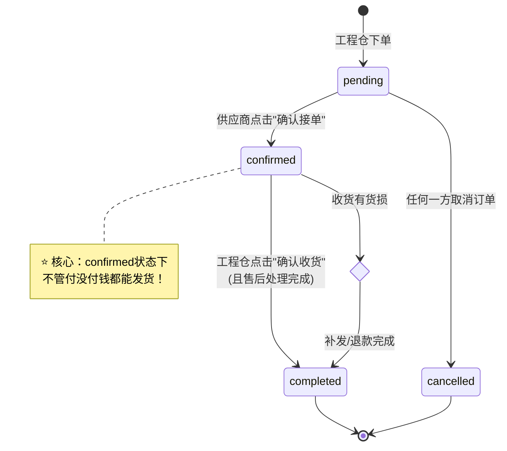
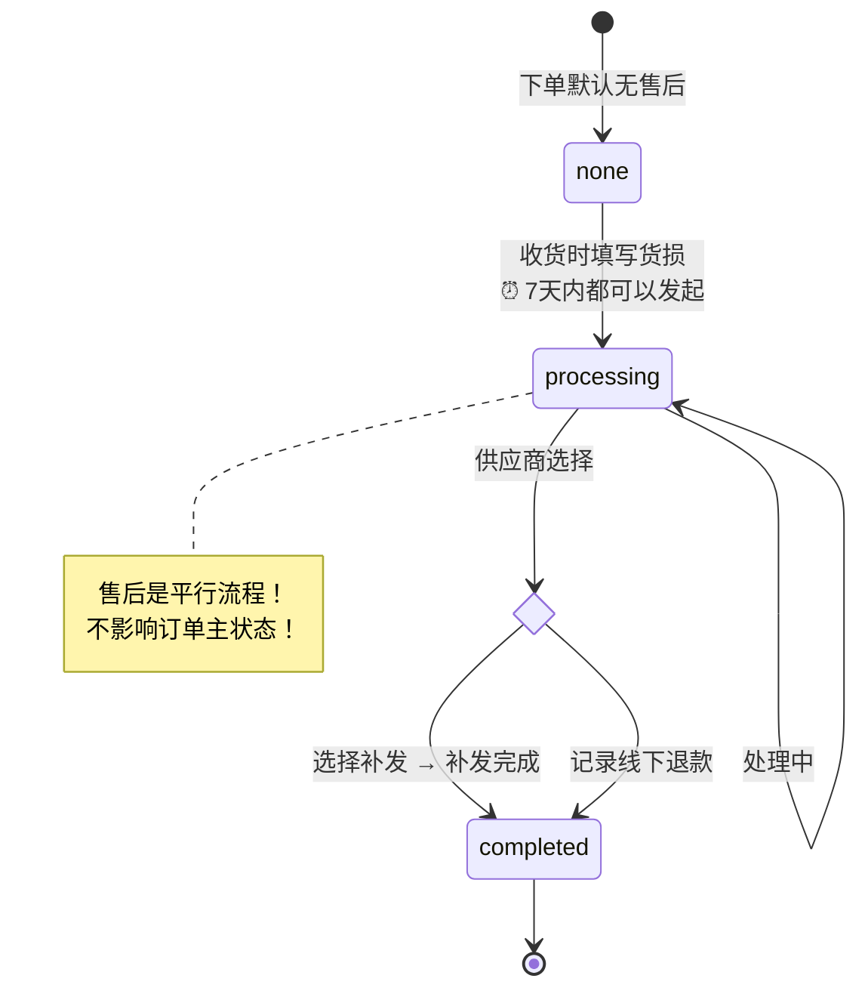
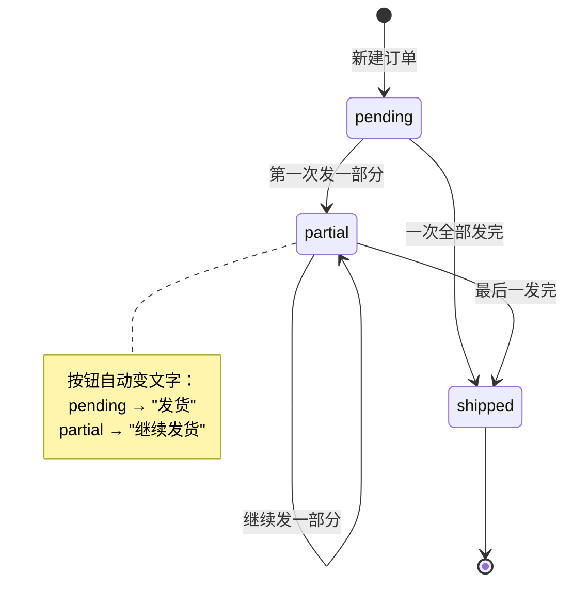

# 订单状态 & 售后状态 - 核心逻辑设计说明书

**版本**：V1.0  
**日期**：2026-04-20  
**适用端**：全端通用设计

---

## 一、状态设计总原则

### ✅ 设计理念
1. **正交独立**：订单状态、支付状态、发货状态、售后状态 **完全独立**，互不依赖
2. **单向流转**：尽量单向流转，减少回退（特殊情况除外）
3. **前端展示**：每个状态有明确的文字+颜色，用户一看就懂
4. **代码友好**：枚举值清晰，判断条件简单

---

## 二、四大状态字段定义

> ❗️ **重要：4个字段完全独立，存储在4个不同的数据库字段！**

| 字段名 | 枚举值 | 说明 |
|-------|-------|------|
| **order_status** | pending/confirmed/completed/cancelled | 订单主状态 |
| **payment_status** | unpaid/paid/refunded | 支付状态 |
| **ship_status** | pending/partial/shipped | 发货状态 |
| **after_sale_status** | none/processing/completed | 售后状态 |

---

## 三、订单主状态（order_status）完整逻辑

### 3.1 状态枚举表

| 枚举值 | 显示文字 | 颜色 | 说明 |
|-------|---------|------|------|
| `pending` | 待确认 | 🔵 蓝色 | 工程仓刚下单，供应商还没确认 |
| `confirmed` | 已确认 | 🟢 绿色 | 供应商已确认接单，可以发货 |
| `completed` | 已完成 | ✅ 深绿 | 全部收货完成（含售后完成） |
| `cancelled` | 已取消 | ⚫ 灰色 | 订单已取消 |

---

### 3.2 状态流转图



---

### 3.3 状态流转条件表

| 当前状态 | 触发事件 | 目标状态 | 谁能操作 |
|---------|---------|---------|---------|
| pending | 点击"确认接单" | confirmed | 供应商 |
| pending | 点击"取消订单" | cancelled | 双方都可以 |
| confirmed | 确认收货 + 无售后 | completed | 工程仓 |
| confirmed | 收货有货损 → 售后完成 | completed | 系统自动 |
| 任何状态（除了completed） | 取消 | cancelled | 管理员 |

---

### 3.4 各状态允许的操作矩阵

| 操作 | pending | confirmed | completed | cancelled |
|------|---------|-----------|-----------|-----------|
| 确认接单 | ✅ | ❌ | ❌ | ❌ |
| 取消订单 | ✅ | ⚠️ 未发货可以 | ❌ | ❌ |
| 发货 | ❌ | ✅ | ❌ | ❌ |
| 继续发货 | ❌ | ✅ | ❌ | ❌ |
| 确认收货 | ❌ | 全部发完后 | ❌ | ❌ |
| 查看售后 | ❌ | ✅ | ✅ | ❌ |
| 导出 | ✅ | ✅ | ✅ | ✅ |

---

## 四、售后状态（after_sale_status）完整逻辑

### 4.1 状态枚举表

| 枚举值 | 显示文字 | 颜色 | 说明 |
|-------|---------|------|------|
| `none` | 无售后 | ⚪ 不显示 | 正常订单，没有售后 |
| `processing` | 售后处理中 | 🔴 红色 | 有货损，正在处理 |
| `completed` | 售后已完成 | 🟡 橙色 | 补发或退款完成 |

---

### 4.2 售后与订单的联动规则

> ❗️ **金规则：售后状态不影响订单主状态的流转！**

| 场景 | 联动逻辑 |
|------|---------|
| **售后中能不能收货？** | ✅ 可以！先点收货确认收到好的那部分，售后单独处理坏的 |
| **订单完成了还能售后吗？** | ✅ 可以！7天内发现货损都可以发起售后 |
| **售后处理中订单是什么状态？** | 订单还是"已确认"，售后状态单独标红显示 |

---

### 4.3 售后状态流转图



---

### 4.4 售后状态流转条件表

| 当前状态 | 触发事件 | 目标状态 | 谁操作 |
|---------|---------|---------|-------|
| none | 工程仓填写货损+上传图片 | processing | 工程仓 |
| processing | 点击"确认补发"并完成发货 | completed | 供应商 |
| processing | 填写"线下退款记录" | completed | 供应商 |

---

### 4.5 各状态允许的操作矩阵

| 操作 | none | processing | completed |
|------|------|-----------|-----------|
| 发起售后（7天内） | ✅ | ❌ | ❌ |
| 查看货损图片 | - | ✅ | ✅ |
| 补发操作 | - | ✅ | ❌ |
| 标记线下退款 | - | ✅ | ❌ |
| 查看补发记录 | - | ✅ | ✅ |

---

## 五、支付状态（payment_status）逻辑

### 5.1 状态枚举表

| 枚举值 | 显示文字 | 颜色 | 说明 |
|-------|---------|------|------|
| `unpaid` | 未支付 | ⚪ 灰色 | 还没传转账凭证 |
| `paid` | 已支付 | 🟢 绿色 | 已上传转账凭证 |

---

### 5.2 最重要的设计：支付状态什么都不影响！

| 支付状态 | 能不能接单？ | 能不能发货？ | 能不能完成？ |
|---------|------------|------------|------------|
| unpaid 未支付 | ✅ 可以 | ✅ 可以 | ✅ 可以 |
| paid 已支付 | ✅ 可以 | ✅ 可以 | ✅ 可以 |

> 🎯 **信任机制的灵魂体现：支付只是一个标记，给大家看的，不是流程卡点！**

---

### 5.3 支付状态流转

```mermaid
graph LR
    A[unpaid 未支付] --> B[工程仓上传转账凭证]
    B --> C[paid 已支付]
    
    note over C: 没有反向流转！<br>付了就是付了
```

---

## 六、发货状态（ship_status）逻辑

### 6.1 状态枚举表

| 枚举值 | 显示文字 | 颜色 | 说明 |
|-------|---------|------|------|
| `pending` | 待发货 | 🟡 黄色 | 还没发过货 |
| `partial` | 部分发货 | 🟠 橙色 | 发了一部分，还有剩下的 |
| `shipped` | 全部发货 | 🟢 绿色 | 全部发完了 |

---

### 6.2 发货状态流转图



---

## 七、列表页标签叠加显示规则

### ✅ 订单列表一个订单最多同时显示4个标签：

```
┌─────────────────────────────────────────────┐
│ 订单号：PO20260001
│
│ 标签区：[🟢 已确认]  [⚪ 未支付]  [🟠 部分发货]  [🔴 售后中]
└─────────────────────────────────────────────┘
```

| 优先级 | 标签 | 显示条件 |
|-------|------|---------|
| 1 | 🔴 售后中 | after_sale_status = processing |
| 2 | 🟠 部分发货 | ship_status = partial |
| 3 | 🟢 已支付 | payment_status = paid |
| 4 | 订单主状态标签 | 一直显示 |

---

## 八、代码判断逻辑示例

### 8.1 发货按钮是否显示？

```typescript
// ✅ 正确写法：只判断订单主状态和发货状态
const canShip = computed(() => {
  return order.order_status === 'confirmed' 
      && order.ship_status !== 'shipped'
})

// ❌ 绝对不要写的错误写法：
// && order.payment_status === 'paid'   ← 千万不要加！
```

### 8.2 按钮文字自动变化

```typescript
const shipButtonText = computed(() => {
  if (order.ship_status === 'pending') return '发货'
  if (order.ship_status === 'partial') return '继续发货'
  return ''
})
```

---

## 九、常见问题答疑

| 问题 | 答案 |
|------|------|
| 工程仓一直不付钱怎么办？ | 系统不管，这是线下生意问题，大家自己催 |
| 货损了不补发怎么办？ | 系统不管，线下沟通解决，系统只做记录 |
| 能不能先售后再收货？ | 不行，必须先收货确认数量再谈货损 |
| 收货10天后才发现货损怎么办？ | 系统不限制，后台管理员可以加 |
| 分5批发完可以吗？ | 完全支持，没有次数限制 |

---

✅ **状态机设计完成！**

这个设计完全贴合建材行业线下生意的信任机制，逻辑清晰，判断简单，开发可以直接按照枚举值写判断条件，没有任何歧义！🚀
