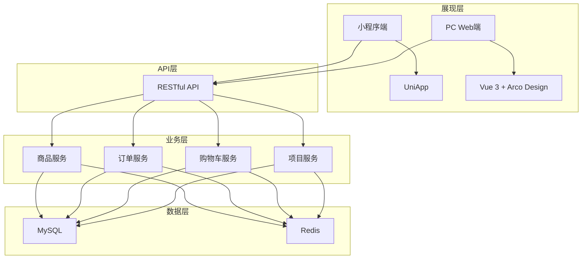

# 施工方端 - 系统概览与架构

> 版本：v1.0  
> 文档状态：初稿  
> 所属章节：第一章

## 版本历史

| 版本 | 日期 | 修订内容 |
|:----:|:----:|---------|
| v1.0 | 2026-04-24 | 初始创建 |

---

## 一、功能定位

### 1.1 系统定位

施工方端是工程仓采供一体化平台的**建材采购方核心端口**，承担**项目采购管理**角色：

```
┌─────────────────────────────────────────────────────────────┐
│                   施工方端（建材采购管理）                      │
├─────────────────────────────────────────────────────────────┤
│                                                              │
│  角色一：作为项目采购方                                        │
│  ┌──────────────────┐    ┌──────────────────┐              │
│  │ 多项目管理        │ →  │ 商品市场选择      │              │
│  │ 切换项目/工程仓    │    │ 浏览/搜索/加购    │              │
│  └──────────────────┘    └──────────────────┘              │
│                                                              │
│  角色二：作为订单管理方                                        │
│  ┌──────────────────┐    ┌──────────────────┐              │
│  │ 采购下单          │ →  │ 订单跟踪          │              │
│  │ 购物车/结算/提交   │    │ 收货/售后/物流    │              │
│  └──────────────────┘    └──────────────────┘              │
│                                                              │
└─────────────────────────────────────────────────────────────┘
```

### 1.2 系统设计哲学

| 原则 | 说明 |
|------|------|
| **移动优先** | 80%场景在手机上完成，PC端仅补充查询功能 |
| **项目驱动** | 所有采购以项目为维度组织，先选项目再采购 |
| **轻量流程** | 操作路径短平快，适合施工现场快速下单 |
| **只管采购** | 施工方只负责买和收货，不涉及商品定义/库存管理 |

### 1.3 核心价值

- **便捷采购**：随时随地通过手机选购建材，告别电话/微信沟通
- **项目化管理**：多项目采购数据自动归集，成本核算一目了然
- **状态透明**：从下单到收货全链路状态跟踪，进度实时掌握
- **减少纠纷**：在线订单记录+确认收货，减少货款纠纷

---

## 二、技术架构

### 2.1 整体架构分层



### 2.2 技术选型

| 技术栈 | 选型 | 用途 |
|-------|------|------|
| 小程序端 | UniApp | 移动端采购入口 |
| PC管理端 | Vue 3.x + Arco Design | PC后台管理 |
| 后端框架 | Spring Boot 3.x | 微服务架构 |
| 数据库 | MySQL 8.x | 核心业务数据 |
| 缓存 | Redis 7.x | 购物车/缓存 |

---

## 三、功能模块树

```
施工方端
├── 首页
│   ├── 项目列表 (P0)
│   ├── 项目切换 (P0)
│   ├── 项目概览 (P1)
│   ├── 工程仓列表 (P1)
│   └── 项目详情 (P1)
├── 商品市场
│   ├── 商品浏览 (P0)
│   ├── 分类筛选 (P0)
│   ├── 搜索商品 (P0)
│   ├── 加入购物车 (P0)
│   └── 商品详情 (P0)
├── 购物车
│   ├── 购物车列表 (P0)
│   ├── 修改数量 (P0)
│   ├── 删除商品 (P0)
│   ├── 清空购物车 (P0)
│   └── 结算下单 (P0)
├── 订单管理
│   ├── 订单列表 (P0)
│   ├── 订单详情 (P0)
│   ├── 取消订单 (P0)
│   ├── 确认收货 (P0)
│   ├── 申请售后 (P1)
│   └── 订单跟踪 (P1)
├── 库存查询
│   ├── 库存列表 (P1)
│   └── 库存详情 (P2)
└── 个人中心
    ├── 查看信息 (P1)
    ├── 修改信息 (P1)
    ├── 修改密码 (P1)
    ├── 意见反馈 (P3)
    ├── 关于我们 (P3)
    └── 退出登录 (P0)
```

---

## 四、角色定义

| 角色 | 系统标识 | 层级 | 核心场景 | 使用端 |
|------|---------|:----:|---------|:------:|
| 项目管理员 | admin | 管理层 | 项目采购管理、查看所有订单 | PC/小程序 |
| 采购员 | buyer | 操作层 | 日常商品选购、下单操作 | 📱 小程序 |
| 仓管员 | warehouse | 操作层 | 验收货物、确认收货 | 📱 小程序 |
| 项目成员 | member | 查看层 | 查看商品、查看订单 | 📱 小程序 |

---

## 五、非功能性需求

| 维度 | 要求 | 衡量标准 |
|-----|------|---------|
| 性能 | 页面加载<2s，操作响应<1s | Lighthouse评分>85 |
| 可用性 | 核心功能可用性>99.5% | 月度可用性统计 |
| 安全 | RBAC权限控制，数据按商户/项目隔离 | 权限验证100%覆盖 |
| 可扩展 | 业务模块可按需增减 | 模块解耦设计 |

