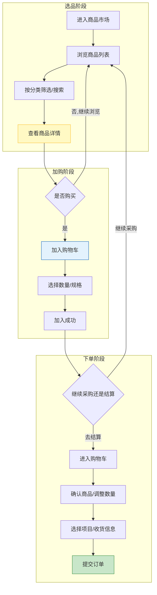
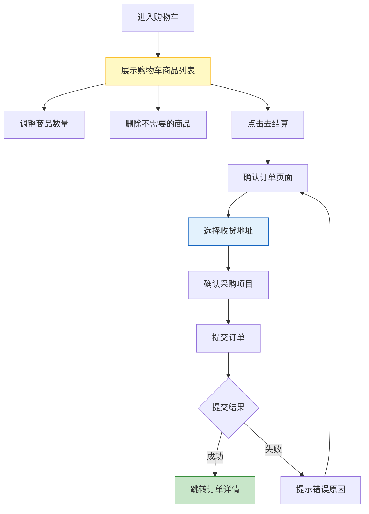
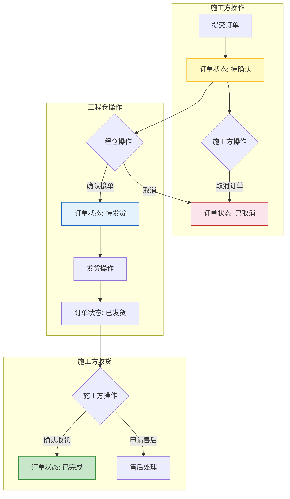
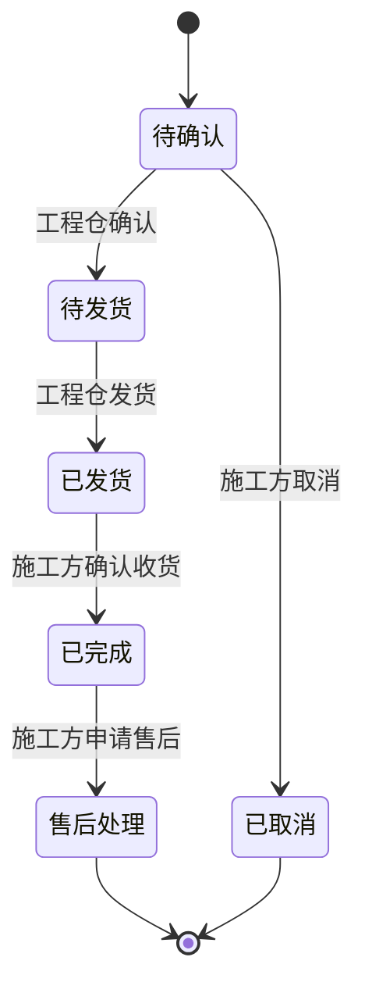

# 施工方端 - 业务流程设计

> 版本：v1.0  
> 文档状态：初稿  
> 所属章节：第二章

## 版本历史

| 版本 | 日期 | 修订内容 |
|:----:|:----:|---------|
| v1.0 | 2026-04-24 | 初始创建，覆盖采购全链路4张核心流程图 |

---

## 一、功能概述

### 1.1 功能定位

业务流程设计是施工方端所有功能模块的**业务操作指南**，描述从浏览商品到确认收货的完整采购流程。本文档面向产品、开发、测试团队，帮助理解施工方在平台中的位置和采购流程的业务规则。

### 1.2 核心概念

| 概念 | 说明 | 涉及链路 |
|-----|------|:--------:|
| 采购链路 | 施工方向工程仓购买建材的完整流程 | 主链路 |
| 购物车 | 施工方临时存放待采购商品的容器 | 选品链路 |
| 销售订单 | 施工方→工程仓的采购单据 | 主链路 |
| 确认收货 | 施工方收到工程仓发货后执行的确认操作 | 主链路 |

### 1.3 目标用户

- **产品经理**：理解业务链路，指导功能设计
- **开发工程师**：了解业务上下文，指导数据库设计和接口开发
- **测试工程师**：基于流程设计测试用例

---

## 二、核心业务链路概述

施工方端在平台中处于**建材采购方**位置，仅参与1条核心交易链路：

```
链路一：建材采购链路（单向）
═════════════════════════════════════════════════════
    ┌──────────┐  采购下单  ┌──────────┐   发货    ┌──────────┐
    │  施工方端  │────────▶│  工程仓端  │────────▶│  施工方端  │
    │  采购方    │          │  销售方    │          │  收货方    │
    └──────────┘           └──────────┘           └──────────┘
```

---

## 三、商品浏览与采购流程

### 3.1 流程图



### 3.2 流程步骤说明

| 步骤 | 操作角色 | 操作内容 | 系统响应 | 前置条件 | 后置状态 |
|:----:|:--------:|---------|---------|---------|---------|
| 1 | 施工方采购员 | 进入商品市场 | 展示商品卡片列表 | 登录+项目选择 | — |
| 2 | 施工方采购员 | 浏览/搜索/筛选 | 实时刷新商品列表 | 无 | — |
| 3 | 施工方采购员 | 点击商品 | 进入商品详情页 | 无 | — |
| 4 | 施工方采购员 | 点击"加入购物车" | 商品加入购物车 | 商品在售 | 购物车+1 |
| 5 | 施工方采购员 | 进入购物车结算 | 展示购物车列表 | 购物车不为空 | — |
| 6 | 施工方采购员 | 确认并提交订单 | 创建销售订单 | 商品有货 | 订单待确认 |

---

## 四、购物车结算流程

### 4.1 流程图



### 4.2 关键规则

- 购物车以工程仓为单位组织，不同工程仓的商品分开展示
- 结算时自动计算商品总价（商品金额=供货价×数量）
- 提交订单后清空购物车中已购买的商品

---

## 五、订单生命周期流程

### 5.1 流程图



### 5.2 状态流转图



---

## 六、关键说明

### 6.1 项目-工程仓联动

- 施工方必须先选择项目，再选择项目关联的工程仓
- 商品市场展示所选工程仓的商品
- 订单归属于当前选中的项目

### 6.2 取消订单限制

- 仅"待确认"状态的订单可取消
- 工程仓已确认后，施工方不可取消，需联系工程仓处理

### 6.3 确认收货后触发

- 确认收货后订单状态变为"已完成"
- 已完成的订单可申请售后
- 订单完成后自动更新项目采购统计数据

