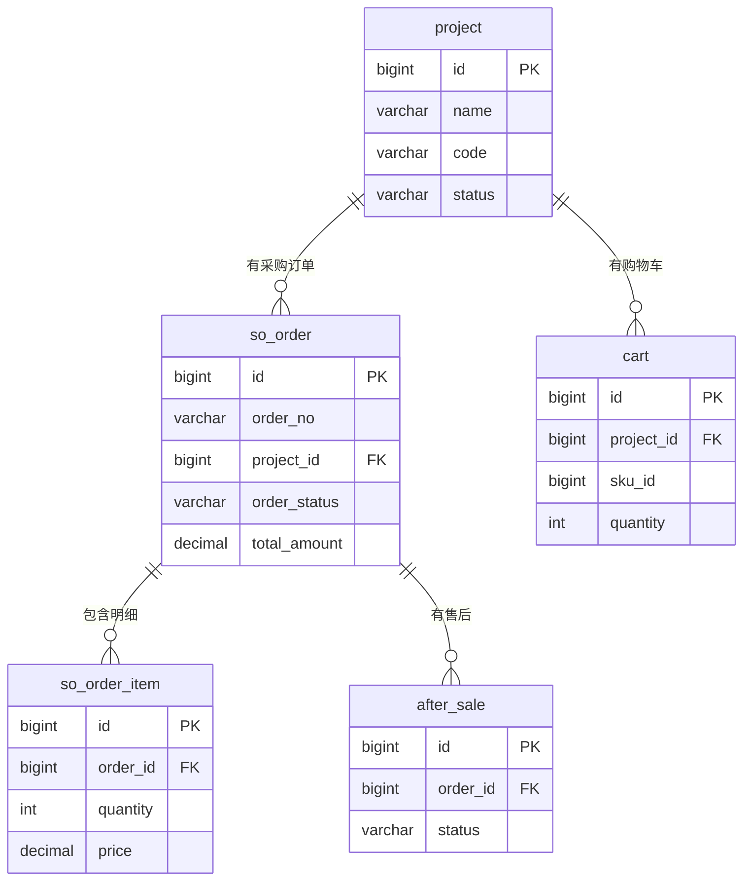

# 施工方端 - 数据模型与表结构

> 版本：v1.0  
> 文档状态：初稿  
> 所属章节：第三章

## 版本历史

| 版本 | 日期 | 修订内容 |
|:----:|:----:|---------|
| v1.0 | 2026-04-24 | 初始创建，覆盖6张核心表结构 |

---

## 一、功能概述

### 1.1 功能定位

本文档定义施工方端所有业务数据的**表结构、字段规范、实体关系**，是后端开发和数据库设计的核心参考。涵盖6张核心表。

### 1.2 核心概念

| 概念 | 说明 | 涉及表 |
|-----|------|--------|
| 项目 | 施工方负责的建筑工程项目，采购组织维度 | project |
| 购物车 | 施工方待采购商品的临时容器 | cart |
| 销售订单 | 施工方→工程仓的采购单据 | so_order |
| 售后 | 施工方发起的售后申请 | after_sale |

### 1.3 核心设计原则

1. **三状态分离**：沿袭全平台标准，订单主状态/支付状态/发货状态独立
2. **项目隔离**：所有采购数据以项目ID作为组织维度
3. **轻量设计**：施工方端不涉及商品定义，只做采购消费

---

## 二、业务数据规则

### 2.1 字段命名规范

- 所有表使用 BIGINT 自增主键
- 金额字段统一使用 DECIMAL(18,2)
- 状态字段统一使用 VARCHAR(20) 可读字符串
- 外键字段命名规则：关联表名_id

### 2.2 施工方数据规则

- 项目ID作为核心组织维度，所有订单/购物车均关联项目
- 购物车数据临时存储，下单后清除已购买商品
- 订单数据由工程仓端负责维护，施工方端仅做消费操作

---

## 三、核心表结构

### 3.1 表：项目表（project）

**说明：** 施工方负责的建筑工程项目

| 字段名 | 类型 | 长度 | 是否必填 | 主键/索引 | 默认值 | 说明 |
|-------|:----:|:----:|:--------:|:---------:|:-----:|------|
| id | BIGINT | — | Y | PK | AUTO_INCREMENT | 自增主键 |
| name | VARCHAR | 100 | Y | — | — | 项目名称 |
| code | VARCHAR | 50 | Y | UK | — | 项目编码 |
| contractor_id | BIGINT | — | Y | IDX | — | 施工方ID |
| status | VARCHAR | 20 | Y | IDX | 'active' | active/inactive |
| address | VARCHAR | 200 | N | — | — | 项目地址 |
| create_time | DATETIME | — | Y | — | NOW | 创建时间 |

**DDL：**

```sql
CREATE TABLE `project` (
  `id` bigint(20) NOT NULL AUTO_INCREMENT COMMENT '自增主键',
  `name` varchar(100) NOT NULL COMMENT '项目名称',
  `code` varchar(50) NOT NULL COMMENT '项目编码',
  `contractor_id` bigint(20) NOT NULL COMMENT '施工方ID',
  `status` varchar(20) NOT NULL DEFAULT 'active' COMMENT '状态: active/inactive',
  `address` varchar(200) DEFAULT NULL COMMENT '项目地址',
  `create_time` datetime NOT NULL DEFAULT CURRENT_TIMESTAMP COMMENT '创建时间',
  PRIMARY KEY (`id`) USING BTREE,
  UNIQUE KEY `uk_code` (`code`) USING BTREE,
  INDEX `idx_contractor_id` (`contractor_id`) USING BTREE
) ENGINE=InnoDB DEFAULT CHARSET=utf8mb4 COMMENT='项目表';
```

### 3.2 表：购物车表（cart）

| 字段名 | 类型 | 长度 | 是否必填 | 主键/索引 | 默认值 | 说明 |
|-------|:----:|:----:|:--------:|:---------:|:-----:|------|
| id | BIGINT | — | Y | PK | AUTO_INCREMENT | 自增主键 |
| project_id | BIGINT | — | Y | IDX | — | 项目ID |
| warehouse_id | BIGINT | — | Y | IDX | — | 工程仓ID |
| sku_id | BIGINT | — | Y | — | — | SKU ID |
| product_name | VARCHAR | 200 | Y | — | — | 商品名称 |
| spec | VARCHAR | 100 | N | — | — | 规格描述 |
| price | DECIMAL | 18,2 | Y | — | 0 | 单价(工程仓销售价) |
| quantity | INT | — | Y | — | 1 | 数量 |
| create_time | DATETIME | — | Y | — | NOW | 创建时间 |
| update_time | DATETIME | — | Y | — | ON UPDATE | 更新时间 |

### 3.3 表：销售订单表（so_order）

| 字段名 | 类型 | 长度 | 是否必填 | 主键/索引 | 默认值 | 说明 |
|-------|:----:|:----:|:--------:|:---------:|:-----:|------|
| id | BIGINT | — | Y | PK | AUTO_INCREMENT | 自增主键 |
| order_no | VARCHAR | 32 | Y | UK | — | 订单编号 |
| project_id | BIGINT | — | Y | IDX | — | 项目ID |
| contractor_id | BIGINT | — | Y | IDX | — | 施工方ID |
| warehouse_id | BIGINT | — | Y | IDX | — | 工程仓ID |
| order_status | VARCHAR | 20 | Y | IDX | 'pending' | pending/confirmed/shipped/completed/cancelled |
| payment_status | VARCHAR | 20 | Y | — | 'unpaid' | unpaid/paid/refunded |
| ship_status | VARCHAR | 20 | Y | — | 'pending' | pending/partial/shipped |
| total_amount | DECIMAL | 18,2 | Y | — | 0 | 订单总金额 |
| delivery_address | VARCHAR | 200 | N | — | — | 收货地址 |
| create_time | DATETIME | — | Y | — | NOW | 创建时间 |
| update_time | DATETIME | — | Y | — | ON UPDATE | 更新时间 |

### 3.4 表：销售订单明细表（so_order_item）

| 字段名 | 类型 | 长度 | 是否必填 | 主键/索引 | 默认值 | 说明 |
|-------|:----:|:----:|:--------:|:---------:|:-----:|------|
| id | BIGINT | — | Y | PK | AUTO_INCREMENT | 自增主键 |
| order_id | BIGINT | — | Y | IDX | — | 订单ID(FK) |
| sku_id | BIGINT | — | Y | — | — | SKU ID |
| product_name | VARCHAR | 200 | Y | — | — | 商品名称 |
| spec | VARCHAR | 100 | N | — | — | 规格描述 |
| quantity | INT | — | Y | — | 1 | 数量 |
| price | DECIMAL | 18,2 | Y | — | 0 | 单价 |
| subtotal | DECIMAL | 18,2 | Y | — | 0 | 小计金额 |

### 3.5 表：售后表（after_sale）

| 字段名 | 类型 | 长度 | 是否必填 | 主键/索引 | 默认值 | 说明 |
|-------|:----:|:----:|:--------:|:---------:|:-----:|------|
| id | BIGINT | — | Y | PK | AUTO_INCREMENT | 自增主键 |
| order_id | BIGINT | — | Y | IDX | — | 原订单ID |
| contractor_id | BIGINT | — | Y | IDX | — | 施工方ID(发起方) |
| type | VARCHAR | 20 | Y | — | 'quality' | quality/quantity/other |
| status | VARCHAR | 20 | Y | IDX | 'pending' | pending/completed/rejected |
| description | TEXT | — | Y | — | — | 问题描述 |
| create_time | DATETIME | — | Y | — | NOW | 创建时间 |

---

## 四、实体关系图



