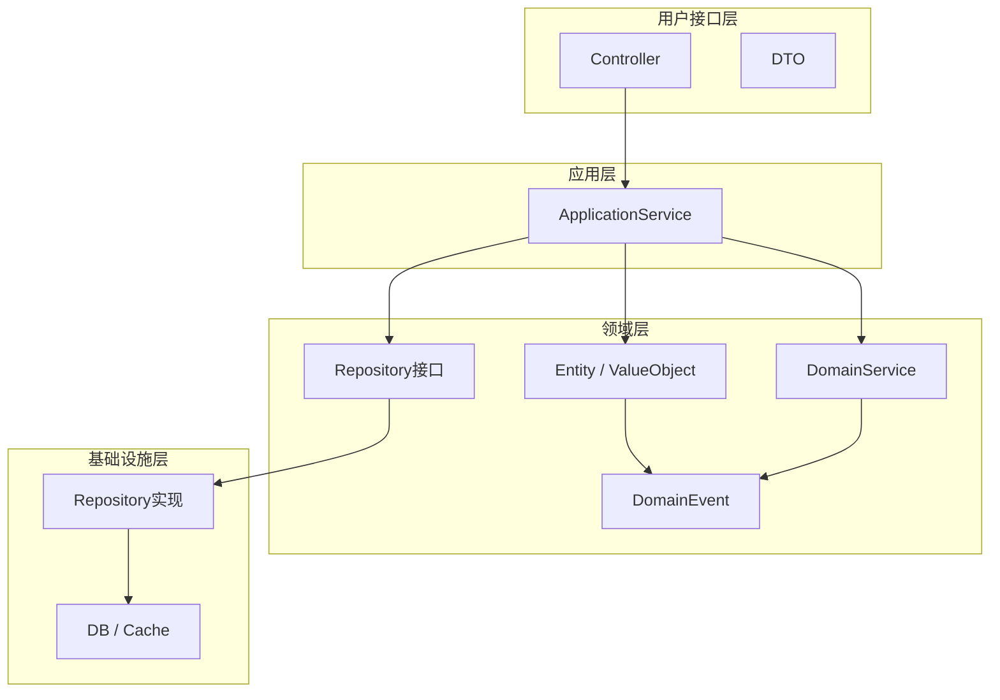

# 施工方端 - 领域模型设计

> 版本：v1.0  
> 文档状态：初稿  
> 所属章节：第四章

## 版本历史

| 版本 | 日期 | 修订内容 |
|:----:|:----:|---------|
| v1.0 | 2026-04-24 | 初始创建 |

---

## 一、功能概述

### 1.1 功能定位

本文档定义施工方端的**领域模型**，包括核心领域实体、领域服务、领域事件。面向开发团队，指导后端代码的领域驱动设计（DDD）实现。

### 1.2 核心概念

| 概念 | 说明 |
|-----|------|
| 领域实体 | 有唯一标识的业务对象，如项目、订单、购物车 |
| 值对象 | 无唯一标识的概念性对象，如地址、金额 |
| 领域服务 | 跨实体的业务操作，如结算下单 |
| 领域事件 | 业务操作触发的通知，如订单创建事件 |

### 1.3 目标用户

- **后端开发工程师**：基于领域模型设计代码结构和数据库访问层
- **架构师**：评估领域划分和实体关系设计的合理性

---

## 二、核心领域实体

### 2.1 项目（Project）

**核心属性：**
- id: BIGINT — 唯一标识
- name: String — 项目名称
- code: String — 项目编码
- status: String — active/inactive
- contractorId: BIGINT — 施工方ID

**关联关系：**
- N:1 Contractor（施工方）
- 1:N SoOrder（采购订单）
- 1:N Cart（购物车）

**领域方法：**
- `switchWarehouse(Long warehouseId)`: 切换当前工程仓
- `getStatistics()`: 获取项目采购统计数据

**业务约束：**
- 一个施工方可管理多个项目
- 项目与工程仓多对多关联

### 2.2 购物车（Cart）

**核心属性：**
- id: BIGINT — 唯一标识
- projectId: BIGINT — 项目ID
- warehouseId: BIGINT — 工程仓ID
- skuId: BIGINT — SKU ID
- quantity: Integer — 数量
- price: Decimal — 单价

**领域方法：**
- `updateQuantity(Integer quantity)`: 修改数量
- `remove()`: 删除商品
- `clear()`: 清空购物车

**业务约束：**
- 购物车按工程仓分组
- 下单后清除已购商品
- 数量不能小于1

### 2.3 销售订单（SalesOrder）

**核心属性：**
- id: BIGINT — 唯一标识
- orderNo: String — 订单编号
- projectId: BIGINT — 项目ID
- contractorId: BIGINT — 施工方ID
- warehouseId: BIGINT — 工程仓ID
- orderStatus: String — pending/confirmed/shipped/completed/cancelled
- paymentStatus: String — unpaid/paid/refunded
- shipStatus: String — pending/partial/shipped
- totalAmount: Decimal — 订单总金额

**关联关系：**
- 1:N OrderItem（订单明细）
- N:1 Project（项目）
- 1:1 AfterSale（售后单）

**领域方法：**
- `cancel()`: 取消订单（仅待确认可取消）
- `confirmReceipt()`: 确认收货
- `trackLogistics()`: 跟踪物流
- `requestAfterSale(String description)`: 申请售后

**业务约束：**
- 仅待确认状态可取消
- 已发货状态才能确认收货
- 已完成状态才能申请售后

### 2.4 售后单（AfterSale）

**核心属性：**
- id: BIGINT — 唯一标识
- orderId: BIGINT — 原订单ID
- status: String — pending/completed/rejected
- type: String — quality/quantity/other
- description: String — 问题描述

**领域方法：**
- `submit()`: 提交售后申请
- `cancel()`: 撤销售后申请

**业务约束：**
- 仅在订单完成后可发起售后
- description 必填

---

## 三、领域服务

### 3.1 商品浏览服务（ProductBrowseService）

> 说明：为施工方提供商品市场的浏览和搜索能力

```typescript
interface ProductBrowseService {
  /** 获取工程仓商品列表 */
  listProducts(warehouseId: Long, categoryId: Long, keyword: String): Page<Product>
  
  /** 获取商品详情 */
  getProductDetail(skuId: Long): ProductDetail
  
  /** 按分类获取商品 */
  getProductsByCategory(categoryId: Long): List<Product>
}
```

### 3.2 购物车服务（CartService）

```typescript
interface CartService {
  /** 获取购物车列表 */
  getCartList(projectId: Long, warehouseId: Long): List<CartItem>
  
  /** 添加商品到购物车 */
  addToCart(projectId: Long, warehouseId: Long, skuId: Long, quantity: Int): void
  
  /** 更新数量 */
  updateItemQuantity(cartId: Long, quantity: Int): void
  
  /** 删除购物车商品 */
  removeCartItem(cartId: Long): void
  
  /** 清空购物车 */
  clearCart(projectId: Long, warehouseId: Long): void
  
  /** 结算下单 */
  checkout(projectId: Long, warehouseId: Long, address: String): SalesOrder
}
```

### 3.3 采购管理服务（ProcurementService）

```typescript
interface ProcurementService {
  /** 获取订单列表 */
  listOrders(projectId: Long, status: String, page: Int): Page<SalesOrder>
  
  /** 获取订单详情 */
  getOrderDetail(orderId: Long): SalesOrderDetail
  
  /** 取消订单 */
  cancelOrder(orderId: Long): void
  
  /** 确认收货 */
  confirmReceipt(orderId: Long): void
  
  /** 申请售后 */
  requestAfterSale(orderId: Long, description: String): AfterSale
  
  /** 跟踪物流 */
  trackLogistics(orderId: Long): LogisticsInfo
}
```

---

## 四、领域事件

### 4.1 事件定义

| 事件名称 | 触发时机 | 携带数据 | 消费者 |
|---------|---------|---------|--------|
| OrderPlacedEvent | 施工方提交订单 | orderId, projectId, warehouseId | 工程仓端通知 |
| OrderCancelledEvent | 施工方取消订单 | orderId, reason | 工程仓端通知 |
| GoodsReceivedEvent | 施工方确认收货 | orderId, timestamp | 工程仓端/财务统计 |
| AfterSaleRequestedEvent | 施工方申请售后 | afterSaleId, orderId | 工程仓端通知 |

---

## 五、DDD分层架构



---

## 六、聚合定义

| 聚合根 | 包含实体 | 仓储 |
|-------|---------|------|
| Project | — | ProjectRepository |
| Cart | — | CartRepository |
| SalesOrder | OrderItem | SalesOrderRepository |
| AfterSale | — | AfterSaleRepository |

