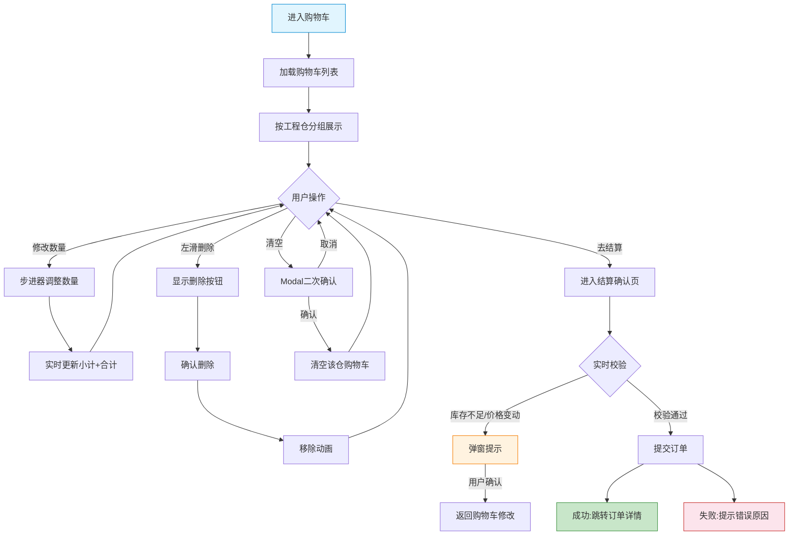

# 施工方端 - 购物车功能详细设计

> 版本：v2.0  
> 文档状态：已定稿  
> 所属章节：第七章

## 版本历史

| 版本 | 日期 | 修订内容 | 修订人 |
|:----:|:----:|---------|:-----:|
| v1.0 | 2026-04-24 | 初始创建，覆盖购物车全部5个功能点 | PM |
| v2.0 | 2026-04-24 | 重构为新版11章模板，新增核心设计原则、Mermaid流程图、权限矩阵、非功能性需求、异常汇总表、接口依赖建议，原子字段新增必填列 | PM |

<!-- ============================================================ -->
<!-- PRD六层模型：                                                    -->
<!--                                                              -->
<!-- 核心层(必写)： 功能概述 → 设计原则 → 业务规则(含流程图) → 功能点详情   -->
<!-- 扩展层(推荐)： 权限矩阵 → 非功能性需求 → 异常汇总 → 接口依赖      -->
<!-- 治理层(状态模块必写)： 状态流转图 → 状态治理矩阵 → 版本历史       -->
<!-- ============================================================ -->

---

## 一、功能概述

### 1.1 功能定位

购物车是施工方端**临时存放待采购商品的容器**，以工程仓为单位组织商品，支持数量调整、删除、批量结算下单，是选购到下单的核心中转环节。

### 1.2 核心概念

| 概念 | 说明 | 示例 |
|:----|------|------|
| 购物车分组 | 以工程仓为单位，不同工程仓的商品分开展示 | "南山工程仓"分组、"宝安工程仓"分组 |
| 结算下单 | 将购物车商品转化为正式订单 | 勾选商品→去结算→提交订单 |
| 失效商品 | 已被下架/删除的购物车中的商品 | 灰色置灰不可选 |

### 1.3 目标用户

- **采购员**（核心用户）：日常管理购物车商品，调整数量，结算下单
- **管理员**：辅助采购操作，查看购物车内容
- **仓管员**：购物车只读不可操作（需要采购权限）

### 1.4 模块范围

| 功能分类 | 主要功能 | 涉及角色 |
|:--------|---------|---------|
| 购物车管理 | 购物车列表查看、修改数量、删除商品、清空 | 管理员、采购员 |
| 结算下单 | 结算下单 | 管理员、采购员 |

---

## 二、核心设计原则

> **购物车以"工程仓"为核心分组维度，同一角色操作权限受项目隔离约束。**

### 2.1 工程仓分组隔离

- 不同工程仓的商品在购物车中分开展示，每组独立计算小计金额
- 结算时只能勾选同一工程仓的商品（跨仓不可合并结算）
- 项目切换时购物车内容跟随当前项目，不同项目购物车独立

### 2.2 操作即时反馈原则

- 数量变更实时更新小计和底部合计金额（无延迟）
- 删除操作配合微动画，让用户明确感知操作结果
- 状态变更（失效/可用）非侵入式更新，不打断用户浏览

### 2.3 采购权限原则

- 仓管员仅可查看购物车列表，不可操作（加/删/改/结算）
- 管理员和采购员拥有完整操作权限

---

## 三、业务规则

### 3.1 购物车分组规则

- 商品按工程仓分组展示，每组显示工程仓名称
- 每组独立计算小计金额，底部展示总合计
- 不同工程仓的商品不支持跨仓合并结算

### 3.2 数量管控规则

- 单个SKU购买数量范围：[1, 库存上限]
- 购物车商品种类上限：200种
- 项目切换后购物车内容跟随当前项目（不同项目独立购物车）

### 3.3 失效商品处理规则

- 已下架/已删除商品在购物车中置灰展示（不可选）
- 失效商品不参与全选操作
- 失效商品显示"已失效"标签
- 批量删除时可一键清除所有失效商品

### 3.4 结算规则

- 结算时自动校验最新价格和库存
- 库存不足的商品阻止提交并提示
- 提交订单后自动清除购物车中已购买的商品

### 3.5 核心业务流程图

#### 流程图1：购物车管理到结算下单流程

---

## 四、权限矩阵

### 4.1 功能权限总表

| 功能模块 | 具体操作 | 管理员 | 采购员 | 仓管员 | 说明 |
|:--------|---------|:------:|:------:|:------:|------|
| **购物车列表** | 查看购物车 | ✅ | ✅ | ✅ | 仓管员只读 |
| | 查看分组详情 | ✅ | ✅ | ✅ | - |
| **修改数量** | 增减商品数量 | ✅ | ✅ | ❌ | 只允许采购角色 |
| **删除商品** | 删除单件商品 | ✅ | ✅ | ❌ | - |
| | 清空购物车 | ✅ | ✅ | ❌ | - |
| **结算下单** | 去结算 | ✅ | ✅ | ❌ | - |
| | 提交订单 | ✅ | ✅ | ❌ | - |

### 4.2 权限校验方式

- **前端**：仓管员不显示操作按钮（加减/删除/结算）
- **后端**：购物车写操作接口校验用户角色

---

## 五、非功能性需求

### 5.1 性能要求

| 接口/场景 | 指标 | P95要求 | 说明 |
|:---------|:----|:-------:|------|
| 购物车列表加载 | 响应时间 | ≤ 500ms | 含分组+商品信息 |
| 修改数量 | 响应时间 | ≤ 200ms | 乐观更新，异步同步 |
| 删除商品 | 响应时间 | ≤ 200ms | 含动画时长≤300ms |
| 结算校验 | 响应时间 | ≤ 500ms | 批量校验价格+库存 |

### 5.2 埋点需求

| 页面 | 事件名 | 触发时机 | 上报字段 |
|:----|:------|---------|---------|
| 购物车 | cart_view | 进入购物车页 | `warehouseCount`, `itemCount` |
| 购物车 | cart_quantity_change | 修改数量 | `skuId`, `from`, `to` |
| 购物车 | cart_delete | 删除商品 | `skuId` |
| 购物车 | cart_clear | 清空购物车 | `warehouseId` |
| 结算 | cart_checkout | 点击去结算 | `itemCount`, `totalAmount` |

### 5.3 安全要求

| 风险点 | 防护措施 | 实现方式 |
|:------|---------|---------|
| 越权操作购物车 | 接口角色校验 | 仓管员写操作接口返回403 |
| 库存超卖 | 结算时实时校验 | 提交订单前校验最新库存和价格 |
| 重复提交订单 | 前端防抖+后端幂等 | 按钮1s防抖+订单号幂等 |

---

## 六、功能点详细设计

### 6.1 购物车列表（P0）

#### 交互逻辑

1. 页面加载：请求购物车列表接口 → 按工程仓分组展示
2. 每个分组显示工程仓名称+商品列表+小计金额
3. 底部固定栏：合计金额+去结算按钮
4. 空购物车：展示空状态插画+"去逛逛"按钮跳转商品市场
5. 失效商品置灰不可选，显示"已失效"标签

#### 原子字段定义

| 字段 | 类型 | 必填 | 来源 | 校验规则 | 展示规则 | 默认值 |
|:----|:----|:----:|:----|:--------|:--------|:-----:|
| 工程仓名称 | String(50) | 是 | 库存接口 | 非空 | 分组标题，左对齐 | - |
| 商品图片 | URL | 否 | 购物车接口 | - | 缩略图，失效商品灰色蒙层 | - |
| 商品名称 | String(100) | 是 | 购物车接口 | 非空 | 失效商品加"已失效"标签 | - |
| 规格 | String(50) | 否 | 购物车接口 | - | 次要文本 | - |
| 单价 | Decimal(10,2) | 是 | 购物车接口 | >0 | 数字右对齐 | - |
| 数量 | Integer | 是 | 购物车接口 | ≥1 | 步进器组件 | 1 |
| 小计 | Decimal(10,2) | 是 | 前端计算 | 单价×数量 | 加粗+右对齐 | 0.00 |
| 是否失效 | Boolean | 否 | 购物车接口 | - | 过期商品灰色+不可选 | false |

#### 边界情况覆盖

| 场景 | 处理逻辑 | 提示文案 |
|:----|:--------|---------|
| 购物车为空 | 展示空状态插画 | "购物车是空的" / "去逛逛" |
| 全部商品失效 | 分组正常展示，全部置灰 | - |
| 商品被其他用户购买至库存不足 | 进入时拉取最新数据，更新数量和状态 | - |
| 网络差时修改数量 | 乐观更新，失败后回滚并Toast提示 | "操作失败" |

---

### 6.2 修改数量（P0）

#### 交互逻辑

1. 点击数量旁的"+" → 数量+1，实时更新小计和底部合计
2. 点击数量旁的"−" → 数量-1（最小值为1）
3. 数量=1时继续减 → 提示"是否删除该商品？"
4. 数量变更时实时校验库存上限

#### 原子字段定义

| 字段 | 类型 | 必填 | 来源 | 校验规则 | 展示规则 | 默认值 |
|:----|:----|:----:|:----|:--------|:--------|:-----:|
| 变更后数量 | Integer | 是 | 用户操作 | ≥1且≤库存 | 步进器中间数字 | 当前数量 |
| 最新库存 | Integer | 是 | 实时查询 | ≥0 | 超过库存时按钮置灰 | - |

#### 边界情况覆盖

| 场景 | 处理逻辑 | 提示文案 |
|:----|:--------|---------|
| 数量达到库存上限 | "+"按钮置灰不可点击 | "已达最大购买数量" |
| 修改数量时库存变更 | 提交时校验，若库存不足则回滚 | "库存不足，已恢复原数量" |
| 数量=1时点减 | 弹出确认 | "是否删除该商品？" |

---

### 6.3 删除商品（P0）

#### 交互逻辑

- 单商品删除：商品行左滑 → 显示红色"删除"按钮 → 点击删除 → 移除动画
- 删除后底部合计金额同步更新
- 若该分组所有商品被删除，分组整体消失

#### 边界情况覆盖

| 场景 | 处理逻辑 | 提示文案 |
|:----|:--------|---------|
| 误删除 | 无撤销操作（需重新加入购物车） | - |
| 删除后分组消失 | 若还有其余分组，继续展示其他分组 | - |
| 网络异常删除失败 | 商品保留，Toast提示 | "删除失败，请重试" |

---

### 6.4 清空购物车（P0）

#### 交互逻辑

1. 点击右上角"清空"按钮 → Modal二次确认弹窗
2. 确认 → 清空当前工程仓所有购物车商品
3. 取消 → 保持现状
4. 清空后展示空购物车状态

#### 边界情况覆盖

| 场景 | 处理逻辑 | 提示文案 |
|:----|:--------|---------|
| 清空确认后失败 | 保持现状，Toast提示 | "清空失败，请重试" |
| 无商品时清空按钮隐藏 | 购物车空时不显示"清空"按钮 | - |
| 跨仓清空 | 清空当前分组，不设计批量跨仓清空 | - |

---

### 6.5 结算下单（P0）

#### 交互逻辑

1. 购物车底部点击"去结算" → 跳转确认订单页面
2. 确认订单页展示商品列表+总金额
3. 选择/确认收货地址（当前项目关联工程仓地址）
4. 确认项目信息（当前项目名称+编码）
5. 点击"提交订单" → 调用下单接口 → 实时校验价格+库存
6. 成功 → 跳转订单详情页
7. 失败 → 弹窗提示错误原因

#### 原子字段定义

| 字段 | 类型 | 必填 | 来源 | 校验规则 | 展示规则 | 默认值 |
|:----|:----|:----:|:----|:--------|:--------|:-----:|
| 商品列表 | Array | 是 | 购物车数据 | 至少1个商品 | 商品名称+数量+小计 | [] |
| 总金额 | Decimal(12,2) | 是 | 前端计算 | >0 | 红色加粗大号字体 | 0.00 |
| 收货地址 | String(200) | 是 | 仓库接口 | 非空 | 文本+可切换 | 默认项目地址 |
| 项目ID | String(32) | 是 | 全局状态 | 非空 | 只读展示 | 当前项目 |
| 提交按钮状态 | Enum | 是 | 前端控制 | - | 可提交/加载中/禁用 | 可提交 |

#### 边界情况覆盖

| 场景 | 处理逻辑 | 提示文案 |
|:----|:--------|---------|
| 库存不足 | 弹窗提示，阻止提交 | "商品{名称}库存不足" |
| 商品已下架 | 弹窗提示，阻止提交 | "商品{名称}已下架" |
| 价格变动≥5% | 弹窗提示变更项，用户确认后提交 | "以下商品价格已变更：{列表}" |
| 结算失败 | Toast提示，购物车数据保持 | "下单失败，请稍后重试" |
| 收货地址为空 | 弹窗提示选择地址 | "请选择收货地址" |

---

## 七、异常处理汇总表

| 异常场景 | 触发条件 | 前端处理 | 后端处理 | 提示文案 |
|:--------|:--------|:--------|:--------|---------|
| 购物车加载失败 | 接口异常 | 重试按钮 | 无特殊处理 | "购物车加载失败" |
| 修改数量失败 | 网络异常/库存不足 | 回滚至修改前数量 | 返回错误码和最新库存 | "操作失败" |
| 删除商品失败 | 接口异常 | Toast提示 | 无特殊处理 | "删除失败，请重试" |
| 清空购物车失败 | 接口异常 | 保持现状 | 无特殊处理 | "清空失败，请重试" |
| 下单-库存不足 | 实时库存不足 | 弹窗提示，数据回滚 | 返回库存不足+具体SKU | "商品{名称}库存不足" |
| 下单-商品已下架 | 商品在提交前已下架 | 弹窗提示，数据回滚 | 返回商品已下架 | "商品{名称}已下架，请从购物车移除" |
| 下单-接口异常 | 下单接口返回错误 | Toast提示，保持数据 | 事务回滚 | "下单失败，请稍后重试" |
| 下单-价格变动 | 提交时价格不一致 | 弹窗提示最新价格 | 返回最新价格列表 | "以下商品价格已更新：{列表}" |

---

## 八、接口依赖建议

| 接口 | 用途 | 核心字段/逻辑 | 性能要求 |
|:----|:----|:-------------|:--------:|
| `/api/cart/list` | 购物车列表 | 输入：projectId；输出：按仓库分组的商品列表+失效标记 | P95 ≤ 500ms |
| `/api/cart/update` | 修改数量 | 输入：skuId/quantity；校验库存上限 | P95 ≤ 200ms |
| `/api/cart/delete` | 删除商品 | 输入：skuId；支持批量 | P95 ≤ 200ms |
| `/api/cart/clear` | 清空购物车 | 输入：warehouseId；清空指定仓库 | P95 ≤ 300ms |
| `/api/order/create` | 提交订单 | 输入：skuList/warehouseId/projectId；批量校验价格+库存 | P95 ≤ 500ms |
| `/api/warehouse/address` | 收货地址 | 输入：warehouseId；输出：仓库地址 | P95 ≤ 200ms |
