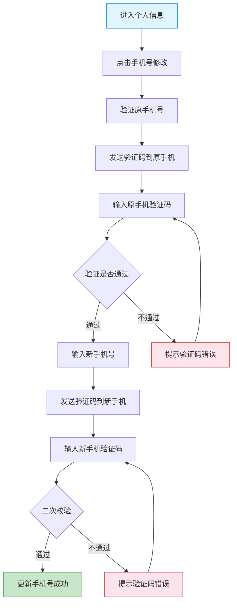

# 施工方端 - 库存与个人中心功能详细设计

> 版本：v2.0  
> 文档状态：已定稿  
> 所属章节：第九章

## 版本历史

| 版本 | 日期 | 修订内容 | 修订人 |
|:----:|:----:|---------|:-----:|
| v1.0 | 2026-04-24 | 初始创建，覆盖库存查询与个人中心全部6个功能点 | PM |
| v2.0 | 2026-04-24 | 重构为新版11章模板，新增核心设计原则、Mermaid流程图、权限矩阵、非功能性需求、异常汇总表、接口依赖建议，原子字段新增必填列 | PM |

<!-- ============================================================ -->
<!-- PRD六层模型：                                                    -->
<!--                                                              -->
<!-- 核心层(必写)： 功能概述 → 设计原则 → 业务规则(含流程图) → 功能点详情   -->
<!-- 扩展层(推荐)： 权限矩阵 → 非功能性需求 → 异常汇总 → 接口依赖      -->
<!-- 治理层(状态模块必写)： 状态流转图 → 状态治理矩阵 → 版本历史       -->
<!-- ============================================================ -->

---

## 一、功能概述

### 1.1 功能定位

库存查询提供施工方查看工程仓商品实时库存的能力（只读），帮助施工方在采购决策时了解库存情况。个人中心管理施工方人员的账号信息、密码修改、退出登录及意见反馈等系统功能。

### 1.2 核心概念

| 概念 | 说明 | 示例 |
|:----|------|------|
| 库存查询 | 查看当前项目关联工程仓的商品库存（只读） | "水泥32.5R-南山仓，库存500吨" |
| 个人中心 | 管理账号信息、密码、反馈等 | 修改手机号/修改密码/意见反馈 |
| 安全库存 | 库存预警线，低于该值触发预警 | 水泥安全库存=100吨 |

### 1.3 目标用户

- **采购员**（核心用户）：查看库存辅助采购决策
- **管理员**：管理个人信息、密码、意见反馈
- **仓管员**：查看库存数据

### 1.4 模块范围

| 功能分类 | 主要功能 | 涉及角色 |
|:--------|---------|---------|
| 库存查询 | 库存列表、库存详情 | 所有角色 |
| 个人中心 | 查看/修改个人信息、修改密码 | 所有角色 |
| 系统 | 意见反馈、关于我们、退出登录 | 所有角色 |

---

## 二、核心设计原则

> **库存数据为只读消费，个人中心操作遵循"身份验证前置"原则。**

### 2.1 库存只读原则

- 施工方端库存数据仅可查看，不可编辑/修改
- 库存数据实时同步工程仓端数据，施工方端不做本地缓存
- 库存列表按当前项目关联的工程仓展示

### 2.2 身份验证前置原则

- 关键信息变更（手机号、姓名）需先验证当前账号身份
- 修改密码需原密码校验
- 退出登录后清除本地缓存和Token

### 2.3 信息最小展示原则

- 个人中心只展示敏感信息脱敏后的数据
- 联系方式默认脱敏展示（手机号中间4位****）
- 编辑时恢复正常显示，方便修改

---

## 三、业务规则

### 3.1 库存规则

- 库存数据仅可查看，不可修改
- 库存列表展示当前项目关联工程仓的商品库存
- 库存实时同步工程仓端数据（延迟≤3min）
- 支持按商品名称搜索
- 库存≤安全库存时显示预警标记

### 3.2 个人中心规则

- 个人信息中的关键字段（手机号、姓名）变更需验证身份
- 手机号修改：发送验证码到原手机 + 新手机双重验证
- 修改密码需要原密码校验

### 3.3 退出登录规则

- 退出登录后清除本地Token和缓存数据
- 退出后跳转登录页
- 退出前需二次确认

### 3.4 核心业务流程图

#### 流程图1：修改手机号流程

---

## 四、权限矩阵

### 4.1 功能权限总表

| 功能模块 | 具体操作 | 管理员 | 采购员 | 仓管员 | 说明 |
|:--------|---------|:------:|:------:|:------:|------|
| **库存列表** | 查看库存列表 | ✅ | ✅ | ✅ | 所有角色 |
| | 搜索库存商品 | ✅ | ✅ | ✅ | - |
| **库存详情** | 查看单个商品库存信息 | ✅ | ✅ | ✅ | - |
| **个人信息** | 查看个人信息 | ✅ | ✅ | ✅ | 所有角色 |
| | 修改姓名 | ✅ | ✅ | ✅ | 所有角色 |
| | 修改手机号 | ✅ | ✅ | ✅ | 需双重验证 |
| **修改密码** | 修改登录密码 | ✅ | ✅ | ✅ | 需原密码 |
| **意见反馈** | 提交反馈 | ✅ | ✅ | ✅ | 所有角色 |
| **退出登录** | 退出登录 | ✅ | ✅ | ✅ | 所有角色 |

### 4.2 权限校验方式

- **前端**：所有库存页面为只读，编辑入口需要身份验证
- **后端**：个人中心写操作接口校验Token和原密码

---

## 五、非功能性需求

### 5.1 性能要求

| 接口/场景 | 指标 | P95要求 | 说明 |
|:---------|:----|:-------:|------|
| 库存列表查询 | 响应时间 | ≤ 500ms | 含搜索+分页 |
| 库存详情查询 | 响应时间 | ≤ 300ms | 单商品 |
| 个人信息查询 | 响应时间 | ≤ 200ms | 缓存5分钟 |
| 修改密码 | 响应时间 | ≤ 500ms | 含原密码校验 |
| 意见反馈提交 | 响应时间 | ≤ 500ms | 含附件上传 |

### 5.2 埋点需求

| 页面 | 事件名 | 触发时机 | 上报字段 |
|:----|:------|---------|---------|
| 库存列表 | inventory_list_view | 进入库存列表 | `warehouseId` |
| 库存详情 | inventory_detail_view | 查看库存详情 | `skuId` |
| 个人信息 | profile_view | 进入个人中心 | - |
| 个人信息 | profile_edit | 编辑个人信息 | `changedField` |
| 密码修改 | password_change | 修改密码 | - |
| 退出登录 | logout | 退出登录 | - |

### 5.3 安全要求

| 风险点 | 防护措施 | 实现方式 |
|:------|---------|---------|
| 越权查看其他项目库存 | 接口校验项目归属 | 库存接口按项目隔离 |
| 密码暴力破解 | 登录限制+验证码 | 连续5次错误锁定30分钟 |
| 验证码重用 | 验证码一次性使用 | 校验后立即失效 |
| 旧手机验证码拦截 | 发送前校验原手机归属 | 仅发送到注册手机号 |

---

## 六、功能点详细设计

### 6.1 库存列表（P1）

#### 交互逻辑

1. 页面加载：请求库存列表接口 → 展示商品库存列表
2. 支持按商品名称搜索
3. 点击商品 → 进入库存详情
4. 库存≤安全库存时行背景变红显示预警
5. 下拉加载更多，每页20条

#### 原子字段定义

| 字段 | 类型 | 必填 | 来源 | 校验规则 | 展示规则 | 默认值 |
|:----|:----|:----:|:----|:--------|:--------|:-----:|
| 商品名称 | String(100) | 是 | 库存接口 | 非空 | 左对齐主标题 | - |
| 规格 | String(50) | 否 | 库存接口 | - | 次要文本 | - |
| 库存数量 | Decimal(12,2) | 是 | 库存接口 | ≥0 | 数字右对齐 | 0 |
| 安全库存 | Decimal(12,2) | 否 | 库存接口 | ≥0 | 库存≤安全库存时红色预警 | - |
| 工程仓名称 | String(50) | 是 | 库存接口 | 非空 | 次要文本 | - |

#### 边界情况覆盖

| 场景 | 处理逻辑 | 提示文案 |
|:----|:--------|---------|
| 库存列表为空 | 显示空状态 | "暂无库存数据" |
| 搜索无结果 | 显示空状态 | "未找到匹配的商品" |
| 库存≤安全库存 | 行背景红色，显示预警图标 | "库存预警" |
| 库存数据为0 | 正常显示"0" | - |
| 列表加载失败 | 显示重试按钮 | "库存加载失败，请重试" |

---

### 6.2 库存详情（P2）

#### 交互逻辑

1. 从库存列表点击商品 → 进入库存详情页
2. 展示：商品信息（名称+规格+编码）、当前库存、在途数量、最近入库/出库时间
3. 底部关联采购入口（可跳转至商品市场该商品详情）

#### 原子字段定义

| 字段 | 类型 | 必填 | 来源 | 校验规则 | 展示规则 | 默认值 |
|:----|:----|:----:|:----|:--------|:--------|:-----:|
| 商品名称 | String(100) | 是 | 库存接口 | 非空 | 主标题 | - |
| 商品编码 | String(20) | 是 | 库存接口 | 非空 | 次要文本 | - |
| 规格 | String(50) | 否 | 库存接口 | - | 次要文本 | - |
| 当前库存 | Decimal(12,2) | 是 | 库存接口 | ≥0 | 大号数字+单位 | 0 |
| 在途数量 | Decimal(12,2) | 否 | 库存接口 | ≥0 | "在途：{数量}" | 0 |
| 最近入库时间 | DateTime | 否 | 库存接口 | - | YYYY-MM-DD HH:mm | - |
| 最近出库时间 | DateTime | 否 | 库存接口 | - | YYYY-MM-DD HH:mm | - |

#### 边界情况覆盖

| 场景 | 处理逻辑 | 提示文案 |
|:----|:--------|---------|
| 库存详情加载失败 | 显示重试按钮 | "库存信息加载失败" |
| 在途数量为空 | 不展示在途数据行 | - |
| 最近入库/出库无记录 | 展示"-" | - |

---

### 6.3 查看个人信息（P1）

#### 交互逻辑

1. 进入个人中心 → 默认展示个人信息卡片
2. 信息以两列布局展示：姓名、手机号、所属项目、角色
3. 手机号脱敏展示（中间4位****）
4. 每个字段右侧有"修改"入口按钮（可编辑字段）

#### 原子字段定义

| 字段 | 类型 | 必填 | 来源 | 校验规则 | 展示规则 | 默认值 |
|:----|:----|:----:|:----|:--------|:--------|:-----:|
| 姓名 | String(20) | 是 | 用户接口 | 非空 | 文本 | - |
| 手机号 | String(11) | 是 | 用户接口 | 11位手机号 | 脱敏：138****1234 | - |
| 所属项目 | Array | 否 | 用户接口 | - | 项目名列表 | [] |
| 角色 | String(10) | 是 | 用户接口 | - | 角色标签 | - |

#### 边界情况覆盖

| 场景 | 处理逻辑 | 提示文案 |
|:----|:--------|---------|
| 信息加载失败 | 显示重试按钮 | "个人信息加载失败" |
| 手机号异常 | 显示"-" | - |

---

### 6.4 修改个人信息（P1）

#### 交互逻辑

1. 点击"修改"按钮 → 进入编辑模式
2. 姓名：Input框直接编辑，2-20个字符
3. 手机号：点击后进入修改手机号流程（见3.4流程图）
4. 保存 → 调用更新接口 → 更新成功后恢复只读状态
5. 取消 → 恢复原始数据

#### 原子字段定义

| 字段 | 类型 | 必填 | 来源 | 校验规则 | 展示规则 | 默认值 |
|:----|:----|:----:|:----|:--------|:--------|:-----:|
| 姓名 | String(20) | 是 | 用户输入 | 2-20个字符 | Input框 | 原始值 |
| 手机号 | String(11) | 是 | 用户输入 | ^1[3-9]\d{9}$ | Input框+短信验证码 | 原始值 |

#### 边界情况覆盖

| 场景 | 处理逻辑 | 提示文案 |
|:----|:--------|---------|
| 姓名格式错误 | 输入框边框变红 | "请输入2-20个字符" |
| 手机号格式错误 | 输入框边框变红 | "请输入正确的手机号" |
| 验证码错误 | 提示重试 | "验证码错误" |
| 保存失败 | Toast提示，数据不更新 | "保存失败，请重试" |

---

### 6.5 修改密码（P1）

#### 交互逻辑

1. 点击"修改密码" → 进入密码修改页面
2. 输入原密码 → 输入新密码 → 确认新密码
3. 原密码校验通过后更新密码
4. 成功 → 提示修改成功，跳转登录页（需重新登录）

#### 原子字段定义

| 字段 | 类型 | 必填 | 来源 | 校验规则 | 展示规则 | 默认值 |
|:----|:----|:----:|:----|:--------|:--------|:-----:|
| 原密码 | String(32) | 是 | 用户输入 | 非空 | Password遮罩输入框 | - |
| 新密码 | String(32) | 是 | 用户输入 | 8-32位，含字母+数字 | Password遮罩+强度指示器 | - |
| 确认新密码 | String(32) | 是 | 用户输入 | 与新密码一致 | Password遮罩 | - |

#### 边界情况覆盖

| 场景 | 处理逻辑 | 提示文案 |
|:----|:--------|---------|
| 原密码错误 | 提交时提示 | "原密码错误" |
| 新密码格式不符 | 实时校验提示 | "密码需为8-32位，含字母和数字" |
| 两次密码不一致 | 确认框实时校验 | "两次输入的密码不一致" |
| 新密码与原密码相同 | 提交时校验 | "新密码不能与旧密码相同" |
| 修改失败 | Toast提示 | "密码修改失败，请重试" |

---

### 6.6 退出登录（P0）

#### 交互逻辑

1. 点击"退出登录" → Modal二次确认弹窗
2. 确认 → 清除Token+本地缓存数据
3. 跳转登录页

#### 边界情况覆盖

| 场景 | 处理逻辑 | 提示文案 |
|:----|:--------|---------|
| 退出失败 | 保持登录状态，Toast提示 | "退出失败，请重试" |
| Token已过期 | 可正常退出 | - |
| 退出后禁止回退 | 清除浏览器历史栈中的登录后页面 | - |

---

## 七、异常处理汇总表

| 异常场景 | 触发条件 | 前端处理 | 后端处理 | 提示文案 |
|:--------|:--------|:--------|:--------|---------|
| 库存列表加载失败 | 接口异常 | 重试按钮 | 无特殊处理 | "库存加载失败，请重试" |
| 库存详情加载失败 | 接口异常 | 重试按钮 | 无特殊处理 | "库存信息加载失败" |
| 个人信息加载失败 | 接口异常 | 重试按钮 | 无特殊处理 | "个人信息加载失败" |
| 修改-保存失败 | 网络异常 | Toast提示，内容保留 | 事务回滚 | "保存失败，请重试" |
| 修改密码-原密码错误 | 原密码不匹配 | 输入框置红 | 返回原密码错误 | "原密码错误" |
| 修改密码-接口失败 | 网络异常 | Toast提示 | 事务回滚 | "密码修改失败，请重试" |
| 验证码发送失败 | 短信接口异常 | Toast提示 | 无特殊处理 | "验证码发送失败" |
| 退出登录失败 | 清除Token接口异常 | 强制前端清除 | - | "退出失败，请重试" |
| 意见反馈提交失败 | 接口异常 | Toast提示，内容保留 | 无特殊处理 | "提交失败，请重试" |

---

## 八、接口依赖建议

| 接口 | 用途 | 核心字段/逻辑 | 性能要求 |
|:----|:----|:-------------|:--------:|
| `/api/inventory/list` | 库存列表 | 输入：warehouseId/keyword/page；输出：商品名称/规格/库存/安全库存 | P95 ≤ 500ms |
| `/api/inventory/detail` | 库存详情 | 输入：skuId；输出：库存详情/在途/出入库时间 | P95 ≤ 300ms |
| `/api/user/profile` | 个人信息 | 输出：姓名/手机号/所属项目/角色 | P95 ≤ 200ms |
| `/api/user/update` | 修改个人信息 | 输入：name/phone；支持验证码校验 | P95 ≤ 500ms |
| `/api/user/change-password` | 修改密码 | 输入：oldPassword/newPassword；需原密码校验 | P95 ≤ 500ms |
| `/api/sms/send-code` | 发送验证码 | 输入：phone/type；验证码有效期5分钟 | P95 ≤ 1s |
| `/api/user/logout` | 退出登录 | 清除Token | P95 ≤ 200ms |
| `/api/feedback/submit` | 意见反馈 | 输入：content/images | P95 ≤ 500ms |
