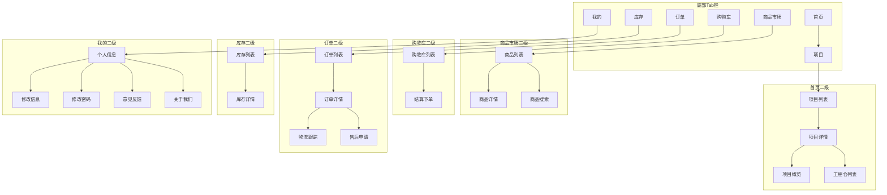

# 施工方端 - 页面导航设计

> 版本：v1.0  
> 文档状态：初稿  
> 所属章节：第十章

## 版本历史

| 版本 | 日期 | 修订内容 |
|:----:|:----:|---------|
| v1.0 | 2026-04-24 | 初始创建，覆盖20个页面索引+导航关系图+小程序TabBar配置 |

---

## 一、功能概述

### 1.1 功能定位

本文档定义施工方端所有页面的导航关系、页面索引、页面跳转交互规则，是前端开发的导航设计参考。

### 1.2 目标用户

- **前端开发工程师**：基于导航设计实现路由配置和页面跳转
- **测试工程师**：基于页面关系设计测试用例

---

## 二、页面索引

| 序号 | 页面名称 | 路由路径 | 归属导航 | 页面类型 |
|:----:|---------|:--------:|:--------:|:--------:|
| 1 | 项目列表 | /projects | 首页 | 列表 |
| 2 | 项目详情 | /projects/:id | 首页 | 详情 |
| 3 | 项目概览 | /projects/:id/overview | 首页 | 看板 |
| 4 | 工程仓列表 | /projects/:id/warehouses | 首页 | 列表 |
| 5 | 商品市场 | /market | 商品市场Tab | 列表 |
| 6 | 商品详情 | /market/:id | 商品市场 | 详情 |
| 7 | 商品搜索 | /market/search | 商品市场 | 列表+搜索 |
| 8 | 购物车 | /cart | 购物车Tab | 列表 |
| 9 | 结算下单 | /cart/checkout | 购物车 | 表单 |
| 10 | 订单列表 | /orders | 订单Tab | 列表 |
| 11 | 订单详情 | /orders/:id | 订单 | 详情 |
| 12 | 物流跟踪 | /orders/:id/logistics | 订单 | 详情 |
| 13 | 售后申请 | /orders/:id/after-sale | 订单 | 表单 |
| 14 | 库存列表 | /inventory | 库存Tab | 列表 |
| 15 | 库存详情 | /inventory/:id | 库存 | 详情 |
| 16 | 个人信息 | /profile | 我的Tab | 详情 |
| 17 | 修改信息 | /profile/edit | 我的 | 表单 |
| 18 | 修改密码 | /profile/password | 我的 | 表单 |
| 19 | 意见反馈 | /profile/feedback | 我的 | 表单 |
| 20 | 关于我们 | /profile/about | 我的 | 静态 |

---

## 三、导航关系图

### 3.1 底部Tab导航

### 3.2 小程序TabBar配置

| Tab | 页面路径 | 图标 | 选中图标 |
|:---:|:--------:|:----:|:--------:|
| 首页 | /pages/index/index | home | home-active |
| 商品市场 | /pages/market/index | market | market-active |
| 购物车 | /pages/cart/index | cart | cart-active |
| 订单 | /pages/order/index | order | order-active |
| 库存 | /pages/inventory/index | inventory | inventory-active |
| 我的 | /pages/mine/index | mine | mine-active |

---

## 四、页面跳转交互规则

### 4.1 登录→首页

- 登录后默认进入首页→项目列表
- 如果只有一个项目，自动进入项目概览

### 4.2 项目切换

- 项目切换后所有页面（商品市场/购物车/订单/库存）刷新为当前项目数据
- 项目切换时购物车保留原项目数据，不丢失

### 4.3 商品市场→购物车跳转

- 点击"加入购物车"后停留在当前页，不跳转
- 点击购物车Tab进入购物车页面
- 结算完成后跳转订单详情页

### 4.4 订单→售后

- 订单详情页点击"申请售后"→ 跳转售后表单
- 售后提交成功 → 返回订单详情

