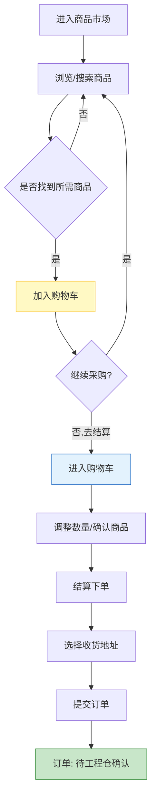
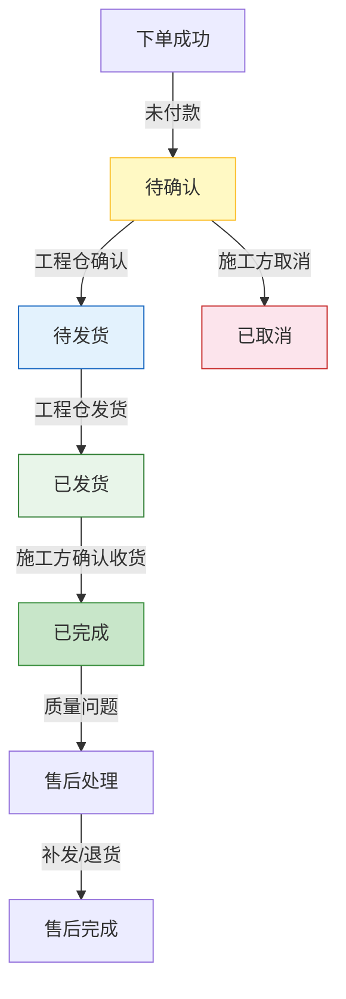

# 施工方端 - 产品需求文档

> 版本：v1.0  
> 文档状态：初稿  
> 创建日期：2026-04-24  
> 文档负责人：产品团队  
> 所属模块：施工方端 - 全模块  
> 文档类型：SKILL格式PRD（融合文档深度+结构化输出）

## 版本历史

| 版本 | 日期 | 修订内容 |
|:----:|:----:|---------|
| v1.0 | 2026-04-24 | 初始创建，覆盖施工方端28个功能点完整详细设计 |

---

## 零、文档索引

| 章节编号 | 名称 | 内容概要 | 面向角色 |
|:--------:|------|---------|:--------:|
| — | [prd.md](prd.md)（本文） | 总纲：设计原则、术语表、角色权限、功能全景、核心流程图、四端边界 | 全局 |
| 01 | [01-系统概览与架构.md](01-系统概览与架构.md) | 系统定位、技术架构、模块树、角色定义 | 全局 |
| 02 | [02-业务流程设计.md](02-业务流程设计.md) | 4张流程图：商品采购、购物车结算、订单跟踪、售后 | 全局 |
| 04 | [04-领域模型设计.md](04-领域模型设计.md) | 5实体、3服务、4事件、DDD分层架构 | 后端 |
| 05 | [05-首页与项目功能设计.md](05-首页与项目功能设计.md) | 项目列表/切换/概览/工程仓列表/项目详情(2P0+3P1) | 前后端 |
| 06 | [06-商品市场功能设计.md](06-商品市场功能设计.md) | 商品浏览/分类筛选/搜索/加入购物车/商品详情(5P0) | 前后端 |
| 07 | [07-购物车功能设计.md](07-购物车功能设计.md) | 购物车列表/修改数量/删除/清空/结算下单(5P0) | 前后端 |
| 08 | [08-订单管理功能设计.md](08-订单管理功能设计.md) | 订单列表/详情/取消/确认收货/售后/跟踪(4P0+2P1) | 前后端 |
| 09 | [09-库存与个人中心功能设计.md](09-库存与个人中心功能设计.md) | 库存列表/详情+个人信息/密码/意见反馈/退出(2P1+1P2+1P0) | 前后端 |
| 10 | [10-页面导航设计.md](10-页面导航设计.md) | 施工方端24个页面索引+路由配置+导航关系Mermaid图 | 前端 |

---

## 一、核心设计原则（Skill：轻量采购+移动优先）

> 施工方端是平台**采购方**，核心场景是"在手机上从工程仓买东西"。

### 1.1 移动优先+PC辅助双端设计

| 使用场景 | 主要端 | 次要端 | 说明 |
|---------|:------:|:------:|------|
| 商品浏览选购 | 📱 小程序 | 💻 PC | 施工现场快速下单 |
| 订单管理 | 📱 小程序 | 💻 PC | 查看订单状态 |
| 项目管理 | 💻 PC | 📱 小程序 | 项目数据更集中在PC |

### 1.2 单条购买链路

施工方端只有一条业务链路：**浏览→加购→下单→支付→收货→售后**，沿袭工程仓端三状态分离设计：

```mermaid
graph TB
    subgraph 施工方采购链路（单链路）
        A[浏览商品] --> B[加入购物车]
        B --> C[结算下单]
        C --> D[订单: 待确认]
        D -->|工程仓确认| E[订单: 待发货]
        E -->|工程仓发货| F[订单: 已发货]
        F -->|确认收货| G[订单: 已完成]
    end
    subgraph 异常链路
        D -->|取消| H[订单: 已取消]
        G -->|售后| I[售后申请]
    end
    style D fill:#fff9c4,stroke:#fbc02d
    style E fill:#e3f2fd,stroke:#1565c0
    style F fill:#e8f5e9,stroke:#2e7d32
    style G fill:#c8e6c9,stroke:#388e3c
    style H fill:#fce4ec,stroke:#c62828
```

### 1.3 项目多仓管理

> 施工方同时负责多个建筑工程项目，每个项目对接不同的工程仓  
> 系统以**项目**为组织维度管理采购，开工时选项目→选工程仓→采购

---

## 二、术语表

| 术语 | 说明 |
|------|------|
| **施工方** | 建筑工程项目施工单位，在平台上向工程仓采购建材 |
| **项目** | 施工方负责的建筑工程项目，施工方的组织维度 |
| **工程仓** | 建筑工程项目仓库管理方，施工方的商品供应方 |
| **销售订单** | 施工方→工程仓的采购单据 |
| **购物车** | 施工方临时存放采购商品的容器，以工程仓为单位 |
| **确认收货** | 施工方收到货物后在系统确认的操作 |

---

## 三、用户角色与权限矩阵

### 3.1 角色定义

| 角色 | 系统标识 | 核心职责 | 使用端 |
|------|---------|---------|:------:|
| **项目管理员** | admin | 项目采购管理、订单审批 | PC/小程序 |
| **采购员** | buyer | 日常商品选购、下单 | 📱 小程序 |
| **仓管员** | warehouse | 收货确认、库存查询 | 📱 小程序 |
| **项目成员** | member | 商品浏览、查看订单 | 📱 小程序 |

### 3.2 权限全景矩阵

| 操作/功能 | 项目管理员 | 采购员 | 仓管员 | 项目成员 |
|-----------|:----------:|:------:|:------:|:--------:|
| 项目切换 | ✅ | ✅ | ✅ | ✅ |
| 商品浏览/搜索 | ✅ | ✅ | ✅ | ✅ |
| 加入购物车 | ✅ | ✅ | ❌ | ❌ |
| 结算下单 | ✅ | ✅ | ❌ | ❌ |
| 查看订单 | ✅ | ✅ | ✅ | ✅ |
| 确认收货 | ✅ | ❌ | ✅ | ❌ |
| 取消订单 | ✅ | ✅ | ❌ | ❌ |
| 申请售后 | ✅ | ✅ | ❌ | ✅ |
| 库存查询 | ✅ | ❌ | ✅ | ❌ |
| 个人中心管理 | ✅ | ✅ | ✅ | ✅ |

---

## 四、功能全景（Skill：8列CSV格式）

| 所属端 | 模块 | 一级菜单 | 二级菜单 | 核心功能点 | 物理文件 | 优先级 | 备注 |
|-------|------|---------|---------|-----------|---------|:------:|------|
| 施工方端 | 首页 | 首页 | 首页 | 项目列表 | 05-首页与项目功能设计.md | P0 | 负责项目列表 |
| 施工方端 | 首页 | 首页 | 首页 | 项目切换 | 05-首页与项目功能设计.md | P0 | 多项目切换 |
| 施工方端 | 首页 | 首页 | 首页 | 项目概览 | 05-首页与项目功能设计.md | P1 | 数据看板 |
| 施工方端 | 首页 | 首页 | 工程仓列表 | 工程仓列表 | 05-首页与项目功能设计.md | P1 | 可用工程仓 |
| 施工方端 | 首页 | 首页 | 项目详情 | 项目详情 | 05-首页与项目功能设计.md | P1 | 项目信息 |
| 施工方端 | 商品市场 | 商品市场 | 商品列表 | 商品浏览 | 06-商品市场功能设计.md | P0 | 卡片展示 |
| 施工方端 | 商品市场 | 商品市场 | 商品列表 | 分类筛选 | 06-商品市场功能设计.md | P0 | Tab切换 |
| 施工方端 | 商品市场 | 商品市场 | 商品列表 | 搜索商品 | 06-商品市场功能设计.md | P0 | 关键词搜索 |
| 施工方端 | 商品市场 | 商品市场 | 商品列表 | 加入购物车 | 06-商品市场功能设计.md | P0 | 选品采购 |
| 施工方端 | 商品市场 | 商品市场 | 商品列表 | 商品详情 | 06-商品市场功能设计.md | P0 | 详情页 |
| 施工方端 | 购物车 | 购物车 | 购物车 | 购物车列表 | 07-购物车功能设计.md | P0 | 购物车管理 |
| 施工方端 | 购物车 | 购物车 | 购物车 | 修改数量 | 07-购物车功能设计.md | P0 | 数量调整 |
| 施工方端 | 购物车 | 购物车 | 购物车 | 删除商品 | 07-购物车功能设计.md | P0 | 左滑删除 |
| 施工方端 | 购物车 | 购物车 | 购物车 | 清空购物车 | 07-购物车功能设计.md | P0 | 一键清空 |
| 施工方端 | 购物车 | 购物车 | 购物车 | 结算下单 | 07-购物车功能设计.md | P0 | 确认订单 |
| 施工方端 | 订单 | 订单 | 订单列表 | 订单列表 | 08-订单管理功能设计.md | P0 | 多Tab筛选 |
| 施工方端 | 订单 | 订单 | 订单列表 | 订单详情 | 08-订单管理功能设计.md | P0 | 详情页 |
| 施工方端 | 订单 | 订单 | 订单列表 | 取消订单 | 08-订单管理功能设计.md | P0 | 取消操作 |
| 施工方端 | 订单 | 订单 | 订单列表 | 确认收货 | 08-订单管理功能设计.md | P0 | 确认按钮 |
| 施工方端 | 订单 | 订单 | 订单列表 | 申请售后 | 08-订单管理功能设计.md | P1 | 售后申请 |
| 施工方端 | 订单 | 订单 | 订单列表 | 订单跟踪 | 08-订单管理功能设计.md | P1 | 物流跟踪 |
| 施工方端 | 库存 | 库存 | 库存查询 | 库存列表 | 09-库存与个人中心功能设计.md | P1 | 查看库存 |
| 施工方端 | 库存 | 库存 | 库存查询 | 库存详情 | 09-库存与个人中心功能设计.md | P2 | 详情 |
| 施工方端 | 个人中心 | 个人中心 | 个人信息 | 查看信息 | 09-库存与个人中心功能设计.md | P1 | 个人信息 |
| 施工方端 | 个人中心 | 个人中心 | 个人信息 | 修改信息 | 09-库存与个人中心功能设计.md | P1 | 信息变更 |
| 施工方端 | 个人中心 | 个人中心 | 修改密码 | 修改密码 | 09-库存与个人中心功能设计.md | P1 | 密码修改 |
| 施工方端 | 个人中心 | 个人中心 | 意见反馈 | 意见反馈 | 09-库存与个人中心功能设计.md | P3 | 提交反馈 |
| 施工方端 | 个人中心 | 个人中心 | 关于我们 | 关于我们 | 09-库存与个人中心功能设计.md | P3 | 系统介绍 |
| 施工方端 | 个人中心 | 个人中心 | 退出登录 | 退出登录 | 09-库存与个人中心功能设计.md | P0 | 退出系统 |

---

## 五、核心业务流程图（全景）

### 5.1 施工方采购流程



### 5.2 订单生命周期（施工方视角）



---

## 六、多端边界定义

| 能力维度 | 施工方端 | 工程仓端 | 供应商端 |
|---------|:--------:|:--------:|:--------:|
| 商品购买 | ✅ 采购 | ✅ 销售 | ❌ 供货 |
| 购物车管理 | ✅ 管理 | ✅ 管理 | ❌ 无 |
| 项目多仓管理 | ✅ 核心 | ❌ 无 | ❌ 无 |
| 商品市场浏览 | ✅ 浏览 | ✅ 浏览 | ❌ 不可 |
| 订单发货 | ❌ 收货 | ✅ 发货 | ✅ 发货 |
| 库存管理 | ❌ 查询 | ✅ 全管 | ❌ 查询 |

---

## 七、全局交互规范

### 7.1 页面加载

| 场景 | 处理方式 | 示意 |
|-----|---------|------|
| 首次加载 | 全页Loading Skeleton | 灰色骨架屏脉冲动画 |
| 列表加载 | 底部滚动loading指示器 | 旋转loading+文字"加载中..." |
| 局部刷新 | 仅更新区域，不做全页刷新 | 区域遮罩+spin |

### 7.2 空状态

| 场景 | 处理方式 | 提示文案 |
|-----|---------|---------|
| 列表无数据 | 居中空状态插画+文字 | "暂无{数据名称}" |
| 搜索无结果 | 空状态+搜索建议 | "未找到'{关键词}'相关结果" |
| 购物车为空 | 空购物车插画+引导购买 | "购物车是空的，去逛逛吧" |

### 7.3 错误处理

| 异常场景 | UI表现 | 用户操作 |
|---------|-------|---------|
| 网络异常 | Toast提示"网络异常，请检查网络连接" | 自动重试3次后提示手动刷新 |
| 请求超时 | 区域重试按钮 | 点击重试 |
| 服务端错误 | 页面顶部通知条 | 刷新页面或联系管理员 |
| 无权限访问 | 页面级提示 | "您暂无该功能权限，请联系管理员" |

### 7.4 操作反馈

| 操作类型 | 反馈方式 | 说明 |
|---------|---------|------|
| 保存/提交 | Toast "操作成功" / "操作失败：{原因}" | 2秒自动消失 |
| 删除 | Modal二次确认（黄色警告）+ Toast | "确认删除{名称}？" |
| 批量操作 | 操作完成后Toast汇总结果 | "成功N条，失败M条" |
| 状态变更 | Toast+列表自动刷新 | "状态已更新" |

