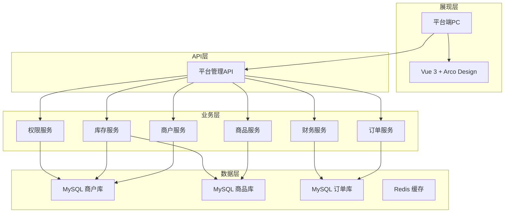

# 平台端 - 系统概览与架构

> 版本：v1.0  
> 文档状态：初稿  
> 所属章节：第一章

## 版本历史

| 版本 | 日期 | 修订内容 |
|:----:|:----:|---------|
| v1.0 | 2026-04-24 | 初始创建 |

---

## 一、功能定位

### 1.1 系统定位

平台端是整个采供一体化平台的**管理中心**，面向平台运营方提供商户管理、商品统筹、订单监控、库存总览、财务核算、系统配置等全链路管理功能，是平台的"驾驶舱"。

```
┌─────────────────────────────────────────────────────────────┐
│                    平台端（管理中心）                          │
├─────────────────────────────────────────────────────────────┤
│                                                              │
│  角色一：作为管理方                                          │
│  ┌──────────────────┐    ┌──────────────────┐              │
│  │ 商户管理          │ →  │ 入驻审核 + 合同    │              │
│  │ 供应商/工程仓/施工方│    │ 冻结/解冻 + 风控  │              │
│  └──────────────────┘    └──────────────────┘              │
│                                                              │
│  角色二：作为数据定义方                                      │
│  ┌──────────────────┐    ┌──────────────────┐              │
│  │ 商品定义          │ →  │ 分类/属性/SPU/SKU │              │
│  │ 统一标准          │    │ 供应商供货关系     │              │
│  └──────────────────┘    └──────────────────┘              │
│                                                              │
│  角色三：作为监控方                                          │
│  ┌──────────────────┐    ┌──────────────────┐              │
│  │ 全平台监控        │ →  │ 订单/库存/财务    │              │
│  │ 跨端数据查看      │    │ 日志审计          │              │
│  └──────────────────┘    └──────────────────┘              │
│                                                              │
└─────────────────────────────────────────────────────────────┘
```

### 1.2 系统设计哲学

| 原则 | 说明 |
|------|------|
| **审核管控** | 所有关键变更需平台审核，审核通过后方可生效 |
| **数据统一定义** | 商品基础数据（分类/属性/SPU/SKU）由平台统一维护 |
| **全量可见** | 平台端可查看所有端的数据，其他端仅可见自身数据 |
| **操作可追溯** | 所有审核和配置变更记录日志，支持审计追溯 |
| **端间数据隔离** | 各端商户数据通过商户ID隔离，互不可见 |

### 1.3 核心价值

- **商户全生命周期管理**：从入驻→审核→合同→账号开通→冻结/解冻
- **商品标准化定义**：统一分类/属性/SPU/SKU体系，消除数据孤岛
- **全平台订单监控**：跨端查看所有交易数据，异常订单及时干预
- **集中式权限管控**：统一管理用户/角色/权限，支持RBAC精细化授权

---

## 二、技术架构

### 2.1 整体架构分层



### 2.2 技术选型

| 技术栈 | 选型 | 用途 |
|-------|------|------|
| 前端框架 | Vue 3.x + TypeScript | PC端管理后台 |
| UI组件库 | Arco Design 2.x | 统一UI风格 |
| 后端框架 | Spring Boot 3.x | 微服务架构 |
| 数据库 | MySQL 8.x | 核心业务数据 |
| 缓存 | Redis 7.x | 分布式锁/缓存 |

---

## 三、功能模块树

```
平台端
├── 工作台 (P1)
│   └── 数据概览看板
├── 商户管理 (4P0 + 3P1)
│   ├── 商户列表查询 (P0)
│   ├── 新增商户 (P0)
│   ├── 商户详情 (P0)
│   ├── 商户审核 (P0)
│   ├── 商户冻结/解冻 (P1)
│   ├── 合同列表查询 (P1)
│   └── 新增合同 (P1)
├── 商品管理 (10P0 + 4P1)
│   ├── 分类树管理 (P0)
│   ├── 属性组管理 (P0)
│   ├── 属性值管理 (P0)
│   ├── SPU新增 (P0)
│   ├── SPU详情 (P0)
│   ├── SKU列表 (P0)
│   ├── SKU详情 (P0)
│   ├── 供应商供货列表 (P0)
│   ├── 设置供货价 (P0)
│   ├── 供货状态切换 (P0)
│   ├── SPU列表查询 (P1)
│   ├── SPU编辑 (P1)
│   ├── SKU编辑 (P1)
│   └── 批量上下架 (P1)
├── 商品市场 (4P0 + 4P1 + 1P2)
│   ├── 供应商品列表 (P0)
│   ├── 商品上下架 (P0)
│   ├── 销售商品列表 (P0)
│   ├── 销售价格设置 (P0)
│   ├── BOM列表 (P1)
│   ├── 创建BOM (P1)
│   ├── BOM详情 (P1)
│   ├── 价格管理列表 (P1)
│   └── BOM编辑 (P2)
├── 订单管理 (2P0 + 1P1 + 1P2)
│   ├── 全量订单查询 (P0)
│   ├── 订单详情 (P0)
│   ├── 订单状态追踪 (P1)
│   └── 订单导出 (P2)
├── 库存管理 (4P1 + 2P2)
│   ├── 库存总览 (P1)
│   ├── 仓库列表 (P1)
│   ├── 仓库详情 (P1)
│   ├── 出入库流水 (P1)
│   ├── 调拨管理 (P2)
│   └── 盘点管理 (P2)
├── 财务中心 (1P0 + 4P1 + 2P2)
│   ├── 支付流水 (P0)
│   ├── 应收记录 (P1)
│   ├── 分账列表 (P1)
│   ├── 进项发票列表 (P1)
│   ├── 销项发票列表 (P1)
│   ├── 发票上传 (P2)
│   └── 发票关联订单 (P2)
└── 系统设置 (3P0 + 3P1 + 1P2)
    ├── 用户列表 (P0)
    ├── 员工列表 (P0)
    ├── 角色管理+权限配置 (P0)
    ├── 菜单管理 (P1)
    ├── 分账配置 (P1)
    ├── 物流配置 (P1)
    └── 操作日志 (P2)
```

---

## 四、角色定义

| 角色 | 系统标识 | 层级 | 核心场景 | 使用端 |
|------|---------|:----:|---------|:------:|
| 平台管理员 | admin | 管理层 | 商户审核、系统配置、平台监控 | PC |
| 平台运营 | operator | 操作层 | 商品管理、商品市场、订单监控 | PC |
| 平台财务 | finance | 操作层 | 支付流水、发票、分账 | PC |
| 平台客服 | service | 操作层 | 订单售后、商户服务 | PC |
| 平台超管 | super_admin | 管理+操作 | 所有权限，不可修改 | PC |

---

## 五、非功能性需求

| 维度 | 要求 | 衡量标准 |
|-----|------|---------|
| 性能 | 列表查询<1s，详情<500ms | 99分位响应时间 |
| 可用性 | 核心功能99.9%可用 | 宕机时间<8.7h/年 |
| 安全 | 商户数据隔离，敏感信息脱敏 | 角色+权限访问控制 |
| 可扩展 | 新商户类型可配置化 | 无需改代码即可新增 |

