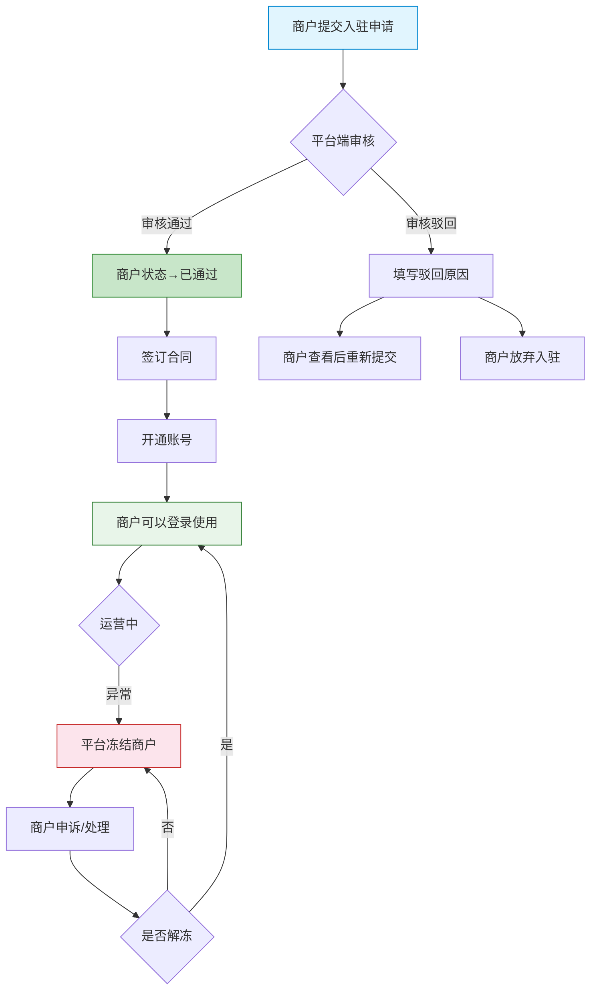
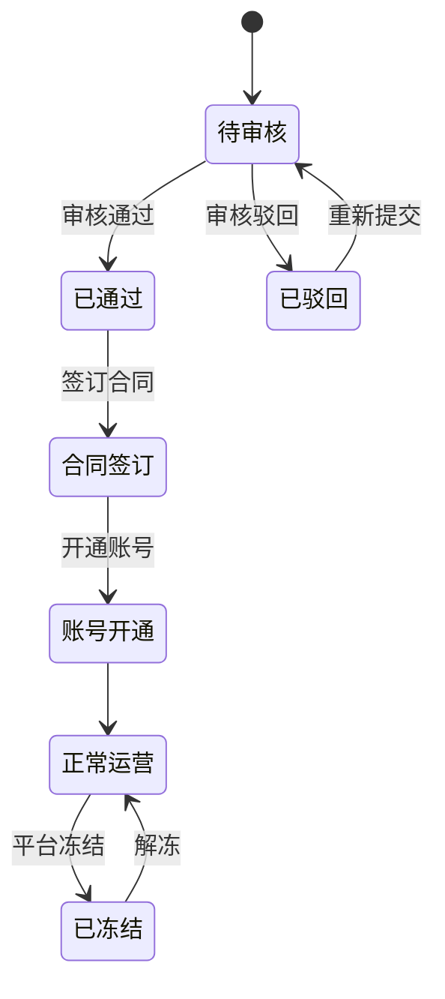
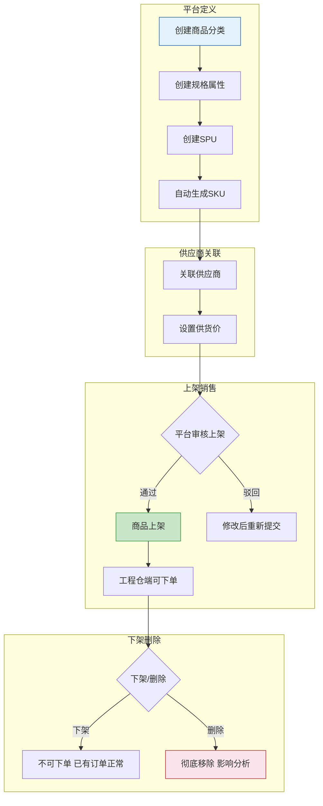
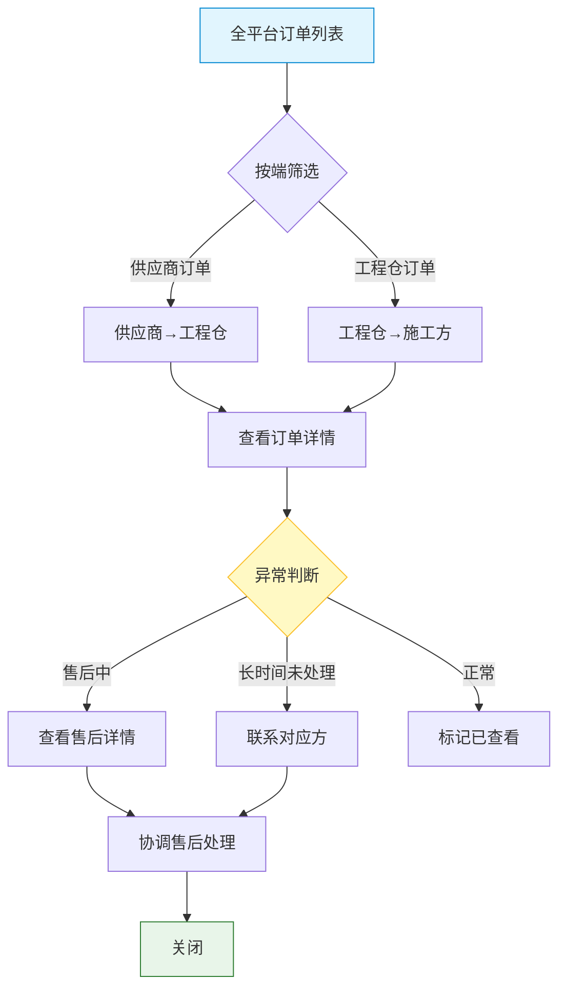
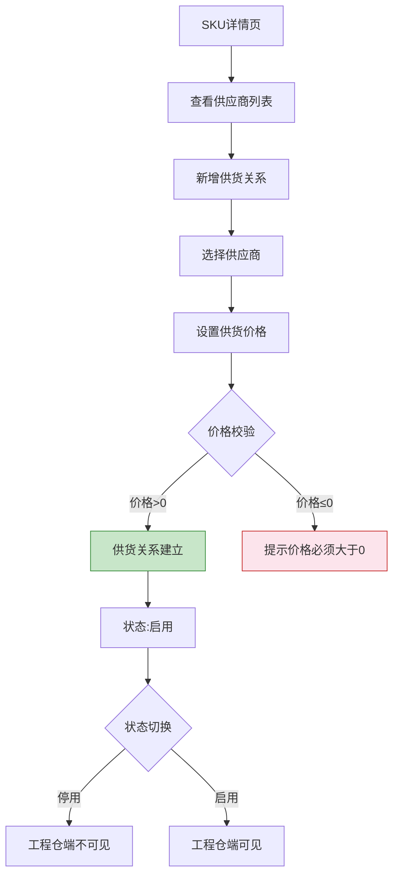

# 平台端 - 业务流程设计

> 版本：v1.0  
> 文档状态：初稿  
> 所属章节：第二章

## 版本历史

| 版本 | 日期 | 修订内容 |
|:----:|:----:|---------|
| v1.0 | 2026-04-24 | 初始创建，覆盖4大核心业务流程 |

---

## 一、功能概述

### 1.1 功能定位

业务流程设计描述平台端所有核心业务的流转链路，包括商户入驻审核、商品全生命周期管理、全平台订单监控、供应商供货管理等。本文档面向产品、开发、测试团队，帮助理解平台端在全系统中的管理职责。

### 1.2 核心概念

| 概念 | 说明 | 涉及链路 |
|-----|------|:--------:|
| 商户入驻 | 供应商/工程仓/施工方的注册审核全流程 | 审核链路 |
| 商品定义 | 平台统一定义分类→属性→SPU→SKU的数据链路 | 定义链路 |
| 供货管理 | 供应商与SKU建立供货关系、设置价格的管理链路 | 供货链路 |
| 订单监控 | 全平台订单跨端查看和状态追踪 | 监控链路 |
| 审核流 | 商户入驻、商品上架等需要平台审批的流程 | 审核链路 |

### 1.3 目标用户

- **产品经理**：理解管理链路，指导功能设计
- **开发工程师**：了解业务上下文，指导接口开发
- **测试工程师**：基于流程设计测试用例
- **平台运营人员**：了解操作流程，指导日常使用

---

## 二、核心业务链路概述

平台端在采供一体化平台中处于**管理中枢**位置，不直接参与交易，而是对交易链路中的各参与方和数据行使管理权：

```
链路一：商户入驻审核链
═════════════════════════════════════════════════════
    ┌──────────┐  提交申请   ┌──────────┐ 审核   ┌──────────┐
    │  商户端   │ ─────────▶ │  平台端   │ ────▶ │  审核结果 │
    │ (申请方)  │◀───────────│ (审核方)  │       │ 通过/驳回 │
    └──────────┘  审核通知   └──────────┘       └──────────┘

链路二：商品定义消费链
═════════════════════════════════════════════════════
    ┌──────────┐  统一定义   ┌──────────┐  消费   ┌──────────┐
    │  平台端   │ ─────────▶ │  供应商端 │ ────▶ │  工程仓端  │
    │ (定义方)  │            │ (设置价)  │       │ (采购方)  │
    └──────────┘            └──────────┘       └──────────┘

链路三：订单监控链
═════════════════════════════════════════════════════
    ┌──────────┐  全量数据   ┌──────────┐
    │  各端订单  │ ─────────▶ │  平台端   │
    │ (产生方)  │            │ (监控方)  │
    └──────────┘            └──────────┘
```

---

## 三、商户入驻审核流程

### 3.1 流程图



### 3.2 流程步骤说明

| 步骤 | 操作角色 | 操作内容 | 系统响应 | 前置条件 | 后置状态 |
|:----:|:--------:|---------|---------|---------|---------|
| 1 | 商户 | 提交入驻申请（填写资料+上传资质） | 创建商户待审核记录 | 无 | pending |
| 2 | 平台管理员 | 审核资质，选择通过/驳回 | 更新商户状态 | 有pending申请 | approved/rejected |
| 3 | 平台管理员 | 驳回时填写原因（10-200字） | 记录驳回原因，通知商户 | 选择驳回 | rejected |
| 4 | 商户 | 查看驳回原因，修改后重新提交 | 更新资料，状态回退pending | 状态=rejected | pending |
| 5 | 平台管理员 | 通过后签订合同 | 合同上传归档 | 状态=approved | 合同已签订 |
| 6 | 平台管理员 | 开通账号 | 创建登录账号 | 合同已签订 | 账号已开通 |

### 3.3 状态流转



---

## 四、商品全生命周期管理流程

### 4.1 流程图



### 4.2 流程说明

| 步骤 | 操作角色 | 操作内容 | 说明 |
|:----:|:--------:|---------|------|
| 1 | 平台运营 | 创建三级分类体系 | 树形结构，支持拖拽 |
| 2 | 平台运营 | 创建规格属性组+属性值 | 如"颜色:红/蓝/绿" |
| 3 | 平台运营 | 创建SPU基本信息 | 关联分类和规格属性 |
| 4 | 系统 | 自动生成SKU组合 | 笛卡尔积生成所有组合 |
| 5 | 供应商 | 选择SKU并设置供货价 | 价格为供应商→工程仓 |
| 6 | 平台运营 | 审核上架/驳回 | 商品进入市场 |
| 7 | 平台运营 | 下架/删除管理 | 下架→不可下单；删除→移除 |

---

## 五、全平台订单监控流程



---

## 六、供应商供货管理流程



