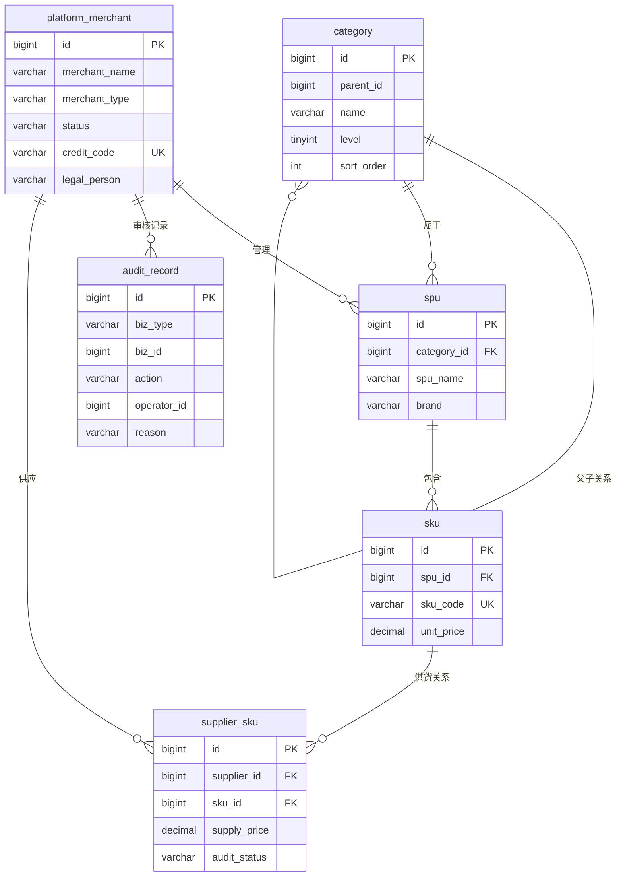

# 平台端 - 数据模型与表结构

> 版本：v1.0  
> 文档状态：初稿  
> 所属章节：第三章

## 版本历史

| 版本 | 日期 | 修订内容 |
|:----:|:----:|---------|
| v1.0 | 2026-04-24 | 初始创建，覆盖6张核心表 |

---

## 一、功能概述

### 1.1 功能定位

本文档定义平台端所有业务数据的**表结构、字段规范、实体关系**，是后端开发和数据库设计的核心参考。涵盖商户、商品、市场、系统等核心模块的数据库设计。

### 1.2 核心概念

| 概念 | 说明 | 涉及表 |
|-----|------|--------|
| 平台商户 | 供应商/工程仓/施工方三种商户类型统一管理 | platform_merchant |
| 商品分类 | 三级分类体系，树形结构 | category |
| 商品SPU | 标准产品单元，商品定义最上层 | spu |
| 商品SKU | 库存量单位，规格商品最小颗粒度 | sku |
| 供货关系 | 供应商与SKU的关联+价格 | supplier_sku |
| 审核记录 | 商户入驻/商品上架等审核操作日志 | audit_record |

### 1.3 核心设计原则

1. **商户ID数据隔离**：所有业务表通过merchant_id字段区分数据所属方
2. **审核记录可追溯**：审核操作记录独立存储，支持全链路审计
3. **状态字段字符串化**：状态字段使用VARCHAR可读字符串，不使用数字枚举
4. **乐观锁并发**：库存等高频更新表使用version字段防止并发冲突

---

## 二、业务数据规则

### 2.1 字段命名规范

- 所有表使用 BIGINT 自增主键（id）
- 创建时间统一字段：create_time（DATETIME, DEFAULT NOW）
- 更新时间统一字段：update_time（DATETIME, ON UPDATE）
- 状态字段统一使用 VARCHAR(20) 可读字符串
- 金额字段统一使用 DECIMAL(18,2)
- 外键字段统一使用 BIGINT，命名规则：关联表名_id

### 2.2 商户数据规则

- 商户类型: supplier（供应商）/ warehouse（工程仓）/ constructor（施工方）
- 商户状态: pending（待审核）/ approved（已通过）/ rejected（已驳回）/ frozen（已冻结）
- 审核流: 每个状态变更都有对应的audit_record记录

### 2.3 商品数据规则

- 分类层级: 三级（level=1/2/3），树形parent_id关联
- SPU→SKU: SPU定义规格属性，SKU通过笛卡尔积自动生成
- 供货价格: 一个SKU可被多个供应商供应，每个供应商有自己的供货价

---

## 三、核心表结构

### 3.1 表：platform_merchant（平台商户表）

**说明：** 存储供应商/工程仓/施工方的商户基础信息

**字段列表：**

| 字段名 | 类型 | 长度 | 是否必填 | 主键/索引 | 默认值 | 说明 |
|-------|:----:|:----:|:--------:|:---------:|:-----:|------|
| id | BIGINT | — | Y | PK | AUTO_INCREMENT | 自增主键 |
| merchant_name | VARCHAR | 100 | Y | — | — | 商户名称 |
| merchant_type | VARCHAR | 20 | Y | IDX | — | 商户类型(supplier/warehouse/constructor) |
| status | VARCHAR | 20 | Y | IDX | pending | 状态(pending/approved/rejected/frozen) |
| credit_code | VARCHAR | 50 | Y | UK | — | 统一信用代码 |
| legal_person | VARCHAR | 50 | Y | — | — | 法人代表 |
| contact_name | VARCHAR | 50 | Y | — | — | 联系人 |
| contact_phone | VARCHAR | 20 | Y | — | — | 联系电话 |
| business_license | VARCHAR | 500 | N | — | — | 营业执照图片URL |
| create_time | DATETIME | — | Y | — | NOW | 创建时间 |
| update_time | DATETIME | — | Y | — | ON UPDATE | 更新时间 |

**索引策略：**

| 索引名 | 类型 | 字段 | 说明 |
|-------|:----:|------|------|
| idx_type_status | INDEX | merchant_type, status | 按类型+状态查询 |
| uk_credit_code | UNIQUE | credit_code | 信用代码唯一 |

**DDL：**

```sql
CREATE TABLE `platform_merchant` (
  `id` bigint(20) NOT NULL AUTO_INCREMENT COMMENT '自增主键',
  `merchant_name` varchar(100) NOT NULL COMMENT '商户名称',
  `merchant_type` varchar(20) NOT NULL COMMENT '商户类型',
  `status` varchar(20) NOT NULL DEFAULT 'pending' COMMENT '状态',
  `credit_code` varchar(50) NOT NULL COMMENT '统一信用代码',
  `legal_person` varchar(50) NOT NULL COMMENT '法人代表',
  `contact_name` varchar(50) NOT NULL COMMENT '联系人',
  `contact_phone` varchar(20) NOT NULL COMMENT '联系电话',
  `business_license` varchar(500) DEFAULT NULL COMMENT '营业执照',
  `create_time` datetime NOT NULL DEFAULT CURRENT_TIMESTAMP COMMENT '创建时间',
  `update_time` datetime NOT NULL DEFAULT CURRENT_TIMESTAMP ON UPDATE CURRENT_TIMESTAMP COMMENT '更新时间',
  PRIMARY KEY (`id`) USING BTREE,
  UNIQUE KEY `uk_credit_code` (`credit_code`),
  INDEX `idx_type_status` (`merchant_type`, `status`)
) ENGINE=InnoDB DEFAULT CHARSET=utf8mb4 COMMENT='平台商户表';
```

### 3.2 表：category（商品分类表）

**说明：** 三级商品分类树形结构

**字段列表：**

| 字段名 | 类型 | 长度 | 是否必填 | 主键/索引 | 默认值 | 说明 |
|-------|:----:|:----:|:--------:|:---------:|:-----:|------|
| id | BIGINT | — | Y | PK | AUTO_INCREMENT | 自增主键 |
| name | VARCHAR | 50 | Y | — | — | 分类名称 |
| parent_id | BIGINT | — | N | IDX | 0 | 父分类ID |
| level | TINYINT | — | Y | — | 1 | 层级(1/2/3) |
| sort_order | INT | — | Y | — | 0 | 排序号 |
| status | VARCHAR | 20 | Y | — | enabled | 状态 |
| create_time | DATETIME | — | Y | — | NOW | 创建时间 |

**DDL：**

```sql
CREATE TABLE `category` (
  `id` bigint(20) NOT NULL AUTO_INCREMENT COMMENT '自增主键',
  `name` varchar(50) NOT NULL COMMENT '分类名称',
  `parent_id` bigint(20) DEFAULT '0' COMMENT '父分类ID',
  `level` tinyint(4) NOT NULL DEFAULT '1' COMMENT '层级',
  `sort_order` int(11) NOT NULL DEFAULT '0' COMMENT '排序号',
  `status` varchar(20) NOT NULL DEFAULT 'enabled' COMMENT '状态',
  `create_time` datetime NOT NULL DEFAULT CURRENT_TIMESTAMP COMMENT '创建时间',
  PRIMARY KEY (`id`) USING BTREE,
  INDEX `idx_parent_id` (`parent_id`)
) ENGINE=InnoDB DEFAULT CHARSET=utf8mb4 COMMENT='商品分类表';
```

### 3.3 表：spu（商品SPU表）

**说明：** 标准产品单元定义

| 字段名 | 类型 | 长度 | 是否必填 | 说明 |
|-------|:----:|:----:|:--------:|------|
| id | BIGINT | — | Y | 自增主键 |
| spu_name | VARCHAR | 200 | Y | SPU名称 |
| category_id | BIGINT | — | Y | 关联分类ID |
| brand | VARCHAR | 100 | N | 品牌 |
| description | TEXT | — | N | 商品描述 |
| main_image | VARCHAR | 500 | N | 主图URL |
| status | VARCHAR | 20 | Y | 状态 |
| create_time | DATETIME | — | Y | 创建时间 |

### 3.4 表：sku（商品SKU表）

| 字段名 | 类型 | 长度 | 是否必填 | 说明 |
|-------|:----:|:----:|:--------:|------|
| id | BIGINT | — | Y | 自增主键 |
| sku_code | VARCHAR | 50 | Y | SKU编码（唯一） |
| spu_id | BIGINT | — | Y | 关联SPU ID |
| spec_desc | VARCHAR | 500 | Y | 规格描述JSON |
| unit_price | DECIMAL | 18,2 | Y | 参考单价 |
| status | VARCHAR | 20 | Y | 状态 |
| create_time | DATETIME | — | Y | 创建时间 |

### 3.5 表：supplier_sku（供应商供货关系表）

| 字段名 | 类型 | 长度 | 是否必填 | 说明 |
|-------|:----:|:----:|:--------:|------|
| id | BIGINT | — | Y | 自增主键 |
| supplier_id | BIGINT | — | Y | 供应商ID |
| sku_id | BIGINT | — | Y | SKU ID |
| supply_price | DECIMAL | 18,2 | Y | 供货价格 |
| status | VARCHAR | 20 | Y | 状态(enabled/disabled) |
| audit_status | VARCHAR | 20 | Y | 审核状态 |
| create_time | DATETIME | — | Y | 创建时间 |

### 3.6 表：audit_record（审核记录表）

| 字段名 | 类型 | 长度 | 是否必填 | 说明 |
|-------|:----:|:----:|:--------:|------|
| id | BIGINT | — | Y | 自增主键 |
| biz_type | VARCHAR | 50 | Y | 业务类型(merchant/spu/sku/supplier_sku) |
| biz_id | BIGINT | — | Y | 业务记录ID |
| action | VARCHAR | 20 | Y | 操作(approve/reject/freeze/unfreeze) |
| operator_id | BIGINT | — | Y | 操作人 |
| reason | VARCHAR | 500 | N | 驳回原因 |
| create_time | DATETIME | — | Y | 创建时间 |

---

## 四、实体关系图



