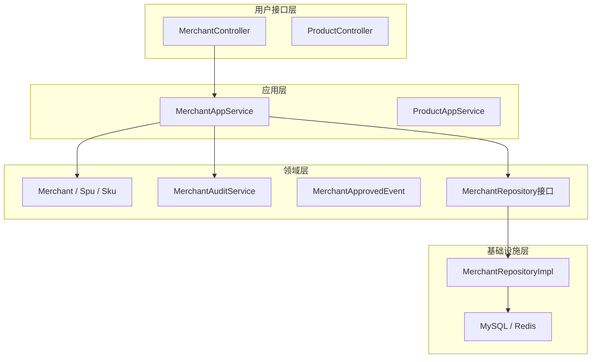

# 平台端 - 领域模型设计

> 版本：v1.0  
> 文档状态：初稿  
> 所属章节：第四章

## 版本历史

| 版本 | 日期 | 修订内容 |
|:----:|:----:|---------|
| v1.0 | 2026-04-24 | 初始创建 |

---

## 一、功能概述

### 1.1 功能定位

本文档定义平台端的**领域模型**，包括核心领域实体、领域服务、领域事件。面向开发团队，指导后端代码的领域驱动设计（DDD）实现，确保业务逻辑的准确性和可维护性。

### 1.2 核心概念

| 概念 | 说明 |
|-----|------|
| 领域实体 | 有唯一标识的业务对象，如商户、SPU |
| 值对象 | 无唯一标识的概念性对象，如地址、资质文件 |
| 领域服务 | 跨实体的业务操作，如商户审核、商品上架审核 |
| 领域事件 | 业务操作触发的通知，如商户入驻完成事件 |
| 聚合根 | 实体关系的根节点，如Merchant是Contract的聚合根 |

### 1.3 目标用户

- **后端开发工程师**：基于领域模型设计代码结构和数据库访问层
- **架构师**：评估领域划分和实体关系设计的合理性
- **技术负责人**：理解核心业务逻辑的代码映射

---

## 二、核心领域实体

### 2.1 平台商户（Merchant）

**核心属性：**
- merchantName: String — 商户名称
- merchantType: MerchantType — 商户类型（supplier/warehouse/constructor）
- status: MerchantStatus — 状态（pending/approved/rejected/frozen）
- creditCode: String — 统一信用代码
- contactInfo: ContactInfo — 联系信息（值对象）

**关联关系：**
- 1:N Contract (合同)
- 1:N User (账号)
- 1:N AuditRecord (审核记录)
- 1:N SkuSupplier (供货关系，作为供应商)

**领域方法：**
- `submitRegistration(info: RegistrationInfo)`: 提交入驻申请
- `approve(operator: OperatorId)`: 审核通过
- `reject(operator: OperatorId, reason: String)`: 审核驳回
- `freeze(operator: OperatorId)`: 冻结商户
- `unfreeze(operator: OperatorId)`: 解冻商户

**业务约束：**
- 信用代码全局唯一
- 冻结状态下禁止登录和下单
- 审核通过后基本资料不可修改

### 2.2 商品SPU（Spu）

**核心属性：**
- spuName: String — SPU名称
- categoryId: CategoryId — 所属分类
- brand: String — 品牌
- specDefs: SpecDef[] — 规格属性定义

**关联关系：**
- N:1 Category (分类)
- 1:N Sku (SKU列表)
- 1:N SpuImage (商品图片)

**领域方法：**
- `createSku(specValues: Map): Sku`: 按规格值生成SKU
- `updateBaseInfo(info: SpuBaseInfo)`: 更新基本信息
- `generateSkus()`: 自动笛卡尔积生成所有SKU组合

### 2.3 商品SKU（Sku）

**核心属性：**
- skuCode: String — SKU编码（全局唯一）
- spuId: SpuId — 所属SPU
- specDesc: String — 规格描述JSON
- unitPrice: Money — 参考单价

**关联关系：**
- N:1 Spu (所属SPU)
- 1:N SkuSupplier (供货关系列表)
- 1:N Inventory (库存记录)

### 2.4 供货关系（SkuSupplier）

**核心属性：**
- supplierId: MerchantId — 供应商ID
- skuId: SkuId — SKU ID
- supplyPrice: Money — 供货价格
- status: SupplyStatus — 状态(enabled/disabled)
- auditStatus: AuditStatus — 审核状态

**业务约束：**
- 一个供应商+一个SKU唯一一条供货关系
- 价格必须大于0
- 停用后工程仓端不可见

### 2.5 审核记录（AuditRecord）

**核心属性：**
- bizType: BizType — 业务类型
- bizId: Long — 业务记录ID
- action: AuditAction — 操作类型
- operatorId: OperatorId — 操作人
- reason: String — 驳回原因

---

## 三、领域服务

### 3.1 商户审核服务（MerchantAuditService）

> 说明：处理商户入驻申请审核的业务逻辑

```typescript
interface MerchantAuditService {
  /** 审核商户入驻申请 */
  auditMerchant(merchantId: MerchantId, operatorId: OperatorId, decision: AuditDecision, reason?: String): Merchant
  
  /** 冻结商户 */
  freezeMerchant(merchantId: MerchantId, operatorId: OperatorId): Merchant
  
  /** 解冻商户 */
  unfreezeMerchant(merchantId: MerchantId, operatorId: OperatorId): Merchant
  
  /** 获取商户审核历史 */
  getAuditHistory(merchantId: MerchantId): AuditRecord[]
}
```

**业务规则：**
1. 审核通过后商户状态变为approved，可进行合同签订
2. 审核驳回必须填写原因（10-200字）
3. 冻结后商户所有端无法登录

### 3.2 商品上架审核服务（ProductAuditService）

```typescript
interface ProductAuditService {
  /** 审核商品上架 */
  auditProduct(supplierSkuId: SupplierSkuId, operatorId: OperatorId, decision: AuditDecision, reason?: String): SupplierSku
  
  /** 批量审核 */
  batchAudit(ids: SupplierSkuId[], operatorId: OperatorId, decision: AuditDecision): BatchResult
}
```

---

## 四、领域事件

### 4.1 事件定义

| 事件名称 | 触发时机 | 携带数据 | 消费者 |
|---------|---------|---------|--------|
| MerchantApproved | 商户审核通过 | merchantId, approvedTime | 通知服务、合同服务 |
| MerchantRejected | 商户审核驳回 | merchantId, reason | 通知服务 |
| MerchantFrozen | 商户被冻结 | merchantId, operatorId | 通知服务、登录服务 |
| ProductListed | 商品上架 | supplierSkuId, skuId | 市场服务、搜索服务 |
| ProductDelisted | 商品下架 | supplierSkuId, skuId | 市场服务、搜索服务 |

### 4.2 事件处理流程

```typescript
// 商户审核通过 → 触发通知
domainEventPublisher.publish(new MerchantApprovedEvent(merchantId, LocalDateTime.now()))

// 订阅方：发送通知给商户
@EventListener
handleMerchantApproved(event: MerchantApprovedEvent) {
  notificationService.notify(event.merchantId, "您的入驻申请已通过")
}
```

---

## 五、DDD分层架构



---

## 六、聚合定义

| 聚合根 | 包含实体 | 仓储 |
|-------|---------|------|
| Merchant | Contract, User, AuditRecord | MerchantRepository |
| Spu | Sku, SpuImage | SpuRepository |
| Sku | SkuSupplier | SkuRepository |
| Category | Category（子分类） | CategoryRepository |

