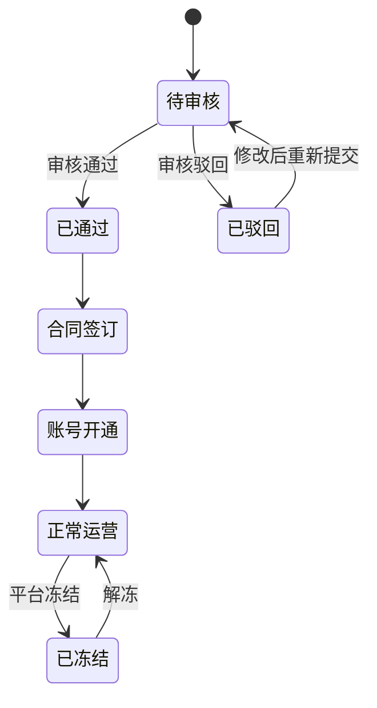

# 平台端 - 商户管理功能设计

> 版本：v1.0  
> 文档状态：初稿  
> 所属章节：第六章

## 版本历史

| 版本 | 日期 | 修订内容 |
|:----:|:----:|---------|
| v1.0 | 2026-04-24 | 初始创建，覆盖商户管理7个功能点的框架结构 |

---

## 一、功能概述

### 1.1 功能定位

商户管理是平台端**最核心的管理功能**，负责供应商/工程仓/施工方三种商户类型的全生命周期管理——从入驻申请→资料审核→合同签订→账号开通→运营监控→冻结/解冻。是平台掌控商户准入和运营状态的唯一入口。

### 1.2 核心概念

| 概念 | 说明 | 示例 |
|-----|------|------|
| 商户类型 | 供应商/工程仓/施工方三种入驻类型 | supplier / warehouse / constructor |
| 入驻申请 | 商户在线提交的注册资料+资质文件 | 包含8个基本字段+营业执照 |
| 审核流 | 平台对商户申请的审批流程 | pending→approved/rejected |
| 合同 | 商户入驻后签署的服务协议 | PDF文件归档 |

### 1.3 目标用户

- **平台管理员**：核心操作角色，审核/冻结/管理商户
- **平台客服**：查看商户信息，协助处理问题
- **平台超管**：拥有所有商户管理权限

### 1.4 模块范围

| 功能分类 | 主要功能 | 优先级 | 涉及角色 |
|---------|---------|:------:|---------|
| 商户查询 | 商户列表查询 | P0 | admin/service |
| 商户创建 | 新增商户 | P0 | admin |
| 商户查看 | 商户详情 | P0 | admin/service |
| 商户审核 | 商户审核 | P0 | admin |
| 商户管控 | 商户冻结/解冻 | P1 | admin |
| 合同管理 | 合同列表查询 | P1 | admin |
| 合同管理 | 新增合同 | P1 | admin |

---

## 二、业务规则

### 2.1 商户状态规则

- **待审核（pending）**：商户提交入驻申请后默认状态
  - 平台管理员可查看资料并审核
  - 商户可撤回申请
  - 超30天未审核→系统提醒平台管理员
- **已通过（approved）**：审核通过，可进行合同签订和账号开通
  - 基本资料变为只读（不可修改）
  - 可签订合同、开通账号
- **已驳回（rejected）**：审核未通过
  - 商户查看驳回原因后可修改资料重新提交
  - 驳回原因必须填写（10-200字）
- **已冻结（frozen）**：运营异常时平台封禁
  - 冻结后所有端禁止登录
  - 已有订单继续执行（不中断交易）
  - 可解冻恢复

### 2.2 查询规则

- 默认按创建时间倒序
- 多条件筛选：商户名称/类型/状态/时间范围
- 状态Tab：全部/待审核(🟡)/已通过(🟢)/已驳回(🔴)/已冻结(⚪)

---

## 三、功能点详细设计

### 3.1 商户列表查询（P0）

> 按工程仓端 05-系统模块详细设计.md 模板的八维格式展开编写

<!-- TODO: 按八维模板补全 -->

### 3.2 新增商户（P0）

<!-- TODO: 按八维模板补全 -->

### 3.3 商户详情（P0）

<!-- TODO: 按八维模板补全 -->

### 3.4 商户审核（P0）

<!-- TODO: 按八维模板补全 -->

### 3.5 商户冻结/解冻（P1）

<!-- TODO: 按八维模板补全 -->

### 3.6 合同列表查询（P1）

<!-- TODO: 按八维模板补全 -->

### 3.7 新增合同（P1）

<!-- TODO: 按八维模板补全 -->

---

## 四、状态流转图

---

## 五、状态治理矩阵

### 5.1 动作定义表

| 动作ID | 动作名称 | 触发方式 | 说明 |
|:------:|---------|---------|------|
| MCH-01 | 查看列表 | 页面加载/切换Tab | 多条件筛选 |
| MCH-02 | 查看详情 | 点击商户项 | 分Tab展示 |
| MCH-03 | 新增商户 | 「新增商户」按钮 | 弹窗表单 |
| MCH-04 | 审核商户 | 详情页「审核」按钮 | 通过/驳回 |
| MCH-05 | 冻结商户 | 「冻结」按钮 | 二次确认 |
| MCH-06 | 解冻商户 | 「解冻」按钮 | 二次确认 |
| MCH-07 | 查看合同 | 详情页合同Tab | 列表展示 |
| MCH-08 | 新增合同 | 「新增合同」按钮 | 上传PDF |

### 5.2 状态×操作矩阵

| 状态 \ 操作 | 查看列表 | 查看详情 | 新增商户 | 审核 | 冻结 | 解冻 | 查看合同 | 新增合同 |
|:-----------:|:--------:|:--------:|:--------:|:----:|:----:|:----:|:--------:|:--------:|
| **待审核** | ✅ | ✅ | ✅ | ✅ | ❌ | ❌ | ❌ | ❌ |
| **已通过** | ✅ | ✅ | ✅ | ❌ | ✅ | ❌ | ✅ | ✅ |
| **已驳回** | ✅ | ✅ | ✅ | ✅ | ❌ | ❌ | ❌ | ❌ |
| **已冻结** | ✅ | ✅ | ✅ | ❌ | ❌ | ✅ | ✅ | ❌ |

### 5.3 错误提示汇总

| 场景 | 提示文案 | 组件类型 |
|:----:|---------|:--------:|
| 审核→重复操作 | "该商户已审核，请刷新页面" | Toast |
| 驳回→未填写原因 | "请输入驳回原因（10-200字）" | Toast |
| 冻结→二次确认 | "确认冻结该商户？冻结后商户无法登录系统" | Modal(黄色警告) |
| 解冻→二次确认 | "确认解冻该商户？解冻后商户可正常登录" | Modal |
| 新增→信用代码重复 | "该信用代码已被注册" | Toast |
| 新增→图片过大 | "营业执照图片不能超过10M" | Toast |
| 冻结→已冻结 | "该商户已处于冻结状态" | Toast |
| 合同→文件过大 | "合同文件不能超过10M" | Toast |

