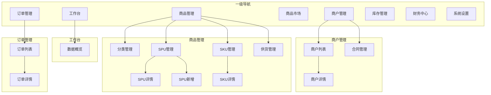

# 平台端 - 页面导航设计

> 版本：v1.0  
> 文档状态：初稿  
> 所属章节：第十三章

## 版本历史

| 版本 | 日期 | 修订内容 |
|:----:|:----:|---------|
| v1.0 | 2026-04-24 | 初始创建，覆盖36个页面索引 |

---

## 一、功能概述

### 1.1 功能定位

本文档定义平台端所有页面的导航关系和跳转交互规则，是前端开发的路由设计和页面组织参考。

### 1.2 页面索引

| 编号 | 页面名称 | 路由 | 所属模块 | 访问角色 |
|:----:|---------|------|---------|:--------:|
| P01 | 工作台 | /dashboard | 工作台 | 所有角色 |
| P02 | 商户列表 | /merchant/list | 商户管理 | admin/service/super_admin |
| P03 | 商户详情 | /merchant/detail/:id | 商户管理 | admin/service/super_admin |
| P04 | 合同管理 | /merchant/contract | 商户管理 | admin/super_admin |
| P05 | 商品分类 | /product/category | 商品管理 | admin/operator/super_admin |
| P06 | SPU列表 | /product/spu | 商品管理 | admin/operator/super_admin |
| P07 | SPU详情 | /product/spu/:id | 商品管理 | admin/operator/super_admin |
| P08 | SPU新增 | /product/spu/create | 商品管理 | admin/operator/super_admin |
| P09 | SKU列表 | /product/sku | 商品管理 | admin/operator/super_admin |
| P10 | SKU详情 | /product/sku/:id | 商品管理 | admin/operator/super_admin |
| P11 | 供货管理 | /product/supply | 商品管理 | admin/operator/super_admin |
| P12 | 供应商品列表 | /market/supply | 商品市场 | admin/operator/super_admin |
| P13 | 销售商品列表 | /market/sale | 商品市场 | admin/operator/super_admin |
| P14 | BOM列表 | /market/bom | 商品市场 | admin/operator/super_admin |
| P15 | BOM新增 | /market/bom/create | 商品市场 | admin/operator/super_admin |
| P16 | BOM详情 | /market/bom/:id | 商品市场 | admin/operator/super_admin |
| P17 | 订单列表 | /order/list | 订单管理 | 所有角色 |
| P18 | 订单详情 | /order/detail/:id | 订单管理 | 所有角色 |
| P19 | 库存总览 | /inventory/overview | 库存管理 | admin/operator/super_admin |
| P20 | 仓库列表 | /inventory/warehouse | 库存管理 | admin/operator/super_admin |
| P21 | 仓库详情 | /inventory/warehouse/:id | 库存管理 | admin/operator/super_admin |
| P22 | 出入库流水 | /inventory/flow | 库存管理 | admin/operator/super_admin |
| P23 | 调拨管理 | /inventory/transfer | 库存管理 | admin/super_admin |
| P24 | 盘点管理 | /inventory/check | 库存管理 | admin/super_admin |
| P25 | 支付流水 | /finance/payment | 财务中心 | admin/finance/super_admin |
| P26 | 应收管理 | /finance/receivable | 财务中心 | admin/finance/super_admin |
| P27 | 分账管理 | /finance/split | 财务中心 | admin/finance/super_admin |
| P28 | 进项发票 | /finance/invoice/in | 财务中心 | admin/finance/super_admin |
| P29 | 销项发票 | /finance/invoice/out | 财务中心 | admin/finance/super_admin |
| P30 | 用户管理 | /system/user | 系统设置 | admin/super_admin |
| P31 | 员工管理 | /system/employee | 系统设置 | admin/super_admin |
| P32 | 角色管理 | /system/role | 系统设置 | admin/super_admin |
| P33 | 菜单管理 | /system/menu | 系统设置 | admin/super_admin |
| P34 | 分账配置 | /system/split-config | 系统设置 | admin/super_admin |
| P35 | 物流配置 | /system/logistics | 系统设置 | admin/super_admin |
| P36 | 操作日志 | /system/log | 系统设置 | admin/super_admin |

### 1.3 导航关系图

---

## 二、页面跳转交互规则

| 触发场景 | 源页面 | 目标页面 | 传递参数 | 打开方式 |
|---------|:------:|:--------:|---------|:--------:|
| 工作台→点击待审核商户 | 工作台 | 商户列表 | status=pending | 路由跳转 |
| 商户列表→点击商户项 | 商户列表 | 商户详情 | merchantId | 路由跳转 |
| 商品SPU→点击SKU | SPU详情 | SKU详情 | skuId | 路由跳转 |
| 商品SPU→点击供货 | SKU详情 | 供货管理 | skuId | 路由跳转 |
| 订单列表→点击订单号 | 订单列表 | 订单详情 | orderId | 路由跳转 |
| 供应商品→设置价格 | 供应商品列表 | (弹窗) | supplierSkuId | Modal |
| 库存总览→点击仓库 | 库存总览 | 仓库详情 | warehouseId | 路由跳转 |
| 用户管理→点击角色 | 用户管理 | 角色管理 | — | 路由跳转 |

