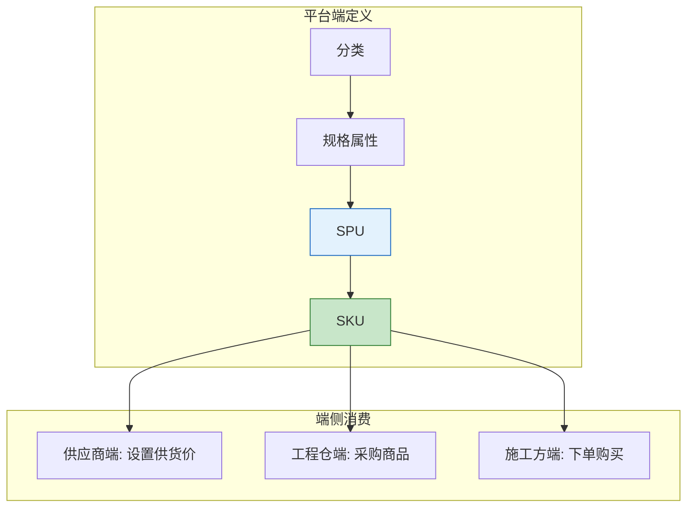
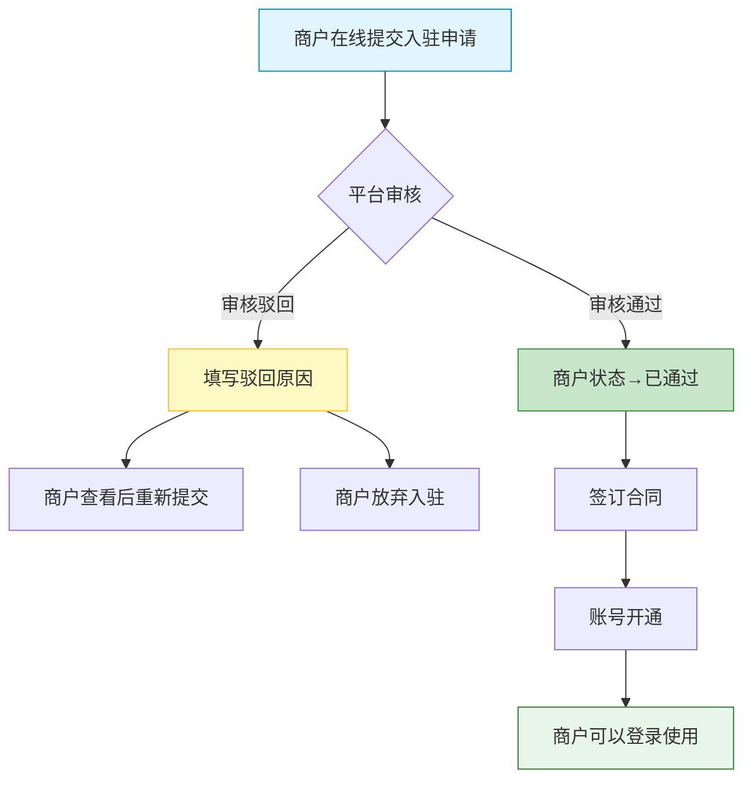
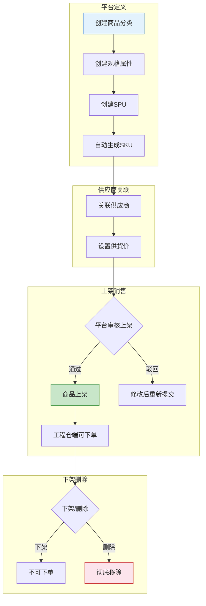
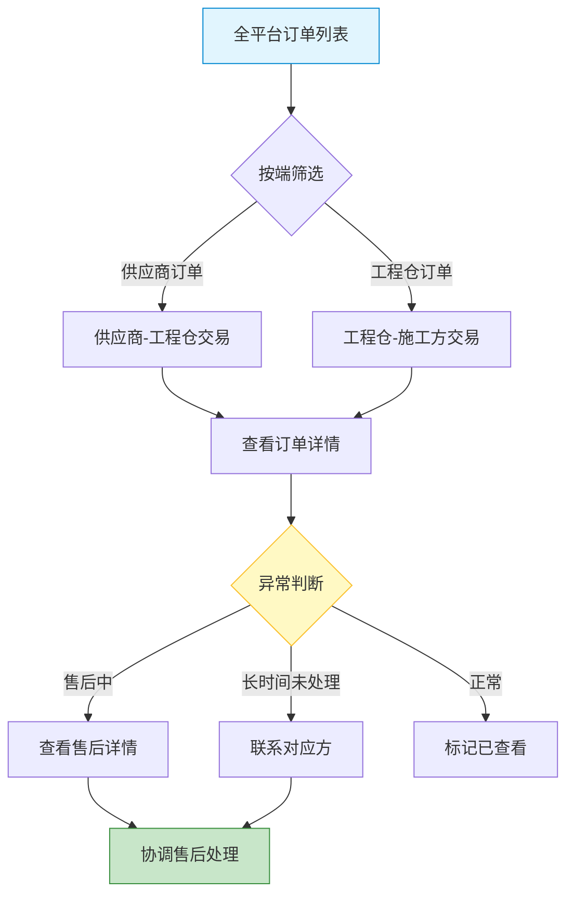
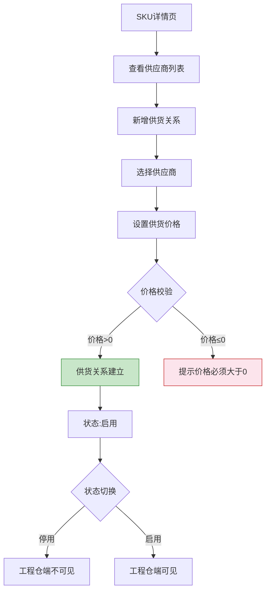

# 平台端 - 产品需求文档

> 版本：v1.0  
> 文档状态：初稿  
> 创建日期：2026-04-24  
> 文档负责人：产品团队  
> 所属模块：平台端 - 全模块  
> 文档类型：SKILL格式PRD（融合文档深度+结构化输出）

## 版本历史

| 版本 | 日期 | 修订内容 |
|:----:|:----:|---------|
| v1.0 | 2026-04-24 | 初始创建，覆盖平台端8大模块、54个功能点的完整PRD框架 |

---

## 零、文档索引

| 章节编号 | 名称 | 内容概要 | 面向角色 |
|:--------:|------|---------|:--------:|
| — | [prd.md](prd.md)（本文） | 总纲：设计原则、术语表、角色权限、54功能全景、核心流程图 | 全局 |
| 01 | [01-系统概览与架构.md](01-系统概览与架构.md) | 系统定位、技术架构、模块树、角色定义 | 全局 |
| 02 | [02-业务流程设计.md](02-业务流程设计.md) | 商户入驻审核/商品全生命周期/订单监控/供货管理流程 | 全局 |
| 04 | [04-领域模型设计.md](04-领域模型设计.md) | 核心领域实体、领域服务、领域事件、DDD分层架构 | 后端 |
| 05 | [05-工作台功能设计.md](05-工作台功能设计.md) | 数据概览看板 | 前后端 |
| 06 | [06-商户管理功能设计.md](06-商户管理功能设计.md) | 商户列表/新增/详情/审核/合同(4P0+3P1) | 前后端 |
| 07 | [07-商品管理功能设计.md](07-商品管理功能设计.md) | 分类/属性/SPU/SKU/价格/审核(10P0+4P1) | 前后端 |
| 08 | [08-商品市场管理功能设计.md](08-商品市场管理功能设计.md) | 供应商品/上下架/销售价/BOM(4P0+4P1+1P2) | 前后端 |
| 09 | [09-订单管理功能设计.md](09-订单管理功能设计.md) | 全量订单查询/详情/追踪/导出(2P0+1P1+1P2) | 前后端 |
| 10 | [10-库存管理功能设计.md](10-库存管理功能设计.md) | 库存总览/仓库/出入库/调拨/盘点(4P1+2P2) | 前后端 |
| 11 | [11-财务中心功能设计.md](11-财务中心功能设计.md) | 支付流水/应收/分账/发票(1P0+4P1+2P2) | 前后端 |
| 12 | [12-系统设置功能设计.md](12-系统设置功能设计.md) | 用户/员工/角色权限/菜单/分账/物流/日志(3P0+3P1+1P2) | 前后端 |
| 13 | [13-页面导航设计.md](13-页面导航设计.md) | 平台端页面导航关系、跳转交互规则 | 前端 |

---

## 一、核心设计原则（Skill：审核管控+数据统一定义）

> 平台端是整个采供一体化平台的**管理中枢**，核心职责是"管"不是"交易"。

### 1.1 审核管控机制

| 审核场景 | 审核对象 | 审核维度 | 审核角色 |
|---------|---------|---------|---------|
| **商户入驻** | 供应商/工程仓/施工方 | 资质真实性、经营范围 | 平台管理员 |
| **商品上架** | 供应商供货商品 | 价格合理性、合规性 | 平台运营 |
| **商品下架/删除** | 已上架商品 | 影响分析、业务必要性 | 平台管理员 |

### 1.2 商品定义统一管理

平台端是整个系统的**商品数据源头**：

### 1.3 数据隔离原则

| 隔离维度 | 策略 | 说明 |
|---------|------|------|
| **商户间数据隔离** | 商户ID字段隔离 | 各端只看到自己的数据 |
| **平台端全量可见** | 跨端查询 | 平台端可查看所有端数据 |
| **操作日志审计** | 所有变更记录日志 | 关键变更需要二次确认 |

### 1.4 三端边界

| 能力维度 | 平台端 | 供应商端 | 工程仓端 |
|---------|:------:|:--------:|:--------:|
| 商品定义（分类/SPU/SKU） | ✅ 定义 | ❌ 消费 | ❌ 消费 |
| 供货价格设置 | ✅ 审核 | ✅ 设置 | ❌ 不可见 |
| 全平台订单监控 | ✅ 查看 | ❌ 仅自己 | ❌ 仅自己 |
| 商户入驻审核 | ✅ 审核 | ❌ 申请 | ❌ 申请 |
| 系统角色权限 | ✅ 全量管理 | ✅ 本端 | ✅ 本端 |

---

## 二、术语表

| 术语 | 说明 |
|------|------|
| **平台端** | 平台运营方的PC管理后台，整个系统的管理中心 |
| **商户** | 平台入驻方，包含供应商、工程仓、施工方三种类型 |
| **分类** | 商品的三级分类体系，平台统一维护 |
| **SPU** | 标准产品单元，平台统一定义的商品最上层 |
| **SKU** | 库存量单位，具体规格商品的最小颗粒度 |
| **供货关系** | 供应商与SKU之间的关联关系，包含供货价格 |
| **BOM** | 物料清单/基装包组合，预定义的套餐商品集合 |
| **审核流** | 商户入驻/商品上架等需要平台审批的流程 |

---

## 三、用户角色与权限矩阵

### 3.1 角色定义

| 角色 | 系统标识 | 核心职责 | 使用端 |
|------|---------|---------|:------:|
| **平台管理员** | admin | 商户管理、系统配置、全平台监控 | PC |
| **平台运营** | operator | 商品管理、商品市场配置、订单监控 | PC |
| **平台财务** | finance | 支付流水、发票管理、分账管理 | PC |
| **平台客服** | service | 订单售后协调、商户服务 | PC |
| **平台超管** | super_admin | 所有权限，不可修改/删除 | PC |

### 3.2 权限矩阵

| 操作/功能 | 管理员 | 运营 | 财务 | 客服 | 超管 |
|-----------|:------:|:----:|:----:|:----:|:----:|
| 工作台看板 | ✅ | ✅ | ✅ | ✅ | ✅ |
| 商户列表查看 | ✅ | ❌ | ❌ | ✅ | ✅ |
| 商户审核 | ✅ | ❌ | ❌ | ❌ | ✅ |
| 商户冻结/解冻 | ✅ | ❌ | ❌ | ❌ | ✅ |
| 商品分类管理 | ✅ | ✅ | ❌ | ❌ | ✅ |
| 商品SPU/SKU管理 | ✅ | ✅ | ❌ | ❌ | ✅ |
| 供货关系管理 | ❌ | ✅ | ❌ | ❌ | ✅ |
| 商品上下架审核 | ❌ | ✅ | ❌ | ❌ | ✅ |
| 全平台订单查看 | ✅ | ✅ | ✅ | ✅ | ✅ |
| 支付流水查看 | ❌ | ❌ | ✅ | ❌ | ✅ |
| 发票管理 | ❌ | ❌ | ✅ | ❌ | ✅ |
| 用户/角色管理 | ✅ | ❌ | ❌ | ❌ | ✅ |
| 系统配置 | ✅ | ❌ | ❌ | ❌ | ✅ |

---

## 四、功能全景（8列CSV格式）

| 所属端 | 模块 | 一级菜单 | 二级菜单 | 核心功能点 | 物理文件 | 优先级 | 备注 |
|-------|------|---------|---------|-----------|---------|:------:|------|
| 平台端 | 工作台 | 工作台 | — | 数据概览看板 | 05-工作台功能设计.md | P1 | 关键指标卡片 |
| 平台端 | 商户管理 | 商户管理 | 商户列表 | 商户列表查询 | 06-商户管理功能设计.md | P0 | 多条件筛选 |
| 平台端 | 商户管理 | 商户管理 | 商户列表 | 新增商户 | 06-商户管理功能设计.md | P0 | 弹窗8字段 |
| 平台端 | 商户管理 | 商户管理 | 商户详情 | 商户详情查看 | 06-商户管理功能设计.md | P0 | 分Tab展示 |
| 平台端 | 商户管理 | 商户管理 | 商户详情 | 商户审核 | 06-商户管理功能设计.md | P0 | 通过/驳回 |
| 平台端 | 商户管理 | 商户管理 | 商户列表 | 商户冻结/解冻 | 06-商户管理功能设计.md | P1 | 封禁后禁登录 |
| 平台端 | 商户管理 | 商户管理 | 合同管理 | 合同列表查询 | 06-商户管理功能设计.md | P1 | 归档管理 |
| 平台端 | 商户管理 | 商户管理 | 合同管理 | 新增合同 | 06-商户管理功能设计.md | P1 | PDF≤10M |
| 平台端 | 商品管理 | 商品中心 | 分类管理 | 分类树管理 | 07-商品管理功能设计.md | P0 | 拖拽排序 |
| 平台端 | 商品管理 | 商品中心 | 属性管理 | 属性组管理 | 07-商品管理功能设计.md | P0 | 弹窗编辑 |
| 平台端 | 商品管理 | 商品中心 | 属性管理 | 属性值管理 | 07-商品管理功能设计.md | P0 | 按组筛选 |
| 平台端 | 商品管理 | 商品中心 | SPU管理 | SPU新增 | 07-商品管理功能设计.md | P0 | 3步骤+预览 |
| 平台端 | 商品管理 | 商品中心 | SPU管理 | SPU详情 | 07-商品管理功能设计.md | P0 | 分卡片展示 |
| 平台端 | 商品管理 | 商品中心 | SKU管理 | SKU列表 | 07-商品管理功能设计.md | P0 | 多条件筛选 |
| 平台端 | 商品管理 | 商品中心 | SKU管理 | SKU详情 | 07-商品管理功能设计.md | P0 | 供应商列表 |
| 平台端 | 商品管理 | 商品中心 | 供货管理 | 供应商供货列表 | 07-商品管理功能设计.md | P0 | 按状态筛选 |
| 平台端 | 商品管理 | 商品中心 | 供货管理 | 设置供货价 | 07-商品管理功能设计.md | P0 | 价格>0校验 |
| 平台端 | 商品管理 | 商品中心 | 供货管理 | 供货状态切换 | 07-商品管理功能设计.md | P0 | 二次确认 |
| 平台端 | 商品管理 | 商品中心 | SPU管理 | SPU列表查询 | 07-商品管理功能设计.md | P1 | 分类/品牌筛选 |
| 平台端 | 商品管理 | 商品中心 | SPU管理 | SPU编辑 | 07-商品管理功能设计.md | P1 | 修改基本信息 |
| 平台端 | 商品管理 | 商品中心 | SKU管理 | SKU编辑 | 07-商品管理功能设计.md | P1 | 价格变更历史 |
| 平台端 | 商品管理 | 商品中心 | 商品管理 | 批量上下架 | 07-商品管理功能设计.md | P1 | 进度条汇总 |
| 平台端 | 商品市场 | 商品市场 | 供应商品 | 供应商品列表 | 08-商品市场管理功能设计.md | P0 | 多条件筛选 |
| 平台端 | 商品市场 | 商品市场 | 供应商品 | 商品上下架 | 08-商品市场管理功能设计.md | P0 | 批量/单行 |
| 平台端 | 商品市场 | 商品市场 | 销售商品 | 销售商品列表 | 08-商品市场管理功能设计.md | P0 | 仓库联动 |
| 平台端 | 商品市场 | 商品市场 | 销售商品 | 销售价格设置 | 08-商品市场管理功能设计.md | P0 | 价格>0校验 |
| 平台端 | 商品市场 | 商品市场 | BOM管理 | BOM列表 | 08-商品市场管理功能设计.md | P1 | 套餐组合 |
| 平台端 | 商品市场 | 商品市场 | BOM管理 | 创建BOM | 08-商品市场管理功能设计.md | P1 | 多步骤 |
| 平台端 | 商品市场 | 商品市场 | BOM管理 | BOM详情 | 08-商品市场管理功能设计.md | P1 | 商品明细 |
| 平台端 | 商品市场 | 商品市场 | 价格管理 | 价格管理列表 | 08-商品市场管理功能设计.md | P1 | 异常标红 |
| 平台端 | 商品市场 | 商品市场 | BOM管理 | BOM编辑 | 08-商品市场管理功能设计.md | P2 | 编辑BOM |
| 平台端 | 订单管理 | 订单管理 | 订单列表 | 全量订单查询 | 09-订单管理功能设计.md | P0 | Tab+高级筛选 |
| 平台端 | 订单管理 | 订单管理 | 订单详情 | 订单详情 | 09-订单管理功能设计.md | P0 | 时间线 |
| 平台端 | 订单管理 | 订单管理 | 订单详情 | 订单状态追踪 | 09-订单管理功能设计.md | P1 | 节点日志 |
| 平台端 | 订单管理 | 订单管理 | 订单列表 | 订单导出 | 09-订单管理功能设计.md | P2 | 分批提示 |
| 平台端 | 库存管理 | 库存管理 | 库存总览 | 库存总览 | 10-库存管理功能设计.md | P1 | 图表展示 |
| 平台端 | 库存管理 | 库存管理 | 仓库管理 | 仓库列表 | 10-库存管理功能设计.md | P1 | 全平台 |
| 平台端 | 库存管理 | 库存管理 | 仓库管理 | 仓库详情 | 10-库存管理功能设计.md | P1 | 库存标红 |
| 平台端 | 库存管理 | 库存管理 | 出入库 | 出入库流水 | 10-库存管理功能设计.md | P1 | 类型标签 |
| 平台端 | 库存管理 | 库存管理 | 调拨 | 调拨管理 | 10-库存管理功能设计.md | P2 | 跨仓库 |
| 平台端 | 库存管理 | 库存管理 | 盘点 | 盘点管理 | 10-库存管理功能设计.md | P2 | 盘点单 |
| 平台端 | 财务中心 | 财务中心 | 支付流水 | 支付流水 | 11-财务中心功能设计.md | P0 | 汇总+导出 |
| 平台端 | 财务中心 | 财务中心 | 应收管理 | 应收记录 | 11-财务中心功能设计.md | P1 | 应收账款 |
| 平台端 | 财务中心 | 财务中心 | 分账 | 分账列表 | 11-财务中心功能设计.md | P1 | 分账记录 |
| 平台端 | 财务中心 | 财务中心 | 进项发票 | 进项发票列表 | 11-财务中心功能设计.md | P1 | 进项发票 |
| 平台端 | 财务中心 | 财务中心 | 销项发票 | 销项发票列表 | 11-财务中心功能设计.md | P1 | 销项发票 |
| 平台端 | 财务中心 | 财务中心 | 发票 | 发票上传 | 11-财务中心功能设计.md | P2 | 附件上传 |
| 平台端 | 财务中心 | 财务中心 | 发票 | 发票关联订单 | 11-财务中心功能设计.md | P2 | 关联操作 |
| 平台端 | 系统设置 | 系统设置 | 用户管理 | 用户列表 | 12-系统设置功能设计.md | P0 | 启用/禁用 |
| 平台端 | 系统设置 | 系统设置 | 员工管理 | 员工列表 | 12-系统设置功能设计.md | P0 | 部门树 |
| 平台端 | 系统设置 | 系统设置 | 角色管理 | 角色管理+权限配置 | 12-系统设置功能设计.md | P0 | 树形勾选 |
| 平台端 | 系统设置 | 系统设置 | 菜单管理 | 菜单管理 | 12-系统设置功能设计.md | P1 | 拖拽排序 |
| 平台端 | 系统设置 | 系统设置 | 分账配置 | 分账配置 | 12-系统设置功能设计.md | P1 | 费率配置 |
| 平台端 | 系统设置 | 系统设置 | 物流配置 | 物流配置 | 12-系统设置功能设计.md | P1 | 物流公司 |
| 平台端 | 系统设置 | 系统设置 | 日志审计 | 操作日志 | 12-系统设置功能设计.md | P2 | 全量审计 |

---

## 五、核心业务流程图（全景）

### 5.1 商户入驻审核流程

### 5.2 商品全生命周期管理流程

### 5.3 全平台订单监控流程

### 5.4 供应商供货管理流程

---

## 六、全局交互规范

### 6.1 页面加载

| 场景 | 处理方式 | 示意 |
|-----|---------|------|
| 首次加载 | 全页Loading Skeleton | 灰色骨架屏脉冲动画 |
| 列表加载 | 底部滚动loading指示器 | 旋转loading+文字"加载中..." |
| 局部刷新 | 仅更新区域，不做全页刷新 | 区域遮罩+spin |

### 6.2 空状态

| 场景 | 处理方式 | 提示文案 |
|-----|---------|---------|
| 列表无数据 | 居中空状态插画+文字 | "暂无{数据名称}" |
| 搜索无结果 | 空状态+搜索建议 | "未找到'{关键词}'相关结果" |
| 功能未开放 | 提示入口 | "该功能即将开放，敬请期待" |

### 6.3 错误处理

| 异常场景 | UI表现 | 用户操作 |
|---------|-------|---------|
| 网络异常 | Toast提示"网络异常，请检查网络连接" | 自动重试3次后提示手动刷新 |
| 请求超时 | 区域重试按钮 | 点击重试 |
| 服务端错误 | 页面顶部通知条 | 刷新页面或联系管理员 |
| 无权限访问 | 页面级提示 | "您暂无该功能权限，请联系管理员" |

### 6.4 操作反馈

| 操作类型 | 反馈方式 | 说明 |
|---------|---------|------|
| 保存/提交 | Toast "操作成功" / "操作失败：{原因}" | 2秒自动消失 |
| 删除 | Modal二次确认（黄色警告）+ Toast | "确认删除{名称}？" |
| 批量操作 | 操作完成后Toast汇总结果 | "成功N条，失败M条" |
| 审核操作 | Modal详情展示+确认 | 驳回时必须填写原因 |

