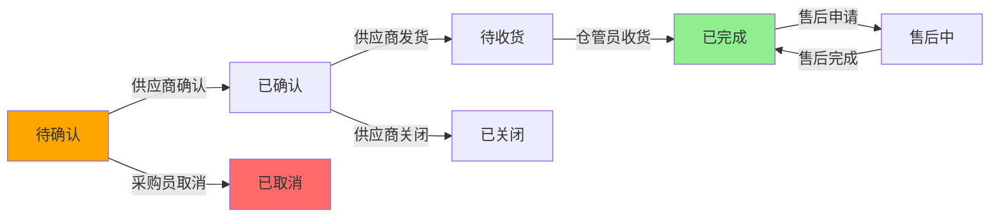
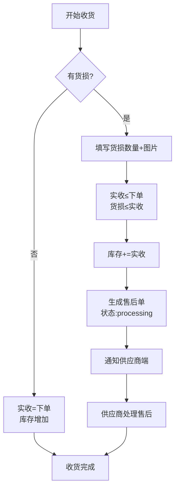
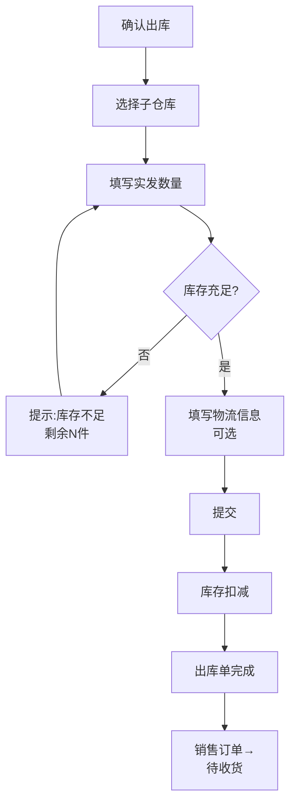

# 工程仓端 - 产品需求文档（Skill PRD格式）

> 版本：v1.0  
> 文档状态：初稿  
> 创建日期：2026-04-24  
> 文档负责人：产品团队  
> 所属模块：工程仓端 - 全模块  
> 文档类型：SKILL格式PRD（融合文档深度+结构化输出）

## 版本历史

| 版本 | 日期 | 修订人 | 修订内容 |
|-----|------|-------|---------|
| v1.0 | 2026-04-24 | 产品团队 | 初始创建，按Skill PRD格式输出全部51个功能 |
| v1.1 | 2026-04-24 | 产品团队 | 各模块追加状态×操作×角色矩阵、错误提示汇总；新增14-页面导航设计.md（页面索引、导航图、交互规则）；prd.md新增全局交互规范 |

---

## 零、文档索引

| 章节编号 | 名称 | 内容概要 | 面向角色 |
|:--------:|------|---------|:--------:|
| — | [prd.md](prd.md) （本文） | 总纲：设计原则、术语表、角色权限、51功能全景、45条PrdPanel、流程图、四端边界 | 全局 |
| 01 | [01-系统概览与架构.md](01-系统概览与架构.md) | 系统定位、技术架构、模块树、角色定义 | 全局 |
| 02 | [02-业务流程设计.md](02-业务流程设计.md) | 10张流程图：双交易链路、出入库、售后、发票 | 全局 |
| 04 | [04-领域模型设计.md](04-领域模型设计.md) | 10实体、11服务、7事件、DDD分层架构 | 后端 |
| 05 | [05-工作台与商户中心功能设计.md](05-工作台与商户中心功能设计.md) | 看板、商户信息、合同管理 | 前后端 |
| 06 | [06-商品市场功能设计.md](06-商品市场功能设计.md) | 商品浏览、详情、购物车、结算 | 前后端 |
| 07 | [07-采购计划功能设计.md](07-采购计划功能设计.md) | 列表、新建、详情、转订单 | 前后端 |
| 08 | [08-商品中心功能设计.md](08-商品中心功能设计.md) | 库存商品、SPU、SKU及其库存 | 前后端 |
| 09 | [09-采购订单管理功能设计.md](09-采购订单管理功能设计.md) | 列表、详情、取消、收货、新建 | 前后端 |
| 10 | [10-销售订单管理功能设计.md](10-销售订单管理功能设计.md) | 列表、详情、确认、发货、导出 | 前后端 |
| 11 | [11-仓库管理功能设计.md](11-仓库管理功能设计.md) | 入库、出库、仓库配置、盘点、调拨 | 前后端 |
| 12 | [12-财务中心功能设计.md](12-财务中心功能设计.md) | 支付流水、进项/销项发票、对账 | 前后端 |
| 13 | [13-系统设置功能设计.md](13-系统设置功能设计.md) | 账号、员工、角色、权限配置 | 前后端 |
| 14 | [14-页面导航设计.md](14-页面导航设计.md) | 44个页面索引、6张导航关系图、跳转交互规则 | 前端 |

---

## 一、核心设计原则（Skill：三状态分离）

> 这是本系统所有订单相关的**灵魂设计原则**，贯穿所有模块。

### 1.1 三状态独立运行

| 状态轨道 | 状态值 | 核心规则 | 说明 |
|---------|-------|---------|------|
| **订单主状态** | pending → confirmed → shipped → completed / cancelled | 订单的履约语义，**不依赖支付** | 订单生命周期主干 |
| **支付状态** | unpaid → paid → refunded | 只做**标记记录**，不做强校验 | 线下转账场景适配 |
| **发货状态** | pending → partial → shipped | **不管付没付钱都能发货** | 熟人生意核心特征 |

```mermaid
graph TB
    subgraph 订单状态（三轨道独立运行）
        O[订单主状态] -->|独立| P[支付状态]
        O -->|独立| S[发货状态]
    end
    
    P -->|线下转账凭证记录| F[工程仓付给供应商]
    S -->|不用等支付确认| D[先发货后付款]
    
    style P fill:#f9f,stroke:#333
    style S fill:#9cf,stroke:#333
    style F fill:#f96,stroke:#333
    style D fill:#6f9,stroke:#333
```

### 1.2 错误校验规则（Skill：黄金准则）

```typescript
// ❌ 绝对禁止 - 支付状态强校验
if (order.order_status === 'confirmed' && order.payment_status === 'paid') {
  canShip = true // 千万不要这样！
}

// ✅ 正确写法 - 三状态独立判断
const canShip = computed(() => {
  return order.order_status === 'confirmed' 
      && order.ship_status !== 'shipped'
      && order.ship_status !== 'partial'
})
```

### 1.3 线下生意真相

> 工程仓说"先发货，钱下午转"，供应商就直接发了  
> 系统**不做强校验**，只做**状态记录**！  
> 货损售后也是电话沟通为主，系统做凭证+流程记录。

---

## 二、术语表

| 术语 | 说明 |
|------|------|
| **工程仓** | 建筑工程项目仓库管理方，平台核心采购方和销售方（双重角色） |
| **采购订单** | 工程仓→供应商的采购单据（链路一） |
| **销售订单** | 施工方→工程仓的采购单据（链路二） |
| **SPU** | 标准产品单元，商品定义最上层 |
| **SKU** | 库存量单位，具体规格商品最小颗粒度 |
| **子仓库** | 工程仓下可管理多个物理仓库 |
| **货损** | 货物在运输/收货过程中发生的损坏 |
| **入库单** | 采购订单到货后验收入库的凭证单据 |
| **出库单** | 销售订单发货出库的凭证单据 |
| **采购计划** | 工程仓班组长/采购员提报的采购需求计划 |
| **BOM** | 物料清单，基装包组合 |

---

## 三、用户角色与权限矩阵

### 3.1 角色定义

| 角色 | 系统标识 | 核心职责 | 使用端 |
|------|---------|---------|--------|
| **采购员** | purchaser | 浏览商品、购物车、下单采购、采购计划 | PC |
| **仓管员** | storekeeper | 入库收货（含货损记录）、出库发货、库存查看 | PC |
| **主管/管理员** | admin | 数据看板、订单监控、员工/账号权限管理 | PC |
| **财务人员** | finance | 支付记录、发票管理、对账管理 | PC |
| **销售** | seller | 销售订单处理、确认发货 | PC |

### 3.2 权限矩阵

| 操作/功能 | 采购员 | 仓管员 | 主管 | 财务 | 销售 |
|-----------|:------:|:------:|:----:|:----:|:----:|
| 工作台看板 | ✅ | ✅ | ✅ | ❌ | ❌ |
| 主体信息查看 | ✅ | ✅ | ✅ | ✅ | ✅ |
| 主体信息编辑 | ❌ | ❌ | ✅ | ❌ | ❌ |
| 合同列表查看 | ❌ | ❌ | ✅ | ✅ | ❌ |
| 商品市场浏览 | ✅ | ❌ | ✅ | ❌ | ❌ |
| 加入购物车 | ✅ | ❌ | ✅ | ❌ | ❌ |
| 创建采购订单 | ✅ | ❌ | ✅ | ❌ | ❌ |
| 取消采购订单 | ✅ | ❌ | ✅ | ❌ | ❌ |
| 商品中心查看 | ✅ | ✅ | ✅ | ❌ | ❌ |
| 入库收货 | ❌ | ✅ | ✅ | ❌ | ❌ |
| 确认出库 | ❌ | ✅ | ❌ | ❌ | ✅ |
| 确认销售订单 | ❌ | ❌ | ❌ | ❌ | ✅ |
| 支付流水查看 | ❌ | ❌ | ✅ | ✅ | ❌ |
| 发票管理 | ❌ | ❌ | ✅ | ✅ | ❌ |
| 员工/角色管理 | ❌ | ❌ | ✅ | ❌ | ❌ |

---

## 四、功能全景（Skill：8列CSV格式）

| 所属端 | 模块 | 一级菜单 | 二级菜单 | 核心功能点 | 物理文件 | 优先级 | 备注 |
|-------|------|---------|---------|-----------|---------|:------:|------|
| 工程仓端 | 工作台 | 工作台 | - | 数据概览看板 | 01-系统概览与架构.md | P1 | 关键指标卡片 |
| 工程仓端 | 商户管理 | 商户中心 | 主体信息 | 主体信息查看 | 05-工作台与商户中心.md | P1 | 敏感信息脱敏 |
| 工程仓端 | 商户管理 | 商户中心 | 主体信息 | 主体信息编辑 | 05-工作台与商户中心.md | P1 | 仅主管可操作 |
| 工程仓端 | 商户管理 | 商户中心 | 合同管理 | 合同列表查看 | 05-工作台与商户中心.md | P2 | 生效/过期筛选 |
| 工程仓端 | 商品市场 | 商品市场 | 商品浏览 | 商品浏览/搜索/分类筛选 | 06-商品市场功能设计.md | P0 | 分类+关键词+价格 |
| 工程仓端 | 商品市场 | 商品市场 | 商品详情 | 商品详情查看 | 06-商品市场功能设计.md | P0 | 图片轮播/规格/价格 |
| 工程仓端 | 商品市场 | 商品市场 | 商品详情 | 加入购物车 | 06-商品市场功能设计.md | P0 | 库存校验 |
| 工程仓端 | 商品市场 | 商品市场 | 购物车 | 购物车管理 | 06-商品市场功能设计.md | P0 | 增删改+全选 |
| 工程仓端 | 商品市场 | 商品市场 | 结算 | 结算下单 | 06-商品市场功能设计.md | P0 | 从购物车到订单 |
| 工程仓端 | 商品市场 | 商品市场 | 确认订单 | 确认订单 | 06-商品市场功能设计.md | P0 | 最终提交 |
| 工程仓端 | 采购计划 | 采购计划 | 列表 | 采购计划列表 | 07-采购计划功能设计.md | P1 | 状态Tab+时间筛选 |
| 工程仓端 | 采购计划 | 采购计划 | 新建 | 新建采购计划 | 07-采购计划功能设计.md | P1 | 多步选择商品 |
| 工程仓端 | 采购计划 | 采购计划 | 详情 | 采购计划详情 | 07-采购计划功能设计.md | P1 | 基本信息+商品明细 |
| 工程仓端 | 采购计划 | 采购计划 | 操作 | 计划转订单 | 07-采购计划功能设计.md | P2 | 一键转正式订单 |
| 工程仓端 | 商品中心 | 商品中心 | 库存商品 | 库存商品列表 | 08-商品中心功能设计.md | P0 | 按仓库/分类筛选 |
| 工程仓端 | 商品中心 | 商品中心 | 库存商品 | 按仓库筛选 | 08-商品中心功能设计.md | P0 | 子仓库下拉筛选 |
| 工程仓端 | 商品中心 | 商品中心 | SPU详情 | SPU详情查看 | 08-商品中心功能设计.md | P1 | 名称/品牌/分类/规格 |
| 工程仓端 | 商品中心 | 商品中心 | SKU详情 | SKU库存详情 | 08-商品中心功能设计.md | P0 | 库存分布+批次+流水 |
| 工程仓端 | 采购订单 | 订单管理 | 采购订单 | 采购订单列表 | 09-采购订单管理功能设计.md | P0 | 多状态Tab+筛选 |
| 工程仓端 | 采购订单 | 订单管理 | 采购订单 | 采购订单详情 | 09-采购订单管理功能设计.md | P0 | 订单信息+明细+操作 |
| 工程仓端 | 采购订单 | 订单管理 | 采购订单 | 取消采购订单 | 09-采购订单管理功能设计.md | P0 | 取消原因+通知供应商 |
| 工程仓端 | 采购订单 | 订单管理 | 采购订单 | 订单收货 | 09-采购订单管理功能设计.md | P0 | 同入库管理-开始收货 |
| 工程仓端 | 采购订单 | 订单管理 | 采购订单 | 新建采购订单 | 09-采购订单管理功能设计.md | P1 | 手动创建（非购物车） |
| 工程仓端 | 销售订单 | 订单管理 | 销售订单 | 销售订单列表 | 10-销售订单管理功能设计.md | P0 | 待确认/待发货/已完成 |
| 工程仓端 | 销售订单 | 订单管理 | 销售订单 | 销售订单详情 | 10-销售订单管理功能设计.md | P0 | 施工方信息+商品明细 |
| 工程仓端 | 销售订单 | 订单管理 | 销售订单 | 确认销售订单 | 10-销售订单管理功能设计.md | P0 | 确认后出库 |
| 工程仓端 | 销售订单 | 订单管理 | 销售订单 | 销售订单发货 | 10-销售订单管理功能设计.md | P1 | 选仓库+物流信息 |
| 工程仓端 | 销售订单 | 订单管理 | 销售订单 | 收货批次列表 | 10-销售订单管理功能设计.md | P1 | 批次记录 |
| 工程仓端 | 销售订单 | 订单管理 | 销售订单 | 订单导出 | 10-销售订单管理功能设计.md | P2 | Excel导出 |
| 工程仓端 | 仓库管理 | 仓库管理 | 入库管理 | 入库单列表 | 11-仓库管理功能设计.md | P0 | 待收货/已完成 |
| 工程仓端 | 仓库管理 | 仓库管理 | 入库管理 | 批次详情 | 11-仓库管理功能设计.md | P0 | 批次聚合展示 |
| 工程仓端 | 仓库管理 | 仓库管理 | 入库管理 | 开始收货 | 11-仓库管理功能设计.md | P0 | 实收+货损+图片 |
| 工程仓端 | 仓库管理 | 仓库管理 | 入库管理 | 货损记录 | 11-仓库管理功能设计.md | P0 | 售后关联 |
| 工程仓端 | 仓库管理 | 仓库管理 | 出库管理 | 出库单列表 | 11-仓库管理功能设计.md | P0 | 待出库/已完成 |
| 工程仓端 | 仓库管理 | 仓库管理 | 出库管理 | 确认出库 | 11-仓库管理功能设计.md | P0 | 库存校验+物流 |
| 工程仓端 | 仓库管理 | 仓库管理 | 仓库配置 | 仓库列表 | 11-仓库管理功能设计.md | P1 | 子仓库概况 |
| 工程仓端 | 仓库管理 | 仓库管理 | 仓库配置 | 仓库详情 | 11-仓库管理功能设计.md | P1 | 仓库信息+库存商品 |
| 工程仓端 | 仓库管理 | 仓库管理 | 打印 | 打印单据 | 11-仓库管理功能设计.md | P2 | 入库单/出库单打印 |
| 工程仓端 | 仓库管理 | 仓库管理 | 盘点 | 库存盘点列表 | 11-仓库管理功能设计.md | P2 | 盘点记录 |
| 工程仓端 | 仓库管理 | 仓库管理 | 盘点 | 创建盘点单 | 11-仓库管理功能设计.md | P2 | 全仓/指定分类 |
| 工程仓端 | 仓库管理 | 仓库管理 | 调拨 | 库存调拨 | 11-仓库管理功能设计.md | P2 | 子仓库间调拨 |
| 工程仓端 | 财务中心 | 财务管理 | 支付流水 | 支付流水 | 12-财务中心功能设计.md | P0 | 收支记录 |
| 工程仓端 | 财务中心 | 财务管理 | 进项发票 | 进项发票列表 | 12-财务中心功能设计.md | P1 | 待认证/已认证 |
| 工程仓端 | 财务中心 | 财务管理 | 进项发票 | 进项发票上传 | 12-财务中心功能设计.md | P1 | 文件上传+OCR |
| 工程仓端 | 财务中心 | 财务管理 | 销项发票 | 销项发票列表 | 12-财务中心功能设计.md | P1 | 待开/已开 |
| 工程仓端 | 财务中心 | 财务管理 | 对账 | 对账单列表 | 12-财务中心功能设计.md | P2 | 供应商+施工方对账 |
| 工程仓端 | 系统设置 | 系统设置 | 账号管理 | 账号列表 | 13-系统设置功能设计.md | P1 | 启用/停用 |
| 工程仓端 | 系统设置 | 系统设置 | 员工管理 | 员工管理 | 13-系统设置功能设计.md | P1 | 新增/编辑/离职 |
| 工程仓端 | 系统设置 | 系统设置 | 角色管理 | 角色列表 | 13-系统设置功能设计.md | P1 | 编辑/删除 |
| 工程仓端 | 系统设置 | 系统设置 | 角色管理 | 角色权限配置 | 13-系统设置功能设计.md | P1 | 权限树 |

> **合计：51个功能点 | P0: 22个 | P1: 18个 | P2: 11个**

---

## 五、页面级PRD（Skill：PrdPanel数据库格式）

```typescript
const prdDatabase = {
  // ========== 工作台 ==========
  '/dashboard': {
    name: '工作台',
    items: [
      { 
        reqId: 'WH-001', 
        moduleName: '数据概览', 
        priority: 'P1',
        content: `关键指标卡片展示：
- 今日订单数、采购总金额、待收货数、库存预警数
- 时间范围选择（今日/本周/本月）
- 预警数字红色标红`
      }
    ]
  },

  // ========== 商户中心 ==========
  '/merchant/profile': {
    name: '主体信息',
    items: [
      { 
        reqId: 'WH-002', 
        moduleName: '信息查看', 
        priority: 'P1',
        content: `展示主体信息（主体名称、信用代码、法人、联系人）
敏感信息（手机号）中间4位脱敏
所有角色可见`
      },
      { 
        reqId: 'WH-003', 
        moduleName: '信息编辑', 
        priority: 'P1',
        content: `编辑联系人、联系电话、地址、营业执照图片
字段实时校验，仅主管角色可操作
提交后更新记录并写入修改日志`
      }
    ]
  },
  '/merchant/contracts': {
    name: '合同列表',
    items: [
      { 
        reqId: 'WH-004', 
        moduleName: '合同查看', 
        priority: 'P2',
        content: `状态Tab（生效/已过期）+ 时间范围筛选
分页列表展示，主管/财务可见`
      }
    ]
  },

  // ========== 商品市场 ==========
  '/market': {
    name: '商品市场',
    items: [
      {
        reqId: 'WH-005',
        moduleName: '商品浏览/搜索',
        priority: 'P0',
        content: `分类Tab切换 + 关键词搜索 + 价格区间过滤 + 排序
商品卡片展示（图片/名称/规格/供货价/库存）
滚动加载更多+下拉刷新
采购员/主管可见`
      },
      {
        reqId: 'WH-006',
        moduleName: '商品详情',
        priority: 'P0',
        content: `图片轮播、名称、规格属性、供货价、库存、供应商信息
已下架→提示"已下架"`
      },
      {
        reqId: 'WH-007',
        moduleName: '加入购物车',
        priority: 'P0',
        content: `点击加入→数量选择器→校验库存→调用添加接口→toast"已加入"
购物车角标+1，库存不足提示`
      },
      {
        reqId: 'WH-008',
        moduleName: '购物车管理',
        priority: 'P0',
        content: `商品列表+数量加减+选中状态+合计金额
左滑删除+二次确认，实时重算总价
已下架商品置灰不可选`
      },
      {
        reqId: 'WH-009',
        moduleName: '结算下单',
        priority: 'P0',
        content: `选中商品→创建临时订单→商品明细/供应商/合计金额/备注
必须勾选"同意采购协议"
校验库存→创建订单→清空购物车→跳转详情`
      }
    ]
  },

  // ========== 采购订单 ==========
  '/order/purchase': {
    name: '采购订单列表',
    items: [
      {
        reqId: 'WH-015',
        moduleName: '采购订单列表',
        priority: 'P0',
        content: `多状态Tab：全部/待确认/已确认/已完成/已取消
订单卡片同时展示4个状态标签（订单主状态+支付+发货+售后）
时间范围+订单号+供应商名称筛选
每页20条滚动加载，超过3个月查询提示`
      },
      {
        reqId: 'WH-016',
        moduleName: '采购订单详情',
        priority: 'P0',
        content: `订单信息/供应商信息/商品明细/支付凭证/操作日志
状态决定操作按钮：待确认→可取消；待收货→可收货`
      },
      {
        reqId: 'WH-017',
        moduleName: '取消订单',
        priority: 'P0',
        content: `仅"待确认"状态可取消
选择取消原因→提交→通知供应商端
已支付：弹强提示二次确认`
      },
      {
        reqId: 'WH-018',
        moduleName: '订单收货',
        priority: 'P0',
        content: `同入库管理-开始收货
选择子仓库→实收数量→货损处理→提交→库存增加`
      }
    ]
  },
  '/order/purchase/create': {
    name: '新建采购订单',
    items: [
      {
        reqId: 'WH-019',
        moduleName: '新建采购订单',
        priority: 'P1',
        content: `手动创建（非购物车流程）
选择供应商→搜索选择商品→设置收货仓库→填写备注
供应商切换→清空已选商品
提交→采购订单创建（状态→待确认）`
      }
    ]
  },

  // ========== 销售订单 ==========
  '/order/sale': {
    name: '销售订单列表',
    items: [
      {
        reqId: 'WH-020',
        moduleName: '销售订单列表',
        priority: 'P0',
        content: `状态Tab：待确认/待发货/待收货/已完成
时间范围+订单号+施工方名称筛选
销售/仓管员/主管可见`
      },
      {
        reqId: 'WH-021',
        moduleName: '销售订单详情',
        priority: 'P0',
        content: `订单信息/施工方信息/商品明细/操作日志
状态决定操作：待确认→确认/取消；待发货→发货`
      },
      {
        reqId: 'WH-022',
        moduleName: '确认销售订单',
        priority: 'P0',
        content: `施工方提交→工程仓确认
二次确认弹窗→订单confirmed→生成出库单`
      },
      {
        reqId: 'WH-023',
        moduleName: '销售订单发货',
        priority: 'P1',
        content: `选择出库仓库→确认各SKU出库数量→物流公司/单号
库存扣减→出库单完成→订单→"待收货"
物流非必填（适配自提场景）`
      }
    ]
  },

  // ========== 仓库管理 ==========
  '/warehouse/inbound': {
    name: '入库管理',
    items: [
      {
        reqId: 'WH-025',
        moduleName: '入库单列表',
        priority: 'P0',
        content: `状态Tab：待收货/已完成
入库单号+来源订单号筛选
待收货→「开始收货」按钮`
      },
      {
        reqId: 'WH-026',
        moduleName: '开始收货',
        priority: 'P0',
        content: `选择子仓库→实收数量（≤下单数量）→货损处理
货损：数量≤实收+图片上传（最多5张）+说明
提交→订单completed→库存增加→生成入库批次
有货损→生成售后单→触发供应商售后提醒`
      },
      {
        reqId: 'WH-027',
        moduleName: '批次详情',
        priority: 'P0',
        content: `按批次聚合展示：批次编号/收货时间/子仓库/商品明细
实收数量/货损数量/验收人/备注`
      },
      {
        reqId: 'WH-028',
        moduleName: '货损记录',
        priority: 'P0',
        content: `货损数量>0→生成售后单
展示：货损SKU/数量/图片/说明/提交时间/处理结果`
      }
    ]
  },
  '/warehouse/outbound': {
    name: '出库管理',
    items: [
      {
        reqId: 'WH-029',
        moduleName: '出库单列表',
        priority: 'P0',
        content: `状态Tab：待出库/已完成
出库单号+关联订单号筛选`
      },
      {
        reqId: 'WH-030',
        moduleName: '确认出库',
        priority: 'P0',
        content: `选择出库仓库→实发数量（≤库存）→物流公司/单号
库存充足校验→提交→库存扣减→出库记录生成
物流非必填（适配自提）`
      }
    ]
  },
  '/warehouse/list': {
    name: '仓库列表',
    items: [
      {
        reqId: 'WH-031',
        moduleName: '仓库列表',
        priority: 'P1',
        content: `表格展示所有子仓库
名称/地址/仓管员/商品种类数/操作按钮`
      },
      {
        reqId: 'WH-032',
        moduleName: '仓库详情',
        priority: 'P1',
        content: `仓库信息 + 该仓库库存商品列表`
      }
    ]
  },
  '/warehouse/print': {
    name: '打印单据',
    items: [
      {
        reqId: 'WH-033',
        moduleName: '打印单据',
        priority: 'P2',
        content: `入库单/出库单打印预览
模板：单号/日期/商品明细/数量/签收人`
      }
    ]
  },
  '/warehouse/check': {
    name: '库存盘点',
    items: [
      {
        reqId: 'WH-034',
        moduleName: '盘点列表',
        priority: 'P2',
        content: `盘点记录：盘点单号/时间/仓库/盘点人/盈亏商品数/状态`
      },
      {
        reqId: 'WH-035',
        moduleName: '创建盘点单',
        priority: 'P2',
        content: `选择仓库→盘点范围（全仓/指定分类）→备注
生成盘点商品列表→填写实际库存→系统计算差异`
      }
    ]
  },
  '/warehouse/transfer': {
    name: '库存调拨',
    items: [
      {
        reqId: 'WH-036',
        moduleName: '库存调拨',
        priority: 'P2',
        content: `调出仓库→调入仓库（≠调出）→调拨商品→调拨数量
调出→扣减；调入→增加（需入库确认）`
      }
    ]
  },

  // ========== 财务中心 ==========
  '/finance/payments': {
    name: '支付流水',
    items: [
      {
        reqId: 'WH-037',
        moduleName: '支付流水',
        priority: 'P0',
        content: `流水号/关联订单号/金额/收支类型/发生时间/支付方式
支持上传支付凭证→生成支付流水+关联订单`
      }
    ]
  },
  '/finance/invoice-in': {
    name: '进项发票',
    items: [
      {
        reqId: 'WH-038',
        moduleName: '进项发票列表',
        priority: 'P1',
        content: `状态Tab：待认证/已认证/已作废
发票号码搜索+时间范围`
      },
      {
        reqId: 'WH-039',
        moduleName: '进项发票上传',
        priority: 'P1',
        content: `上传发票文件（jpg/png/pdf, ≤10M）
填写发票号码/关联订单号/发票金额
支持多张同时上传`
      }
    ]
  },
  '/finance/invoice-out': {
    name: '销项发票',
    items: [
      {
        reqId: 'WH-040',
        moduleName: '销项发票列表',
        priority: 'P1',
        content: `状态Tab：待开/已开
已开票→显示发票号码/金额/时间`
      }
    ]
  },
  '/finance/reconciliation': {
    name: '对账管理',
    items: [
      {
        reqId: 'WH-041',
        moduleName: '对账单列表',
        priority: 'P2',
        content: `对账对象（供应商/施工方）+ 时间范围
生成对账单→自动汇总→导出Excel
对方确认→"已确认"`
      }
    ]
  },

  // ========== 系统设置 ==========
  '/settings/accounts': {
    name: '账号管理',
    items: [
      {
        reqId: 'WH-042',
        moduleName: '账号列表',
        priority: 'P1',
        content: `账号/姓名/手机号/邮箱/角色/最近登录时间/状态
新建账号→发送初始密码
账号可启用/停用`
      }
    ]
  },
  '/settings/employees': {
    name: '员工管理',
    items: [
      {
        reqId: 'WH-043',
        moduleName: '员工管理',
        priority: 'P1',
        content: `姓名/部门/岗位/手机号/入职时间/状态
可新增/编辑/离职员工
离职→关联账号停用`
      }
    ]
  },
  '/settings/roles': {
    name: '角色管理',
    items: [
      {
        reqId: 'WH-044',
        moduleName: '角色列表',
        priority: 'P1',
        content: `角色名称/描述/成员数/操作（编辑/删除）
默认角色不可删除`
      },
      {
        reqId: 'WH-045',
        moduleName: '角色权限配置',
        priority: 'P1',
        content: `权限树：模块→子功能→操作
勾选保存→该角色下所有用户即时生效`
      }
    ]
  }
}
```

---

## 六、核心业务流程图（Skill：Mermaid）

### 6.1 工程仓双交易链路

```mermaid
graph TB
    subgraph 链路一：工程仓采购（工程仓→供应商）
        A[采购员浏览商品市场] --> B[加入购物车]
        B --> C[结算下单]
        C --> D[创建采购订单<br>状态:待确认]
        D --> E[供应商确认<br>状态:已确认]
        E --> F[供应商发货<br>状态:待收货]
        F --> G[仓管员收货<br>入库+批次]
        G --> H[订单完成<br>状态:已完成]
    end

    subgraph 链路二：施工方采购（施工方→工程仓）
        I[施工方提交销售订单] --> J[工程仓确认订单<br>状态:已确认]
        J --> K[生成出库单]
        K --> L[仓管员发货<br>确认出库]
        L --> M[施工方收货]
        M --> N[订单完成]
    end

    subgraph 核心原则
        O[订单主状态] -.-> P[支付状态:独立标记]
        O -.-> Q[发货状态:独立运行]
    end
```

### 6.2 采购订单三状态流转



### 6.3 入库货损售后流程



### 6.4 出库发货流程



---

## 七、四端边界（Skill原则）

| 端 | 核心诉求 | 禁忌功能 |
|-----|---------|---------|
| **工程仓端** | 买货、入库、卖给施工方、管理库存 | **不要做在线支付**（线下转账） |
| 平台端 | 控品、对账、看全局 | 不要干预业务执行 |
| 供应商端 | 接单、发货、收钱 | 不要做商品录入 |
| 施工方端 | 小程序下单收货 | 不要搞复杂后台 |

---

## 八、非功能性需求

| 指标 | 要求 | 说明 |
|-----|------|------|
| 页面加载时间 | < 2秒 | PC端首屏 |
| 接口响应时间 | < 500ms | 95% API请求 |
| 并发用户数 | 500+ | 工程仓用户规模较小 |
| 系统可用性 | 99.9% | 年度可用性 |
| 数据同步 | 实时 | 库存变动即时生效 |

**安全要求：**
- JWT Token + Refresh Token 认证
- RBAC角色权限模型
- 敏感数据AES加密存储
- HTTPS传输
 关键操作审计日志

---

## 九、全局交互规范（通用）

> 以下为所有模块通用的空状态、加载状态和交互规则，各模块不再重复描述，开发时全局统一实现。

### 9.1 列表页空状态

| 场景 | 展示文案 | 推荐操作 |
|:----:|---------|---------|
| 列表无任何数据（通用） | "暂无数据" | 显示新建按钮（如有新建权限） |
| 搜索/筛选无结果（通用） | "未找到匹配的结果" | 建议换关键词或缩小范围 |
| 购物车为空 | "购物车是空的" | 「去商品市场逛逛」按钮 |
|

### 9.2 加载状态规范

| 场景 | 组件 | 说明 |
|:----:|:----:|------|
| 列表首次加载 | 骨架屏 | 灰色占位，显示8~10个占位项 |
| 列表翻页加载 | 底部Loading | 列表底部显示加载指示器 |
| 详情页加载 | 内容区域骨架屏 | 信息卡片区域灰色占位 |
| 表单提交 | 按钮Loading | 按钮显示loading动画，禁止重复点击 |
| 弹窗加载 | 弹窗内容区域Loading | 弹窗内部显示旋转动画 |
| 文件上传 | 进度条 | 显示上传进度百分比 |
| Excel导出 | 进度条 | 不可关闭，显示"正在导出..." |
|

### 9.3 通用交互规则

| 规则 | 说明 |
|:----:|------|
| 加载超时处理 | 列表/详情加载 > 5秒 → 显示"加载超时"+ 重试按钮 |
| 错误重试 | 所有加载失败场景都必须提供重试按钮 |
| Toast时长规范 | 成功提示2秒 / 错误提示3秒 / 警告提示持续到用户操作 |
| Modal关闭 | 确认弹窗必须通过按钮关闭，禁止点击遮罩关闭 |
| 返回筛选记忆 | 从详情页返回列表页，保留之前的筛选条件和页码 |

