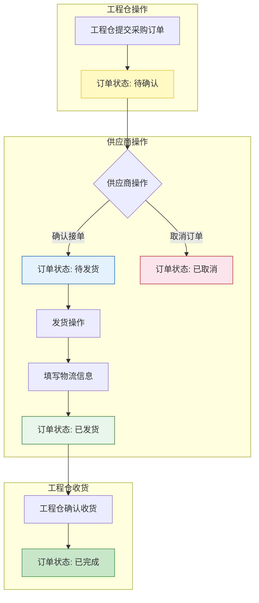
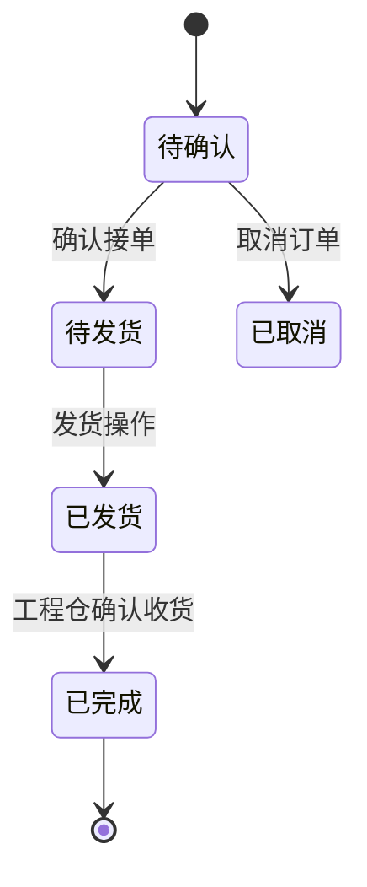
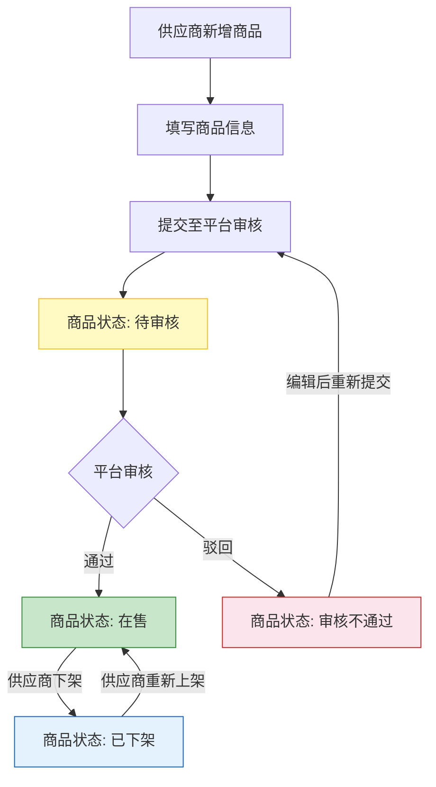
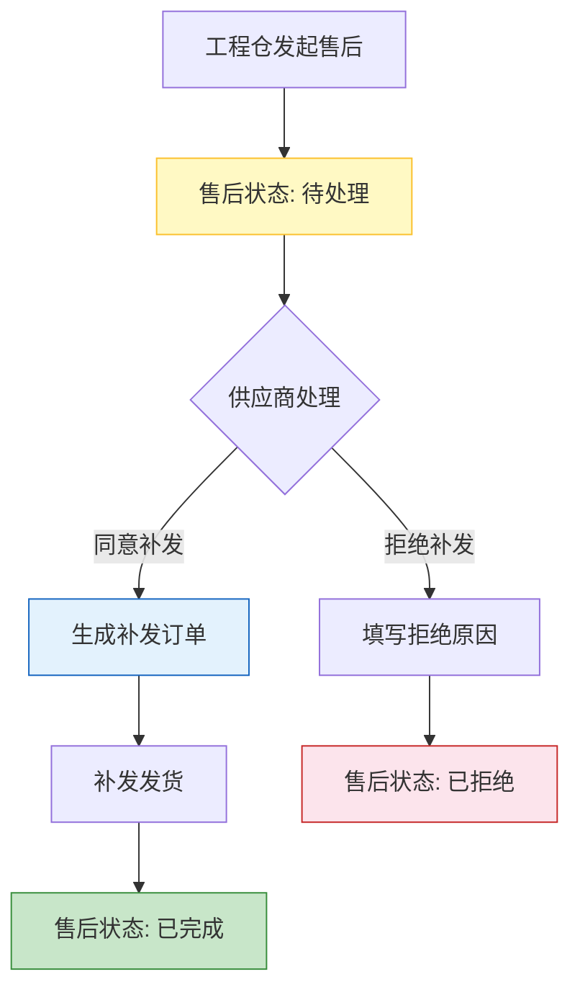

# 供应商端 - 业务流程设计

> 版本：v1.0  
> 文档状态：初稿  
> 所属章节：第二章

## 版本历史

| 版本 | 日期 | 修订内容 |
|:----:|:----:|---------|
| v1.0 | 2026-04-24 | 初始创建，覆盖4条核心业务流程 |

---

## 一、功能概述

### 1.1 功能定位

业务流程设计是供应商端所有功能模块的**业务操作指南**，描述从订单接收到货物发出的完整业务流转。本文档面向产品、开发、测试团队，帮助理解供应商在平台中的位置和各流程的业务规则。

### 1.2 核心概念

| 概念 | 说明 | 涉及链路 |
|-----|------|:--------:|
| 采购订单 | 工程仓向供应商发起的采购单据 | 履约链路 |
| 供货价 | 供应商为商品设定的销售单价 | 商品链路 |
| 货损补发 | 运输过程中货物损坏后的补发处理 | 售后链路 |
| 结算单 | 按周期生成的供应商结算对账单 | 财务链路 |

### 1.3 目标用户

- **产品经理**：理解业务链路，指导功能设计
- **开发工程师**：了解业务上下文，指导数据库设计和接口开发
- **测试工程师**：基于流程设计测试用例
- **运营人员**：了解操作流程，指导日常使用

---

## 二、核心业务链路概述

供应商端在平台中处于**商品供应方+订单履约方**位置，同时参与3条核心交易链路：

```
链路一：商品供应链路
═════════════════════════════════════════════════════
    ┌──────────┐    商品管理    ┌──────────┐
    │  平台端   │ ──────────▶  │ 供应商端  │
    │ 定义SPU/SKU│◀───────────│ 设置供货价  │
    └──────────┘     审核     └──────────┘

链路二：订单履约链路
═════════════════════════════════════════════════════
    ┌──────────┐   下单      ┌──────────┐     发货     ┌──────────┐
    │  工程仓端  │ ──────────▶│ 供应商端  │──────────▶ │  工程仓端  │
    │  采购方    │◀───────────│  履约方   │◀───────────│  收货方    │
    └──────────┘   接单确认   └──────────┘   推送物流   └──────────┘

链路三：售后补发链路
═════════════════════════════════════════════════════
    ┌──────────┐  申请售后  ┌──────────┐  补发发货  ┌──────────┐
    │  工程仓端  │──────────▶│ 供应商端  │──────────▶│  工程仓端  │
    └──────────┘            └──────────┘           └──────────┘
```

---

## 三、订单履约流程

### 3.1 流程图



### 3.2 流程步骤说明

| 步骤 | 操作角色 | 操作内容 | 系统响应 | 前置条件 | 后置状态 |
|:----:|:--------:|---------|---------|---------|---------|
| 1 | 工程仓 | 提交采购订单 | 生成订单(todo→pending) | 登录+商品选择 | 待确认 |
| 2 | 供应商业务员 | 查看待确认订单 | 展示订单详情+操作按钮 | 登录成功 | — |
| 3 | 供应商业务员 | 点击确认接单 | 状态更新+通知工程仓 | 订单状态="待确认" | 待发货 |
| 4 | 供应商仓管 | 点击发货 | 弹出发货表单 | 订单状态="待发货" | — |
| 5 | 供应商仓管 | 填写物流信息并提交 | 状态更新+通知工程仓 | 物流信息提交 | 已发货 |
| 6 | 工程仓 | 确认收货 | 订单完成通知供应商 | 订单状态="已发货" | 已完成 |

### 3.3 状态流转图



---

## 四、商品上架审核流程

### 4.1 流程图



### 4.2 流程步骤说明

| 步骤 | 操作角色 | 操作内容 | 系统响应 | 前置条件 | 后置状态 |
|:----:|:--------:|---------|---------|---------|---------|
| 1 | 供应商业务员 | 点击新增商品 | 弹出商品表单 | 登录成功 | — |
| 2 | 供应商业务员 | 填写商品信息并提交 | 生成商品草稿 | 通过前端必填校验 | 待审核 |
| 3 | 平台运营 | 审核商品 | 更新商品状态+通知供应商 | 商品状态="待审核" | 在售/不通过 |
| 4 | 供应商业务员 | 上下架操作 | 更新商品状态 | 商品状态="在售"或"已下架" | 已下架/在售 |

---

## 五、售后补发流程

### 5.1 流程图



### 5.2 关键说明

- **货损处理**：供应商查看货损记录和证据，决定补发或拒绝
- **补发不经过PC**：补发订单直接关联原订单，无需二次确认
- **拒绝需填写原因**：必须在弹窗中填写拒绝原因，此信息对工程仓可见

---

## 六、关键流程说明

### 6.1 物流信息非必填校验

- 物流公司非必填：需要去掉原有的必填校验，支持"自有配送"场景
- 物流单号非必填：自有配送场景无需填写物流单号

### 6.2 一笔订单一个发票

- 每笔发票只能关联一个订单，不能多笔订单共用一个发票
- 发票已关联则不能再次关联处理

### 6.3 补发自动创建订单

- 补发操作自动生成补发订单，订单类型标记为"补发"
- 补发订单沿用原订单的商品明细和价格信息

