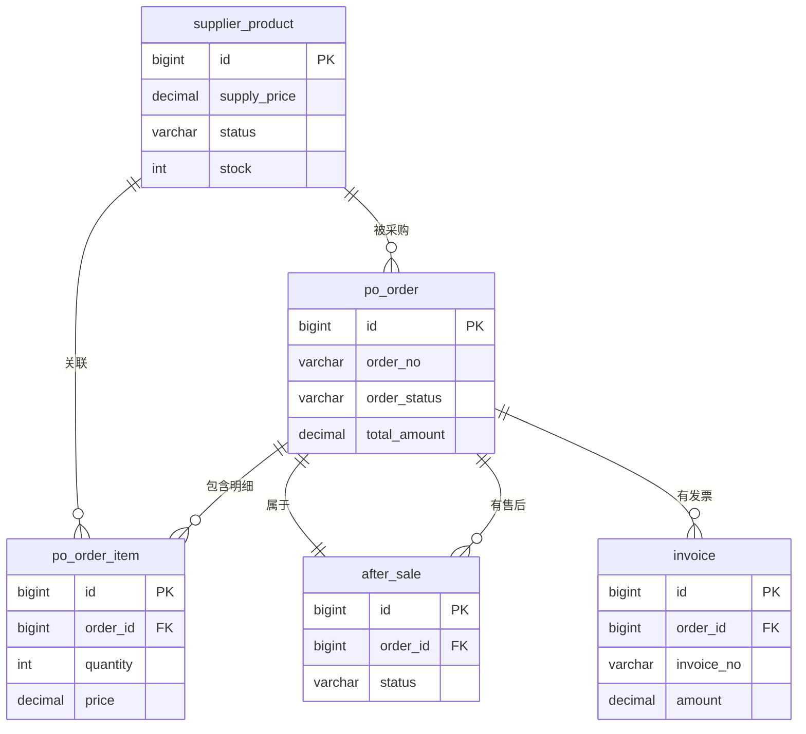

# 供应商端 - 数据模型与表结构

> 版本：v1.0  
> 文档状态：初稿  
> 所属章节：第三章

## 版本历史

| 版本 | 日期 | 修订内容 |
|:----:|:----:|---------|
| v1.0 | 2026-04-24 | 初始创建，覆盖5张核心表结构 |

---

## 一、功能概述

### 1.1 功能定位

本文档定义供应商端所有业务数据的**表结构、字段规范、实体关系**，是后端开发和数据库设计的核心参考。涵盖8张核心表。

### 1.2 核心概念

| 概念 | 说明 | 涉及表 |
|-----|------|--------|
| 商品 | 供应商从平台商品库选用的标准商品 | sp_product, sp_sku |
| 订单 | 工程仓向供应商发起的采购订单 | po_order, po_order_item |
| 售后 | 工程仓发起的售后服务记录 | after_sale |
| 发票 | 供应商开给工程仓的发票记录 | invoice |

### 1.3 核心设计原则

1. **三状态分离**：订单主状态/支付状态/发货状态独立存储与校验
2. **状态用字符串**：状态字段使用VARCHAR(20)可读字符串，不使用数字枚举
3. **金额统一精度**：金额字段统一使用DECIMAL(18,2)

---

## 二、业务数据规则

### 2.1 字段命名规范

- 所有表使用 BIGINT 自增主键（id）
- 创建时间统一字段：create_time（DATETIME, DEFAULT NOW）
- 更新时间统一字段：update_time（DATETIME, ON UPDATE）
- 状态字段统一使用 VARCHAR(20) 可读字符串
- 金额字段统一使用 DECIMAL(18,2)
- 外键字段统一使用 BIGINT，命名规则：关联表名_id

### 2.2 供应商数据规则

- 商品数据从平台商品库引用，供应商仅维护供货价和上下架状态
- 订单数据由工程仓创建，供应商只能确认/取消/发货
- 售后单由工程仓发起，供应商处理补发或拒绝

---

## 三、核心表结构

### 3.1 表：供应商商品表（supplier_product）

**说明：** 供应商从平台商品库选择的商品，维护供货价和上架状态

**字段列表：**

| 字段名 | 类型 | 长度 | 是否必填 | 主键/索引 | 默认值 | 说明 |
|-------|:----:|:----:|:--------:|:---------:|:-----:|------|
| id | BIGINT | — | Y | PK | AUTO_INCREMENT | 自增主键 |
| supplier_id | BIGINT | — | Y | IDX | — | 供应商ID |
| spu_id | BIGINT | — | Y | IDX | — | 平台SPU ID |
| sku_id | BIGINT | — | Y | IDX | — | 平台SKU ID |
| supply_price | DECIMAL | 18,2 | Y | — | 0 | 供货价 |
| status | VARCHAR | 20 | Y | IDX | 'pending' | 状态: pending/online/offline/rejected |
| stock | INT | — | Y | — | 0 | 库存数量 |
| create_time | DATETIME | — | Y | — | NOW | 创建时间 |
| update_time | DATETIME | — | Y | — | ON UPDATE | 更新时间 |

**DDL：**

```sql
CREATE TABLE `supplier_product` (
  `id` bigint(20) NOT NULL AUTO_INCREMENT COMMENT '自增主键',
  `supplier_id` bigint(20) NOT NULL COMMENT '供应商ID',
  `spu_id` bigint(20) NOT NULL COMMENT '平台SPU ID',
  `sku_id` bigint(20) NOT NULL COMMENT '平台SKU ID',
  `supply_price` decimal(18,2) NOT NULL DEFAULT '0' COMMENT '供货价',
  `status` varchar(20) NOT NULL DEFAULT 'pending' COMMENT '状态: pending待审核/online在售/offline已下架/rejected审核不通过',
  `stock` int(11) NOT NULL DEFAULT '0' COMMENT '库存数量',
  `create_time` datetime NOT NULL DEFAULT CURRENT_TIMESTAMP COMMENT '创建时间',
  `update_time` datetime NOT NULL DEFAULT CURRENT_TIMESTAMP ON UPDATE CURRENT_TIMESTAMP COMMENT '更新时间',
  PRIMARY KEY (`id`) USING BTREE,
  INDEX `idx_supplier_id` (`supplier_id`) USING BTREE,
  INDEX `idx_sku_id` (`sku_id`) USING BTREE,
  INDEX `idx_status` (`status`) USING BTREE
) ENGINE=InnoDB DEFAULT CHARSET=utf8mb4 COMMENT='供应商商品表';
```

### 3.2 表：采购订单表（po_order）

**说明：** 工程仓向供应商发起的采购订单

| 字段名 | 类型 | 长度 | 是否必填 | 主键/索引 | 默认值 | 说明 |
|-------|:----:|:----:|:--------:|:---------:|:-----:|------|
| id | BIGINT | — | Y | PK | AUTO_INCREMENT | 自增主键 |
| order_no | VARCHAR | 32 | Y | UK | — | 订单编号 |
| supplier_id | BIGINT | — | Y | IDX | — | 供应商ID |
| order_status | VARCHAR | 20 | Y | IDX | 'pending' | pending/confirmed/shipped/completed/cancelled |
| payment_status | VARCHAR | 20 | Y | — | 'unpaid' | unpaid/paid/refunded |
| ship_status | VARCHAR | 20 | Y | — | 'pending' | pending/partial/shipped |
| total_amount | DECIMAL | 18,2 | Y | — | 0 | 订单总金额 |
| logistics_company | VARCHAR | 50 | N | — | — | 物流公司(非必填) |
| logistics_no | VARCHAR | 50 | N | — | — | 物流单号(非必填) |
| create_time | DATETIME | — | Y | — | NOW | 创建时间 |
| update_time | DATETIME | — | Y | — | ON UPDATE | 更新时间 |

### 3.3 表：采购订单明细表（po_order_item）

| 字段名 | 类型 | 长度 | 是否必填 | 主键/索引 | 默认值 | 说明 |
|-------|:----:|:----:|:--------:|:---------:|:-----:|------|
| id | BIGINT | — | Y | PK | AUTO_INCREMENT | 自增主键 |
| order_id | BIGINT | — | Y | IDX | — | 订单ID(FK) |
| sku_id | BIGINT | — | Y | — | — | SKU ID |
| product_name | VARCHAR | 200 | Y | — | — | 商品名称 |
| spec | VARCHAR | 100 | N | — | — | 规格描述 |
| quantity | INT | — | Y | — | 1 | 数量 |
| price | DECIMAL | 18,2 | Y | — | 0 | 单价 |
| subtotal | DECIMAL | 18,2 | Y | — | 0 | 小计金额 |

### 3.4 表：售后表（after_sale）

| 字段名 | 类型 | 长度 | 是否必填 | 主键/索引 | 默认值 | 说明 |
|-------|:----:|:----:|:--------:|:---------:|:-----:|------|
| id | BIGINT | — | Y | PK | AUTO_INCREMENT | 自增主键 |
| order_id | BIGINT | — | Y | IDX | — | 原订单ID |
| type | VARCHAR | 20 | Y | — | 'damage' | 售后类型: damage货损 |
| status | VARCHAR | 20 | Y | IDX | 'pending' | pending/completed/rejected |
| reason | TEXT | — | N | — | — | 售后原因 |
| reject_reason | TEXT | — | N | — | — | 拒绝原因(供应商填写) |
| create_time | DATETIME | — | Y | — | NOW | 创建时间 |

### 3.5 表：发票表（invoice）

| 字段名 | 类型 | 长度 | 是否必填 | 主键/索引 | 默认值 | 说明 |
|-------|:----:|:----:|:--------:|:---------:|:-----:|------|
| id | BIGINT | — | Y | PK | AUTO_INCREMENT | 自增主键 |
| invoice_no | VARCHAR | 50 | Y | UK | — | 发票号码 |
| order_id | BIGINT | — | Y | IDX | — | 关联订单ID(一笔订单一个发票) |
| amount | DECIMAL | 18,2 | Y | — | 0 | 发票金额 |
| file_url | VARCHAR | 500 | Y | — | — | 发票文件URL |
| status | VARCHAR | 20 | Y | — | 'valid' | valid/invalid |

---

## 四、实体关系图



---

## 五、并发控制策略

| 表名 | 策略 | 字段 | 说明 |
|-----|------|------|------|
| po_order | 乐观锁 | version | 订单状态变更使用版本号防并发 |
| supplier_product | 唯一索引 | supplier_id + sku_id | 防止供应商重复新增同一商品 |

