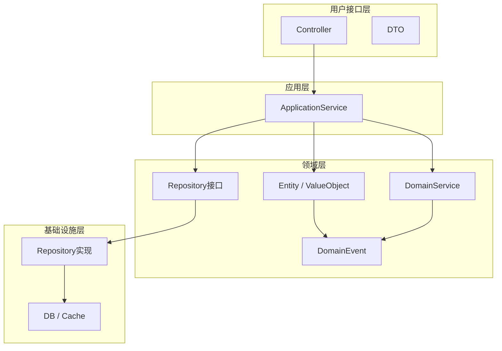

# 供应商端 - 领域模型设计

> 版本：v1.0  
> 文档状态：初稿  
> 所属章节：第四章

## 版本历史

| 版本 | 日期 | 修订内容 |
|:----:|:----:|---------|
| v1.0 | 2026-04-24 | 初始创建 |

---

## 一、功能概述

### 1.1 功能定位

本文档定义供应商端的**领域模型**，包括核心领域实体、领域服务、领域事件。面向开发团队，指导后端代码的领域驱动设计（DDD）实现。

### 1.2 核心概念

| 概念 | 说明 |
|-----|------|
| 领域实体 | 有唯一标识的业务对象，如商品、订单 |
| 值对象 | 无唯一标识的概念性对象，如金额、物流信息 |
| 领域服务 | 跨实体的业务操作，如订单发货 |
| 领域事件 | 业务操作触发的通知，如订单确认事件 |

### 1.3 目标用户

- **后端开发工程师**：基于领域模型设计代码结构和数据库访问层
- **架构师**：评估领域划分和实体关系设计的合理性

---

## 二、核心领域实体

### 2.1 供应商商品（SupplierProduct）

**核心属性：**
- id: BIGINT — 唯一标识
- skuId: BIGINT — 关联平台SKU
- supplyPrice: Decimal — 供货价
- status: String — 状态（pending/online/offline/rejected）
- stock: Integer — 库存数量

**关联关系：**
- N:1 Supplier（供应商）
- 1:1 PlatformSku（平台SKU）

**领域方法：**
- `submitForReview()`: 提交平台审核
- `changeStatus(Status target)`: 变更上下架状态
- `updateSupplyPrice(Decimal price)`: 更新供货价

**业务约束：**
- 供货价必须大于0
- 上下架操作需商品审核通过后方可执行

### 2.2 采购订单（PurchaseOrder）

**核心属性：**
- id: BIGINT — 唯一标识
- orderNo: String — 订单编号
- orderStatus: String — pending/confirmed/shipped/completed/cancelled
- paymentStatus: String — unpaid/paid/refunded
- shipStatus: String — pending/partial/shipped

**关联关系：**
- 1:N OrderItem（订单明细）
- N:1 Supplier（供应商）
- 1:1 AfterSale（售后单）

**领域方法：**
- `confirm()`: 确认接单
- `cancel(String reason)`: 取消订单
- `ship(String logisticsCompany, String logisticsNo)`: 发货

**业务约束：**
- 仅"待确认"状态可确认/取消
- 仅"待发货"状态可发货
- 物流公司和物流单号均为非必填

### 2.3 售后单（AfterSale）

**核心属性：**
- id: BIGINT — 唯一标识
- status: String — pending/completed/rejected
- type: String — damage（货损）
- rejectReason: String — 拒绝原因

**领域方法：**
- `approveReplacement()`: 同意补发
- `reject(String reason)`: 拒绝补发

**业务约束：**
- 拒绝时rejectReason必填
- 同意补发后自动创建补发订单

### 2.4 发票（Invoice）

**核心属性：**
- id: BIGINT — 唯一标识
- invoiceNo: String — 发票号码
- orderId: BIGINT — 关联订单ID
- amount: Decimal — 发票金额

**领域方法：**
- `linkOrder(Long orderId)`: 关联订单
- `download()`: 下载发票文件

**业务约束：**
- 一笔订单只能关联一个发票
- 发票已关联不能重复关联

### 2.5 结算单（Settlement）

**核心属性：**
- id: BIGINT — 唯一标识
- periodStart: Date — 结算周期开始
- periodEnd: Date — 结算周期结束
- totalAmount: Decimal — 结算总金额
- status: String — pending/settled

---

## 三、领域服务

### 3.1 商品供应服务（ProductSupplyService）

> 说明：管理供应商商品的全生命周期

```typescript
interface ProductSupplyService {
  /** 供应商从平台商品库选用商品 */
  selectProduct(spuId: Long, skuId: Long, price: Decimal): SupplierProduct
  
  /** 提交商品到平台审核 */
  submitForReview(productId: Long): void
  
  /** 批量上下架 */
  batchToggleStatus(productIds: List<Long>, targetStatus: Status): void
}
```

### 3.2 订单履约服务（OrderFulfillmentService）

```typescript
interface OrderFulfillmentService {
  /** 确认接单 */
  confirmOrder(orderId: Long): void
  
  /** 订单发货 */
  shipOrder(orderId: Long, logisticsCompany: String, logisticsNo: String): void
  
  /** 取消订单 */
  cancelOrder(orderId: Long, reason: String): void
  
  /** 打印发货单 */
  printShippingSlip(orderId: Long): void
}
```

### 3.3 售后处理服务（AfterSaleService）

```typescript
interface AfterSaleService {
  /** 查看货损记录 */
  viewDamageRecords(afterSaleId: Long): DamageRecord
  
  /** 同意补发（自动生成补发订单） */
  approveReplacement(afterSaleId: Long): PurchaseOrder
  
  /** 拒绝补发 */
  rejectReplacement(afterSaleId: Long, reason: String): void
}
```

### 3.4 发票管理服务（InvoiceService）

```typescript
interface InvoiceService {
  /** 上传发票 */
  createInvoice(invoiceNo: String, amount: Decimal, fileUrl: String): Invoice
  
  /** 关联订单 */
  linkOrder(invoiceId: Long, orderId: Long): void
  
  /** 下载发票文件 */
  downloadInvoice(invoiceId: Long): String
}
```

---

## 四、领域事件

### 4.1 事件定义

| 事件名称 | 触发时机 | 携带数据 | 消费者 |
|---------|---------|---------|--------|
| OrderConfirmedEvent | 供应商确认接单 | orderId, supplierId | 工程仓端通知 |
| OrderShippedEvent | 供应商发货 | orderId, logisticsNo | 工程仓端通知 |
| OrderCancelledEvent | 供应商取消订单 | orderId, reason | 工程仓端通知 |
| ReplacementApprovedEvent | 同意补发 | afterSaleId, newOrderId | 工程仓端通知 |
| InvoiceCreatedEvent | 新增发票 | invoiceId, orderId | 财务统计 |

### 4.2 事件处理流程

```typescript
// 示例：订单确认事件
// 发布方
domainEventPublisher.publish(new OrderConfirmedEvent(orderId, supplierId, timestamp))

// 订阅方
@EventListener
handleOrderConfirmed(event: OrderConfirmedEvent) {
  // 通知工程仓、更新商品销量统计等
}
```

---

## 五、DDD分层架构



---

## 六、聚合定义

| 聚合根 | 包含实体 | 仓储 |
|-------|---------|------|
| SupplierProduct | — | SupplierProductRepository |
| PurchaseOrder | OrderItem | PurchaseOrderRepository |
| AfterSale | — | AfterSaleRepository |
| Invoice | — | InvoiceRepository |

