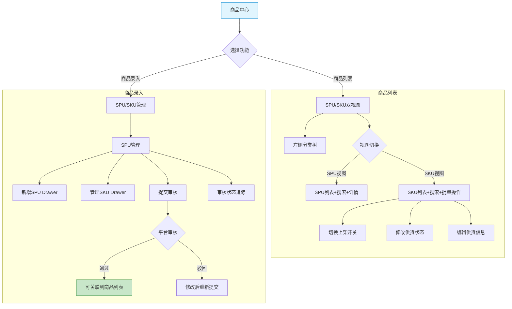
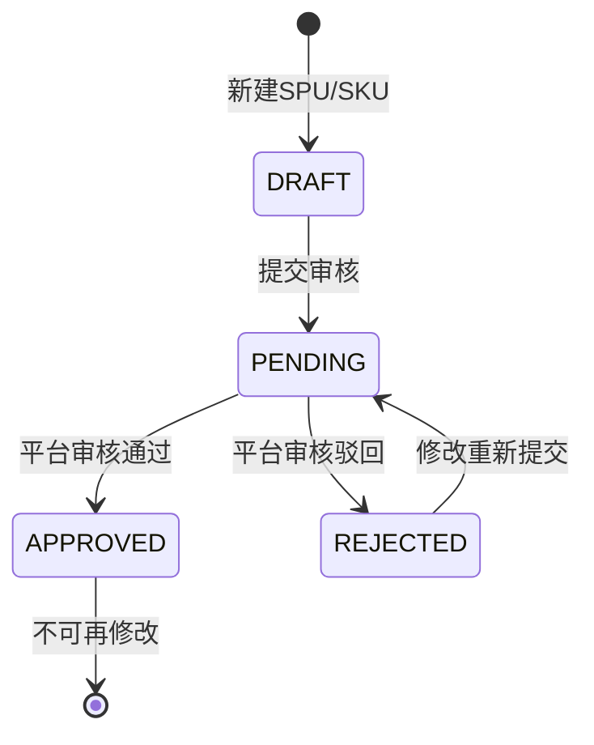

# 供应商端 - 商品中心功能详细设计

> 版本：v2.0（代码逆向）
> 文档状态：初稿
> 所属章节：第六章

## 版本历史

| 版本 | 日期 | 修订内容 | 修订人 |
|:----:|:----:|---------|:-----:|
| v1.0 | 2026-04-24 | 初始创建 | PM |
| v2.0 | 2026-05-22 | 按代码实际实现重写：重构为SPU/SKU双视图+左侧分类树+商品录入独立模块，新增批量上下架/供货状态管理/多方审核追踪/平台库选择 | PM |

---

## 一、功能概述

### 1.1 功能定位

商品中心是供应商在平台的**数字货架管理模块**，包含商品列表和商品录入两个子模块。供应商通过商品列表管理已关联商品的供货状态和上下架，通过商品录入创建和提交自有SPU/SKU供平台审核。

### 1.2 核心概念

| 概念 | 说明 | 示例 |
|:----|------|------|
| SPU | 标准产品单元，商品的抽象概念 | "螺纹钢HRB400" |
| SKU | 库存保持单位，具体可售商品 | "螺纹钢HRB400-20mm" |
| 供货价 | 供应商为SKU设定的销售单价 | ¥300/吨 |
| 供货状态 | 供应商对该SKU的供货意愿 | 供货中/暂停供货/永久停货 |
| 上架状态 | SKU在平台前台是否可见 | 已上架/已下架 |
| 审核状态 | SPU/SKU在平台端的审核进度 | 草稿/待审核/已通过/已驳回 |

### 1.3 目标用户

- **管理员**（核心用户）：管理商品列表和录入商品
- **业务员**：协助管理商品信息和录入

### 1.4 模块范围

| 子模块 | 主要功能 | 优先级 |
|:------|---------|:------:|
| 商品列表 | SPU列表视图、SKU列表视图、分类树筛选、搜索、批量上下架、供货状态管理、从平台库选择 | P0 |
| 商品录入 | SPU管理（CRUD+提交审核）、SKU管理（CRUD）、审核状态追踪 | P0 |

---

## 二、核心设计原则

> **商品中心遵循"两段定义"——供应商负责定价和库存，平台负责规格和审核。**

### 2.1 SPU/SKU分离原则

- SPU为商品抽象层，SKU为具体可售层
- 商品列表页通过RadioGroup切换SPU/SKU两种视图
- 一个SPU可包含多个SKU（不同规格）

### 2.2 双轨供货管理

- **供货状态**（supplyStatus）：供应商控制——供货中/暂停供货/永久停货
- **上架状态**（shelfStatus）：平台可见性控制——已上架/已下架
- 永久停货不可逆，需重新申请才能再次供货

### 2.3 分类树导航

- 左侧展示商品分类树，支持搜索筛选
- 选中分类后列表自动过滤
- 每个分类旁显示该分类下SPU/SKU的数量

### 2.4 多方审核追踪

- SPU和SKU均需经过平台审核才能在售
- 审核状态：草稿（DRAFT）→ 待审核（PENDING）→ 已通过（APPROVED）/ 已驳回（REJECTED）
- 审核备注记录驳回原因，供供应商修改后重新提交

---

## 三、业务规则

### 3.1 商品列表规则（商品列表视图）

- SPU列表展示从平台库关联的商品，SKU列表展示具体的可售规格
- SPU来源：自建（self）/平台（platform）
- SKU列表支持**批量选择**后批量上架/批量下架
- 上架开关禁用条件：供货状态为"永久停货" 或 审核状态为"待审核"/"已驳回"

### 3.2 商品录入规则（商品录入视图）

- SPU新建后状态为"草稿（DRAFT）"，需要先创建SKU才能提交审核
- 提交审核后不可编辑，待平台审核通过或驳回后才可继续操作
- 已通过的SPU/SKU不可编辑、不可删除
- 审核备注记录平台端的审核意见

### 3.3 核心业务流程图

---

## 四、权限矩阵

| 功能模块 | 具体操作 | 管理员 | 业务员 | 说明 |
|:--------|---------|:------:|:------:|------|
| **商品列表** | 查看SPU列表 | ✅ | ✅ | - |
| | 查看SKU列表 | ✅ | ✅ | - |
| | SKU编辑 | ✅ | ✅ | - |
| | 批量上架/下架 | ✅ | ✅ | - |
| | 修改供货状态 | ✅ | ✅ | - |
| **商品录入** | 查看SPU/SKU | ✅ | ✅ | - |
| | 新增/编辑SPU | ✅ | ✅ | - |
| | 管理SKU | ✅ | ✅ | - |
| | 提交审核 | ✅ | ✅ | - |
| | 删除SPU/SKU | ✅ | ✅ | 已通过状态不可删 |

---

## 五、非功能性需求

| 场景 | P95要求 |
|:----|:-------:|
| 商品列表查询 | ≤ 500ms |
| 分类树加载 | ≤ 300ms |
| 新增SPU/SKU提交 | ≤ 1s |
| 批量上下架 | ≤ 2s（100条以内） |

---

## 六、功能点详细设计

### 6.1 商品列表（P0）- 商品列表视图

#### 页面布局

左侧分类树 + 右侧内容区。

**左侧 - 分类树**
- 树形结构展示商品分类，支持展开/折叠
- 搜索框可搜索分类名称
- 每个分类节点显示该分类下的SPU/SKU数量
- 选中分类后右侧列表自动过滤
- "重置"按钮清除分类选择

**右侧 - 内容区**

顶部：SPU/SKU切换RadioGroup + "从平台库选择"按钮

SPU视图：
- 搜索表单：关键词搜索（SPU名称/编码）+ 分类级联选择器 + 审核状态下拉
- 表格列：主图（缩略图）/ SPU编码 / SPU名称 / 分类 / SKU数量（可点击查看SKU）/ 来源（自建/平台Tag）/ 审核状态Tag / 创建时间 / 操作（详情）
- 分页：每页10条

SKU视图：
- 搜索表单：关键词搜索 + 分类级联选择器 + 供货状态下拉 + 上架状态下拉
- 批量操作栏：批量上架 / 批量下架（选中行后启用）
- 表格列：主图 / SKU编码 / SKU名称 / 所属SPU / 规格（Tag列表）/ 供货价 / 供货状态Tag / 上架状态Switch / 操作（详情/编辑/更多下拉：继续供货/暂停供货/永久停货）
- 分页：每页10条

#### SKU编辑Modal

编辑字段：供货价（只读）、预计供货量、最小起订量、供货周期（天）。

#### 供货状态变更

| 目标状态 | 前置条件 | 交互 |
|:--------|:--------|:----|
| 继续供货 | 当前为暂停或停货 | 直接变更 |
| 暂停供货 | 当前为供货中 | 弹窗提示"暂停后商品暂不展示，可随时恢复" |
| 永久停货 | 当前为供货中或暂停 | 弹窗红色告警"此操作不可逆"，需填写停货原因 |

#### 从平台库选择

点击按钮 → 弹出PlatformProductSelector Modal → 展示平台商品库 → 选择商品 → 确认 → 商品进入供应商列表。

---

### 6.2 商品录入（P0）- 商品录入视图

#### 页面布局

顶部：SPU管理/SKU管理切换RadioGroup

**SPU管理**

搜索表单：关键词搜索 + 分类级联选择器 + 审核状态下拉
操作按钮："新增SPU"

表格列：主图 / SPU编码 / SPU名称 / 所属分类 / 计量单位 / SKU数量 / 审核状态Tag / 审核备注 / 创建时间 / 操作（详情/编辑/管理SKU/提交审核/删除）

操作规则：
- 编辑：草稿/待审核/已驳回状态可编辑，已通过状态不可编辑（按钮置灰）
- 提交审核：仅草稿状态且SKU数量>0时可用
- 删除：已通过状态不可删除

**SKU管理**

搜索表单：关键词搜索 + 分类级联选择器 + 审核状态下拉

表格列：主图 / SKU编码 / SKU名称 / 所属SPU / 规格（Tag列表） / 单位 / 建议售价 / 审核状态Tag / 创建时间 / 操作（详情/编辑）

#### Drawer组件说明

| Drawer | 用途 | 内容 |
|:-------|:-----|:-----|
| SupplierSpuCreateDrawer | 新增/编辑SPU | SPU基础信息表单 + 分类选择 + 属性赋值 |
| SupplierSkuDrawer | 新增/编辑SKU | SKU规格定义 + 售价 + 单位 |
| SupplierSpuDetailDrawer | SPU详情查看 | SPU完整信息展示 |

---

## 七、审核状态流转

### 状态定义

| 状态 | 编码 | 说明 | 可操作 |
|:----|:----:|------|:------:|
| 草稿 | DRAFT | 新建后未提交审核 | 编辑/删除/提交审核 |
| 待审核 | PENDING | 已提交等待平台审核 | 不可编辑/不可删除 |
| 已通过 | APPROVED | 平台审核通过 | 只读/不可编辑/不可删除 |
| 已驳回 | REJECTED | 平台审核不通过 | 查看驳回原因/修改重新提交 |

---

## 八、字段定义

### SPU列表字段

| 字段 | 必填 | 来源 | 展示规则 |
|:----|:----|:----:|:--------|
| 主图 | 否 | 系统 | 48x48缩略图 |
| SPU编码 | 是 | 系统 | 文本 |
| SPU名称 | 是 | 表单 | 文本 |
| 分类 | 是 | 分类树 | 文本 |
| SKU数量 | 是 | 系统 | 数字，蓝色可点击链接 |
| 来源 | 是 | 系统 | Tag：自建(蓝)/平台(绿) |
| 审核状态 | 否 | 系统 | Tag颜色区分 |
| 创建时间 | 是 | 系统 | YYYY-MM-DD HH:mm |

### SKU列表字段

| 字段 | 必填 | 来源 | 展示规则 |
|:----|:----|:----:|:--------|
| 主图 | 否 | 系统 | 48x48缩略图 |
| SKU编码 | 是 | 系统 | 文本 |
| SKU名称 | 是 | 表单 | 文本 |
| 所属SPU | 是 | 关联 | 文本 |
| 规格 | 否 | 属性 | Tag列表 |
| 供货价 | 是 | 供应商设置 | 金额格式 |
| 供货状态 | 是 | 系统 | Tag颜色区分 |
| 上架状态 | 是 | 系统 | Switch开关 |
| 预计供货量 | 否 | 表单 | 数字+单位 |
| 最小起订量 | 否 | 表单 | 数字+单位 |
| 供货周期 | 否 | 表单 | 数字+天 |

---

## 九、异常处理汇总表

| 异常场景 | 处理逻辑 | 提示文案 |
|:--------|:--------|---------|
| 供货价≤0 | 表单校验 | "供货价必须大于0" |
| 提交审核时SKU为0 | 按钮置灰+提示 | "请先添加SKU再提交审核" |
| 编辑已通过的SPU | 按钮置灰 | - |
| 删除已通过的SPU | 按钮置灰 | - |
| 批量上下架无选中行 | 按钮置灰 | - |
| 永久停货不填原因 | 表单校验 | "请输入永久停货原因" |

---

## 十、接口需求说明

| 接口 | 用途 | 说明 |
|:----|:----|:----|
| SPU列表 | 分页查询SPU | 支持关键词/分类/审核状态筛选 |
| SKU列表 | 分页查询SKU | 支持关键词/分类/供货状态/上架状态筛选 |
| 分类树 | 获取商品分类树 | 含SPU/SKU计数 |
| 平台商品库 | 从平台库选择商品 | - |
| 新增SPU | 创建SPU | - |
| 编辑SPU | 修改SPU信息 | - |
| 删除SPU | 删除SPU | 已通过不可删 |
| 新增SKU | 创建SKU | - |
| 编辑SKU | 修改SKU信息 | - |
| 删除SKU | 删除SKU | 已通过不可删 |
| 提交审核 | SPU提交平台审核 | 草稿→待审核 |
| 更新供货状态 | 修改供货状态 | 供货中/暂停/停货 |
| 更新上架状态 | 切换上架开关 | 批量/单个 |
