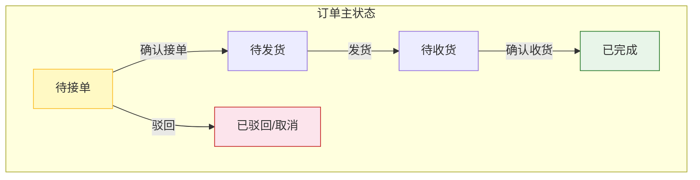
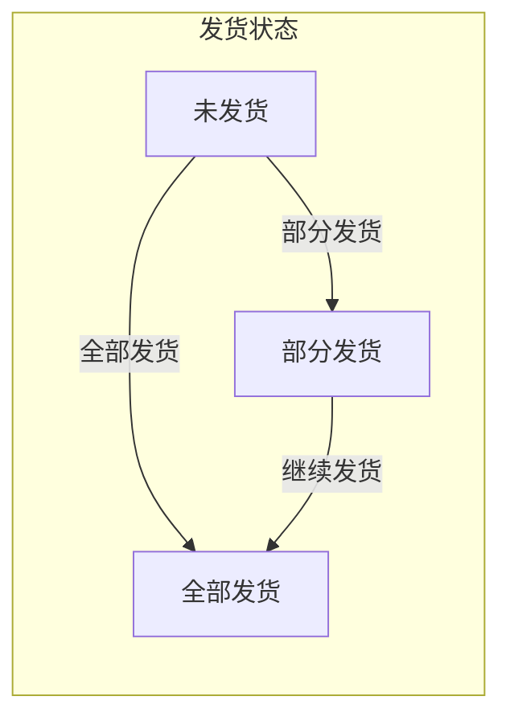
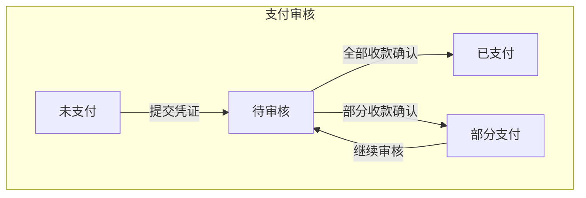

# 供应商端 - 订单管理功能详细设计

> 版本：v2.0（代码逆向文档）  
> 文档状态：已确认（基于代码 v2.0 逆向生成）  
> 所属章节：第七章

## 版本历史

| 版本 | 日期 | 修订内容 | 修订人 |
|:----:|:----:|---------|:-----:|
| v1.0 | 2026-04-24 | 初始创建，覆盖11个功能点的完整详细设计 | PM |
| v2.0 | 2026-04-24 | **代码逆向重写**：删除未实现的"发货打印/售后处理按钮/取消订单"，新增"审核支付/导出待发货单/自配送/详情5Tab"等真实功能 | PM |

---

## 一、功能概述

### 1.1 功能定位

订单管理是供应商端的**核心履约模块**，覆盖从接单到发货再到售后查看的完整订单生命周期。

### 1.2 核心概念

| 概念 | 说明 | 示例 |
|:----|------|------|
| 订单三状态 | 订单主状态/支付状态/发货状态独立运行 | pending→confirmed→shipped |
| 分批发货 | 可多次发货，每次填写发货数量 | 本次发货100件，剩余50件 |
| 自配送 | 不填物流公司/单号，走自有配送 | 物流信息非必填 |

### 1.3 目标用户

- **管理员**（核心用户）：管理所有订单，确认/审核支付/发货/查看售后
- **业务员**：查看订单，确认接单
- **仓管员**：发货操作
- **客服**：查看售后信息

### 1.4 模块范围

| 功能分类 | 主要功能 | 优先级 |
|:--------|---------|:------:|
| 订单管理 | 订单列表、详情、确认、驳回、发货、审核支付、导出待发货单、开具发票 | P0-P1 |
| 售后查看 | 售后列表入口、售后状态查看（仅查看） | P1 |

---

## 二、核心设计原则

> **订单管理遵循"三状态分离"原则——订单/支付/发货各自独立运行，互不依赖。**

### 2.1 三状态分离原则

- 订单主状态：待接单→待发货→待收货→已完成→已驳回/取消
- 支付状态：未支付→部分支付→全部支付（只做记录，不做强制校验）
- 发货状态：未发货→部分发货→全部发货
- 三状态独立运行，互不阻塞

### 2.2 线下生意适配原则

- 物流公司/物流单号非必填：支持自有配送（自配送）场景
- 可分批发货，发货记录自动汇总
- 每条物流记录可独立填写

### 2.3 审核确认原则

- 确认接单时支持逐商品设置可供应数量和供应不足原因
- 支持部分商品接单/不接单的精细化操作
- 支付审核支持部分收款或全部收款确认

---

## 三、业务规则

### 3.1 订单状态流转

```
待接单（pending）
    ├─ 确认接单 → 待发货（confirmed）
    ├─ 驳回订单 → 已驳回/取消（cancelled）
    └─ 自动取消 ← 工程仓取消

待发货（confirmed）
    ├─ 发货（全部） → 待收货（shipped）
    ├─ 发货（部分） → 待收货（shipped，发货状态：部分发货）
    └─ 导出待发货单（不改变状态）

待收货（shipped）
    └─ 工程仓确认收货 → 已完成（completed）

已完成（completed）
    └─ 售后处理（仅查看售后，导航至售后页面）

已驳回/取消（cancelled）→ 终态
```

### 3.2 Tab筛选规则

| Tab | 筛选逻辑 | 说明 |
|:---|:--------|:----|
| 全部（默认） | 所有订单 | 进入页面默认展示 |
| 待接单 | status === 'pending' \|\| 'to_confirm' | 需供应商确认 |
| 待发货 | status === 'confirmed' | 已确认未发货 |
| 待收货 | status === 'shipped' | 已发货 |
| 已完成 | status === 'completed' | 工程仓已收货 |
| 已驳回/取消 | status === 'cancelled' | 驳回/取消终态 |

### 3.3 搜索规则

| 搜索字段 | 使用控件 | 匹配方式 | 选项/说明 |
|:--------|:--------|:--------|:---------|
| 订单编码 | InputSearch | 模糊匹配（不分大小写） | - |
| 采购方 | InputSearch | 模糊匹配（仓库名称） | - |
| 订单类型 | Select下拉 | 精确匹配 | 采购订单 / 售后订单 |
| 支付状态 | Select下拉 | 精确匹配 | 已支付 / 未支付 / 部分支付 |
| 发货状态 | Select下拉 | 精确匹配 | 未发货 / 部分发货 / 全部发货 |
| 下单时间 | DatePicker Range | 范围筛选 | - |
| 完成时间 | DatePicker Range | 范围筛选 | - |

### 3.4 发货规则

- 物流公司非必填：支持自配送场景（有无物流开关）
- 物流单号非必填：自配送场景可不填
- 可分批发货：每次填写本次发货数量（不超过待发货数量）
- 支持多条物流记录（快递多包裹场景）
- 提交发货后状态变更为"待收货"（shipped）

### 3.5 支付审核规则

- 工程仓提交支付凭证后，审核状态为待审核（pending）
- 供应商审核可操作：全部收款确认 / 部分收款确认
- 部分收款确认后，支付状态变为部分支付（partial_paid）
- 全部收款确认后，支付状态变为已支付（paid）
- 审核时可查看转账凭证图片

### 3.6 售后规则

- 仅已完成订单支持售后
- 供应商端**仅查看**售后信息，不处理售后申请
- 查看售后按钮导航至售后管理页面（独立页面）
- 售后处理后订单可标记"售后中"或"已退款"

---

## 四、权限矩阵

| 功能模块 | 具体操作 | 管理员 | 业务员 | 仓管员 | 客服 | 说明 |
|:--------|---------|:------:|:------:|:------:|:----:|------|
| **订单列表** | 查看列表 | ✅ | ✅ | ✅ | ✅ | - |
| **订单详情** | 查看详情 | ✅ | ✅ | ✅ | ✅ | 5个Tab |
| **确认订单** | 确认接单 | ✅ | ✅ | ❌ | ❌ | 逐商品操作 |
| **驳回订单** | 驳回操作 | ✅ | ❌ | ❌ | ❌ | - |
| **审核支付** | 确认收款 | ✅ | ❌ | ❌ | ❌ | 支持部分收款 |
| **发货** | 填写物流发货 | ✅ | ❌ | ✅ | ❌ | 支持自配送 |
| **导出待发货单** | 导出Excel | ✅ | ❌ | ✅ | ❌ | - |
| **开具发票** | 上传/开具 | ✅ | ❌ | ❌ | ❌ | - |
| **查看售后** | 查看售后 | ✅ | ✅ | ✅ | ✅ | 仅查看 |

---

## 五、功能点详细设计

### 5.1 订单列表（P0）

#### 交互逻辑

1. **默认展示「全部」Tab**，并非「待接单」
2. Tab切换：全部 / 待接单 / 待发货 / 待收货 / 已完成 / 已驳回·取消
3. 每个Tab显示当前状态订单的数量角标
4. 搜索栏（7个字段）：

| 搜索字段 | 使用控件 | 匹配逻辑 | 说明 |
|:--------|:--------|:--------|:----|
| 订单编码 | InputSearch | 模糊匹配（不分大小写） | - |
| 采购方 | InputSearch | 模糊匹配（仓库名称） | - |
| 订单类型 | Select下拉 | 精确匹配 | 选项：采购订单 / 售后订单 |
| 支付状态 | Select下拉 | 精确匹配 | 选项：已支付 / 未支付 / 部分支付 |
| 发货状态 | Select下拉 | 精确匹配 | 选项：未发货 / 部分发货 / 全部发货 |
| 下单时间 | DatePicker Range | 范围筛选 | - |
| 完成时间 | DatePicker Range | 范围筛选 | - |

5. 顶部操作栏：**重置按钮** + **导出订单按钮**（全部订单导出）

#### 表格列定义（15列）

| 字段 | 展示规则 | 说明 |
|:----|:--------|:----|
| 订单编号 | 文本 | - |
| 采购方 | 文本 | 仓库名称 |
| 订单类型 | Tag标签 | 采购订单(蓝) / 售后订单(橙) |
| 收货信息 | 收货人 + 手机号 + 地址 | 组合展示 |
| 商品数量（SKU） | 数字 + "种" | - |
| 采购量 | 数字 | 所有商品数量合计 |
| 订单金额 | ¥ + 数字 | - |
| 实付金额 | ¥ + 数字 | paidAmount或totalAmount |
| 支付状态 | Tag（颜色区分） | 点击导航至详情支付记录Tab |
| 发货状态 | Tag（颜色区分） | 未发货/部分发货/全部发货 |
| 要求交货日期 | 日期文本 | 2天内紧急标红 |
| 订单状态 | Tag（颜色区分） | 含售后中/已退款角标 |
| 下单时间 | YYYY-MM-DD HH:mm | - |
| 完成时间 | YYYY-MM-DD HH:mm / - | - |
| **操作** | 按钮组 | 见下方 |

#### 操作按钮矩阵（6个操作）

| 操作 | 显示条件 | 功能 |
|:---|:--------|:----|
| **查看** | 始终显示 | 跳转至详情页 /detail/:id |
| **订单确认** | status === 'pending' | 弹出确认弹窗（逐商品操作） |
| **审核支付** | 有pending支付记录 | 弹出支付审核弹窗 |
| **导出待发货单** | status === 'confirmed' | 弹出待发货单数据表格 |
| **发货** | status === 'confirmed' | 弹出发货弹窗 |
| **查看售后** | hasAfterSales 或 afterSalesStatus 存在 | 跳转至售后管理页 |

#### Mock数据

当前为前端Hardcode Mock数据，包含6条订单示例数据，覆盖 pending / confirmed / shipped / completed / cancelled 等状态。

---

### 5.2 订单详情（P0）

#### 交互逻辑

1. 点击"查看"按钮 → 跳转至独立详情页 `/supplier/order/detail/:id`
2. 详情页以Modal形式打开，宽度1200px，含5个Tab页签

#### 详情页Tab结构（5个Tab）

| Tab | 内容 | 说明 |
|:---|:----|:----|
| **基本信息** | 描述信息（订单编号/采购方/金额/日期/状态/地址/备注）+ 商品清单表格 + 操作按钮 | 待接单状态显示"拒绝订单"和"确认接单"按钮 |
| **支付记录** | 支付记录表格（支付流水号/方式/金额/状态/时间/备注） | - |
| **物流信息** | 物流公司/单号/发货时间/物流状态 + 物流跟踪Timeline | pending状态隐藏该Tab |
| **发票信息** | 发票状态/类型/号码/时间/金额/税率 | 有发票状态才显示该Tab |
| **订单流程** | Steps步骤条（待接单→待发货→已发货→已完成）+ 操作日志Timeline | 展示完整流程时间线 |

#### 商品清单表格

| 字段 | 说明 |
|:----|:----|
| SKU编码 | - |
| 商品名称 | + 规格值 |
| 单位 | - |
| 采购数量 | - |
| 单价 | ¥ |
| 金额 | ¥ = 数量 × 单价 |
| 备注 | - |

---

### 5.3 订单确认（P0）

#### 交互逻辑

1. 点击"订单确认"按钮 → 弹出确认Modal（宽度1100px）
2. 展示订单头部信息（订单编号/采购方/交货日期/收货地址）
3. **逐商品操作**表格：

| 列 | 控件 | 说明 |
|:--|:----|:----|
| 是否接单 | RadioGroup（接单/不接单） | 默认全部接单 |
| 商品名称 | 文本 | - |
| 采购数量 | 文本 | - |
| 可供应数量 | InputNumber（0～采购数量） | 不接单时置0，默认同采购量 |
| 供应不足原因 | Input | 可供应<采购量时必填 |
| 单价 | ¥ | - |
| 金额 | ¥ | 可供应×单价 |
| 备注 | Input | 选填 |

4. 底部操作：订单备注 + **取消** / **驳回订单** / **确认接单**

#### 边界情况

| 场景 | 处理逻辑 | 提示文案 |
|:----|:--------|:---------|
| 无可供应商品 | 阻止提交 | "请至少选择并设置一个可供应商品" |
| 部分商品不接单 | 仅接单商品进入发货 | 不接单商品不入单 |
| 驳回订单 | 状态变更为 cancelled | "订单已驳回" |

#### 数据流

```
handleConfirmSubmit() → confirmSupplierOrder(id, { acceptItems, rejectItems, remark })
→ status = 'confirmed' → confirmTime = now → refreshOrderList()
```

---

### 5.4 订单发货（P0）

#### 交互逻辑

1. 点击"发货"按钮 → 弹出发货Modal（宽度1100px）
2. 展示：订单信息 + 收货信息（收货人/电话/仓库/地址）
3. 发货商品表格：

| 列 | 说明 |
|:--|:----|
| 商品名称 | + 规格 |
| 单位 | - |
| 购买数量 | - |
| 待发货数量 | 橙色高亮 |
| 本次发货数量 | InputNumber（0～待发货数量） |

4. **是否有物流**开关：
   - 是：填写物流公司（Select）+ 物流单号（Input），支持"添加物流"（多条）
   - 否（自配送）：不填物流信息

5. 底部操作：**取消** / **本次发货** / **已全部发货**

#### 边界情况

| 场景 | 处理逻辑 |
|:----|:--------|
| 有物流未填单号 | 阻止提交，"请填写完整的物流信息" |
| 本次发货（部分） | shipStatus = partial_shipped，记录日志 |
| 已全部发货 | status = shipped, shipStatus = fully_shipped, shipTime = now |
| 全部发送完毕后配送 | 商品shipQuantity自动填满待发货数量 |

---

### 5.5 审核支付（P1）

#### 交互逻辑

1. 点击"审核支付"按钮 → 弹出审核Modal（宽度800px）
2. 展示订单金额概览：订单金额 / 已付金额 / 待付金额 / 待审核笔数
3. 转账凭证记录表格：

| 列 | 说明 |
|:--|:----|
| 支付流水号 | - |
| 支付方式 | 文本 |
| 转账金额 | ¥ |
| 审核状态 | Tag |
| 转账时间 | - |
| 操作 | "查看凭证"按钮 |

4. 审核操作表单：
   - **部分收款**（输入确认收款金额）
   - **全部收款**（确认支付完成）
   - 备注说明（选填）

#### 数据流

```
handleAuditPaymentSubmit()
→ result='full': paymentStatus='paid', paidAmount=totalAmount
→ result='partial': paidAmount+=confirmedAmount
  → if paidAmount >= totalAmount: paymentStatus='paid'
  → else: paymentStatus='partial_paid'
```

---

### 5.6 导出待发货单（P1）

#### 交互逻辑

1. 点击"导出待发货单"按钮 → 弹出待发货单Modal（宽度1400px）
2. 展示待发货商品列表表格（10列）：

| 列 | 说明 |
|:--|:----|
| 订单编号 | - |
| 采购方 | - |
| 收货人 | - |
| 手机号 | - |
| 收货地址 | - |
| 商品名称 | - |
| 规格 | - |
| 单位 | - |
| 订购数量 | - |
| 待发货数量 | - |

3. 底部统计 + **下载Excel**按钮

---

### 5.7 开具发票（P1）

#### 交互逻辑

1. 操作入口：详情页/列表操作（当前在独立Modal中）
2. 两种方式：
   - **上传已有发票**：选择文件（PDF/JPG/PNG，≤10MB）
   - **在线开具电子发票**：模拟开票（2秒loading）
3. 表单字段：

| 字段 | 必填 | 控件 |
|:----|:----:|:----|
| 发票类型 | 是 | Radio（专票/普票/电子普票） |
| 发票号码 | 是 | Input |
| 发票代码 | 否 | Input |
| 开票日期 | 是 | DatePicker |
| 价税合计 | 是 | InputNumber（¥） |
| 税率 | 是 | Select（13%/9%/6%/3%/0%） |
| 上传附件 | 上传时必填 | Upload |
| 备注 | 否 | Textarea |

4. 提交后：currentOrder.invoiceStatus = 'issued'，并保存发票信息

---

### 5.8 售后查看（P1）

#### 交互逻辑

1. 操作入口：订单列表中满足条件时显示"查看售后"按钮
2. 点击后路由跳转至独立售后管理页面：`/supplier/order/after-sales`
3. 该页面功能详见独立PRD文档

---

## 六、异常处理汇总表

| 异常场景 | 前端处理 | 提示文案 |
|:--------|:--------|:---------|
| 无可供应商品 | 阻止提交 | "请至少选择并设置一个可供应商品" |
| 有物流未填单号 | 表单校验 | "请填写完整的物流信息" |
| 审核支付未选择结果 | 阻止提交 | "请选择收款确认方式" |
| 部分收款未填金额 | 阻止提交 | "请输入确认收款金额" |
| 发票信息不完整 | 逐项校验 | 对应字段提示 |
| 上传发票未传文件 | 阻止提交 | "请上传发票附件" |
| 驳回订单未填原因 | 阻止提交 | "请填写驳回订单的原因" |

---

## 七、接口需求说明

| 接口 | 用途 | 说明 |
|:----|:----|:----|
| getSupplierOrderList | 获取订单列表 | 支持分页/状态筛选/搜索 |
| confirmSupplierOrder | 确认接单 | 含逐商品确认数据 |
| shipSupplierOrder | 发货提交 | 含物流信息+商品发货数量 |
| getOrderDetail | 获取订单详情 | 含商品清单/支付记录/物流/发票 |
| getAfterSalesList | 获取售后列表 | 独立页面 |

---

## 八、状态流转图

### 8.1 订单主状态



### 8.2 发货子状态



### 8.3 支付审核流程



---

## 九、状态治理矩阵

### 9.1 动作定义表

| 动作ID | 动作名称 | 触发方式 | 触发角色 | 说明 |
|:-----:|---------|---------|:-------:|------|
| ORD-01 | 确认接单 | 点击按钮 | admin/sales | 逐商品确认 |
| ORD-02 | 驳回订单 | 点击按钮 | admin | 驳回至取消 |
| ORD-03 | 发货（全部） | 点击按钮 | admin/warehouse | 填写物流/自配送 |
| ORD-04 | 发货（部分） | 点击按钮 | admin/warehouse | 分批发货 |
| ORD-05 | 审核支付 | 点击按钮 | admin | 部分/全部收款 |
| ORD-06 | 导出待发货单 | 点击按钮 | admin/warehouse | 待发货清单导出 |
| ORD-07 | 开具发票 | 点击按钮 | admin | 上传/在线开票 |

### 9.2 状态×操作矩阵

| 状态 \ 操作 | ORD-01确认 | ORD-02驳回 | ORD-03发货 | ORD-04部分发货 | ORD-05支付审核 | ORD-06导出 | ORD-07开票 |
|:----------:|:----------:|:----------:|:----------:|:--------------:|:--------------:|:----------:|:----------:|
| **待接单** | ✅ | ✅ | ❌ | ❌ | ❌ | ❌ | ❌ |
| **待发货** | ❌ | ❌ | ✅ | ✅ | ✅ | ✅ | ❌ |
| **待收货** | ❌ | ❌ | ❌ | ❌ | ❌ | ❌ | ❌ |
| **已完成** | ❌ | ❌ | ❌ | ❌ | ❌ | ❌ | ✅ |
| **已驳回/取消** | ❌ | ❌ | ❌ | ❌ | ❌ | ❌ | ❌ |

### 9.3 错误提示汇总

| 场景 | 提示文案 | 组件类型 |
|:----:|---------|:--------:|
| 无可供应商品 | "请至少选择并设置一个可供应商品" | Toast |
| 物流信息不完整 | "请填写完整的物流信息" | Toast |
| 请选择收款确认方式 | "请选择收款确认方式" | Toast |
| 审核支付金额为空 | "请输入确认收款金额" | Toast |
| 发票信息不完整 | 对应字段提示文案 | 表单校验 |
