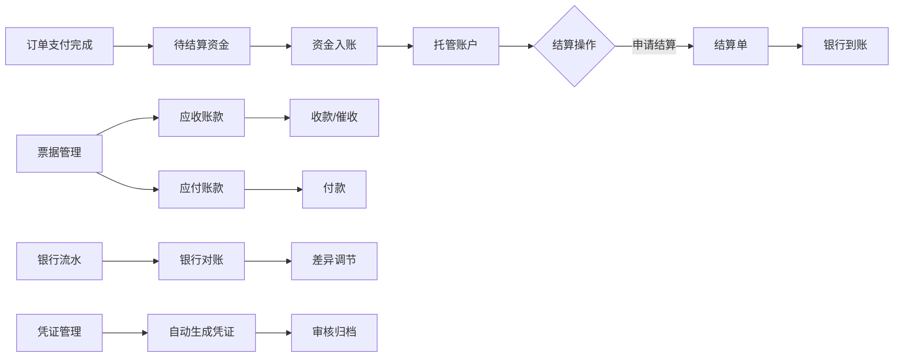

# 供应商端 - 财务中心功能详细设计

> 版本：v2.0（代码逆向）
> 文档状态：初稿
> 所属章节：第八章

## 版本历史

| 版本 | 日期 | 修订内容 | 修订人 |
|:----:|:----:|---------|:-----:|
| v1.0 | 2026-04-24 | 初始创建 | PM |
| v2.0 | 2026-05-22 | 按代码实际实现重写：从3个子模块扩展为9个子模块（资金托管/待结算/结算单/票据管理/支付记录/银行对账/凭证管理/发票管理/API对接），新增手工对账/凭证审核/账户充值提现等核心操作 | PM |

---

## 一、功能概述

### 1.1 功能定位

财务中心是供应商端的**资金管理和财务核算模块**，覆盖供应商与平台之间所有资金流转环节，包括托管账户管理、结算申请、资金到账追踪、票据管理、对账核算和凭证管理等完整财务链路。

### 1.2 核心概念

| 概念 | 说明 |
|:----|------|
| 资金托管 | 供应商在平台的托管账户，用于结算资金的收付中转 |
| 待结算 | 订单支付后待入账到托管账户的款项 |
| 结算单 | 供应商发起的结算申请单，将资金从托管账户提取 |
| 票据管理 | 应收账款/应付账款的管理，含收款/付款/催收操作 |
| 银行对账 | 将银行流水与系统流水进行匹配核对，生成调节表 |
| 凭证管理 | 会计记账凭证的生成、审核和归档 |

### 1.3 子模块清单

| 序号 | 子模块 | 主要功能 | 优先级 |
|:---:|:------|---------|:------:|
| 1 | 资金托管 | 账户概览、余额查询、充值、提现、交易记录 | P0 |
| 2 | 待结算 | 待入账/已入账资金查看、搜索过滤、导出 | P1 |
| 3 | 结算单 | 申请结算、结算单列表、详情查看 | P1 |
| 4 | 票据管理 | 应收账款/应付账款、登记收款/付款、催收 | P1 |
| 5 | 支付记录 | 支付流水查询、搜索过滤、详情查看、回单下载 | P1 |
| 6 | 银行对账 | 导入对账单、自动对账、手工对账、差异调节表 | P2 |
| 7 | 凭证管理 | 凭证列表、自动生成、审核、编辑、打印 | P2 |
| 8 | 发票管理 | 发票列表（路由入口） | P2 |
| 9 | API对接 | API密钥管理、回调地址配置、API文档、调用日志 | P2 |

---

## 二、核心设计原则

> **财务中心遵循"资金安全"和"流程闭环"两大原则。**

### 2.1 资金安全原则

- 资金托管账户的充值和提现需经过风控校验
- 结算申请需要填写银行账户信息，确保资金安全
- 所有操作均记录操作日志，可追溯

### 2.2 流程闭环原则

- 订单支付 → 待结算资金 → 结算申请 → 结算到账 → 凭证生成，全链路闭环
- 票据管理支持应收账款→催收→收款的全流程跟踪
- 银行对账实现系统内外部账务核对

---

## 三、功能点详细设计

### 3.1 资金托管（P0）

#### 3.1.1 页面布局

资金托管概览页分为3个主要区域：
1. **账户卡片区**：左侧展示托管账户余额卡片（账户余额/冻结金额/可用余额），右侧展示账户详细信息
2. **账户统计区**：本月充值/本月提现/本月收入/本月支出4个统计指标
3. **交易记录区**：支持按类型筛选（收入/支出/充值/提现/冻结/解冻）、时间范围筛选的交易记录列表

#### 3.1.2 核心操作

| 操作 | 交互逻辑 |
|:----|---------|
| 充值 | 点击"充值"→ 跳转充值页 → 输入金额/选择方式 → 确认充值 |
| 提现 | 点击"提现"→ 跳转提现页 → 输入金额/选择账户 → 确认提现 |
| 查看详情 | 点击交易记录 → 跳转交易详情页 |

#### 3.1.3 账户信息字段

| 字段 | 说明 |
|:----|------|
| 账户名称 | 供应商企业全称 |
| 托管账户号 | 系统分配的唯一账户号 |
| 开户银行 | 开户行名称 |
| 银行账号 | 关联的银行账号 |
| 开户日期 | YYYY-MM-DD |
| 账户状态 | 正常/冻结/注销 |
| 认证状态 | 已认证/未认证 |
| 绑定状态 | 已绑定/未绑定 |

#### 3.1.4 交易记录

支持按类型筛选：收入、支出、充值、提现、冻结、解冻
支持按时间范围筛选

---

### 3.2 待结算（P1）

#### 3.2.1 页面布局

- **统计卡片**：待入账金额、今日入账、本月入账、待入账笔数
- **Tab切换**：待入账 / 已入账 / 全部
- **搜索表单**：订单编号、采购方工程仓、入账状态、时间范围
- **收款列表**：订单编号、采购方、入账金额、支付时间、预计入账时间、实际入账时间、入账状态
- **操作**：导出

#### 3.2.2 入账状态定义

| 状态 | 说明 |
|:----|:-----|
| 待入账 | 支付完成，系统尚未入账 |
| 已入账 | 资金已进入托管账户 |
| 入账失败 | 入账异常，需人工处理 |

---

### 3.3 结算单（P1）

#### 3.3.1 页面布局

**结算单列表页**：
- **统计卡片**：可结算金额、结算中金额、本月已结算
- **操作按钮**：申请结算（跳转到结算申请页）
- **搜索表单**：结算单号、结算状态、申请时间
- **表格列**：结算单号、结算金额、结算银行、申请时间、结算状态、到账时间、操作（详情）

**结算申请页**：提交结算申请表单
**结算详情页**：结算单详细信息

#### 3.3.2 结算状态定义

| 状态 | 说明 |
|:----|:-----|
| 待审核 | 结算申请已提交，等待平台审核 |
| 处理中 | 平台审核通过，资金处理中 |
| 已到账 | 结算资金已到银行账户 |
| 已失败 | 结算失败 |

---

### 3.4 票据管理（P1）

#### 3.4.1 页面布局

- **统计卡片**：应收账款、应付账款、30天以上账龄、坏账预警
- **操作按钮**：登记应收、登记应付
- **Tab切换**：应收账款 / 应付账款

**应收账款 Tab**：
- 账龄告警：当有30天以上账龄账款时显示告警
- 表格列：应收单号、关联订单、应收金额、已收金额、未收金额、账龄(天)、到期日期、状态、操作（收款/详情/催收）

**应付账款 Tab**：
- 表格列：应付单号、供应商、应付金额、已付金额、未付金额、应付日期、状态、操作（付款/详情）

#### 3.4.2 核心操作

**登记收款 Modal**：
- 展示应收单信息（应收单号/关联订单/应收总额/已收金额/待收金额）
- 表单：收款金额、收款方式（银行转账/微信/支付宝/承兑汇票）、收款日期、备注
- 校验：收款金额不能超过待收金额

**登记应付/付款 Modal**：
- 展示应付单信息
- 表单：付款金额、付款方式、付款日期、备注

---

### 3.5 支付记录（P1）

#### 3.5.1 页面布局

- **统计卡片**：待支付订单、本月支付笔数、本月支付金额、累计手续费
- **搜索表单**：支付状态、支付方式、支付流水号、订单号、支付时间
- **操作**：搜索、重置、导出
- **表格列**：支付流水号、关联订单、支付方式、支付状态、支付金额、手续费、实际到账、付款方、支付时间、到账时间、操作（详情/回单）

#### 3.5.2 支付状态定义

| 状态 | 说明 |
|:----|:-----|
| 待支付 | 等待付款 |
| 支付成功 | 支付完成 |
| 支付失败 | 支付未成功 |
| 已退款 | 已发起退款 |

#### 3.5.3 支付方式

| 方式 | 标签颜色 |
|:----|:--------:|
| 对公转账 | 蓝 |
| 微信支付 | 绿 |
| 支付宝 | 蓝 |
| 余额支付 | 橙 |

---

### 3.6 银行对账（P2）

#### 3.6.1 页面布局

- **统计卡片**：已对账笔数、未对账笔数、已对账金额、差异金额
- **操作按钮**：导入银行对账单、自动对账、下载模板
- **Tab切换**：未对账 / 已对账 / 差异调节表

**未对账 Tab**：
- 表格列：银行流水号、交易时间、收入金额、支出金额、对方账户、对方户名、摘要、操作（手工对账/忽略）

**已对账 Tab**：
- 表格列：银行流水号、系统流水号、对账方式（自动/手工Tag）、银行金额、系统金额、对账人、对账时间、操作（取消对账）

**差异调节表 Tab**：
- 告警提示
- 调节项：银行账面余额、系统账面余额、企业已收银行未收、企业已付银行未付、银行已收企业未收、银行已付企业未付、调节后余额

#### 3.6.2 手工对账 Modal

左右分栏布局：
- 左栏：银行流水的详细信息（流水号/交易时间/交易金额/对方户名/摘要）
- 右栏：选择匹配的系统流水（搜索系统流水号，Radio单选），若金额有差异则显示差异

---

### 3.7 凭证管理（P2）

#### 3.7.1 页面布局

- **统计卡片**：待生成凭证、本月凭证数、已审核凭证、附件总数
- **搜索表单**：凭证状态、凭证类型（收款/付款/转账）、凭证号、制单日期
- **操作**：搜索、重置、自动生成凭证
- **表格列**：凭证号、凭证类型、摘要、借方金额、贷方金额、制单人、制单日期、审核人、状态、附件数、操作（查看/编辑/审核/打印/更多：上传附件/查看附件/删除）

#### 3.7.2 记账凭证 Modal

展示完整记账凭证：
- 凭证头：凭证号、制单日期、附件张数
- 分录表格：摘要、会计科目、借方金额、贷方金额
- 凭证尾：借方合计/贷方合计、制单人/审核人/记账人签名

#### 3.7.3 凭证状态定义

| 状态 | 说明 |
|:----|:-----|
| 待审核 | 已生成待审核 |
| 已审核 | 审核通过 |
| 已过账 | 已过账归档 |

---

### 3.8 发票管理（P2）

发票管理为路由入口页面，引导用户访问发票相关功能。

---

### 3.9 API对接（P2）

#### 3.9.1 页面布局

**Tab1 - API密钥管理**：
- 展示AppID、AppSecret（脱敏）、创建时间、最后使用时间、状态、IP白名单
- 操作：复制AppID、查看/重置AppSecret、配置IP白名单
- 回调地址表单：订单回调地址、支付回调地址、库存回调地址

**Tab2 - API文档**：
- API接口列表：接口名称、请求方式（GET/POST Tag）、描述
- 操作：查看文档

**Tab3 - 调用日志**：
- 搜索：时间范围、状态
- 操作：导出日志
- 表格列：调用时间、API名称、请求方式、响应状态、响应时间

---

## 四、权限矩阵

| 功能模块 | 操作 | 管理员 | 财务 | 说明 |
|:--------|:----|:-----:|:----:|------|
| **资金托管** | 查看概览 | ✅ | ✅ | - |
| | 充值/提现 | ✅ | ✅ | - |
| **待结算** | 查看/导出 | ✅ | ✅ | - |
| **结算单** | 申请结算 | ✅ | ✅ | - |
| **票据管理** | 登记收款/付款 | ✅ | ✅ | - |
| | 催收 | ✅ | ✅ | - |
| **支付记录** | 查看/导出 | ✅ | ✅ | - |
| **银行对账** | 导入/对账 | ✅ | ✅ | - |
| **凭证管理** | 查看/生成/审核 | ✅ | ✅ | - |

---

## 五、业务流程

---

## 六、异常处理汇总表

| 异常场景 | 处理逻辑 | 提示文案 |
|:--------|:--------|---------|
| 提现金额超过可用余额 | 表单校验 | "提现金额不能超过可用余额" |
| 银行对账差异过大 | 告警提示 | "差异金额较大，请核对明细" |
| 撤销已审核凭证 | 按钮置灰 | "已审核凭证不可编辑" |
| 手工对账金额不匹配 | 显示差异 | 括号标注差异金额 |
| 结算申请时无可结算金额 | 按钮置灰 | "暂无可结算金额" |
| 催收账龄不足15天 | 按钮置灰 | "账龄不足15天" |

---

## 七、接口需求说明

| 接口 | 用途 |
|:----|:-----|
| 托管账户信息 | 获取账户余额/冻结/可用金额及账户信息 |
| 交易记录列表 | 托管账户交易记录查询 |
| 充值 | 提交充值申请 |
| 提现 | 提交提现申请 |
| 待结算列表 | 待入账/已入账资金列表分页查询 |
| 结算单列表 | 结算单分页查询 |
| 申请结算 | 提交结算申请 |
| 结算详情 | 查询结算单详情 |
| 票据列表 | 应收/应付票据分页查询 |
| 登记收款 | 登记收款操作 |
| 登记付款 | 登记付款操作 |
| 支付记录列表 | 支付流水分页查询 |
| 导入对账单 | 上传并解析银行对账单 |
| 自动对账 | 系统自动匹配银行流水和系统流水 |
| 手工对账 | 人工匹配指定流水 |
| 取消对账 | 取消已对账记录 |
| 凭证列表 | 凭证分页查询 |
| 自动生成凭证 | 自动生成记账凭证 |
| 审核凭证 | 审核指定凭证 |
| API密钥管理 | 查询/重置API密钥 |
| 回调地址配置 | 保存回调地址 |
| API调用日志 | 分页查询API日志 |
