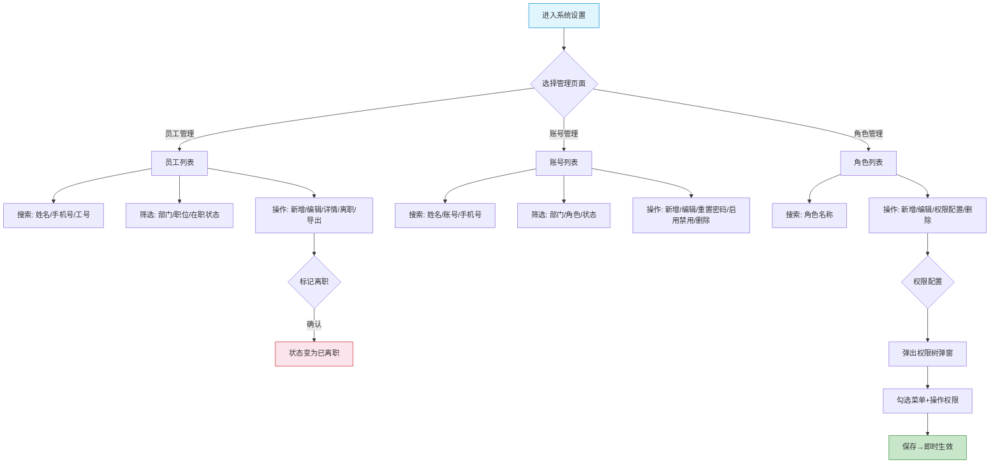

# 供应商端 - 系统设置功能详细设计

> 版本：v2.0（代码逆向）
> 文档状态：初稿
> 所属章节：第九章

## 版本历史

| 版本 | 日期 | 修订内容 | 修订人 |
|:----:|:----:|---------|:-----:|
| v1.0 | 2026-04-24 | 初始创建 | PM |
| v2.0 | 2026-05-22 | 按代码实际实现重写，覆盖员工管理/账号管理/角色管理三大页面，新增部门/职位筛选、重置密码、系统角色保护等真实功能 | PM |

---

## 一、功能概述

### 1.1 功能定位

系统设置是供应商端的**组织与权限管理模块**，提供员工管理、账号管理和角色管理三大核心能力。采用RBAC权限模型，支持精细化的功能权限控制。

### 1.2 核心概念

| 概念 | 说明 | 示例 |
|:----|------|------|
| 员工 | 供应商企业的实际人员，记录个人信息和在职状态 | 张三（销售部业务员） |
| 账号 | 员工的系统登录凭证，一个员工对应一个账号 | zhangsan（可登录系统） |
| 角色 | 权限的集合，不同角色拥有不同的操作权限 | 管理员/业务员/仓管员 |
| 权限配置 | 为角色勾选具体的菜单和操作权限（树形结构） | 商品管理→查看、订单管理→发货 |

### 1.3 目标用户

- **管理员**（唯一操作者）：管理所有员工、账号和角色权限
- **业务员/仓管员/财务/客服**：被管理对象，无系统设置操作权限

### 1.4 模块范围

| 功能页面 | 主要功能 | 优先级 |
|:--------|---------|:------:|
| 员工管理 | 员工列表、新增/编辑、详情查看、标记离职、导出 | P1 |
| 账号管理 | 账号列表、新增/编辑、重置密码、启用/禁用、删除 | P1 |
| 角色管理 | 角色列表、新增/编辑、权限树配置、系统角色保护 | P1 |

---

## 二、核心设计原则

### 2.1 RBAC权限模型

- 预设5个系统角色：管理员、业务员、仓管员、财务、客服
- 权限按功能菜单+按钮粒度进行树形配置
- 一个员工可拥有多个角色，权限取并集

### 2.2 员工-账号分离原则

- 员工管理和账号管理为两个独立的页面
- 一个员工只能有一个账号
- 账号创建时需指定已有员工，自动以手机号作为登录名
- 员工离职后账号可继续保留或禁用

### 2.3 系统角色保护

- 系统预设角色（如管理员）不可删除、不可编辑基本信息
- 系统角色的编码固定，不可修改
- 普通用户不可删除自身账号

---

## 三、业务规则

### 3.1 员工规则

- 员工状态：在职（on_job）/离职（dimission）/休假中（vacation）
- 员工信息包含：姓名、性别、手机号、部门、职位、直属上级、入职日期
- 标记离职操作不可逆，离职后员工不可登录系统

### 3.2 账号规则

- 账号状态：启用（1）/禁用（0）
- 重置密码：管理员可为任意账号重置密码，重置后账号需使用新密码登录
- 启用/禁用：禁用后账号无法登录系统
- 删除：仅非管理员账号可删除，删除后无法恢复

### 3.3 角色规则

- 角色状态：启用（1）/禁用（0）
- 系统角色（isSystem=true）：编码固定，不可编辑基本信息，不可删除
- 自定义角色：可编辑全部信息，可删除
- 权限配置变更即时生效，用户下次请求时刷新权限

### 3.4 核心业务流程图



---

## 四、权限矩阵

| 功能页面 | 具体操作 | 管理员 | 其他角色 | 说明 |
|:--------|---------|:------:|:--------:|------|
| **员工管理** | 查看列表/详情 | ✅ | ❌ | 仅管理员 |
| | 新增员工 | ✅ | ❌ | - |
| | 编辑员工 | ✅ | ❌ | - |
| | 标记离职 | ✅ | ❌ | - |
| | 导出员工 | ✅ | ❌ | - |
| **账号管理** | 查看列表 | ✅ | ❌ | 仅管理员 |
| | 新增账号 | ✅ | ❌ | - |
| | 编辑账号 | ✅ | ❌ | - |
| | 重置密码 | ✅ | ❌ | - |
| | 启用/禁用 | ✅ | ❌ | - |
| | 删除账号 | ✅ | ❌ | 不可删除自身/管理员 |
| **角色管理** | 查看列表 | ✅ | ❌ | 仅管理员 |
| | 新增角色 | ✅ | ❌ | - |
| | 编辑角色 | ✅ | ❌ | 系统角色不可编辑 |
| | 权限配置 | ✅ | ❌ | 树形勾选 |
| | 删除角色 | ✅ | ❌ | 系统角色不可删 |

---

## 五、非功能性需求

| 场景 | P95要求 |
|:----|:-------:|
| 员工/账号/角色列表查询 | ≤ 300ms |
| 权限配置保存 | ≤ 500ms |
| 重置密码 | ≤ 500ms |

---

## 六、功能点详细设计

### 6.1 员工管理（P1）

#### 交互逻辑

1. 页面加载：展示员工列表，支持分页（每页10条）
2. 搜索：支持按员工姓名、手机号、工号模糊搜索
3. 筛选：部门下拉、职位下拉、在职状态下拉（在职/已离职/休假中）
4. 新增：弹出Modal表单 → 填写姓名/性别/手机号/部门/职位/直属上级/入职日期 → 保存
5. 编辑：选中已有员工 → 弹出Modal表单（预填数据）→ 修改后保存
6. 详情：点击姓名Link → 查看员工详细信息
7. 离职：点击"离职"按钮 → Popconfirm确认 → 标记为已离职
8. 导出：点击导出按钮 → 下载员工列表Excel

#### 页面字段

| 字段 | 必填 | 来源 | 展示规则 |
|:----|:----|:----:|:--------|
| 工号 | 是 | 系统 | 文本 |
| 姓名 | 是 | 表单 | 链接，点击可查看详情 |
| 性别 | 是 | 表单 | 男/女 |
| 手机号 | 是 | 表单 | 文本 |
| 部门 | 是 | 表单 | 下拉选项 |
| 职位 | 是 | 表单 | 下拉选项 |
| 直属上级 | 否 | 表单 | 文本 |
| 入职日期 | 是 | 表单 | YYYY-MM-DD |
| 在职状态 | 是 | 系统 | Tag：在职(绿)/已离职(红)/休假中(橙) |
| 创建时间 | 是 | 系统 | YYYY-MM-DD HH:mm |

#### 边界情况

| 场景 | 处理逻辑 |
|:----|:--------|
| 手机号重复 | 后端校验，提示"手机号已被使用" |
| 标记离职后登录 | 账号自动禁用，无法登录 |
| 删除有账号关联的员工 | 先删除账号或解绑 |

---

### 6.2 账号管理（P1）

#### 交互逻辑

1. 页面加载：展示账号列表，支持分页
2. 搜索：支持按姓名、账号、手机号模糊搜索
3. 筛选：部门下拉、角色下拉、状态下拉（启用/禁用）
4. 新增：弹出Modal → 选择关联员工 → 设置角色 → 保存（自动以手机号创建登录名）
5. 编辑：选中账号 → 修改角色/状态 → 保存
6. 重置密码：点击"重置密码" → 弹出确认 → 密码重置为默认密码 → Toast提示
7. 启用/禁用：点击按钮 → 切换账号状态
8. 删除：Popconfirm确认 → 删除账号（管理员账号不可删）

#### 页面字段

| 字段 | 必填 | 来源 | 展示规则 |
|:----|:----|:----:|:--------|
| 员工ID | 是 | 系统 | 文本 |
| 姓名 | 是 | 员工关联 | 链接 |
| 账号 | 是 | 系统生成(手机号) | 文本 |
| 手机号 | 是 | 员工关联 | 文本 |
| 部门 | 是 | 员工关联 | 文本 |
| 职位 | 是 | 员工关联 | 文本 |
| 角色 | 是 | 角色分配 | Tag标签（可多个） |
| 状态 | 是 | 系统 | Tag：启用(绿)/禁用(红) |
| 最后登录 | 否 | 系统记录 | YYYY-MM-DD HH:mm |
| 创建时间 | 是 | 系统 | YYYY-MM-DD HH:mm |

#### 边界情况

| 场景 | 处理逻辑 |
|:----|:--------|
| 删除管理员账号 | 按钮置灰/隐藏，不可操作 |
| 管理员禁用自身 | 允许，但需提示"禁用后将无法登录" |
| 重置密码 | 重置后强制要求修改密码 |

---

### 6.3 角色管理（P1）

#### 交互逻辑

1. 页面加载：展示角色列表，支持分页
2. 搜索：按角色名称搜索
3. 筛选：状态下拉（启用/禁用）
4. 新增：弹出Modal → 填写角色名称/编码/描述 → 保存
5. 编辑：选中角色 → 弹出Modal（预填，系统角色编码不可编辑）→ 保存
6. 权限配置：点击"权限" → 弹出权限树弹窗 → 树形勾选菜单+操作权限 → 保存
7. 删除：Popconfirm确认 → 删除（系统角色不可删）

#### 页面字段

| 字段 | 必填 | 来源 | 展示规则 |
|:----|:----|:----:|:--------|
| 角色名称 | 是 | 表单 | 文本 |
| 角色编码 | 是 | 表单 | 文本，系统角色固定 |
| 描述 | 否 | 表单 | 文本 |
| 用户数 | 是 | 系统 | 数字（该角色关联的员工数） |
| 状态 | 是 | 表单 | Switch：启用/禁用 |
| 创建时间 | 是 | 系统 | YYYY-MM-DD HH:mm |

#### 权限树结构（参考）

```
供应商端
├── 工作台: 查看
├── 商户信息: 查看、编辑
├── 商品中心
│   ├── 商品列表: 查看、新增、编辑、上架、下架
│   ├── 库存查询: 查看
│   └── 库存流水: 查看
├── 订单管理
│   ├── 订单列表: 查看、确认、发货、审核支付
│   └── 售后管理: 查看、处理
├── 财务中心
│   ├── 发票管理: 查看、新增、导出
│   ├── 待入账: 查看
│   ├── 结算单: 查看、申请结算
│   ├── 账单: 查看
│   ├── 付款: 查看
│   ├── 对账: 查看、导入
│   ├── 凭证: 查看
│   ├── 资金托管: 查看、充值、提现
│   └── API管理: 查看
└── 系统设置
    ├── 员工管理: 查看、新增、编辑、离职、导出
    ├── 账号管理: 查看、新增、编辑、重置密码、启用禁用、删除
    └── 角色管理: 查看、新增、编辑、权限配置、删除
```

---

## 七、异常处理汇总表

| 异常场景 | 处理逻辑 | 提示文案 |
|:--------|:--------|---------|
| 新增员工手机号重复 | 后端校验 | "手机号已被其他员工使用" |
| 删除有账号的员工 | 前端拦截 | "该员工有关联账号，请先删除账号" |
| 删除系统角色 | 按钮置灰 | - |
| 删除管理员自身账号 | 按钮置灰 | - |
| 权限配置保存失败 | Toast提示 | "权限保存失败，请重试" |

---

## 八、接口需求说明

| 接口 | 用途 | 说明 |
|:----|:----|:----|
| 员工列表 | 分页查询员工 | 支持关键词/部门/职位/在职状态筛选 |
| 新增员工 | 创建员工 | - |
| 编辑员工 | 修改员工信息 | - |
| 标记离职 | 员工离职操作 | - |
| 导出员工 | 导出员工列表 | - |
| 账号列表 | 分页查询账号 | 支持关键词/部门/角色/状态筛选 |
| 新增账号 | 创建账号 | 关联员工+分配角色 |
| 编辑账号 | 修改账号信息 | - |
| 重置密码 | 重置账号密码 | - |
| 启用/禁用账号 | 切换账号状态 | - |
| 删除账号 | 删除指定账号 | 系统角色不可删 |
| 角色列表 | 分页查询角色 | 支持关键词/状态筛选 |
| 新增角色 | 创建角色 | - |
| 编辑角色 | 修改角色信息 | 系统角色编码不可改 |
| 角色权限保存 | 保存权限树配置 | - |
| 删除角色 | 删除指定角色 | 系统角色不可删 |
