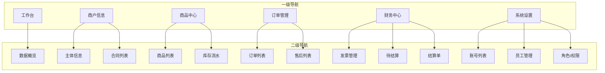

# 供应商端 - 页面导航设计

> 版本：v1.0  
> 文档状态：初稿  
> 所属章节：第十章

## 版本历史

| 版本 | 日期 | 修订内容 |
|:----:|:----:|---------|
| v1.0 | 2026-04-24 | 初始创建，覆盖21个页面索引+导航关系图 |

---

## 一、功能概述

### 1.1 功能定位

本文档定义供应商端所有页面的导航关系、页面索引、页面跳转交互规则，是前端开发的导航设计参考。

### 1.2 目标用户

- **前端开发工程师**：基于导航设计实现路由配置和页面跳转
- **测试工程师**：基于页面关系设计测试用例

---

## 二、页面索引

| 序号 | 页面名称 | 路由路径 | 归属菜单 | 关联功能模块 | 页面类型 |
|:----:|---------|:--------:|---------|:-----------:|:--------:|
| 1 | 工作台-数据概览 | /dashboard | 工作台 | 数据概览 | 列表/看板 |
| 2 | 主体信息查看 | /profile/view | 商户信息 | 主体信息 | 详情 |
| 3 | 主体信息编辑 | /profile/edit | 商户信息 | 主体信息 | 表单 |
| 4 | 合同列表 | /contracts | 商户信息 | 合同列表 | 列表 |
| 5 | 商品列表 | /products | 商品中心 | 商品管理 | 列表 |
| 6 | 商品新增 | /products/create | 商品中心 | 商品管理 | 表单 |
| 7 | 商品编辑 | /products/:id/edit | 商品中心 | 商品管理 | 表单 |
| 8 | 商品详情 | /products/:id | 商品中心 | 商品管理 | 详情 |
| 9 | 库存流水 | /products/stock-log | 商品中心 | 库存管理 | 列表 |
| 10 | 订单列表 | /orders | 订单管理 | 订单管理 | 列表 |
| 11 | 订单详情 | /orders/:id | 订单管理 | 订单管理 | 详情 |
| 12 | 售后列表 | /orders/after-sales | 订单管理 | 售后管理 | 列表 |
| 13 | 发票列表 | /finance/invoices | 财务中心 | 发票管理 | 列表 |
| 14 | 新增发票 | /finance/invoices/create | 财务中心 | 发票管理 | 表单 |
| 15 | 发票详情 | /finance/invoices/:id | 财务中心 | 发票管理 | 详情 |
| 16 | 待结算列表 | /finance/pending | 财务中心 | 结算管理 | 列表 |
| 17 | 结算单列表 | /finance/settlements | 财务中心 | 结算管理 | 列表 |
| 18 | 账号列表 | /settings/accounts | 系统设置 | 账号管理 | 列表 |
| 19 | 员工管理 | /settings/employees | 系统设置 | 员工管理 | 列表 |
| 20 | 角色列表 | /settings/roles | 系统设置 | 角色管理 | 列表 |
| 21 | 权限配置 | /settings/roles/:id/permissions | 系统设置 | 权限管理 | 表单 |

---

## 三、导航关系图

---

## 四、页面跳转交互规则

### 4.1 登录跳转

| 场景 | 跳转目标 | 逻辑 |
|-----|---------|------|
| 首次登录 | 工作台-数据概览 | 默认进入工作台 |
| 从链接进入 | 具体页面 | 路由不匹配时重定向404 |
| Token过期 | 登录页 | 清除Token，重定向到登录 |

### 4.2 列表→详情跳转

- 点击列表行/卡片 → 跳转详情页
- 详情页返回 → 回到列表页并保持之前的筛选状态

### 4.3 操作跳转

- 新增/编辑提交成功 → 跳转列表页（刷新数据）
- 删除操作 → 停留在列表页（刷新数据）

