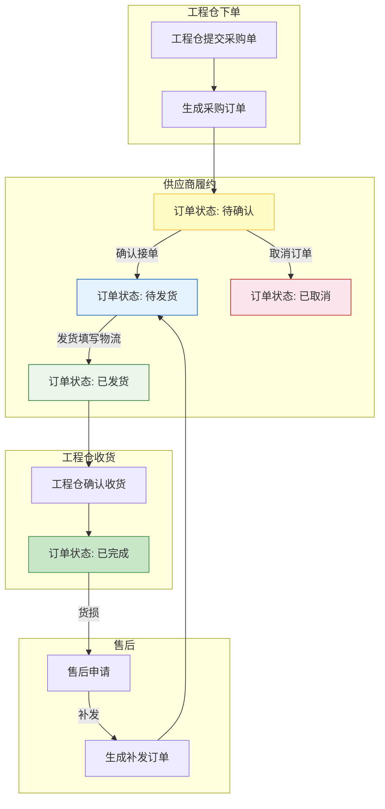
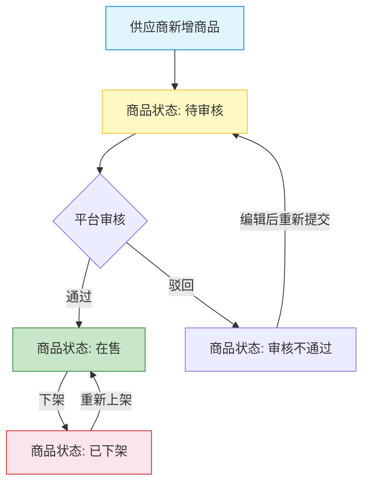

# 供应商端 - 产品需求文档

> 版本：v1.0  
> 文档状态：初稿  
> 创建日期：2026-04-24  
> 文档负责人：产品团队  
> 所属模块：供应商端 - 全模块  
> 文档类型：SKILL格式PRD（融合文档深度+结构化输出）

## 版本历史

| 版本 | 日期 | 修订内容 |
|:----:|:----:|---------|
| v1.0 | 2026-04-24 | 初始创建，覆盖供应商端31个功能点完整详细设计 |

---

## 零、文档索引

| 章节编号 | 名称 | 内容概要 | 面向角色 |
|:--------:|------|---------|:--------:|
| — | [prd.md](prd.md)（本文） | 总纲：设计原则、术语表、角色权限、功能全景、核心流程图、四端边界 | 全局 |
| 01 | [01-系统概览与架构.md](01-系统概览与架构.md) | 系统定位、技术架构、模块树、角色定义 | 全局 |
| 02 | [02-业务流程设计.md](02-业务流程设计.md) | 8张流程图：订单履约、商品供货、售后补发、发票管理 | 全局 |
| 04 | [04-领域模型设计.md](04-领域模型设计.md) | 6实体、4服务、5事件、DDD分层架构 | 后端 |
| 05 | [05-工作台与商户中心功能设计.md](05-工作台与商户中心功能设计.md) | 数据概览、主体信息查看/编辑、合同列表(1P1+2P1+1P2) | 前后端 |
| 06 | [06-商品中心功能设计.md](06-商品中心功能设计.md) | 商品列表/新增/编辑/详情/上下架/库存/流水(5P0+2P1) | 前后端 |
| 07 | [07-订单管理功能设计.md](07-订单管理功能设计.md) | 订单列表/详情/确认/取消/发货/打印/售后补发(7P0+4P1+1P2) | 前后端 |
| 08 | [08-财务中心功能设计.md](08-财务中心功能设计.md) | 发票列表/新增/关联/详情/下载/待结算/结算单(5P1+2P2) | 前后端 |
| 09 | [09-系统设置功能设计.md](09-系统设置功能设计.md) | 账号列表/员工管理/角色列表/权限配置(4P1) | 前后端 |
| 10 | [10-页面导航设计.md](10-页面导航设计.md) | 供应商端30个页面索引+路由配置+导航关系Mermaid图 | 前端 |

---

## 一、核心设计原则（Skill：订单三状态分离+商品两段定义）

> 供应商端是平台**商品供应方**和**订单履约方**，核心职责是"接单+发货"。

### 1.1 订单三状态独立运行（沿袭平台规范）

| 状态轨道 | 状态值 | 核心规则 | 说明 |
|---------|-------|---------|------|
| **订单主状态** | pending → confirmed → shipped → completed / cancelled | 订单的履约语义，**不依赖支付** | 订单生命周期主干 |
| **支付状态** | unpaid → paid → refunded | 只做**标记记录**，不做强校验 | 线下转账场景适配 |
| **发货状态** | pending → partial → shipped | **不管付没付钱都能发货** | 熟人生意核心特征 |

```mermaid
graph TB
    subgraph 订单状态（三轨道独立运行）
        O[订单主状态] -->|独立| P[支付状态]
        O -->|独立| S[发货状态]
    end
    P -->|线下转账凭证记录| F[供应商收款]
    S -->|不用等支付确认| D[先发货后付款]
    style P fill:#f9f,stroke:#333
    style S fill:#9cf,stroke:#333
    style F fill:#f96,stroke:#333
    style D fill:#6f9,stroke:#333
```

### 1.2 商品两段定义

| 阶段 | 定义方 | 供应商角色 | 下游消费方 |
|------|-------|-----------|:----------:|
| 标准商品定义 | 平台端 | 从平台商品库选择 | 全部端可见 |
| 供货规格配置 | 供应商端 | 设置供货价、库存 | 仅工程仓可见 |

### 1.3 线下生意真相

> 供应商说"先发货，钱下午转"，工程仓就直接收了  
> 系统**不做强支付校验**，只做**状态记录**！  
> 货损售后也是电话沟通为主，系统做凭证+流程记录。

---

## 二、术语表

| 术语 | 说明 |
|------|------|
| **供应商** | 建材供货企业，在平台上向工程仓提供商品 |
| **采购订单** | 工程仓→供应商的采购单据 |
| **供货价** | 供应商为商品设定的销售价格，仅工程仓可见 |
| **供货状态** | 供应商商品的上架/下架状态，控制工程仓能否采购 |
| **货损** | 货物在运输/收货过程中发生的损坏 |
| **补发** | 货损后供应商重新发货的处理流程 |
| **待结算** | 已发货待结算货款的订单汇总 |
| **结算单** | 供应商与平台按周期结算的对账单 |

---

## 三、用户角色与权限矩阵

### 3.1 角色定义

| 角色 | 系统标识 | 核心职责 | 使用端 |
|------|---------|---------|:------:|
| **管理员** | admin | 全功能管理，含账号/角色配置 | PC |
| **业务员** | operator | 日常订单处理、商品管理 | PC |
| **仓管员** | warehouse | 发货操作、库存管理 | PC |
| **财务人员** | finance | 发票管理、结算对账 | PC |
| **客服** | service | 售后处理、补发管理 | PC |

### 3.2 权限全景矩阵

| 操作/功能 | 管理员 | 业务员 | 仓管员 | 财务 | 客服 |
|-----------|:------:|:------:|:------:|:----:|:----:|
| 数据概览查看 | ✅ | ✅ | ❌ | ✅ | ❌ |
| 商品管理（CRUD） | ✅ | ✅ | ❌ | ❌ | ❌ |
| 商品上下架 | ✅ | ✅ | ❌ | ❌ | ❌ |
| 订单接单/取消 | ✅ | ✅ | ❌ | ❌ | ❌ |
| 订单发货 | ✅ | ❌ | ✅ | ❌ | ❌ |
| 售后/补发处理 | ✅ | ❌ | ❌ | ❌ | ✅ |
| 发票管理 | ✅ | ❌ | ❌ | ✅ | ❌ |
| 结算对账 | ✅ | ❌ | ❌ | ✅ | ❌ |
| 员工/角色管理 | ✅ | ❌ | ❌ | ❌ | ❌ |
| 系统配置 | ✅ | ❌ | ❌ | ❌ | ❌ |

---

## 四、功能全景（Skill：8列CSV格式）

| 所属端 | 模块 | 一级菜单 | 二级菜单 | 核心功能点 | 物理文件 | 优先级 | 备注 |
|-------|------|---------|---------|-----------|---------|:------:|------|
| 供应商端 | 首页 | 工作台 | 工作台 | 数据概览 | 05-工作台与商户中心功能设计.md | P1 | 运营数据看板 |
| 供应商端 | 商户信息 | 商户信息 | 主体信息 | 查看/编辑主体信息 | 05-工作台与商户中心功能设计.md | P1 | 商户档案 |
| 供应商端 | 商户信息 | 商户信息 | 合同列表 | 查看合同列表 | 05-工作台与商户中心功能设计.md | P2 | 合同查看 |
| 供应商端 | 商品中心 | 商品中心 | 商品列表 | 商品列表 | 06-商品中心功能设计.md | P0 | 列表展示 |
| 供应商端 | 商品中心 | 商品中心 | 商品列表 | 新增商品 | 06-商品中心功能设计.md | P0 | 提交平台审核 |
| 供应商端 | 商品中心 | 商品中心 | 商品列表 | 编辑商品 | 06-商品中心功能设计.md | P0 | 信息修改 |
| 供应商端 | 商品中心 | 商品中心 | 商品列表 | 商品详情 | 06-商品中心功能设计.md | P0 | 详情展示 |
| 供应商端 | 商品中心 | 商品中心 | 商品列表 | 上下架 | 06-商品中心功能设计.md | P0 | 状态变更 |
| 供应商端 | 商品中心 | 商品中心 | 商品列表 | 库存查询 | 06-商品中心功能设计.md | P1 | 库存监控 |
| 供应商端 | 商品中心 | 商品中心 | 库存记录 | 库存流水 | 06-商品中心功能设计.md | P1 | 变更记录 |
| 供应商端 | 订单管理 | 订单管理 | 订单列表 | 订单列表 | 07-订单管理功能设计.md | P0 | 多Tab筛选 |
| 供应商端 | 订单管理 | 订单管理 | 订单列表 | 订单详情 | 07-订单管理功能设计.md | P0 | 详情页 |
| 供应商端 | 订单管理 | 订单管理 | 订单列表 | 确认订单 | 07-订单管理功能设计.md | P0 | 接单 |
| 供应商端 | 订单管理 | 订单管理 | 订单列表 | 取消订单 | 07-订单管理功能设计.md | P1 | 取消 |
| 供应商端 | 订单管理 | 订单管理 | 订单列表 | 订单发货 | 07-订单管理功能设计.md | P0 | 填写物流 |
| 供应商端 | 订单管理 | 订单管理 | 订单列表 | 发货打印 | 07-订单管理功能设计.md | P0 | 打印发货单 |
| 供应商端 | 订单管理 | 订单管理 | 售后管理 | 售后列表 | 07-订单管理功能设计.md | P1 | 售后查看 |
| 供应商端 | 订单管理 | 订单管理 | 售后管理 | 货损处理 | 07-订单管理功能设计.md | P1 | 查看货损 |
| 供应商端 | 订单管理 | 订单管理 | 售后管理 | 补发处理 | 07-订单管理功能设计.md | P1 | 补发操作 |
| 供应商端 | 订单管理 | 订单管理 | 售后管理 | 拒绝补发 | 07-订单管理功能设计.md | P2 | 拒绝+原因 |
| 供应商端 | 财务中心 | 财务中心 | 发票管理 | 发票列表 | 08-财务中心功能设计.md | P1 | 列表展示 |
| 供应商端 | 财务中心 | 财务中心 | 发票管理 | 新增发票 | 08-财务中心功能设计.md | P1 | 上传发票 |
| 供应商端 | 财务中心 | 财务中心 | 发票管理 | 关联订单 | 08-财务中心功能设计.md | P1 | 关联 |
| 供应商端 | 财务中心 | 财务中心 | 发票管理 | 发票详情 | 08-财务中心功能设计.md | P1 | 详情 |
| 供应商端 | 财务中心 | 财务中心 | 发票管理 | 下载发票 | 08-财务中心功能设计.md | P2 | 下载 |
| 供应商端 | 财务中心 | 财务中心 | 待结算 | 待结算列表 | 08-财务中心功能设计.md | P1 | 结算管理 |
| 供应商端 | 财务中心 | 财务中心 | 结算单 | 结算单列表 | 08-财务中心功能设计.md | P1 | 结算记录 |
| 供应商端 | 系统设置 | 系统设置 | 账号列表 | 账号列表 | 09-系统设置功能设计.md | P1 | 管理账号 |
| 供应商端 | 系统设置 | 系统设置 | 员工管理 | 员工列表 | 09-系统设置功能设计.md | P1 | 管理员工 |
| 供应商端 | 系统设置 | 系统设置 | 角色列表 | 角色列表 | 09-系统设置功能设计.md | P1 | 管理角色 |
| 供应商端 | 系统设置 | 系统设置 | 角色列表 | 权限配置 | 09-系统设置功能设计.md | P1 | 配置权限 |

---

## 五、核心业务流程图（全景）

### 5.1 订单履约链路（供应商视角）



### 5.2 商品上架审核流程



---

## 六、多端边界定义

| 能力维度 | 供应商端 | 平台端 | 工程仓端 |
|---------|:--------:|:------:|:--------:|
| 商品定义（分类/SPU/SKU） | ❌ 消费 | ✅ 定义 | ❌ 消费 |
| 供货价格设置 | ✅ 设置 | ✅ 审核 | ❌ 不可见 |
| 订单确认/发货 | ✅ 操作 | ❌ 只读 | ❌ 采购方 |
| 全平台订单查看 | ❌ 仅自己 | ✅ 全量 | ❌ 仅自己 |
| 商品审核 | ❌ 不可 | ✅ 审核 | ❌ 不可 |
| 售后补发管理 | ✅ 处理 | ❌ 不可 | ❌ 不可 |

---

## 七、全局交互规范

### 7.1 页面加载

| 场景 | 处理方式 | 示意 |
|-----|---------|------|
| 首次加载 | 全页Loading Skeleton | 灰色骨架屏脉冲动画 |
| 列表加载 | 底部滚动loading指示器 | 旋转loading+文字"加载中..." |
| 局部刷新 | 仅更新区域，不做全页刷新 | 区域遮罩+spin |

### 7.2 空状态

| 场景 | 处理方式 | 提示文案 |
|-----|---------|---------|
| 列表无数据 | 居中空状态插画+文字 | "暂无{数据名称}" |
| 搜索无结果 | 空状态+搜索建议 | "未找到'{关键词}'相关结果" |
| 功能未开放 | 提示入口 | "该功能即将开放，敬请期待" |

### 7.3 错误处理

| 异常场景 | UI表现 | 用户操作 |
|---------|-------|---------|
| 网络异常 | Toast提示"网络异常，请检查网络连接" | 自动重试3次后提示手动刷新 |
| 请求超时 | 区域重试按钮 | 点击重试 |
| 服务端错误 | 页面顶部通知条 | 刷新页面或联系管理员 |
| 无权限访问 | 页面级提示 | "您暂无该功能权限，请联系管理员" |

### 7.4 操作反馈

| 操作类型 | 反馈方式 | 说明 |
|---------|---------|------|
| 保存/提交 | Toast "操作成功" / "操作失败：{原因}" | 2秒自动消失 |
| 删除 | Modal二次确认（黄色警告）+ Toast | "确认删除{名称}？" |
| 批量操作 | 操作完成后Toast汇总结果 | "成功N条，失败M条" |
| 状态变更 | Toast+列表自动刷新 | "状态已更新" |

