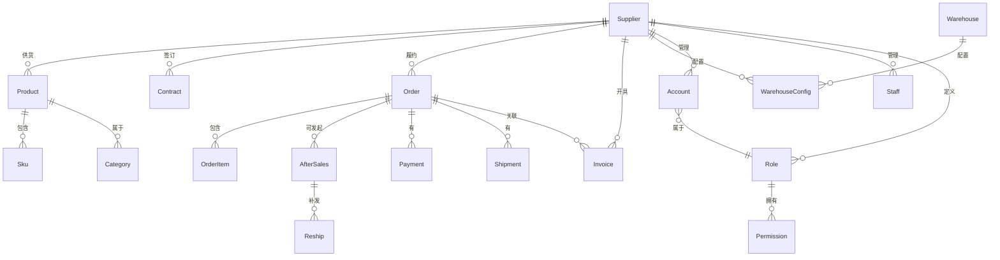

# 供应商端 - 产品需求文档（基于代码实现）

> **版本**：v2.0  
> **文档状态**：代码逆向文档（基于前端代码实现反推）  
> **创建日期**：2026-05-22  
> **文档负责人**：产品团队  
> **所属模块**：供应商端 - 全模块  
> **文档类型**：代码逆向PRD（反映真实实现状态）  

## 版本历史

| 版本 | 日期 | 修订内容 |
|:----:|:----:|---------|
| v1.0 | 2026-04-24 | 初始PRD（需求设计稿） |
| v2.0 | 2026-05-22 | 基于前端代码实现逆向生成，反映真实实现状态 |

---

## 文档索引

| 章节 | 名称 | 内容概要 |
|:----:|------|---------|
| 一 | 系统概述与技术架构 | 项目定位、技术栈、模块树 |
| 二 | 术语表 | 核心业务术语定义 |
| 三 | 用户角色与权限矩阵 | 角色定义、权限矩阵 |
| 四 | 功能全景清单 | 所有功能点清单（代码实现映射） |
| 五 | 路由与导航结构 | 路由树、菜单结构、多端切换 |
| 六 | 工作台模块 | Dashboard页面功能说明 |
| 七 | 商户信息模块 | 主体信息、合同管理 |
| 八 | 商品中心模块 | 商品列表、新增/编辑、库存记录 |
| 九 | 订单管理模块 | 订单列表、订单详情、售后管理 |
| 十 | 财务中心模块 | 发票管理、发票详情、OCR识别 |
| 十一 | 系统设置模块（代码已完成未接入路由） | 账号管理、员工管理、角色管理 |
| 十二 | 供应商工程仓配置 | 配置管理（平台端路由） |
| 十三 | 数据模型与枚举定义 | 核心实体、状态枚举 |
| 十四 | 接口契约 | 接口定义（基于Mock数据结构） |
| 十五 | 测试用例矩阵 | 功能测试、状态机覆盖 |
| 十六 | 待澄清问题清单 | 需确认问题 |

---

## 一、系统概述与技术架构

### 1.1 项目定位

供应商端是**工程仓采供一体化平台**的供应商门户子系统，为材料供应商提供商品管理、订单履约、发货管理、财务对账等核心业务能力。供应商通过本系统实现"接单→发货→结算"的全链路数字化管理。

### 1.2 技术架构

| 维度 | 选型 |
|------|------|
| 框架 | Vue 3 (Composition API + `<script setup>`) |
| 语言 | TypeScript |
| UI组件库 | Arco Design Vue 2.x |
| 状态管理 | Pinia |
| 路由 | Vue Router 4 |
| 构建工具 | Vite 5 |
| 包管理 | pnpm workspace (monorepo) |
| 公共包 | `@gongchengcang/types` `@gongchengcang/utils` `@gongchengcang/api` `@gongchengcang/constants` |

### 1.3 供应商端在整个系统中的定位

| 能力维度 | 供应商端 | 平台端 | 工程仓端 |
|---------|:--------:|:------:|:--------:|
| 商品定义（分类/SPU/SKU） | ❌ 消费平台商品 | ✅ 定义标准商品 | ❌ 消费 |
| 供货价格设置 | ✅ 设置供货价 | ✅ 审核 | ❌ 不可见 |
| 订单确认/发货 | ✅ 接单+发货 | ❌ 只读 | ❌ 采购方 |
| 全平台订单查看 | ❌ 仅自己 | ✅ 全量 | ❌ 仅自己 |
| 商品审核 | ❌ 不可 | ✅ 审核 | ❌ 不可 |
| 售后补发管理 | ✅ 处理补发 | ❌ 不可 | ❌ 不可 |
| 发票管理 | ✅ 上传开票 | ✅ 审核 | ❌ 不可 |

---

## 二、术语表

| 术语 | 说明 |
|------|------|
| **供应商** | 建材供货企业，在平台上向工程仓提供商品 |
| **采购订单** | 工程仓→供应商的采购单据 |
| **SPU** | 标准产品单元（商品聚合），如"立邦漆5L白色" |
| **SKU** | 库存量单位（具体售卖规格），如"立邦漆5L白色/哑光" |
| **供货价** | 供应商为商品设定的销售价格，仅工程仓可见 |
| **供货状态** | 供应商商品的供货控制：供货中/暂停供货/永久停货 |
| **审核状态** | 商品审核状态：待审核/已通过/已驳回 |
| **上架状态** | 商品在工程仓是否可见：已上架/已下架 |
| **补发** | 货损/售后后供应商重新发货的处理流程 |
| **OCR识别** | 发票图片光学字符识别，自动提取发票信息 |
| **结算单** | 供应商与平台按周期结算的对账单 |

---

## 三、用户角色与权限矩阵

### 3.1 角色定义

> ⚠️ 注意：以下角色定义和权限矩阵是基于代码中Mock数据推断，前端尚未实现完整的RBAC权限拦截逻辑，实际以接口权限为准。

| 角色 | 系统标识 | 核心职责 | 使用端 |
|------|---------|---------|:------:|
| **管理员** | admin | 全功能管理，含账号/角色/员工配置 | PC |
| **业务员** | operator | 日常订单处理、商品管理 | PC |
| **仓管员** | warehouse | 发货操作、库存管理 | PC |
| **财务** | finance | 发票管理、结算对账 | PC |
| **客服** | service | 售后处理、补发管理 | PC |

### 3.2 权限矩阵（建议）

| 操作/功能 | 管理员 | 业务员 | 仓管员 | 财务 | 客服 |
|-----------|:------:|:------:|:------:|:----:|:----:|
| 工作台数据概览 | ✅ | ✅ | ❌ | ✅ | ❌ |
| 主体信息查看/编辑 | ✅ | ❌ | ❌ | ❌ | ❌ |
| 合同列表查看 | ✅ | ✅ | ❌ | ❌ | ❌ |
| 商品列表查看 | ✅ | ✅ | ✅ | ❌ | ❌ |
| 新增/编辑商品 | ✅ | ✅ | ❌ | ❌ | ❌ |
| 商品上架/下架 | ✅ | ✅ | ❌ | ❌ | ❌ |
| 从平台库选择商品 | ✅ | ✅ | ❌ | ❌ | ❌ |
| 库存记录查看 | ✅ | ✅ | ✅ | ❌ | ❌ |
| 订单接单/拒绝 | ✅ | ✅ | ❌ | ❌ | ❌ |
| 订单发货 | ✅ | ❌ | ✅ | ❌ | ❌ |
| 导出待发货单 | ✅ | ❌ | ✅ | ❌ | ❌ |
| 售后/补发处理 | ✅ | ❌ | ❌ | ❌ | ✅ |
| 发票管理（开票/作废） | ✅ | ❌ | ❌ | ✅ | ❌ |
| OCR识别发票 | ✅ | ❌ | ❌ | ✅ | ❌ |
| 结算管理 | ✅ | ❌ | ❌ | ✅ | ❌ |
| 账号管理 | ✅ | ❌ | ❌ | ❌ | ❌ |
| 员工管理 | ✅ | ❌ | ❌ | ❌ | ❌ |
| 角色管理 | ✅ | ❌ | ❌ | ❌ | ❌ |
| 系统角色不可删除/编辑 | ✅ | ✅ | ✅ | ✅ | ✅ |

---

## 四、功能全景清单（代码实现映射）

| 所属模块 | 菜单名称 | 页面路径 | 核心功能点 | 物理文件 | 代码状态 |
|---------|---------|---------|-----------|---------|:--------:|
| 工作台 | 工作台 | /supplier/dashboard | 数据概览、待处理事项、快捷入口 | dashboard/index.vue | ✅ 已实现Mock |
| 商户信息 | 主体信息 | /supplier/merchant/profile | 基础信息、资质管理、合同信息 | profile/index.vue | ✅ 已实现Mock |
| 商户信息 | 合同列表 | /supplier/merchant/contract | 合同CRUD、搜索筛选、详情弹窗 | contract/index.vue | ✅ 已实现Mock |
| 商品中心 | 商品列表 | /supplier/product/list | SPU/SKU双Tab、分类树、从平台库选择 | product/index.vue | ✅ 已实现Mock |
| 商品中心 | 新增商品 | /supplier/product/add | 基本信息、规格属性、SKU生成 | product/detail.vue | ✅ 已实现Mock |
| 商品中心 | 编辑商品 | /supplier/product/edit/:id | 同上（编辑模式） | product/detail.vue | ✅ 已实现Mock |
| 商品中心 | 商品详情 | /supplier/product/view/:id | 同上（查看模式） | product/detail.vue | ✅ 已实现Mock |
| 商品中心 | 库存记录 | /supplier/product/inventory | 发货汇总/明细双Tab、搜索导出 | product/inventory.vue | ✅ 已实现Mock |
| 订单管理 | 订单列表 | /supplier/order/list | 多Tab筛选、搜索、详情弹窗(5Tab) | order/index.vue | ✅ 已实现Mock |
| 订单管理 | 售后管理 | /supplier/order/after-sales | 售后列表、补发弹窗 | after-sales/index.vue | ✅ 已实现Mock |
| 财务中心 | 发票管理 | /supplier/finance/invoice | 发票列表、OCR识别、开票/作废 | finance/invoice/index.vue | ✅ 已实现Mock |
| 财务中心 | 发票详情 | /supplier/finance/invoice/detail/:id | 发票详情页、操作日志 | finance/invoice/detail.vue | ✅ 已实现Mock |
| 系统设置 | 账号管理 | ❌ 未接入路由 | 账号CRUD、禁用/启用 | account/index.vue | ⚠️ 代码完成未接路由 |
| 系统设置 | 员工管理 | ❌ 未接入路由 | 员工CRUD、离职处理 | staff/index.vue | ⚠️ 代码完成未接路由 |
| 系统设置 | 角色管理 | ❌ 未接入路由 | 角色CRUD、权限树配置 | role/index.vue | ⚠️ 代码完成未接路由 |
| 财务中心 | 结算管理 | ❌ 未接入路由 | 申请结算、结算单列表 | finance/settlement/index.vue | ⚠️ 代码完成未接路由 |
| 商品中心 | 供应商工程仓配置 | ❌ 注册在平台端路由 | 配置向导、双视图切换 | warehouse-config/index.vue | ⚠️ 代码完成路由在平台端 |

---

## 五、路由与导航结构

### 5.1 路由树

```
/supplier
├── /supplier/dashboard                        # 工作台
├── /supplier/merchant                         # 商户信息
│   ├── /supplier/merchant/profile             # 主体信息
│   └── /supplier/merchant/contract            # 合同列表
├── /supplier/product                          # 商品中心
│   ├── /supplier/product/list                 # 商品列表
│   ├── /supplier/product/inventory            # 库存记录
│   ├── /supplier/product/add                  # 新增商品（隐藏菜单）
│   ├── /supplier/product/edit/:id             # 编辑商品（隐藏菜单）
│   └── /supplier/product/view/:id             # 商品详情（隐藏菜单）
├── /supplier/order                            # 订单管理
│   ├── /supplier/order/list                   # 订单列表
│   ├── /supplier/order/after-sales            # 售后管理
│   ├── /supplier/order/after-sales/detail/:id # 售后详情（隐藏菜单）
│   └── /supplier/order/detail/:id             # 订单详情（隐藏菜单）
└── /supplier/finance                          # 财务中心
    ├── /supplier/finance/invoice              # 发票管理
    └── /supplier/finance/invoice/detail/:id   # 发票详情（隐藏菜单）
```

### 5.2 侧边栏菜单结构

```
工作台 (icon-home)
商户信息 (icon-user)
  ├── 主体信息
  └── 合同列表
商品中心 (icon-shopping-cart)
  ├── 商品列表
  └── 库存记录
订单管理 (icon-file)
  ├── 订单列表
  └── 售后管理
财务中心 (icon-money-collect)
  └── 发票管理
```

### 5.3 多端切换

页面顶部Header右侧提供下拉切换入口，可切换至：
- **平台端**：`/platform` 路由
- **工程仓端**：`/warehouse` 路由

### 5.4 布局组件 [SupplierLayout.vue](file:///Users/mcdreamy/Documents/trae_projects/gongchengcang2/apps/pc/src/layouts/SupplierLayout.vue)

| 区域 | 内容 |
|------|------|
| 左侧Sider | Logo（折叠展开）、自动生成菜单（基于路由children过滤hideInMenu）、可折叠 |
| 顶部Header | 面包屑导航、小程序预览按钮、PRD文档按钮、多端下拉切换、消息通知Badge、用户头像下拉（主体信息/账号设置/退出登录） |

---

## 六、工作台模块

### 6.1 工作台 Dashboard

**页面路径**：`/supplier/dashboard`  
**物理文件**：[dashboard/index.vue](file:///Users/mcdreamy/Documents/trae_projects/gongchengcang2/apps/pc/src/views/supplier/dashboard/index.vue)

#### 6.1.1 页面结构

| 区域 | 内容 | 实现方式 |
|------|------|---------|
| 欢迎横幅 | "欢迎进入材料供应商平台" + 副标题 | 静态文案 + 图标装饰 |
| 统计卡片(4个) | 供货中商品、待处理订单、本月供货额(¥)、累计结算金额(¥) | a-statistic组件，show-group-separator |
| 待处理事项列表 | 新订单确认(1条)、库存不足提醒(1条)、合同到期提醒(1条) | a-list + avatar图标颜色区分 |
| 快捷入口(3个) | 商品管理、主体信息、合同列表 | a-card可点击跳转 |
| 平台公告(4条) | 公告标题+时间 | a-list静态数据 |

#### 6.1.2 字段说明

| 字段 | 组件 | 必填 | 校验规则 | 错误提示 | 默认值 | 来源 |
|------|------|------|---------|---------|--------|------|
| 供货中商品 | a-statistic | - | - | - | 1,286 | Mock |
| 待处理订单 | a-statistic | - | - | - | 23 | Mock |
| 本月供货额 | a-statistic | - | - | - | 386,500.00 | Mock |
| 累计结算金额 | a-statistic | - | - | - | 2,856,900.00 | Mock |
| 待处理事项 | a-list | - | - | - | 3条 | Mock |
| 平台公告 | a-list | - | - | - | 4条 | Mock |

#### 6.1.3 交互说明

| 交互 | 行为 |
|------|------|
| 快捷入口点击 | 使用 `router.push` 跳转到对应路由页面 |
| 统计卡片 | ❌ 不可点击（无跳转逻辑） |

---

## 七、商户信息模块

### 7.1 主体信息

**页面路径**：`/supplier/merchant/profile`  
**物理文件**：[profile/index.vue](file:///Users/mcdreamy/Documents/trae_projects/gongchengcang2/apps/pc/src/views/supplier/profile/index.vue)

#### 7.1.1 页面结构

使用 a-tabs 组织，分5个信息区块：

| 区块 | 内容 | 展示方式 |
|------|------|---------|
| 基础信息 | 供应商ID、供应商类型、供应商名称、联系人、联系电话、邮箱、合作模式、入驻时间、供应品类、入驻状态 | a-descriptions |
| 主体信息 | 企业名称、统一社会信用代码、法定代表人、营业执照（图片）、法人身份证（正反面图片） | a-descriptions + a-image |
| 结算账户信息 | 账户名称、银行账号、开户行、联行号 | a-descriptions |
| 合同信息 | 最近合同列表表格 | a-table |
| 资质信息 | 资质表格 + 添加资质按钮 | a-table + a-modal |

#### 7.1.2 字段说明（基础信息）

| 字段 | 组件 | 必填 | 校验规则 | 默认值（Mock） |
|------|------|------|---------|---------------|
| 供应商ID | 文本展示 | - | - | SUP-2025-0001 |
| 供应商类型 | 文本展示 | - | - | 材料供应商 |
| 供应商名称 | 文本展示 | - | - | 恒达建材有限公司 |
| 联系人 | 文本展示 | - | - | 张经理 |
| 联系电话 | 文本展示 | - | - | 138-0000-0000 |
| 邮箱 | 文本展示 | - | - | hengda@example.com |
| 合作模式 | 文本展示 | - | - | 框架协议+单次下单 |
| 入驻时间 | 文本展示 | - | - | 2025-01-15 |
| 入驻状态 | a-tag | - | - | 已入驻（绿色） |

#### 7.1.3 资质信息

| 字段 | 组件 | 必填 | 校验规则 |
|------|------|------|---------|
| 资质名称 | a-input | 是 | 必填 |
| 资质编号 | a-input | 是 | 必填 |
| 有效期 | a-date-picker | 是 | 必填 |
| 附件 | a-upload | 否 | 图片格式 |

### 7.2 合同列表

**页面路径**：`/supplier/merchant/contract`  
**物理文件**：[contract/index.vue](file:///Users/mcdreamy/Documents/trae_projects/gongchengcang2/apps/pc/src/views/supplier/contract/index.vue)

#### 7.2.1 搜索筛选

| 字段 | 组件 | 选项/规则 |
|------|------|----------|
| 关键字 | a-input-search | 搜索合同编号/名称 |
| 合同状态 | a-select | 全部(默认)/生效中/已过期/待生效 |
| 合同类型 | a-select | 全部(默认)/供货合同/采购合同/服务合同 |

#### 7.2.2 合同表格

| 列 | 宽度 | 说明 |
|----|:----:|------|
| 合同编号 | 160px | - |
| 合同名称 | 200px | - |
| 合同类型 | 100px | Tag：供货合同(blue)/采购合同(green)/服务合同(orange) |
| 签订日期 | 120px | - |
| 有效期 | 200px | 格式：YYYY-MM-DD ~ YYYY-MM-DD |
| 状态 | 100px | Tag：生效中(green)/已过期(red)/待生效(orange) |
| 操作 | 150px | 查看详情/下载 |

#### 7.2.3 查看详情弹窗

Modal展示完整合同信息，包含：
- 合同基本信息（编号、名称、类型、签订日期、有效期）
- 合同双方（甲方/乙方名称）
- 合同金额
- 合同附件下载按钮

#### 7.2.4 新增合同

按钮存在，点击后弹出新增Modal，字段：合同编号、合同名称、合同类型、甲方、乙方、合同金额、签订日期、有效期起、有效期止、附件上传。

---

## 八、商品中心模块

### 8.1 商品列表

**页面路径**：`/supplier/product/list`  
**物理文件**：[product/index.vue](file:///Users/mcdreamy/Documents/trae_projects/gongchengcang2/apps/pc/src/views/supplier/product/index.vue)

#### 8.1.1 页面结构

| 区域 | 内容 |
|------|------|
| 左侧 | 商品分类树（带数量角标） |
| 右侧主区域 | SPU列表 / SKU列表 双Tab切换 |
| 操作栏 | 从平台库选择按钮、搜索筛选 |

#### 8.1.2 SPU列表

| 字段 | 组件 | 宽度 | 说明 |
|------|------|:----:|------|
| 主图 | a-image | 80px | 商品图片预览 |
| SPU编码 | 文本 | 140px | - |
| SPU名称 | 文本 | 200px | - |
| 所属分类 | a-tag | 120px | 分类名称 |
| SKU数量 | 文本 | 80px | - |
| 来源 | a-tag | 80px | 自建(blue)/平台(green) |
| 审核状态 | a-tag | 80px | 待审核(orange)/已通过(green)/已驳回(red) |
| 操作 | 按钮组 | 200px | 查看/编辑/删除 |

#### 8.1.3 SKU列表

| 字段 | 组件 | 宽度 | 说明 |
|------|------|:----:|------|
| 主图 | a-image | 80px | SKU图片预览 |
| SKU编码 | 文本 | 140px | - |
| SKU名称 | 文本 | 200px | - |
| 所属SPU | 文本 | 200px | - |
| 规格 | 文本 | 150px | 格式："颜色:白色, 尺寸:大" |
| 供货价 | 文本 | 100px | ¥前缀 |
| 供货状态 | a-tag | 100px | 供货中(green)/暂停供货(orange)/永久停货(red) |
| 上架状态 | a-switch | 80px | 已上架/已下架，Switch开关 |
| 操作 | 按钮组 | 200px | 编辑/变更状态 |

#### 8.1.4 搜索筛选

| 字段 | 组件 | 选项 |
|------|------|------|
| 商品名称/编码 | a-input-search | - |
| 商品分类 | a-tree-select | 从分类树选择 |
| 审核状态 | a-select | 全部/待审核/已通过/已驳回 |
| 来源 | a-select | 全部/自建/平台 |

#### 8.1.5 从平台库选择

点击"从平台库选择"按钮 → 弹出 [PlatformProductSelector] 模态框：
- 搜索：关键字搜索平台商品
- 列表：展示平台商品（含主图、名称、分类、规格）
- 操作：选择商品，确认后添加为供应商的供货商品

#### 8.1.6 SKU编辑弹窗

| 字段 | 组件 | 必填 | 校验规则 |
|------|------|:----:|---------|
| 供货价 | a-input-number | 是 | > 0 |
| 供货状态 | a-radio-group | 是 | 供货中/暂停供货/永久停货 |
| 变更原因 | a-textarea | 否 | - |

#### 8.1.7 批量上下架

SKU列表支持批量操作：批量上架/批量下架

### 8.2 商品新增/编辑/详情

**页面路径**：`/supplier/product/add` | `/supplier/product/edit/:id` | `/supplier/product/view/:id`  
**物理文件**：[product/detail.vue](file:///Users/mcdreamy/Documents/trae_projects/gongchengcang2/apps/pc/src/views/supplier/product/detail.vue)（三合一页面）

#### 8.2.1 模式区分

| 模式 | 判断条件 | 标题 | 表单状态 |
|------|---------|------|---------|
| 新增 | `!isEdit && !isFromPlatform` | "新增商品" | 可编辑 |
| 编辑 | `isEdit` | "编辑商品" | 可编辑（数据回填） |
| 查看 | 两者都非 | "商品详情" | 只读 |
| 从平台选择后新增 | `isFromPlatform` | "从平台库选择商品" | 部分预填 |

#### 8.2.2 基本信息卡片

| 字段 | 组件 | 必填 | 校验规则 | 错误提示 |
|------|------|:----:|---------|---------|
| SPU名称 | a-input | 是 | 非空 | "请输入SPU名称" |
| SPU编码 | a-input | 是 | 系统自动生成（新增时） | - |
| 所属分类 | a-cascader | 是 | 必须选择到叶子节点 | "请选择商品分类" |
| 计量单位 | a-select(可创建) | 是 | 非空 | "请选择计量单位" |
| 商品主图 | a-upload | 是 | 图片格式 | "请上传商品主图" |
| 商品相册 | a-upload | 否 | 最多9张，图片格式 | - |
| 商品描述 | a-textarea | 否 | 最多500字 | - |

#### 8.2.3 规格属性卡片

| 操作 | 说明 |
|------|------|
| 添加规格 | 输入规格名称（如"颜色"）和规格值（如"白色,黑色"） |
| 生成SKU | 根据规格值的笛卡尔积自动生成SKU组合列表 |
| 批量设置 | 批量设置所有SKU的供货价、库存 |

#### 8.2.4 SKU列表表格

| 字段 | 组件 | 必填 | 校验规则 |
|------|------|:----:|---------|
| SKU主图 | a-upload | 否 | - |
| SKU编码 | 文本 | 自动生成 | - |
| SKU名称 | 文本 | 自动生成 | - |
| 规格组合 | 文本 | 自动生成 | 如"颜色:白色, 尺寸:L" |
| 供货价 | a-input-number | 是 | > 0 |
| 库存 | a-input-number | 是 | >= 0 |
| 货号/条码 | a-input | 否 | - |
| 操作 | 删除按钮 | - | - |

### 8.3 库存记录

**页面路径**：`/supplier/product/inventory`  
**物理文件**：[product/inventory.vue](file:///Users/mcdreamy/Documents/trae_projects/gongchengcang2/apps/pc/src/views/supplier/product/inventory.vue)

#### 8.3.1 统计卡片

| 统计项 | Mock值 |
|--------|:------:|
| 本月正常发货 | 2,860 |
| 本月补发 | 36 |
| 本月累计发货 | 2,896 |
| 关联订单数 | 156 |

#### 8.3.2 双Tab结构

| Tab | 内容 | 说明 |
|:---:|------|------|
| 商品发货汇总 | SKU维度的发货统计表格 | 每SKU一行 |
| 发货明细记录 | 按时间排序的发货流水分页列表 | 详细至每次发货 |

#### 8.3.3 发货汇总表格

| 列 | 宽度 | 说明 |
|----|:----:|------|
| SKU图片 | 70px | 缩略图 |
| SKU编码 | 140px | - |
| SKU名称 | 180px | - |
| 规格 | 150px | - |
| 单位 | 60px | - |
| 历史总发货 | 100px | - |
| 本月正常发货 | 100px | - |
| 本月补发 | 80px | - |
| 本月累计 | 100px | - |
| 操作 | 100px | "查看明细"按钮 |

#### 8.3.4 发货明细表格

| 列 | 宽度 | 说明 |
|----|:----:|------|
| 变动时间 | 160px | 精确到秒 |
| 流水号 | 160px | - |
| 商品SKU | - | SKU图片+编码+名称+规格 |
| 变动类型 | 80px | 正常发货(green)/补发(orange) |
| 发货数量 | 80px | - |
| 累计发货 | 80px | - |
| 关联单据 | 120px | 关联订单号 |
| 业务类型 | 80px | - |
| 操作人 | 80px | - |
| 备注 | 120px | - |

#### 8.3.5 搜索筛选

| 字段 | 组件 | 说明 |
|------|------|------|
| 商品分类 | a-tree-select | 选择分类 |
| 关键字 | a-input-search | 搜索SKU编码/名称 |
| 变动类型 | a-select | 全部/正常发货/补发 |
| 变动时间范围 | a-range-picker | 日期范围 |
| 导出流水按钮 | a-button | 导出发货流水 |

**提示信息**：页面顶部Alert提示"本页面仅统计各商品的发货和补发数据，不作为实际库存依据"

---

## 九、订单管理模块

### 9.1 订单列表

**页面路径**：`/supplier/order/list`  
**物理文件**：[order/index.vue](file:///Users/mcdreamy/Documents/trae_projects/gongchengcang2/apps/pc/src/views/supplier/order/index.vue)

#### 9.1.1 Tab栏（带数量角标）

| TabKey | 标签 | 说明 |
|:------:|:----:|------|
| all | 全部 | 所有订单 |
| pending | 待接单 | 订单主状态=pending |
| confirmed | 待发货 | 订单主状态=confirmed |
| shipped | 待收货 | 订单主状态=shipped |
| completed | 已完成 | 订单主状态=completed |
| rejected | 已驳回取消 | 订单主状态=rejected |

#### 9.1.2 搜索筛选

| 字段 | 组件 |
|------|------|
| 订单编码 | a-input-search |
| 采购方 | a-input |
| 订单类型 | a-select（全部/采购单/补发单） |
| 支付状态 | a-select（全部/待支付/已支付/部分支付/待审核） |
| 发货状态 | a-select（全部/未发货/部分发货/全部发货） |
| 下单时间 | a-range-picker |
| 完成日期 | a-range-picker |
| 导出订单按钮 | a-button |

#### 9.1.3 订单表格

| 列 | 宽度 | 说明 |
|----|:----:|------|
| 订单编号 | 160px | - |
| 采购方 | 120px | - |
| 收货信息 | 200px | 收货人+电话+地址 |
| 商品数量 | 80px | SKU种数 |
| 采购量 | 80px | 总数量 |
| 订单金额 | 120px | ¥前缀 |
| 实付金额 | 120px | ¥前缀 |
| 支付状态 | 100px | a-tag |
| 发货状态 | 100px | a-tag |
| 要求交货日期 | 120px | - |
| 订单状态 | 100px | a-tag + 售后标识 |
| 下单时间 | 160px | - |
| 完成时间 | 160px | - |
| 操作 | 180px | 按钮组 |

#### 9.1.4 操作按钮

| 按钮 | 显示条件 | 功能 |
|------|---------|------|
| 查看 | 始终 | 打开详情弹窗 |
| 订单确认 | 状态=pending | 确认接单/拒绝接单 |
| 审核支付 | 支付状态=待审核 | 审核支付凭证 |
| 导出待发货单 | 状态=confirmed | 导出发货单 |
| 发货 | 状态=confirmed | 填写物流信息发货 |
| 查看售后 | 有售后单 | 跳转售后详情 |

#### 9.1.5 订单详情弹窗（5Tab）

Modal宽度1200px，包含5个Tab页签：

**Tab1 基本信息**
- 订单信息描述列表：订单编号、订单类型、下单时间、订单状态、支付状态、发货状态、要求交货日期
- 收货信息：收货人、联系电话、收货地址
- 商品清单表格：商品SKU、名称、规格、单价、数量、小计

**Tab2 支付记录**
- 支付流水表格：支付流水号、支付方式、支付金额、支付时间、支付状态、备注

**Tab3 物流信息**
- 物流公司、物流单号
- 物流跟踪Timeline：展示物流状态节点

**Tab4 发票信息**
- 发票状态、发票类型、发票号码、发票金额
- 发票文件链接

**Tab5 订单流程**
- Step组件展示订单状态流转
- 操作日志Timeline：操作人+操作时间+操作内容

底部操作栏：新增合同按钮（根据状态显示）/ 拒绝按钮（pending状态）/ 确认接单按钮（pending状态）

### 9.2 售后管理

**页面路径**：`/supplier/order/after-sales`  
**物理文件**：[after-sales/index.vue](file:///Users/mcdreamy/Documents/trae_projects/gongchengcang2/apps/pc/src/views/supplier/order/after-sales/index.vue)

#### 9.2.1 搜索筛选

| 字段 | 组件 |
|------|------|
| 售后单号 | a-input-search |
| 原订单编号 | a-input-search |
| 项目名称 | a-input-search |
| 工程仓信息 | a-input-search |
| 申请日期范围 | a-range-picker |

#### 9.2.2 Tab栏

| TabKey | 标签 |
|:------:|:----:|
| all | 全部 |
| applying | 申请中 |
| approved | 已通过 |
| completed | 已完成 |
| rejected | 已拒绝 |
| cancelled | 已取消 |

#### 9.2.3 售后表格

| 列 | 宽度 | 说明 |
|----|:----:|------|
| 售后单号 | 160px | Link跳转详情 |
| 原订单号 | 160px | - |
| 工程仓信息 | 150px | - |
| 售后类型 | 100px | 物流售后 |
| 售后商品数 | 80px | - |
| 商品库存数 | 80px | - |
| 售后原因 | 120px | - |
| 售后图片 | 100px | 缩略图 |
| 售后状态 | 100px | a-tag |
| 申请时间 | 160px | - |
| 处理时间 | 160px | - |
| 操作 | 100px | 补发按钮（仅approved状态显示） |

#### 9.2.4 补发弹窗

Modal包含以下区块：

**售后信息描述列表**
- 售后单号、原订单编号、售后类型、售后原因、售后图片

**收货信息描述列表**
- 收货人、联系电话、收货地址

**补发商品表格**
| 字段 | 组件 | 说明 |
|------|------|------|
| 商品名称 | 文本 | - |
| 单位 | 文本 | - |
| 已发货数量 | 文本 | - |
| 售后数量 | 文本 | - |
| 补发数量 | a-input-number | 可编辑，默认=售后数量 |

**补发原因**
- a-radio-group：运输破损/数量损耗/质量问题/错发漏发/其他原因

**物流信息**
- 是否有物流：a-switch
- 物流公司：a-select（有物流时显示）
- 物流单号：a-input（有物流时显示）

---

## 十、财务中心模块

### 10.1 发票管理

**页面路径**：`/supplier/finance/invoice`  
**物理文件**：[finance/invoice/index.vue](file:///Users/mcdreamy/Documents/trae_projects/gongchengcang2/apps/pc/src/views/supplier/finance/invoice/index.vue)

#### 10.1.1 Tab栏（带数量角标）

| TabKey | 标签 |
|:------:|:----:|
| all | 全部 |
| pending | 待开票 |
| issued | 已开票 |
| voided | 已作废 |

#### 10.1.2 搜索筛选

| 字段 | 组件 |
|------|------|
| 订单编号 | a-input |
| 发票抬头 | a-input |
| 票据类型 | a-select（全部/增值税专用发票/增值税普通发票） |
| 日期范围 | a-range-picker |

#### 10.1.3 表格

| 列 | 宽度 | 说明 |
|----|:----:|------|
| 订单编号 | 160px | Link |
| 票据类型 | 100px | a-tag：专用(blue)/普通(green) |
| 发票抬头 | 160px | - |
| 开票金额 | 120px | ¥前缀 |
| 实际开票金额 | 120px | ¥前缀 |
| 发票号码 | 140px | - |
| 开票状态 | 100px | a-tag |
| 创建时间 | 160px | - |
| 操作 | 200px | 按钮组 |

**批量操作**：支持表格行多选 + 批量导出按钮

#### 10.1.4 操作按钮

| 按钮 | 显示条件 | 功能 |
|------|---------|------|
| 查看 | 始终 | 打开发票详情弹窗 |
| 开票 | pending状态 | 打开开票Modal |
| 下载 | issued状态 | 下载发票文件 |
| 作废 | issued状态且作废次数<1 | 打开作废Modal |

#### 10.1.5 开票Modal（核心功能）

**表单字段**：

| 字段 | 组件 | 必填 | 校验规则 |
|------|------|:----:|---------|
| 票据类型 | a-radio-group | 是 | 专用发票/普通发票 |
| 订单编号 | 文本（不可编辑） | - | - |
| 开票金额 | a-input-number | 是 | >0 |
| 发票号码 | a-input | 是 | 非空 |
| 发票抬头 | a-input | 是 | 非空 |
| 纳税人识别号 | a-input | 是 | 非空 |
| 发票附件 | a-upload | 是 | 图片/PDF |

**OCR识别功能**：

1. 上传发票文件或图片后自动触发OCR识别
2. OCR状态流转：`pending(初始)` → `recognizing(识别中)` → `success(识别成功)` / `failed(识别失败)`
3. 识别中状态：展示进度条 + loading动画
4. 识别成功后展示识别结果面板：
   - 识别金额、发票代码、发票号码、开票日期、销售方、购买方
5. **商品明细核对**（可折叠面板）：
   - 发票商品明细 vs 订单商品明细 对比展示
   - 金额一致性校验：识别金额与订单金额是否一致
   - 数量一致性校验：发票数量与订单数量是否一致
6. OCR结果Alert提示：合格(绿色) / 不合格(红色)

**TypeScript接口定义**：
```typescript
interface OcrState {
  status: 'pending' | 'recognizing' | 'success' | 'failed'
  progress: number
  result: OcrResult | null
}

interface OcrResult {
  amount: number
  invoiceCode: string
  invoiceNo: string
  invoiceDate: string
  sellerName: string
  buyerName: string
  items: Array<{ name: string; quantity: number; price: number }>
}
```

#### 10.1.6 作废Modal

| 字段 | 组件 | 必填 |
|------|------|:----:|
| 提示文案 | a-alert | "每张发票仅允许作废1次" |
| 作废原因 | a-textarea | 是 |

#### 10.1.7 发票详情弹窗

Modal展示完整发票信息：
- 发票基本信息：发票号、票据类型、发票抬头、纳税人识别号、开票金额
- 发票文件预览
- 下载按钮
- 作废按钮（issued状态）

### 10.2 发票详情页

**页面路径**：`/supplier/finance/invoice/detail/:id`  
**物理文件**：[finance/invoice/detail.vue](file:///Users/mcdreamy/Documents/trae_projects/gongchengcang2/apps/pc/src/views/supplier/finance/invoice/detail.vue)

#### 10.2.1 页面结构

| 区域 | 内容 |
|------|------|
| PageHeader | 返回按钮 + 发票标题 + 状态Tag + 合规状态Tag |
| 步骤展示 | 三步骤：订单完成 → 发票开具 → 合规校验 |
| 发票信息卡片 | 记录ID、关联订单、订单类型、发票号码、开票日期、创建时间 |
| 金额明细卡片 | 订单总金额、已支付金额、已开票金额、待开票金额 |
| 发票附件卡片 | 缩略图 + 下载按钮 |
| 操作日志 | Timeline：创建记录、开具发票、异常标记 |

#### 10.2.2 上传发票Modal

| 字段 | 组件 | 必填 |
|------|------|:----:|
| 本次开票金额 | a-input-number | 是 |
| 发票号码 | a-input | 是 |
| 开票日期 | a-date-picker | 是 |
| 发票附件 | a-upload | 是 |

### 10.3 结算管理（代码已完成，未接入路由）

**物理文件**：[finance/settlement/index.vue](file:///Users/mcdreamy/Documents/trae_projects/gongchengcang2/apps/pc/src/views/supplier/finance/settlement/index.vue)

#### 10.3.1 统计栏

| 统计项 | Mock值 |
|--------|:------:|
| 可结算金额 | ¥128,500.00 |
| 结算中金额 | ¥35,000.00 |
| 本月已结算 | ¥256,800.00 |
| 申请结算按钮 | 跳转到申请结算页 |

#### 10.3.2 搜索筛选

| 字段 | 组件 |
|------|------|
| 结算单号 | a-input |
| 结算状态 | a-select（全部/待审核/处理中/已到账/已失败） |
| 申请时间 | a-range-picker |

#### 10.3.3 结算表格

| 列 | 宽度 | 说明 |
|----|:----:|------|
| 结算单号 | 180px | - |
| 结算金额 | 150px | ¥前缀，右对齐 |
| 结算银行 | 200px | 银行名称(卡号) |
| 申请时间 | 180px | - |
| 结算状态 | 100px | a-tag颜色区分 |
| 到账时间 | 180px | 已到账时显示，否则"-" |
| 操作 | 120px | 详情按钮 |

**结算状态Tag颜色**：
| 状态 | 颜色 |
|:----:|:----:|
| pending/待审核 | orange |
| processing/处理中 | blue |
| success/已到账 | green |
| failed/已失败 | red |

---

## 十一、系统设置模块（代码已完成，未接入路由）

> ⚠️ 以下三个页面的代码已实现，但**未注册在供应商端路由中**。需要接入路由后在 `/supplier/system` 路径下使用。

### 11.1 账号管理

**物理文件**：[account/index.vue](file:///Users/mcdreamy/Documents/trae_projects/gongchengcang2/apps/pc/src/views/supplier/account/index.vue)

#### 11.1.1 搜索筛选

| 字段 | 组件 |
|------|------|
| 关键字 | a-input-search（搜索姓名/账号/手机号） |
| 部门 | a-select |
| 角色 | a-select |
| 状态 | a-select（启用/禁用） |

#### 11.1.2 账号表格

| 列 | 宽度 | 说明 |
|----|:----:|------|
| 员工ID | 100px | - |
| 姓名 | 100px | Link点击查看详情 |
| 账号 | 130px | - |
| 手机号 | 130px | - |
| 部门 | 100px | - |
| 职位 | 100px | - |
| 角色 | 150px | 多Tag |
| 状态 | 80px | a-tag启用(green)/禁用(red) |
| 最后登录 | 160px | - |
| 创建时间 | 160px | - |
| 操作 | 200px | 编辑/重置密码/禁用启用/删除 |

**操作按钮**：
- 编辑：打开编辑Modal
- 重置密码：直接重置为默认密码
- 禁用/启用：状态切换
- 删除：二次确认（管理员不可删除）

#### 11.1.3 新增/编辑Modal

| 字段 | 组件 | 必填 |
|------|------|:----:|
| 账号 | a-input | 是 |
| 密码/重置密码 | a-input-password | 新增时必填 |
| 姓名 | a-input | 是 |
| 手机号 | a-input | 是 |
| 部门 | a-select | 是 |
| 职位 | a-input | 否 |
| 角色 | a-select(multiple) | 是 |
| 邮箱 | a-input | 否 |
| 状态 | a-switch | 否（默认启用） |

#### 11.1.4 详情Drawer

右侧滑出Drawer展示完整员工信息：账号、姓名、手机号、邮箱、部门、职位、角色、创建时间、最后登录时间、状态。

### 11.2 员工管理

**物理文件**：[staff/index.vue](file:///Users/mcdreamy/Documents/trae_projects/gongchengcang2/apps/pc/src/views/supplier/staff/index.vue)

> 区别于账号管理：员工管理侧重点在员工个人信息和在职状态，账号管理侧重点在系统登录权限。

#### 11.2.1 搜索筛选

| 字段 | 组件 |
|------|------|
| 关键字 | a-input-search（搜索员工姓名/手机号/工号） |
| 部门 | a-select |
| 职位 | a-select |
| 在职状态 | a-select（在职/已离职/休假中） |

#### 11.2.2 员工表格

| 列 | 宽度 | 说明 |
|----|:----:|------|
| 工号 | 100px | - |
| 姓名 | 100px | Link点击查看详情 |
| 性别 | 80px | - |
| 手机号 | 130px | - |
| 部门 | 100px | - |
| 职位 | 100px | - |
| 直属上级 | 100px | - |
| 入职日期 | 120px | - |
| 在职状态 | 100px | a-tag在职(green)/已离职(red)/休假中(orange) |
| 创建时间 | 160px | - |
| 操作 | 150px | 详情/编辑/离职 |

**操作按钮**：
- 详情：打开详情Drawer
- 编辑：打开编辑Modal
- 离职：Popupconfirm二次确认

#### 11.2.3 新增/编辑Modal

| 字段 | 组件 | 必填 |
|------|------|:----:|
| 姓名 | a-input | 是 |
| 性别 | a-radio-group | 是（男/女） |
| 手机号 | a-input | 是 |
| 邮箱 | a-input | 否 |
| 部门 | a-select | 是 |
| 职位 | a-select | 是 |
| 直属上级 | a-select(搜索) | 否 |
| 入职日期 | a-date-picker | 是 |
| 在职状态 | a-select | 是 |
| 备注 | a-textarea | 否 |

#### 11.2.4 详情Drawer

右侧滑出Drawer展示：工号、姓名、性别、手机号、邮箱、部门、职位、直属上级、入职日期、在职状态、离职日期（已离职时显示）。

### 11.3 角色管理

**物理文件**：[role/index.vue](file:///Users/mcdreamy/Documents/trae_projects/gongchengcang2/apps/pc/src/views/supplier/role/index.vue)

#### 11.3.1 搜索筛选

| 字段 | 组件 |
|------|------|
| 关键字 | a-input-search（搜索角色名称） |
| 状态 | a-select（启用/禁用） |

#### 11.3.2 角色表格

| 列 | 宽度 | 说明 |
|----|:----:|------|
| 角色名称 | 150px | - |
| 角色编码 | 150px | - |
| 描述 | 250px | - |
| 用户数 | 100px | 该角色下的人员数量 |
| 状态 | 100px | a-tag启用(green)/禁用(red) |
| 创建时间 | 180px | - |
| 操作 | 200px | 权限/编辑/删除 |

**操作按钮**：
- 权限：打开权限树Modal
- 编辑：打开编辑Modal（系统角色不可编辑）
- 删除：二次确认（系统角色不可删除）

#### 11.3.3 新增/编辑Modal

| 字段 | 组件 | 必填 |
|------|------|:----:|
| 角色名称 | a-input | 是 |
| 角色编码 | a-input | 是（编辑时禁用） |
| 描述 | a-textarea | 否 |
| 状态 | a-switch | 否（默认启用） |

#### 11.3.4 权限树Modal（核心功能）

使用a-tree组件，可勾选模式，默认全部展开。

**权限树结构**（Mock数据）：
```
商品管理
├── 商品列表
├── 新增商品
├── 编辑商品
└── 删除商品
订单管理
├── 订单列表
├── 订单详情
└── 导出订单
财务管理
├── 账单管理
└── 结算管理
系统管理
├── 账号管理
└── 角色管理
```

Mock角色数据：
| 角色 | 编码 | 用户数 | 系统角色 |
|------|:----:|:------:|:--------:|
| 管理员 | admin | 2 | ✅ |
| 销售 | sales | 5 | ❌ |
| 财务 | finance | 3 | ❌ |
| 客服 | service | 4 | ❌ |

---

## 十二、供应商工程仓配置

**物理文件**：[warehouse-config/index.vue](file:///Users/mcdreamy/Documents/trae_projects/gongchengcang2/apps/pc/src/views/supplier/warehouse-config/index.vue)

> ⚠️ 该页面注册在平台端商品中心路由下（`/product/warehouse-config`），而非供应商端路由下。

### 12.1 双视图切换

| 视图 | 切换方式 | 说明 |
|:----:|---------|------|
| 按供应商查看 | a-radio-group | 以供应商维度展示配置列表 |
| 按工程仓查看 | a-radio-group | 以工程仓维度展示配置列表 |

### 12.2 搜索筛选

| 字段 | 组件 |
|------|------|
| 关键字 | a-input-search |
| 配置状态 | a-select（已配置/未配置） |

### 12.3 供应商视图表格

| 列 | 宽度 | 说明 |
|----|:----:|------|
| 供应商ID | 120px | - |
| 供应商名称 | 200px | - |
| 联系人 | 100px | - |
| 联系电话 | 130px | - |
| 已配置工程仓数 | 120px | Link可点击 |
| 供货商品数 | 100px | - |
| 状态 | 100px | 已配置(green)/未配置(red) |

### 12.4 工程仓视图表格

| 列 | 宽度 | 说明 |
|----|:----:|------|
| 工程仓ID | 120px | - |
| 工程仓名称 | 200px | - |
| 联系人 | 100px | - |
| 联系电话 | 130px | - |
| 地址 | 250px | - |
| 已配置供应商数 | 120px | Link可点击 |
| 状态 | 100px | - |

### 12.5 添加配置向导（三步Modal）

| 步骤 | 内容 |
|:----:|------|
| Step1 选择供应商 | 多选列表、搜索、全选 |
| Step2 选择工程仓 | 多选列表、搜索、全选 |
| Step3 配置信息 | 合作模式、结算方式、结算周期等配置表单 |

---

## 十三、数据模型与枚举定义

### 13.1 核心实体


```mermaid
erDiagram
    Supplier ||--o{ Product : "供货"
    Supplier ||--o{ Contract : "签订"
    Supplier ||--o{ Order : "履约"
    Supplier ||--o{ Invoice : "开具"
    Product ||--o{ Sku : "包含"
    Product ||--o{ Category : "属于"
    Order ||--o{ OrderItem : "包含"
    Order ||--o{ AfterSales : "可发起"
    Order ||--o{ Payment : "有"
    Order ||--o{ Shipment : "有"
    Order ||--o{ Invoice : "关联"
    AfterSales ||--o{ Reship : "补发"
    Supplier ||--o{ WarehouseConfig : "配置"
    Warehouse ||--o{ WarehouseConfig : "配置"
    Supplier ||--o{ Account : "管理"
    Supplier ||--o{ Staff : "管理"
    Supplier ||--o{ Role : "定义"
    Role ||--o{ Permission : "拥有"
    Account }o--|| Role : "属于"
```

### 13.2 核心枚举定义

#### 订单主状态

| 值 | 标签 | 说明 |
|:----:|:----:|------|
| pending | 待确认 | 工程仓已下单，供应商待接单 |
| confirmed | 待发货 | 供应商已接单，待发货 |
| shipped | 待收货 | 供应商已发货，工程仓待收货 |
| completed | 已完成 | 工程仓已确认收货 |
| rejected | 已驳回取消 | 供应商拒绝接单/已取消 |

#### 支付状态

| 值 | 标签 | 说明 |
|:----:|:----:|------|
| unpaid | 待支付 | 未付款 |
| paid | 已支付 | 已付款 |
| partial_paid | 部分支付 | 部分付款 |
| pending_audit | 待审核 | 线下转账凭证待审核 |

#### 发货状态

| 值 | 标签 | 说明 |
|:----:|:----:|------|
| unshipped | 未发货 | - |
| partial_shipped | 部分发货 | 部分商品已发货 |
| fully_shipped | 全部发货 | 全部商品已发货 |

#### 供货状态

| 值 | 标签 | 说明 |
|:----:|:----:|------|
| active | 供货中 | 可被工程仓采购 |
| paused | 暂停供货 | 暂时不可采购 |
| permanent_stopped | 永久停货 | 永久停止供货 |

#### 审核状态

| 值 | 标签 | 说明 |
|:----:|:----:|------|
| pending | 待审核 | 供应商提交，平台待审 |
| approved | 已通过 | 平台审核通过 |
| rejected | 已驳回 | 平台审核不通过 |

#### 上架状态

| 值 | 标签 | 说明 |
|:----:|:----:|------|
| on | 已上架 | 工程仓可见 |
| off | 已下架 | 工程仓不可见 |

#### 合同状态

| 值 | 标签 | 说明 |
|:----:|:----:|------|
| active | 生效中 | - |
| expired | 已过期 | - |
| pending | 待生效 | 合同未到生效日期 |

#### 合同类型

| 值 | 标签 | 说明 |
|:----:|:----:|------|
| supply | 供货合同 | 约定供货条款 |
| purchase | 采购合同 | 约定采购条款 |
| service | 服务合同 | 约定服务条款 |

#### 售后状态

| 值 | 标签 | 说明 |
|:----:|:----:|------|
| applying | 申请中 | 工程仓申请售后 |
| approved | 已通过 | 供应商同意售后 |
| completed | 已完成 | 售后处理完成 |
| rejected | 已拒绝 | 供应商拒绝售后 |
| cancelled | 已取消 | 工程仓取消售后 |

#### 补发原因

| 值 | 标签 |
|:----:|:----:|
| transport_damage | 运输破损 |
| quantity_loss | 数量损耗 |
| quality_issue | 质量问题 |
| wrong_delivery | 错发漏发 |
| other | 其他原因 |

#### 发票状态

| 值 | 标签 | 说明 |
|:----:|:----:|------|
| pending | 待开票 | 未开具发票 |
| issued | 已开票 | 已开具发票 |
| voided | 已作废 | 发票已作废 |

#### 票据类型

| 值 | 标签 |
|:----:|:----:|
| special | 增值税专用发票 |
| normal | 增值税普通发票 |

#### 结算状态

| 值 | 标签 |
|:----:|:----:|
| pending | 待审核 |
| processing | 处理中 |
| success | 已到账 |
| failed | 已失败 |

#### 在职状态

| 值 | 标签 |
|:----:|:----:|
| on_job | 在职 |
| dimission | 已离职 |
| vacation | 休假中 |

#### 变动类型（库存流水）

| 值 | 标签 |
|:----:|:----:|
| normal | 正常发货 |
| reship | 补发 |

---

## 十四、接口契约

> ⚠️ 本接口契约基于前端Mock数据结构反推，具体字段和类型需以后端接口文档为准。

### 14.1 工作台统计接口

**URL**：`GET /api/supplier/dashboard/stats`  
**Method**：GET  
**Headers**：Authorization: Bearer {token}

**Response 成功示例**：
```json
{
  "code": 200,
  "data": {
    "activeProducts": 1286,
    "pendingOrders": 23,
    "monthlyAmount": 386500.00,
    "totalSettled": 2856900.00,
    "pendingItems": [
      {"id": 1, "title": "新订单确认", "description": "您有3笔新订单待确认"},
      {"id": 2, "title": "库存不足提醒", "description": "5个商品库存低于安全库存"},
      {"id": 3, "title": "合同到期提醒", "description": "2份合同将于30天内到期"}
    ],
    "announcements": [
      {"id": 1, "title": "平台五一放假通知", "createdAt": "2026-04-28"},
      {"id": 2, "title": "供应商入驻须知更新", "createdAt": "2026-04-25"}
    ]
  }
}
```

### 14.2 商品列表接口

**URL**：`GET /api/supplier/products`  
**Method**：GET  
**Params**：`?page=1&pageSize=20&type=spu&categoryId=&keyword=&auditStatus=&source=`

**Response 成功示例**：
```json
{
  "code": 200,
  "data": {
    "list": [
      {
        "id": 1,
        "spuCode": "SPU20260001",
        "spuName": "立邦净味环保乳胶漆",
        "categoryName": "涂料",
        "skuCount": 6,
        "source": "self",
        "auditStatus": "approved",
        "mainImage": "https://...",
        "createdAt": "2026-01-15"
      }
    ],
    "total": 156,
    "page": 1,
    "pageSize": 20
  }
}
```

### 14.3 订单列表接口

**URL**：`GET /api/supplier/orders`  
**Method**：GET  
**Params**：`?page=1&pageSize=10&status=pending&keyword=&payStatus=&shipStatus=&dateRange=`

**Response 成功示例**：
```json
{
  "code": 200,
  "data": {
    "list": [
      {
        "id": 1,
        "orderNo": "ORD202605220001",
        "buyerName": "杭州滨江工程仓",
        "receiverInfo": "张三 138****0000 杭州市滨江区...",
        "skuCount": 3,
        "totalQuantity": 50,
        "orderAmount": 12500.00,
        "actualAmount": 12500.00,
        "payStatus": "paid",
        "shipStatus": "unshipped",
        "orderStatus": "confirmed",
        "deliveryDate": "2026-06-01",
        "createdAt": "2026-05-22 10:30:00",
        "completedAt": null
      }
    ],
    "total": 89,
    "page": 1,
    "pageSize": 10,
    "statusStats": {
      "allCount": 89,
      "pendingCount": 12,
      "confirmedCount": 23,
      "shippedCount": 18,
      "completedCount": 30,
      "rejectedCount": 6
    }
  }
}
```

### 14.4 发票OCR识别接口

**URL**：`POST /api/supplier/invoice/ocr`  
**Method**：POST  
**Content-Type**：multipart/form-data

**Request Body**：
```
file: (binary image/pdf)
```

**Response 成功示例**：
```json
{
  "code": 200,
  "data": {
    "status": "success",
    "result": {
      "amount": 12500.00,
      "invoiceCode": "031002200511",
      "invoiceNo": "12345678",
      "invoiceDate": "2026-05-20",
      "sellerName": "恒达建材有限公司",
      "buyerName": "杭州滨江工程仓",
      "items": [
        {"name": "立邦乳胶漆", "quantity": 50, "price": 250.00}
      ]
    }
  }
}
```

### 14.5 开票接口

**URL**：`POST /api/supplier/invoice/issue`  
**Method**：POST

**Request Body**：
```json
{
  "orderId": 1,
  "invoiceType": "special",
  "amount": 12500.00,
  "invoiceNo": "12345678",
  "invoiceTitle": "恒达建材有限公司",
  "taxId": "91330100MAXXXX",
  "attachmentUrl": "https://..."
}
```

### 14.6 错误码表

| 错误码 | 含义 | HTTP状态码 | 前端处理 |
|:------:|------|:----------:|---------|
| 200 | 成功 | 200 | 正常处理 |
| 400 | 参数错误 | 400 | Toast提示"参数错误" |
| 401 | 未登录 | 401 | 跳转登录页 |
| 403 | 无权限 | 403 | 页面提示无权限 |
| 404 | 资源不存在 | 404 | Toast提示"资源不存在" |
| 500 | 服务器错误 | 500 | Toast提示"服务器繁忙，请稍后重试" |
| 1001 | 订单状态不允许操作 | 400 | Toast提示具体错误原因 |
| 1002 | 发票已作废不可重复作废 | 400 | Toast"该发票已作废" |
| 1003 | OCR识别失败 | 400 | Alert提示"OCR识别失败，请重试或手动输入" |
| 1004 | 商品库存不足 | 400 | Toast提示"商品XXX库存不足" |

---

## 十五、测试用例矩阵

### 15.1 功能测试用例

#### 工作台模块

| 用例ID | 模块 | 场景 | 前置条件 | 输入 | 预期结果 |
|:------:|------|------|---------|------|---------|
| TC-DB-001 | 工作台 | 正常加载统计卡片 | 已登录供应商端 | 无 | 4个统计卡片展示Mock数据，显示千分位分隔 |
| TC-DB-002 | 工作台 | 点击快捷入口-商品管理 | 已登录 | 点击"商品管理"卡片 | 路由跳转到 /supplier/product/list |
| TC-DB-003 | 工作台 | 点击快捷入口-主体信息 | 已登录 | 点击"主体信息"卡片 | 路由跳转到 /supplier/merchant/profile |
| TC-DB-004 | 工作台 | 待处理事项为空 | 无待处理事项 | - | 列表展示"暂无待处理事项"空状态 |
| TC-DB-005 | 工作台 | 统计数据加载失败 | 接口异常 | - | 展示错误提示，提供重试按钮 |

#### 商品中心模块

| 用例ID | 模块 | 场景 | 前置条件 | 输入 | 预期结果 |
|:------:|------|------|---------|------|---------|
| TC-PD-001 | 商品列表 | 默认加载SPU列表 | 已登录 | 无 | 展示SPU列表表格+左侧分类树+搜索栏 |
| TC-PD-002 | 商品列表 | 切换SKU列表 | SPU列表已加载 | 点击"SKU列表"Tab | 切换显示SKU列表，含上架Switch开关 |
| TC-PD-003 | 商品列表 | SKU上架/下架 | SKU列表 | 点击上架Switch | Switch切换状态 |
| TC-PD-004 | 商品列表 | 搜索商品 | 已加载列表 | 输入关键字+点击搜索 | 列表刷新为搜索结果 |
| TC-PD-005 | 商品列表 | 筛选审核状态 | 已加载列表 | 选择"待审核" | 列表仅显示待审核商品 |
| TC-PD-006 | 商品列表 | 从平台库选择 | 已登录 | 点击"从平台库选择" | 弹出PlatformProductSelector模态框 |
| TC-PD-007 | 商品新增 | 新增商品-基本信息 | 已登录 | 填写完整基本信息 | 基本信息卡片内容更新 |
| TC-PD-008 | 商品新增 | 新增商品-规格生成SKU | 已添加规格 | 点击"生成SKU" | 根据规格笛卡尔积生成SKU组合列表 |
| TC-PD-009 | 商品新增 | SPU名称未填写 | 表单其他字段已填 | 点击提交 | 提示"请输入SPU名称" |
| TC-PD-010 | 商品新增 | 供货价为负数 | 其他字段合规 | 输入-10 | 校验提示，无法提交 |
| TC-PD-011 | 商品新增 | 库存为负数 | 其他字段合规 | 输入-5 | 校验提示，无法提交 |
| TC-PD-012 | 库存记录 | 加载发货汇总 | 已登录 | 无 | 展示统计卡片+发货汇总列表 |
| TC-PD-013 | 库存记录 | 切换发货明细 | 汇总列表已加载 | 点击"发货明细记录"Tab | 切换显示发货明细表格 |
| TC-PD-014 | 库存记录 | 导出发货流水 | 有发货数据 | 点击"导出流水" | 触发文件下载 |

#### 订单管理模块

| 用例ID | 模块 | 场景 | 前置条件 | 输入 | 预期结果 |
|:------:|------|------|---------|------|---------|
| TC-OD-001 | 订单列表 | 默认加载全部订单 | 已登录 | 无 | 展示订单表格+Tab栏（各Tab带数量角标） |
| TC-OD-002 | 订单列表 | Tab切换筛选 | 全部Tab加载 | 点击"待接单"Tab | 仅显示待接单订单 |
| TC-OD-003 | 订单列表 | 搜索订单编码 | 有订单数据 | 输入订单编号 | 列表过滤为匹配订单 |
| TC-OD-004 | 订单列表 | 查看订单详情 | 选中某订单 | 点击"查看" | 弹出1200px宽度详情Modal（5Tab） |
| TC-OD-005 | 订单详情 | 查看基本信息Tab | 详情Modal已打开 | 点击基本信息Tab | 展示订单信息+商品清单 |
| TC-OD-006 | 订单详情 | 查看物流信息Tab | 详情Modal已打开 | 点击物流信息Tab | 展示物流信息，含物流公司+单号+发货进度 |
| TC-OD-007 | 订单详情 | 查看支付信息Tab | 详情Modal已打开 | 点击支付信息Tab | 展示支付流水+凭证记录 |
| TC-OD-008 | 订单详情 | 查看操作日志Tab | 详情Modal已打开 | 点击操作日志Tab | 展示Timeline操作日志 |
| TC-OD-009 | 订单详情 | 查看售后信息Tab | 详情Modal已打开 | 点击售后信息Tab | 展示售后记录（如有）或"暂无售后" |
| TC-OD-010 | 订单管理 | 接单操作 | 订单为待接单状态 | 点击"接单"→确认 | 确认Modal关闭，订单流转为已确认 |
| TC-OD-011 | 订单管理 | 拒绝接单 | 订单为待接单状态 | 点击"拒绝"→输入原因→确认 | 确认Modal关闭，订单流转为已拒绝 |
| TC-OD-012 | 订单管理 | 发货操作 | 订单为已确认状态 | 点击"发货"→填写物流信息→确认 | 发货Modal关闭，订单流转为已发货 |
| TC-OD-013 | 订单管理 | 不接单操作 | 待确认订单 | 点击"不接单" | 弹出确认框，确认后订单标记为不接单 |
| TC-OD-014 | 订单管理 | 多商品部分接单 | 待确认订单含多个商品 | 部分商品选接单，部分选不接单→确认 | 仅接单商品进入发货流程 |
| TC-OD-015 | 售后列表 | 默认加载全部售后单 | 已登录 | 无 | 展示售后表格+6个Tab（全部/申请中/已通过/已完成/已拒绝/已取消） |
| TC-OD-016 | 售后列表 | Tab切换筛选 | 全部Tab加载 | 点击"申请中"Tab | 仅显示申请中状态的售后单 |
| TC-OD-017 | 售后列表 | 多条件组合搜索 | 有售后数据 | 输入售后单号+原订单号+日期范围 | 列表过滤为匹配结果 |
| TC-OD-018 | 售后列表 | 查看售后详情 | 选中某售后单 | 点击售后单号链接 | 跳转至售后详情页 |
| TC-OD-019 | 售后处理 | 补发操作 | 售后已通过审批 | 点击"补发"→选择商品→填写物流信息→确认 | 补发Modal关闭，生成补发单 |
| TC-OD-020 | 售后处理 | 查看补发物流 | 已补发的售后单 | 点击"查看物流" | 展示物流轨迹信息 |

#### 财务中心模块

| 用例ID | 模块 | 场景 | 前置条件 | 输入 | 预期结果 |
|:------:|------|------|---------|------|---------|
| TC-FI-001 | 发票列表 | 默认加载全部发票 | 已登录 | 无 | 展示发票表格+4个Tab（全部/待开票/已开票/已作废）+批量导出按钮 |
| TC-FI-002 | 发票列表 | Tab切换筛选 | 全部Tab加载 | 点击"待开票"Tab | 仅显示待开票状态的发票 |
| TC-FI-003 | 发票列表 | 搜索订单编号 | 有发票数据 | 输入订单编号 | 列表过滤为匹配订单的发票 |
| TC-FI-004 | 发票列表 | 搜索发票抬头 | 有发票数据 | 输入发票抬头 | 列表过滤为匹配抬头的发票 |
| TC-FI-005 | 发票列表 | 筛选票据类型 | 有发票数据 | 选择"增值税专用发票" | 列表仅显示专票 |
| TC-FI-006 | 发票列表 | 日期范围筛选 | 有发票数据 | 选择起止日期 | 列表过滤在日期范围内的发票 |
| TC-FI-007 | 发票列表 | 批量导出 | 有选中发票 | 勾选发票→点击"批量导出" | 触发文件下载（CSV/Excel） |
| TC-FI-008 | 发票管理 | OCR上传发票 | 待开票订单 | 点击"上传识别"→选择发票图片 | 上传后状态变为"识别中"，Mock展示识别结果 |
| TC-FI-009 | 发票管理 | OCR识别成功 | 发票已上传 | 识别完成 | 发票信息自动填充至表单，展示识别结果详情 |
| TC-FI-010 | 发票管理 | OCR识别失败 | 发票已上传 | 识别完成 | Alert提示"OCR识别失败，请重试或手动输入" |
| TC-FI-011 | 发票管理 | OCR识别中状态 | 发票正在识别 | - | 展示"识别中"加载状态 |
| TC-FI-012 | 发票管理 | 商品明细核对 | OCR识别完成 | 查看"商品明细核对"区域 | 展示识别出的商品明细，标注金额/数量是否匹配 |
| TC-FI-013 | 发票管理 | 开票操作 | OCR识别通过 | 点击"确认开票" | 开票成功，状态变为已开票 |
| TC-FI-014 | 发票管理 | 作废发票 | 已开票的发票 | 点击"作废"→输入原因→确认 | 发票状态变为已作废 |
| TC-FI-015 | 发票详情 | 查看详情页 | 已登录 | 点击发票号链接 | 跳转至发票详情页，展示PageHeader+三步状态 |
| TC-FI-016 | 发票详情 | 查看发票信息卡片 | 详情页已打开 | 无 | 展示发票基本信息、金额明细、附件下载 |
| TC-FI-017 | 发票详情 | 查看操作日志 | 详情页已打开 | 滚动至日志区域 | 展示Timeline格式的操作日志 |
| TC-FI-018 | 结算列表 | 默认加载结算单 | 已登录 | 无 | 展示4个统计栏（可结算/结算中/本月已结算/申请按钮）+结算表格 |
| TC-FI-019 | 结算列表 | 搜索结算单号 | 有结算数据 | 输入结算单号 | 列表过滤为匹配结果 |
| TC-FI-020 | 结算列表 | 筛选结算状态 | 有结算数据 | 选择"已到账" | 列表仅显示已到账结算单 |
| TC-FI-021 | 结算列表 | 申请结算 | 有可结算金额 | 点击"申请结算" | 跳转至结算申请页 |
| TC-FI-022 | 结算申请 | 提交结算申请 | 进入申请页 | 输入结算金额→选择银行→提交 | 显示成功提示，跳转回结算列表 |
| TC-FI-023 | 结算申请 | 全部结算快捷操作 | 可结算金额>0 | 点击"全部结算" | 输入框自动填入可结算金额 |
| TC-FI-024 | 结算申请 | 金额超过可结算金额 | 可结算金额226,800 | 输入300,000 | 表单校验提示超过可结算金额 |
| TC-FI-025 | 结算申请 | 查看账户信息 | 进入申请页 | 无 | 展示账户余额/冻结金额/可结算金额/账户状态 |

#### 合同管理模块

| 用例ID | 模块 | 场景 | 前置条件 | 输入 | 预期结果 |
|:------:|------|------|---------|------|---------|
| TC-CT-001 | 合同列表 | 默认加载合同数据 | 已登录 | 无 | 展示合同表格+新增合同按钮 |
| TC-CT-002 | 合同列表 | 搜索合同编号 | 有合同数据 | 输入合同编号 | 列表过滤为匹配结果 |
| TC-CT-003 | 合同列表 | 筛选合同状态 | 有合同数据 | 选择"生效中" | 仅显示生效中合同 |
| TC-CT-004 | 合同列表 | 查看合同详情 | 一条合同已选中 | 点击"查看" | 弹出合同详情弹窗 |
| TC-CT-005 | 合同列表 | 下载合同 | 合同有附件 | 点击"下载" | 触发文件下载 |

#### 系统设置模块

| 用例ID | 模块 | 场景 | 前置条件 | 输入 | 预期结果 |
|:------:|------|------|---------|------|---------|
| TC-AC-001 | 账号管理 | 默认加载账号列表 | 已登录 | 无 | 展示账号表格+新增按钮+导出按钮 |
| TC-AC-002 | 账号管理 | 搜索账号 | 有账号数据 | 输入姓名/账号/手机号 | 列表过滤为匹配结果 |
| TC-AC-003 | 账号管理 | 筛选部门 | 有账号数据 | 选择部门 | 仅显示该部门账号 |
| TC-AC-004 | 账号管理 | 筛选角色 | 有账号数据 | 选择角色 | 仅显示该角色账号 |
| TC-AC-005 | 账号管理 | 筛选状态 | 有账号数据 | 选择"禁用" | 仅显示禁用状态的账号 |
| TC-AC-006 | 账号管理 | 新增账号 | 已登录 | 填写基本信息+选择角色→提交 | 新增成功，列表刷新 |
| TC-AC-007 | 账号管理 | 编辑账号 | 选中一个账号 | 修改信息→提交 | 编辑成功，列表刷新 |
| TC-AC-008 | 账号管理 | 查看账号详情 | 选中一个账号 | 点击"详情" | 右侧Drawer打开，展示账号完整信息 |
| TC-AC-009 | 账号管理 | 启用/禁用账号 | 账号已选中 | 点击"禁用"或"启用" | 状态切换成功，Tag更新 |
| TC-AC-010 | 账号管理 | 重置密码 | 账号已选中 | 点击"重置密码"→确认 | 密码重置成功提示 |
| TC-AC-011 | 员工管理 | 默认加载员工列表 | 已登录 | 无 | 展示员工表格+搜索栏+新增/导出按钮 |
| TC-AC-012 | 员工管理 | 搜索员工 | 有员工数据 | 输入姓名/手机号/工号 | 列表过滤为匹配结果 |
| TC-AC-013 | 员工管理 | 筛选部门 | 有员工数据 | 选择部门 | 仅显示该部门员工 |
| TC-AC-014 | 员工管理 | 筛选在职状态 | 有员工数据 | 选择"在职" | 仅显示在职员工 |
| TC-AC-015 | 员工管理 | 新增员工 | 已登录 | 填写基本信息→提交 | 新增成功，列表刷新 |
| TC-AC-016 | 员工管理 | 编辑员工 | 选中一个员工 | 修改信息→提交 | 编辑成功，列表刷新 |
| TC-AC-017 | 员工管理 | 查看员工详情 | 选中一个员工 | 点击姓名链接或"详情" | 右侧Drawer打开，展示员工完整信息 |
| TC-AC-018 | 员工管理 | 员工离职处理 | 员工为在职状态 | 点击"离职"→确认 | 状态变为离职，列表刷新 |
| TC-AC-019 | 角色管理 | 默认加载角色列表 | 已登录 | 无 | 展示角色表格+新增按钮+搜索栏 |
| TC-AC-020 | 角色管理 | 搜索角色名称 | 有角色数据 | 输入角色名称 | 列表过滤为匹配结果 |
| TC-AC-021 | 角色管理 | 筛选角色状态 | 有角色数据 | 选择"启用" | 仅显示启用状态的角色 |
| TC-AC-022 | 角色管理 | 新增角色 | 已登录 | 输入角色名称+编码+描述→提交 | 新增成功，列表刷新 |
| TC-AC-023 | 角色管理 | 编辑角色 | 选中一个非系统角色 | 修改名称/描述/状态→提交 | 编辑成功，列表刷新 |
| TC-AC-024 | 角色管理 | 删除角色 | 选中一个非系统角色 | 点击"删除"→确认 | 删除成功，列表刷新 |
| TC-AC-025 | 角色管理 | 系统角色不可编辑/删除 | 选中系统角色 | 查看操作栏 | 编辑/删除按钮为禁用状态 |
| TC-AC-026 | 角色管理 | 配置角色权限 | 选中一个角色 | 点击"权限"→勾选权限树→确认 | 权限配置保存成功 |

### 15.2 状态机覆盖用例

| 用例ID | 实体 | 源状态 | 触发操作 | 目标状态 | 代码实现 |
|:------:|:----:|:------:|---------|:--------:|---------|
| TC-SM-001 | 订单 | pending | 供应商接单 | confirmed | [order/index.vue](file:///Users/mcdreamy/Documents/trae_projects/gongchengcang2/apps/pc/src/views/supplier/order/index.vue) handleConfirm |
| TC-SM-002 | 订单 | pending | 供应商拒绝 | rejected | [order/index.vue](file:///Users/mcdreamy/Documents/trae_projects/gongchengcang2/apps/pc/src/views/supplier/order/index.vue) handleReject |
| TC-SM-003 | 订单 | confirmed | 供应商发货 | shipped | [order/detail.vue](file:///Users/mcdreamy/Documents/trae_projects/gongchengcang2/apps/pc/src/views/supplier/order/detail.vue) handleShip |
| TC-SM-004 | 订单 | shipped | 采购方确认收货 | completed | 前端不可触发（采购方操作） |
| TC-SM-005 | 订单 | rejected | - | 终态 | 拒绝后不可再操作 |
| TC-SM-006 | 订单 | completed | - | 终态 | 完成后不可再操作 |
| TC-SM-007 | 发票 | pending | OCR上传识别 | recognizing | [finance/invoice/index.vue](file:///Users/mcdreamy/Documents/trae_projects/gongchengcang2/apps/pc/src/views/supplier/finance/invoice/index.vue) OCR逻辑 |
| TC-SM-008 | 发票 | recognizing | OCR识别成功 | success | OCR结果回调 |
| TC-SM-009 | 发票 | recognizing | OCR识别失败 | failed | OCR结果回调 |
| TC-SM-010 | 发票 | success | 确认开票 | issued | 开票操作 |
| TC-SM-011 | 发票 | issued | 作废操作 | voided | 作废操作 |
| TC-SM-012 | 结算单 | pending | 平台审核通过 | processing | 后端处理（前端Mock） |
| TC-SM-013 | 结算单 | processing | 资金到账 | success | 后端处理（前端Mock） |
| TC-SM-014 | 结算单 | processing | 打款失败 | failed | 后端处理（前端Mock） |
| TC-SM-015 | 售后单 | applying | 平台审核通过 | approved | 后端处理 |
| TC-SM-016 | 售后单 | applying | 平台审核拒绝 | rejected | 后端处理 |
| TC-SM-017 | 售后单 | approved | 供应商补发 | completed | 补发操作 |
| TC-SM-018 | 售后单 | applying | 供应商取消 | cancelled | 取消操作 |

---

## 十六、待澄清问题清单

基于代码逆向分析，以下问题需产品/业务方确认：

### 16.1 代码已实现但未接入路由的页面

以下页面代码已存在但未在供应商端路由中注册：

| 页面 | 文件路径 | 建议路由 |
|------|---------|---------|
| 账号管理 | [account/index.vue](file:///Users/mcdreamy/Documents/trae_projects/gongchengcang2/apps/pc/src/views/supplier/account/index.vue) | /supplier/system/account |
| 员工管理 | [staff/index.vue](file:///Users/mcdreamy/Documents/trae_projects/gongchengcang2/apps/pc/src/views/supplier/staff/index.vue) | /supplier/system/staff |
| 角色管理 | [role/index.vue](file:///Users/mcdreamy/Documents/trae_projects/gongchengcang2/apps/pc/src/views/supplier/role/index.vue) | /supplier/system/role |
| 结算管理 | [finance/settlement/index.vue](file:///Users/mcdreamy/Documents/trae_projects/gongchengcang2/apps/pc/src/views/supplier/finance/settlement/index.vue) | /supplier/finance/settlement |

**建议**：确认上述页面是否需要接入路由并上线。

### 16.2 数据Mock问题

当前所有页面数据均为**前端Hardcode Mock数据**，无真实API对接。具体表现：

| 模块 | Mock数据表现 |
|------|-------------|
| 工作台 | 统计卡片、待处理事项、快捷入口、公告均为静态Mock |
| 商户信息 | 5个Tab区块全部为模拟数据 |
| 商品中心 | 商品列表、分类树、库存数据均为Mock |
| 订单管理 | 订单列表、详情、售后数据均为Mock |
| 发票管理 | 发票列表、OCR结果均为前端模拟 |

**影响**：所有"新增/编辑/删除/搜索"操作均为前端模拟，刷新页面后数据重置。需确认真实API对接计划。

### 16.3 消息通知与用户信息的Hardcode问题

[SupplierLayout.vue](file:///Users/mcdreamy/Documents/trae_projects/gongchengcang2/apps/pc/src/layouts/supplier/SupplierLayout.vue)中的以下区域为硬编码：

| 区域 | 当前表现 | 建议 |
|------|---------|------|
| 消息通知Badge | 硬编码数字 | 接入消息中心API |
| 用户头像/名称 | 显示"供应商管理员" | 接入用户信息API |
| 多端切换 | 下拉选项渲染 | 确认多端切换的业务逻辑 |

### 16.4 权限控制问题

权限矩阵（第三章）为**基于代码推断**，前端代码中未实现真正的RBAC权限拦截：

| 问题 | 说明 |
|------|------|
| 角色管理中的权限树 | [role/index.vue](file:///Users/mcdreamy/Documents/trae_projects/gongchengcang2/apps/pc/src/views/supplier/role/index.vue)中权限树数据为Mock |
| 按钮级权限 | 前端未实现v-permission或类似指令 |
| 路由级权限 | 路由守卫中未实现角色校验 |

**建议**：明确是否需要进行前端权限拦截，以及权限数据的来源（平台端配置/本地硬编码）。

### 16.5 待确认业务逻辑

| 编号 | 问题 | 涉及模块 |
|:----:|------|---------|
| Q-001 | 供应商是否可以主动发起退款？当前售后仅支持"物流售后"类型 | 售后管理 |
| Q-002 | 结算周期是固定周期（如每月）还是供应商随时可发起？ | 结算管理 |
| Q-003 | OCR识别的发票类型是否支持PDF格式？当前仅Mock了图片识别 | 发票管理 |
| Q-004 | 是否支持部分发货？当前发货Modal按订单商品明细逐项操作 | 订单管理 |
| Q-005 | 供应商合同是否需要电子签章集成？ | 合同管理 |
| Q-006 | 商品审核流程的后端逻辑：供应商提交后由平台审核，前端是否需要展示审核进度？ | 商品中心 |

---

## 附录A：代码证据索引

以下为PRD中各功能描述对应的代码实现来源：

| PRD章节 | 对应文件 | 关键行号 | 实现说明 |
|:-------:|---------|:--------:|---------|
| 六、工作台 | [dashboard/index.vue](file:///Users/mcdreamy/Documents/trae_projects/gongchengcang2/apps/pc/src/views/supplier/dashboard/index.vue) | 全部 | 统计卡片+待办事项+快捷入口 |
| 七、商户信息 | [profile/index.vue](file:///Users/mcdreamy/Documents/trae_projects/gongchengcang2/apps/pc/src/views/supplier/profile/index.vue) | 全部 | 5 Tab区块Mock数据 |
| 七、合同管理 | [contract/index.vue](file:///Users/mcdreamy/Documents/trae_projects/gongchengcang2/apps/pc/src/views/supplier/contract/index.vue) | 全部 | 合同列表+搜索+详情弹窗 |
| 八、商品中心 | [product/index.vue](file:///Users/mcdreamy/Documents/trae_projects/gongchengcang2/apps/pc/src/views/supplier/product/index.vue) | 全部 | SPU/SKU双Tab+分类树 |
| 八、商品新增 | [product/detail.vue](file:///Users/mcdreamy/Documents/trae_projects/gongchengcang2/apps/pc/src/views/supplier/product/detail.vue) | 全部 | 四模式+规格SKU生成+校验 |
| 八、库存记录 | [product/inventory.vue](file:///Users/mcdreamy/Documents/trae_projects/gongchengcang2/apps/pc/src/views/supplier/product/inventory.vue) | 全部 | 统计卡片+发货汇总/明细 |
| 九、订单列表 | [order/index.vue](file:///Users/mcdreamy/Documents/trae_projects/gongchengcang2/apps/pc/src/views/supplier/order/index.vue) | 全部 | 6 Tab+5Tab详情Modal+接单/发货 |
| 九、售后管理 | [order/after-sales/index.vue](file:///Users/mcdreamy/Documents/trae_projects/gongchengcang2/apps/pc/src/views/supplier/order/after-sales/index.vue) | 全部 | 6 Tab+多条件搜索+补发弹窗 |
| 十、发票管理 | [finance/invoice/index.vue](file:///Users/mcdreamy/Documents/trae_projects/gongchengcang2/apps/pc/src/views/supplier/finance/invoice/index.vue) | 全部 | OCR识别+开票/作废 |
| 十、发票详情 | [finance/invoice/detail.vue](file:///Users/mcdreamy/Documents/trae_projects/gongchengcang2/apps/pc/src/views/supplier/finance/invoice/detail.vue) | 全部 | PageHeader+三步状态+操作日志 |
| 十、结算管理 | [finance/settlement/index.vue](file:///Users/mcdreamy/Documents/trae_projects/gongchengcang2/apps/pc/src/views/supplier/finance/settlement/index.vue) | 全部 | 统计栏+结算表格+状态Tag |
| 十一、账号管理 | [account/index.vue](file:///Users/mcdreamy/Documents/trae_projects/gongchengcang2/apps/pc/src/views/supplier/account/index.vue) | 全部 | CRUD+详情Drawer+启用/禁用 |
| 十一、员工管理 | [staff/index.vue](file:///Users/mcdreamy/Documents/trae_projects/gongchengcang2/apps/pc/src/views/supplier/staff/index.vue) | 全部 | CRUD+详情Drawer+离职处理 |
| 十一、角色管理 | [role/index.vue](file:///Users/mcdreamy/Documents/trae_projects/gongchengcang2/apps/pc/src/views/supplier/role/index.vue) | 全部 | CRUD+权限树+系统角色保护 |
| 五、路由定义 | [router/index.ts](file:///Users/mcdreamy/Documents/trae_projects/gongchengcang2/apps/pc/src/router/index.ts) | 378-507 | 供应商路由注册 |
| 五、布局组件 | [layouts/SupplierLayout.vue](file:///Users/mcdreamy/Documents/trae_projects/gongchengcang2/apps/pc/src/layouts/SupplierLayout.vue) | 全部 | 侧边栏+面包屑+多端切换 |
| 十二、工程仓配置 | [warehouse-config/index.vue](file:///Users/mcdreamy/Documents/trae_projects/gongchengcang2/apps/pc/src/views/supplier/warehouse-config/index.vue) | 全部 | 双视图+两步向导Modal |

---

> **文档结束**  
> 本文档基于供应商端前端代码（Vue 3 + TypeScript + Arco Design）逆向生成，反映截至2026-05-22的真实代码实现状态。  
> 文档版本：v2.0 | 文档状态：代码逆向文档