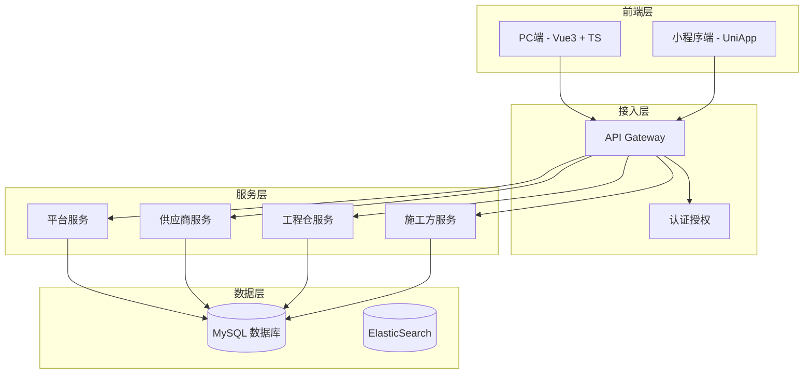

# 系统功能说明书

> 版本：v1.0 | 更新日期：2026-04-24

---

## 一、系统总览

工程项目管理系统是一个为建材行业"熟人生意"场景设计的**采供协同平台**，由四个子系统组成：

| 系统 | 访问端 | 核心定位 | 一句话描述 |
|:----|:------|:--------|:---------|
| **平台端** | PC浏览器 | 管理中枢 | 管商品、管商户、看全局，不参与交易 |
| **供应商端** | PC浏览器 | 供应方 | 上架商品、接单发货、开发票 |
| **工程仓端** | PC浏览器 | 核心枢纽 | 买货入库、卖货出库、管库存 |
| **施工方端** | 📱小程序 + PC | 采购方 | 工地上手机下单买东西 |

---

## 二、架构说明

### 2.1 整体架构

### 2.2 设计理念

| 原则 | 说明 |
|:----|------|
| **三状态分离** | 订单/支付/发货独立运行，互不阻塞，适配先发货后付款的熟人生意 |
| **商品两段定义** | 平台统一定义标准商品，供应商自管价格和库存 |
| **商户数据隔离** | 各端数据按商户ID隔离，平台端全量可见 |
| **RBAC权限模型** | 按角色配置功能菜单+按钮粒度的操作权限 |

---

## 三、系统协同

参见 [跨部门协同PRD](跨部门协同PRD.md) 详细文档。

核心协同链路：

1. **商品链路**：平台定义 → 供应商设置价格 → 工程仓/施工方采购
2. **采购链路**：工程仓下单 → 供应商接单 → 供应商发货 → 工程仓收货
3. **销售链路**：施工方下单 → 工程仓确认 → 工程仓发货 → 施工方收货
4. **售后链路**：收货方发现问题 → 供应方处理补发

---

## 四、平台端功能说明

### 4.1 工作台
- 关键指标看板：商户数、商品数、订单数、交易金额

### 4.2 商户管理
- 商户列表/新增/详情/审核（通过/驳回）
- 商户冻结/解冻
- 合同管理（新增/查看）

### 4.3 商品中心（核心模块）
- 分类管理：三级分类树，拖拽排序
- 属性管理：规格属性组+属性值
- SPU管理：新增/编辑/详情
- SKU管理：列表/详情/编辑
- 供货管理：供应商关联、供货价设置、状态切换
- 批量操作：批量上下架

### 4.4 商品市场
- 供应商品管理：上下架、批量操作
- 销售商品管理：销售价格设置
- BOM管理：物料清单新增/编辑/详情
- 价格管理：价格异常标红

### 4.5 订单管理
- 全平台订单查询（只读）：多条件筛选
- 订单详情查看：时间线+状态追踪
- 订单导出

### 4.6 库存管理
- 库存总览看板
- 仓库管理：列表/详情
- 出入库流水
- 调拨管理
- 盘点管理

### 4.7 财务中心
- 支付流水：汇总+导出
- 应收管理
- 分账管理
- 进项/销项发票
- 发票上传与关联

### 4.8 系统设置
- 用户/员工/角色管理+权限树配置
- 菜单管理
- 分账/物流配置
- 操作日志审计

---

## 五、供应商端功能说明

### 5.1 工作台与商户中心
- 数据概览：订单金额/待发货/待结算/在售商品数
- 主体信息：查看/编辑联系人信息
- 合同列表：查看已签署合同

### 5.2 商品中心
- 商品列表：按状态Tab筛选（在售/待审核/已下架/审核不通过）
- 新增商品：从平台库选品→设置供货价/库存
- 编辑商品：修改供货价/库存
- 上下架管理
- 库存查询与流水

### 5.3 订单管理（核心模块）
- 订单列表：多Tab（全部/待确认/待发货/已发货/已完成/已取消）
- 订单详情：信息+商品明细+状态时间线
- 确认接单/取消订单
- 订单发货（物流可选填）
- 发货单打印
- 售后管理：货损查看/补发处理/拒绝补发

### 5.4 财务中心
- 发票管理：列表/新增/关联订单/详情/下载
- 待结算：已发货未结算订单
- 结算单：按周期生成的对账单

### 5.5 系统设置
- 账号列表：新增/编辑/启用禁用
- 员工管理：新增/编辑/标记离职
- 角色列表：新增/编辑
- 权限配置：树形勾选菜单+操作权限

---

## 六、工程仓端功能说明

### 6.1 工作台与商户中心
- 数据概览看板
- 主体信息：查看/编辑
- 合同列表查看

### 6.2 商品市场
- 商品浏览/搜索/分类筛选
- 商品详情：图片轮播/规格/价格/供应商
- 购物车管理：增删改+全选
- 结算下单

### 6.3 采购计划
- 采购计划列表：按状态筛选
- 新建采购计划：多步选择商品
- 采购计划详情
- 计划转订单

### 6.4 商品中心
- 库存商品列表：按仓库/分类筛选
- SPU详情：基本信息+规格
- SKU详情：库存分布+批次+流水

### 6.5 采购订单管理
- 采购订单列表：多状态Tab
- 订单详情：信息+商品明细+操作日志
- 取消订单
- 订单收货：同入库收货
- 手动创建采购订单

### 6.6 销售订单管理
- 销售订单列表：多状态Tab
- 订单详情：施工方信息+商品明细
- 确认销售订单
- 销售发货：选仓库+物流
- 订单导出

### 6.7 仓库管理（核心模块）
- 入库管理：入库单列表/开始收货/批次详情/货损记录
- 出库管理：出库单列表/确认出库
- 仓库配置：列表/详情
- 打印单据
- 库存盘点：盘点记录/创建盘点单
- 库存调拨：子仓库间调拨

### 6.8 财务中心
- 支付流水：收支记录
- 进项发票：列表/上传
- 销项发票：列表
- 对账管理：供应商+施工方对账

### 6.9 系统设置
- 账号管理/员工管理/角色管理/权限配置

---

## 七、施工方端功能说明

### 7.1 首页与项目
- 项目列表：负责项目
- 项目切换：一键切换项目
- 项目概览：数据看板
- 工程仓列表：可用工程仓
- 项目详情

### 7.2 商品市场
- 商品浏览：卡片展示
- 分类筛选：Tab切换
- 商品搜索
- 加入购物车
- 商品详情

### 7.3 购物车
- 购物车列表
- 修改数量
- 删除商品/清空购物车
- 结算下单

### 7.4 订单管理
- 订单列表：多Tab筛选
- 订单详情
- 取消订单
- 确认收货
- 申请售后
- 订单跟踪

### 7.5 库存与个人中心
- 库存列表/详情
- 个人信息查看/修改
- 修改密码
- 意见反馈
