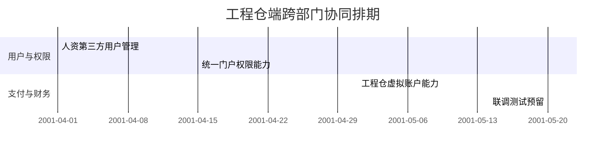
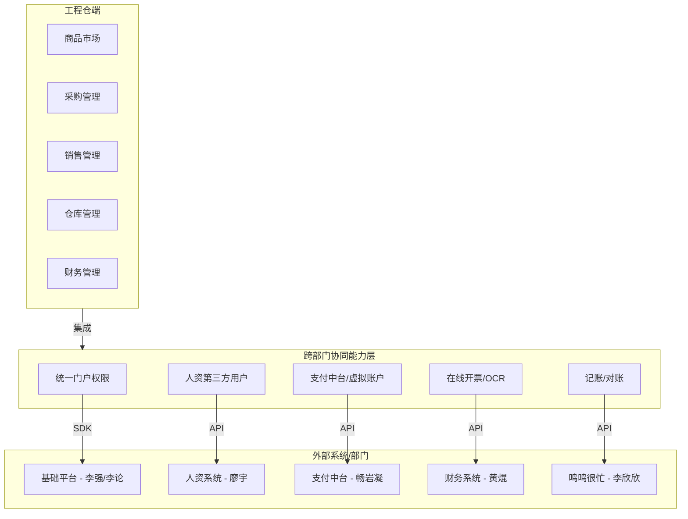

# 跨部门协同 — 工程仓端 V1.0

> 版本：v1.0 | 更新日期：2026-04-25
> 本文档描述工程仓端当前版本（v1.0）涉及的跨部门/跨系统协同能力清单、对接人、排期和接口说明。

---

## 一、协同背景

工程仓端作为**采供协同平台的核心枢纽**，承担采购方和销售方双重角色，需要与平台端、供应商端、施工方端以及多个中台系统进行跨系统协同。

当前版本涉及的跨部门/跨系统协同能力涵盖**六大板块**：

| 协同板块 | 能力说明 | 接入方式 |
|:--------|---------|---------|
| 统一门户框架 | 统一登录认证、权限管理、用户体系 | SDK/API 接入 |
| 人资第三方用户 | 第三方用户管理（非企业正式员工） | API 集成 |
| 支付中台 | 工程仓虚拟账户、充值、提现、触发划扣 | 支付中台对接 |
| 在线开票 & 发票 OCR | 平台端开具发票 + 发票 OCR 识别 | 联调对接 |
| 记账与对账 | 鸣鸣很忙记账能力、对账能力 | 现有能力对接 |

---

## 二、跨部门干系人清单

| 角色 | 部门/系统 | 负责人 | 职责 | 关键节点 | 状态 |
|:----|:---------|:------|:-----|:---------|:----|
| 统一门户权限 | 基础平台 | 李强 / 李论 | 统一登录认证、RBAC权限模型、门户框架 | 5-30 | ✅ 已确认 |
| 人资第三方用户 | 人资系统 | 廖宇 | 第三方用户管理（非正式员工账号体系） | 4-30 | ✅ 已确认 |
| 工程仓虚拟账户 | 支付中台 | 畅岩凝 | 虚拟账户开立、充值、提现、交易划扣 | 5-30（待评估） | ⚠️ 待评估 |
| 平台开具发票 & OCR | 财务系统 | 黄焜 | 电子发票开具、发票 OCR 识别录入 | 联调提前通知 | ✅ 现有能力 |
| 记账能力 | 鸣鸣很忙 | 李欣欣 / 畅岩凝 | 业务记账（出入账、流水记录） | 现有能力 | ✅ 现有能力 |
| 对账能力 | 财务系统 | — | 每日/定期对账（财务数据核对） | 现有能力 | ✅ 现有能力 |

---

## 三、协同能力详述

### 3.1 统一门户框架

**负责人：** 李强 / 李论 | **交付节点：** 5-30

统⼀门户框架是工程仓端的基础设施层，封装了登录认证、权限管理和门户布局等公共能力，各模块通过 SDK 方式集成。

#### 包含子能力

| 子能力 | 说明 | 依赖关系 |
|:------|:----|:--------|
| 统一登录 | 账号密码登录、SSO 单点登录、Token 管理 | 门户框架提供 |
| 权限管理 | RBAC 角色权限模型、功能菜单/按钮权限控制 | 门户框架提供 |
| 门户框架 | 公共布局、导航菜单、顶部栏、个人中心 | 门户框架提供 |

**对接要点：**
- 工程仓端各模块通过门户 SDK 获取当前用户信息和权限
- 无需重复开发登录/权限逻辑
- 门户框架统一处理 Token 刷新和过期

---

### 3.2 人资第三方用户管理

**负责人：** 廖宇 | **交付节点：** 4-30

人资第三方用户管理解决工程仓端**非企业正式员工**（如临聘人员、外部合作方）的账号管理问题。

| 能力 | 说明 |
|:----|:----|
| 第三方账号创建 | 人资系统创建临时账号，指定角色和有效期 |
| 账号同步 | 人资 → 门户 → 工程仓端 用户信息同步 |
| 权限绑定 | 第三方账号关联工程仓端的角色权限 |
| 生命周期管理 | 到期自动禁用 / 手动续期 |

---

### 3.3 支付中台 — 工程仓虚拟账户

**负责人：** 畅岩凝 | **交付节点：** 5-30（待评估）

工程仓虚拟账户是支付中台为工程仓端提供的**资金管理能力**，支持以下操作：

```
┌─────────────────────────────────────┐
│         工程仓虚拟账户                 │
├─────────────────────────────────────┤
│                                     │
│  ◉ 账户开立   → 为每个工程仓创建虚拟户  │
│  ◉ 充值       → 银行转账 → 充值到虚拟户 │
│  ◉ 提现       → 虚拟户余额提现到银行账户 │
│  ◉ 触发划扣   → 订单结算时自动触发划扣   │
│  ◉ 余额查询   → 实时查询虚拟户余额      │
│  ◉ 流水记录   → 充值/提现/划扣明细      │
│                                     │
└─────────────────────────────────────┘
```

| 操作 | 触发方 | 支付中台响应 | 前置条件 |
|:----|:------|:-----------|:--------|
| 开户 | 工程仓端 | 返回虚拟账户 ID | 工程仓商户入驻完成 |
| 充值 | 工程仓财务 | 余额增加、记录充值流水 | 线下转账到平台指定账户 |
| 提现 | 工程仓财务 | 余额扣减、发起银行转账 | 余额充足 |
| 触发划扣 | 订单结算 | 余额扣减、记录交易流水 | 订单状态 → 结算阶段 |

**注意：** 当前版本无在线支付网关，充值为线下转账上传凭证，支付中台人工确认到账。

---

### 3.4 平台开具发票 & 发票 OCR 识别

**负责人：** 黄焜 | **交付节点：** 现有能力（联调提前通知）

| 能力 | 说明 | 使用场景 |
|:----|:----|:--------|
| 平台开具发票 | 平台端统一开票，工程仓端发起开票请求 | 采购/销售订单完成后申请开票 |
| 发票 OCR 识别 | 上传发票图片 → OCR 提取关键信息 → 结构化存储 | 报销/入账时识别发票内容 |

**联调要求：**
- 开始联调前需提前通知黄焜
- 双方对齐接口字段和回调协议
- 测试环境准备完成后进行联调

---

### 3.5 鸣鸣很忙 — 记账能力

**负责人：** 李欣欣 / 畅岩凝 | **交付节点：** 现有能力

鸣鸣很忙记账能力提供工程仓端的**业务记账**功能，记录出入账流水：

| 记账场景 | 触发条件 | 记账内容 |
|:--------|:--------|:--------|
| 采购支出 | 采购订单完成 → 供应商发货 | 支出金额 + 供应商信息 |
| 销售收入 | 销售订单完成 → 施工方收货 | 收入金额 + 施工方信息 |
| 费用记录 | 运营费用产生 | 费用类型 + 金额 |

---

### 3.6 对账能力

**交付节点：** 现有能力

| 对账类型 | 频率 | 涉及方 | 说明 |
|:--------|:----|:------|:----|
| 交易对账 | 每日 | 工程仓 ⟷ 供应商 | 采购订单金额核对 |
| 支付对账 | 每日 | 工程仓 ⟷ 支付中台 | 虚拟账户流水核对 |
| 发票对账 | 定期 | 工程仓 ⟷ 平台端 | 开票记录核对 |

---

## 四、排期时间线

| 能力 | 负责人 | 排期 | 状态 | 风险 |
|:----|:------|:----|:----|:----|
| 人资第三方用户管理 | 廖宇 | 4-30 | 🟢 按计划 | — |
| 统一门户权限能力 | 李强/李论 | 5-30 | 🟡 进行中 | — |
| 工程仓虚拟账户能力 | 畅岩凝 | 5-30（待评估） | 🟠 待评估 | 依赖支付中台排期确认 |
| 平台开具发票 & OCR | 黄焜 | 现有能力 | ✅ 就绪 | 联调需提前通知 |
| 鸣鸣很忙记账能力 | 李欣欣/畅岩凝 | 现有能力 | ✅ 就绪 | — |
| 对账能力 | — | 现有能力 | ✅ 就绪 | — |



---

## 五、工程仓端跨部门协同全景



---

## 六、协同风险与依赖

| 风险/依赖 | 影响能力 | 风险等级 | 应对措施 |
|:---------|:--------|:-------:|:--------|
| 支付中台排期未确认 | 工程仓虚拟账户 | 🔴 高 | 提前沟通排期，准备备选方案（暂用线下转账） |
| 现有能力联调协调 | 开票/OCR | 🟡 中 | 提前通知黄焜，预留联调时间窗口 |
| 多系统集成复杂度 | 统一门户 | 🟡 中 | 优先完成 SDK 集成，功能验收按模块分批进行 |
