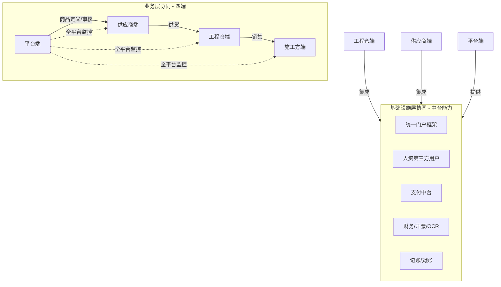
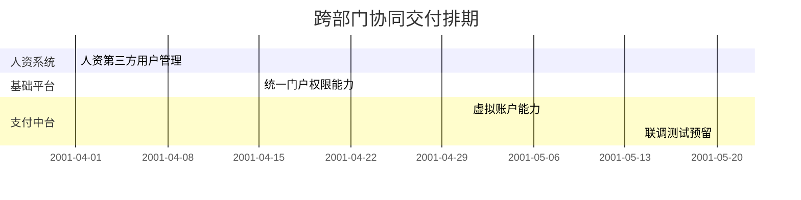
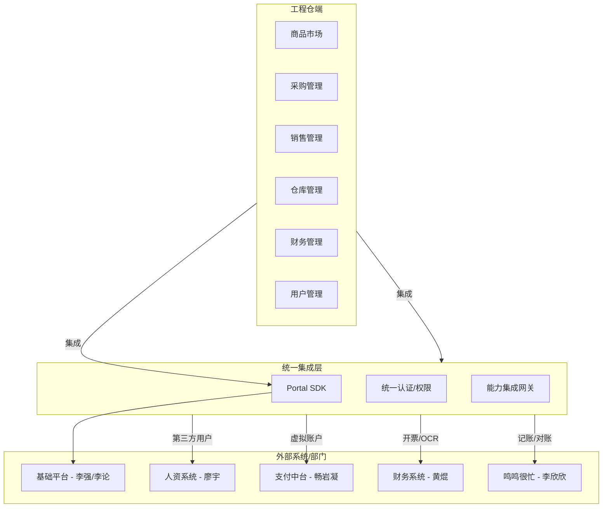
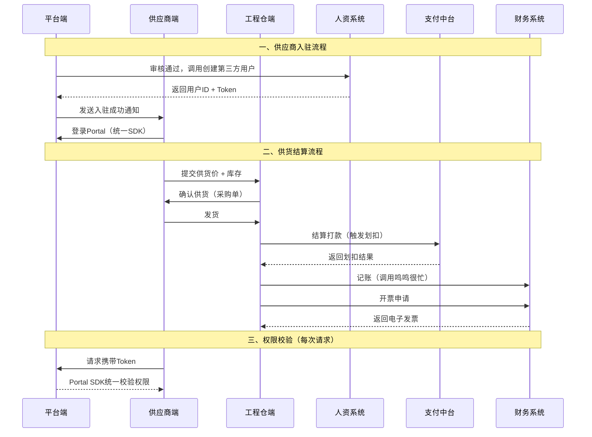
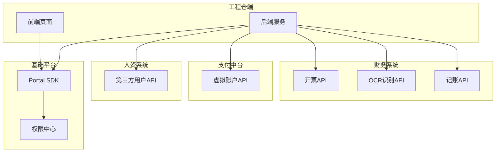

# 跨部门协同 PRD — 总体架构

> 版本：v2.0 | 更新日期：2026-04-25
> 本文档描述工程项目管理系统全项目的**跨部门/跨系统协同总体架构**，覆盖业务层协同与基础设施层协同，定义各方职责边界和提供物清单。

---

## 一、项目团队与里程碑

### 1.1 核心团队

| 角色 | 负责人 |
|:-----|:------|
| **业务负责人** | 刘朗云 |
| **产品负责人** | 王飞 |
| **项目负责人** | 韩立平 |
| **技术负责人** | 徐俊 |
| **前端负责人** | 黄模荣 |
| **测试负责人** | 周云鹏 |

### 1.2 项目组成员

| 方向 | 成员 |
|:-----|:------|
| **前端** | 黄模荣、李瑞禧 |
| **后端** | 徐俊、郭纪伟、彭涛、朱俊池 |
| **测试** | 周云鹏、关铭伟 |

### 1.3 项目里程碑计划

| 里程碑 | 计划完成日期 | 关键交付物 | 负责人 |
|:-------|:-----------|:----------|:------|
| 项目启动会 | 4-22 | 项目章程、团队组建 | 韩立平/王飞/刘荣蓉 |
| 需求评审完成<br>（已内部评审部分） | 3-20 | 需求文档/系统demo | 王飞 |
| 设计评审完成 | - | UI 设计稿、技术方案 | - |
| 开发/执行完成 | 待定 | 可交付的成果 | 徐俊 |
| 测试验收完成 | 6-30 | 测试报告、用户验收确认 | 周云鹏 |
| 正式上线/发布 | 6-30 | 上线部署 | 徐俊 |
| 项目复盘/结项 | 7-20 | 结项报告 | 王飞 |

### 1.4 分阶段排期计划

| 阶段 | 内容 | 当前进度 | 预计完成日期 |
|:-----|:-----|:--------|:------------|
| **第一阶段** | 基建：商户管理能力，商品管理，商品市场 | 测试阶段 | 3-4月 |
| **第二阶段** | 工程仓-供应商的交易链路，工程仓端管理功能（仓库管理，采购订单交易） | 研发阶段 | 5月初 |
| **第三阶段** | 施工方与工程仓端交易链路，施工方端管理功能-联动工程系统项目管理 | 待评审 | 5月底 |
| **第四阶段** | 工程仓虚拟户管理，销售交易链路涉及的财务分账能力（重点） | 待评审 | 6月初 |
| **第五阶段** | 整体联调，上线测试 | 待启动 | 6月底 |
| **第六阶段** | 培训阶段，切换老系统（切换方案） | 待启动 | 7月 |
| **第七阶段** | 正式上线 | 待启动 | 7月 |

### 1.5 关键风险

| 风险描述 | 概率 | 影响 | 应对策略 | 负责人 |
|:--------|:----|:----|:--------|:------|
| 由于完全搭建一个新的项目，核心场景功能过多，以及人员资源不足问题 | 40% | 延期上线 | 1. 只做核心功能<br>2. 补充人员 | 王飞 |
| 依赖项：虚拟户功能--核心 | - | 效率影响 | 1. 工程仓线下转帐给鸣鸣很忙 | 畅岩凝 |
| 统一人资第三方能力 | - | 人员管理能力 | 默认人员 | 廖宇 |
| 统一账号权限能力 | - | 账号权限能力 | 默认账号权限 | 李强/李论 |
| 发票能力 | - | 效率影响 | 已有接口，可配合联调 | 黄焜 |

### 1.6 沟通机制

| 沟通内容 | 频率/时机 | 方式 | 参与人 | 目的 |
|:--------|:---------|:-----|:------|:-----|
| 项目例会 | 每日5点半 | 现场/视频会议 | 核心团队 | 同步进度、解决问题 |
| 项目周报 | 每周周五下班前 | 邮件 | 全员 | 正式汇报状态 |
| 双周汇报 | 双周周五 | 现场/视频会议 | 核心团队/业务人员 | 跨部门进度对齐 |
| 里程碑评审 | 里程碑节点 | 评审会议 | 核心团队+协同团队 | 确认阶段成果、调整方向 |
| 风险/问题升级 | 发生时 | 即时消息 + 邮件 | 项目经理 + 相关决策者 | 快速响应 |

---

## 二、项目协同全景总览

工程项目管理系统是一个**四端协同 + 多中台集成**的复杂系统。跨部门协同分为两个层面：

| 层面 | 说明 | 涉及方 |
|:----|:-----|:------|
| **业务层协同** | 四端间的商品、订单、库存、财务等业务流转 | 平台端、供应商端、工程仓端、施工方端 |
| **基础设施层协同** | 统一门户、人资、支付、开票、记账等中台能力集成 | 基础平台、人资系统、支付中台、财务系统、鸣鸣很忙 |



### 2.1 系统协同架构图

> 点击查看大图：<a href="javascript:void(0)" class="flow-link" data-flow="architecture">🧩 打开产品模块设计全景图</a>

### 2.2 资金交易链路架构图

工程仓资金流转涉及 **业务系统 → 支付中台 → 对账系统** 三域协同。

> 点击查看大图：<a href="javascript:void(0)" class="flow-link" data-flow="fund">🏭 打开资金交易链路架构图</a>

### 2.3 核心交易链路时序图

销售与采购独立双主线：**工程仓先收款 → 再主动向平台支付撮合费**（非空中分账模式）。

> 点击查看大图：<a href="javascript:void(0)" class="flow-link" data-flow="transaction">🔀 打开核心交易链路时序图</a>

---

## 三、跨部门干系人与提供物清单

### 3.1 业务层协同 — 四端职责矩阵

| 端 | 核心职责 | 提供物 | 消费物 |
|:--|:--------|:------|:------|
| **平台端** | 商品标准定义、商户入驻审核、全平台监控 | 分类/属性/SPU/SKU标准、审核结果、监控数据 | 各端业务数据 |
| **供应商端** | 商品供应、订单履约、售后处理 | 供货价/库存、接单/发货、售后单处理 | 采购订单、商品标准 |
| **工程仓端** | 商品采购、销售、仓库管理 | 采购订单、销售订单、库存变动 | 供货价、销售价、商品信息 |
| **施工方端** | 商品选购、订单跟踪 | 销售订单、收货确认 | 商品信息、销售价 |

### 3.2 基础设施层协同 — 各部门提供物清单

| 部门/系统 | 负责人 | 交付节点 | 需提供内容 | 消费方 |
|:---------|:------|:--------|:----------|:------|
| **基础平台** | 李强 / 李论/ 王飞 | 进行中 | ① Portal SDK（统一登录、Token管理）<br>② RBAC权限模型接口（角色/菜单/按钮权限）<br>③ 门户框架组件（布局、导航、顶部栏） | 工程仓端、各端 |
| **人资系统** | 廖宇 | 5-8 | ① 第三方用户创建 API<br>② 用户信息同步接口（人资→门户→各端）<br>③ 角色绑定接口<br>④ 用户生命周期管理（创建/禁用/续期/删除） | 工程仓端 |
| **支付中台** | 畅岩凝 | （待评估） | ① 虚拟账户开立 API（一期不用）<br>② 充值接口 + 到账回调<br>③ 提现接口（虚拟户→银行账户）<br>④ 触发划扣接口<br>⑤ 余额查询接口<br>⑥ 流水查询接口 | 工程仓端 |
| **财务系统（开票）** | 黄焜 | 现有能力（联调提前通知） | ① 电子发票开具 API<br>② 发票 OCR 识别 API<br>③ 开票结果回调通知 | 工程仓端 |
| **鸣鸣很忙（记账）** | 李欣欣 / 畅岩凝 | 现有能力 | ① 业务记账 API（出入账写入）<br>② 流水查询接口 | 工程仓端 |
| **财务系统（对账）** | — | 现有能力 | ① 交易对账数据接口<br>② 支付对账数据接口<br>③ 发票对账数据接口 | 工程仓端 |

### 3.3 各方接口对接依赖



---

## 四、工程仓端跨部门集成架构



---

## 五、各部门提供内容详解

### 5.1 基础平台（李强/李论）

**提供物：** Portal SDK 集成包

| 模块 | 提供形式 | 说明 |
|:----|:--------|:----|
| 统一登录 | SDK / API | 账号密码登录、SSO、Token 发放与刷新 |
| 权限认证 | SDK / API | 角色校验、功能菜单权限、按钮权限 |
| 门户框架 | UI 组件 | 公共布局、导航菜单、顶部栏、个人中心 |
| 用户信息 | API | 当前登录用户信息、角色列表 |

**工程仓端集成方式：** 引入 Portal SDK → 配置应用信息 → 对接登录/权限接口

---

### 5.2 人资系统（廖宇）

**提供物：** 第三方用户管理 API

| 接口 | 方向 | 说明 |
|:----|:----|:----|
| 第三方用户创建 | 人资 → 门户 | 创建临时账号，指定角色和有效期 |
| 用户同步 | 人资 → 门户 → 各端 | 新增/变更/禁用时同步到门户，门户再同步到各端 |
| 角色绑定 | 人资 → 门户 | 第三方账号关联 RBAC 角色 |
| 生命周期管理 | 人资 → 门户 | 到期自动禁用 / 手动续期 / 提前删除 |

**工程仓端关注点：**
- 第三方用户登录后能正常访问工程仓端
- 权限按角色配置生效
- 用户到期后自动退出并锁定

---

### 5.3 支付中台（畅岩凝）

**提供物：** 虚拟账户能力 API

| 能力 | 接口方向 | 触发时机 | 同步/异步 |
|:----|:--------|:--------|:--------:|
| 账户开立 | 工程仓→支付中台 | 工程仓商户入驻完成 | 同步 |
| 充值 | 工程仓→支付中台 | 线下转账→上传凭证→确认到账 | 异步（人工确认） |
| 提现 | 工程仓→支付中台 | 财务发起提现申请 | 异步（银行处理） |
| 触发划扣 | 订单系统→支付中台 | 订单进入结算阶段 | 同步 |
| 余额查询 | 工程仓→支付中台 | 实时查询 | 同步 |
| 流水查询 | 工程仓→支付中台 | 查询历史记录 | 同步 |

**注意：** 当前无在线支付网关，充值为线下转账→上传凭证→支付中台人工确认到账

---

### 5.4 财务系统 - 开票 & OCR（黄焜）

**提供物：** 开票 + OCR API

| 接口 | 说明 | 前置条件 |
|:----|:----|:--------|
| 开票申请 | 工程仓发起开票请求 → 平台端开票 | 订单已完成 |
| 开票结果回调 | 开票完成后通知工程仓 | 平台端开票完成 |
| OCR 识别 | 上传发票图片 → 返回结构化字段（金额、税号、日期等） | 发票图片清晰 |

**联调要求：** 需提前通知黄焜，对齐接口字段和回调协议

---

### 5.5 鸣鸣很忙 — 记账（李欣欣/畅岩凝）

**提供物：** 记账 API

| 能力 | 说明 |
|:----|:----|
| 业务记账写入 | 采购支出、销售收入、费用记录 |
| 流水查询 | 按时间/类型/金额检索 |

**对接方式：** 订单完成时触发记账 API 写入，查询时调用流水接口

---

### 5.6 对账能力

**提供物：** 对账数据

| 对账类型 | 数据来源 | 对账周期 | 主责 |
|:--------|:--------|:--------|:----|
| 交易对账 | 采购订单金额核对 | 每日 | 工程仓 ⟷ 供应商 |
| 支付对账 | 虚拟账户流水核对 | 每日 | 工程仓 ⟷ 支付中台 |
| 发票对账 | 开票记录核对 | 定期 | 工程仓 ⟷ 平台端 |

---

## 六、协同风险与依赖

| 风险 | 影响 | 等级 | 应对措施 |
|:----|:----|:----:|:--------|
| 支付中台排期未确认 | 虚拟账户依赖支付中台排期 | 🔴 高 | 提前与畅岩凝沟通排期，备选方案：暂用线下转账 |
| 联调窗口协调风险 | 开票/OCR 联调需提前通知 | 🟡 中 | 提前两周通知黄焜，预留 3-5 天联调时间 |
| 多系统集成复杂度 | 统一门户 SDK 版本兼容性 | 🟡 中 | 分模块分批验收，优先完成登录/权限集成 |
| 人资系统接口变更 | 第三方用户管理依赖人资接口 | 🟢 低 | 接口变更后按约定更新时间窗口 |

---

## 七、跨部门泳道图

### 7.1 典型场景：供应商完整业务流程



### 7.2 技术集成泳道图



---

## 八、接口契约（待评审后填写）

> ⚠️ **填写说明**：本章节为预留模板，评审通过后由各系统对接人在此补充具体接口定义。
>
> ✅ **填写原则**：
> - 每个跨系统对接接口，必须在此填写一份
> - 请求/响应字段与类型，必须与代码一致
> - 错误码与处理方式，必须明确可执行
> - 本页更新后，群内周知所有消费方

---

### 8.1 接口总览表（对接人评审后填写）

| 序号 | 接口名称 | 调用方 | 提供方 | 对接人 | 计划联调日期 | 状态 |
|:----|:--------|:------|:------|:------|:-----------:|:----:|
| 1 | 创建第三方用户 | 工程仓端 | 人资系统 | ☐ 廖宇 | | ☐ 待确认 |
| 2 | 虚拟账户开立 | 工程仓端 | 支付中台 | ☐ 畅岩凝 | | ☐ 待确认 |
| 3 | 开具电子发票 | 工程仓端 | 财务系统 | ☐ 黄焜 | | ☐ 待确认 |
| 4 | 发票OCR识别 | 工程仓端 | 财务系统 | ☐ 黄焜 | | ☐ 待确认 |
| 5 | 业务记账 | 工程仓端 | 鸣鸣很忙 | ☐ 李欣欣 | | ☐ 待确认 |

---

### 8.2 接口填写模板（复制使用）

各对接人请按以下模板补充接口详情：

```markdown
#### 接口N：[接口中文名称]

| 属性 | 内容 |
|------|------|
| 接口路径 | [HTTP方法 + URL，如：POST /api/hr/user] |
| 调用方 | [哪个系统调用] |
| 提供方 | [哪个系统提供] |
| 对接人 | [姓名 + 飞书号] |
| SLA承诺 | [响应时间 + 可用性，如：<500ms 99.95%] |

**请求示例**：
```json
{
  "key": "请在此填写实际请求字段"
}
```

**响应示例**：
```json
{
  "code": 0,
  "message": "success",
  "data": {}
}
```

**错误码说明**：

| 错误码 | 含义 | 消费方处理方式 |
|-------|------|:-------------|
| 40001 | 错误含义 | 重试/提示用户/告警 |
```

---

## 九、联调计划

### 9.1 联测试环境

| 环境 | 地址 | 负责人 | 可用时间 |
|:-----|:-----|:------|:--------|
| 沙箱环境 | https://sandbox-gongcang.bytedance.net | 徐俊 | 5-15 起可用 |
| 测试环境 | https://test-gongcang.bytedance.net | 各系统对接人 | 联调期间7x24可用 |

### 9.2 联调排期

| 阶段 | 时间 | 参与方 | 联调内容 |
|:-----|:-----|:------|:---------|
| 第一阶段 | 5-15 ~ 5-20 | 基础平台 + 人资 + 工程仓 | 登录 + 用户创建 |
| 第二阶段 | 5-25 ~ 5-31 | 支付中台 + 工程仓 | 虚拟账户 + 充值/提现 |
| 第三阶段 | 6-05 ~ 6-10 | 财务系统 + 工程仓 | 开票 + OCR + 记账 |

### 9.3 联调用例清单

| 用例ID | 场景 | 预期结果 | 测试人 |
|:-------|:-----|:---------|:-------|
| TC-001 | 供应商入驻 → 创建第三方用户 | 用户创建成功，可登录 | 李瑞禧 |
| TC-002 | 结算 → 触发划扣 | 账户余额扣减成功 | 郭纪伟 |
| TC-003 | 开票申请 → 获取电子发票 | PDF文件返回成功 | 彭涛 |

---

## 十、SLA承诺与降级策略

### 10.1 服务等级承诺

| 系统 | 可用性 | 响应时间P99 | 数据一致性 | 降级方案 |
|:-----|:------:|:-----------:|:----------:|:--------|
| 基础平台Portal | 99.95% | < 200ms | 强一致 | 本地权限缓存兜底 |
| 人资第三方用户 | 99.9% | < 500ms | 最终一致 | 预创建测试账号 |
| 支付中台 | 99.99% | < 1000ms | 强一致 | 充值码 + 人工审核 |
| 开票/OCR | 99.5% | < 3000ms | 最终一致 | 手工开票 |
| 记账 | 99.9% | < 1000ms | 最终一致 | 异步重试 + 日终对账 |

### 10.2 问题升级机制

| 故障等级 | 定义 | 通知方式 | 响应时间 | 升级路径 |
|:-------|:-----|:---------|:--------|:---------|
| P0 | 核心流程阻塞，影响线上 | 电话 + 群@所有人 | 15分钟 | 接口人 → 技术负责人 → 部门总监 |
| P1 | 非核心功能异常 | 群@对接人 | 1小时 | 接口人 → 技术负责人 |
| P2 | 体验类问题 | 飞书消息 | 4小时 | 对接人处理 |

---

## 十一、协同目标量化

| 目标 | 衡量指标 | 责任方 |
|:-----|:---------|:------|
| 减少对接沟通成本 | 跨部门沟通会议减少 50% | 韩立平/王飞 |
| 提升联调效率 | 联调时间控制在 3 天/系统内 | 徐俊 |
| 降低线上故障率 | 跨部门接口故障率 < 0.1% | 各系统负责人 |
| 提升交付准时率 | 跨部门交付物准时率 100% | 韩立平 |

---

## 十二、协同沟通机制

| 场景 | 方式 | 频率 | 参与方 |
|:----|:----|:----:|:------|
| 进度同步 | 周会 | 每周三下午 | 各对接负责人 |
| 联调协作 | 专项群「工仓-跨部门联调」 | 联调期间每日站会 | 技术对接人 |
| 接口变更 | 群通知 + 更新文档 | 变更前3个工作日 | 变更方通知所有消费方 |
| 问题升级 | 按P0/P1/P2等级 | 见升级机制表 | 接口人 → 部门负责人 |

---

## 十三、签字确认

> 本页用于评审通过后签字确认，确认后各部门按文档执行

| 部门/系统 | 负责人签字 | 日期 | 联系方式 |
|:---------|:----------|:-----|:---------|
| 业务负责人 | __________ | ______ | 刘朗云 |
| 产品负责人 | __________ | ______ | 王飞 |
| 项目负责人 | __________ | ______ | 韩立平 |
| 技术负责人 | __________ | ______ | 徐俊 |
| 基础平台 | __________ | ______ | 李强/李论 |
| 人资系统 | __________ | ______ | 廖宇 |
| 支付中台 | __________ | ______ | 畅岩凝 |
| 财务系统 | __________ | ______ | 黄焜 |
| 鸣鸣很忙 | __________ | ______ | 李欣欣 |
| 测试负责人 | __________ | ______ | 周云鹏 |

---

## 十四、附录：术语表

| 术语 | 说明 |
|:----|:----|
| Portal SDK | 统一门户框架的集成开发工具包，封装登录/权限/布局能力 |
| RBAC | 基于角色的访问控制模型 |
| 第三方用户 | 非企业正式员工，如临聘人员、外部合作方的账号 |
| 虚拟账户 | 支付中台为工程仓创建的资金账户，用于充值/提现/划扣 |
| 触发划扣 | 订单结算时，系统自动从虚拟账户扣减对应金额 |
| OCR | 光学字符识别，用于发票图片自动识别录入 |
