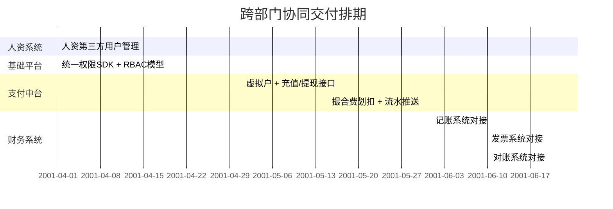

# 工程仓项目 · 跨部门协同PRD

---

## 一、项目概览

### 1.1 参与主体边界澄清

> 🎯 **核心原则**：四端业务系统由我们团队自建，仅基础设施层为真正跨部门协同

| 分类 | 系统 | 归属 | 说明 |
|:-----|:-----|:-----|:-----|
| ✅ **我们内部团队** | 平台端、工程仓端、供应商端、施工方端 | **本产品部自建** | 4个端都是我们团队独立负责开发 |
| 🤝 **真正跨部门** | 支付中台、人资系统、记账系统、发票系统、统一权限平台 | 集团其他部门 | 依赖对接，需要跨部门协同 |

---

### 1.2 项目里程碑

| 阶段 | 事项 | 状态 | 时间点 | 负责人 |
|:-----|:-----|:-----|:-------|:------|
| **第一阶段** | 工程仓商品模型 + 商品全流程 | 进行中 | 4-22到4-30 | 王飞/产研团队 |
| **第二阶段** | 施工方全流程 + 统一人资集成 | 进行中 | 5-6到5-12 | 王飞/产研团队 |
| **第三阶段** | 工程仓钱包支付划扣 | 待启动 | 5-13到5-26 | 王飞/畅岩凝 |
| **第四阶段** | 发票/售后/评价/收藏 | 待启动 | 5-27到6-9 | 王飞/产品部全体 |
| **第五阶段** | 供应商端/报表 | 待启动 | 6月 | 王飞/产品部全体 |
| **第六阶段** | 回归测试 | 待启动 | 7月 | 王飞/产品部全体 |
| **第七阶段** | 正式上线 | 待启动 | 7月 | 王飞/产品部全体 |

### 1.3 干系人

| 角色 | 人员 |
|:-----|:-----|
| 项目负责人 | 王飞 |
| 后端负责人 | 李论 |
| 前端负责人 | 李强 |
| 测试负责人 | 黄晓鹏 |
| 运维负责人 | 朱春雷 |
| 设计负责人 | 周奕 |

### 1.4 沟通机制

| 沟通内容 | 频率/时机 | 方式 | 参与人 |
|:--------|:---------|:-----|:------|
| 需求评审 | 每个功能开发前 | 线下/文档 | 前后端测试产品 |
| 周进度会 | 每周一周三 17.30-18:00 | 线下 | 王飞/李论/李强 |
| 上线前评审 | 上线前3天 | 线下 | 全体 |
| 阻塞沟通 | 随时 | 企业微信 | 对应负责人 |

---

## 二、项目协同全景总览

### 2.1 系统协同架构图

> 点击查看大图：<a href="javascript:void(0)" class="flow-link" data-flow="architecture">🧩 打开产品模块设计全景图</a>

### 2.2 平台撮合费记账链路架构图

> 🎯 **【非空中分账模式】核心定义**
>
> 资金不经过平台对公户，**全程闭环在支付中台虚拟户体系内**：
>
> | 步骤 | 资金流向 | 说明 |
> |:----|:--------|:-----|
> | ① | 施工方支付全额 → 工程仓虚拟户 | 货款直接进入工程仓账户，**平台不碰货款** |
> | ② | 订单完成 → 确认收货 | 划扣触发条件达成 |
> | ③ | 工程仓虚拟户 → 平台撮合费专户 | **仅划扣约定比例的撮合费**（货款全额留存工程仓） |
> | ④ | 划扣流水 → 平台记账 | 平台唯一收入来源 |
>
> ---
>
> 📌 **平台记账核心原则**：仅记撮合费
> - ✅ **平台收入**：施工方与工程仓交易产生的 **撮合服务费**（订单金额 × 约定费率（按商品））
> - ❌ **不记账范围**：施工方货款、采购支付等（属于代收代付，不确认为平台收入）

| 记账环节 | 触发时机 | 记账依据 | 会计分录 |
|:--------|:---------|:---------|:---------|
| **预记账** | 撮合费划扣成功 | 支付中台划扣流水 | 借：其他货币资金-虚拟户 贷：主营业务收入-撮合费 |
| **正式记账** | 对账完成确认 | 对账系统确认结果 | 借：银行存款 贷：其他货币资金-虚拟户 |

> 点击查看大图：<a href="javascript:void(0)" class="flow-link" data-flow="fund">🏭 打开平台撮合费记账链路架构图</a>

---

### 2.3 记账跨部门协同分工

| 部门/系统 | 记账相关职责 | 关键输出 | 对接财务时间点 |
|:---------|:------------|:---------|:--------------|
| **【我们】工程仓产品部** | 1. 计算撮合费率 2. 触发划扣时机 3. 提供订单业务数据 | 撮合费计算结果、划扣指令 | T+1 日 10:00 前 |
| **【跨部门】支付中台** | 1. 执行撮合费划扣 2. 生成划扣成功/失败流水 3. 自动重试机制 | 划扣记录、支付流水 | 实时推送 → 记账系统 |
| **【跨部门】鸣鸣很忙财务系统** | 1. 接收划扣流水自动记账 2. 生成记账凭证 3. 登记入账簿 | 记账凭证数据、入账确认 | 划扣成功后 30 分钟内 |
| **【跨部门】对账系统/财务部** | 1. 业务应收 vs 实收对账 2. 差异处理 3. 最终记账确认 | 对账报告、记账确认标记 | T+1 日 15:00 前完成 |

---

### 2.4 核心交易链路时序图

销售与采购独立双主线：**工程仓先收款 → 再主动向平台支付撮合费**（非空中分账模式）。

> 点击查看大图：<a href="javascript:void(0)" class="flow-link" data-flow="transaction">🔀 打开核心交易链路时序图</a>

---

## 三、跨部门协同详细清单

### 3.1 真正跨部门对接清单（核心）

| 依赖系统 | 归属部门 | 接口人 | 对接优先级 | 需提供能力 | 我们消费方 |
|:---------|:--------|:-------|:----------|:----------|:----------|
| **统一权限平台** | 基础平台部 | 李强/李论 | P0 最高 | ① Portal SDK（统一登录、Token管理） ② RBAC权限模型接口 ③ 门户框架组件 | 工程仓端、各端 |
| **人资系统** | 人力资源部 | 廖宇 | P0 最高 | ① 第三方用户创建 API ② 用户信息同步接口 ③ 角色绑定接口 ④ 用户生命周期管理 | 工程仓端 |
| **支付中台** | 支付金融部 | 畅岩凝 | P0 最高 | ① 虚拟账户体系 ② 充值/提现/划扣接口 ③ 支付回调通知 ④ 余额/流水查询 | 工程仓端 |
| **记账系统** | 财务部 | 李欣欣/畅岩凝 | P1 高 | ① 撮合费自动记账 API ② 记账凭证生成 ③ 记账状态回调 | 支付中台 → 我们 |
| **发票系统** | 财务部 | 黄焜 | P1 高 | ① 电子发票开具 API ② 发票 OCR 识别 ③ 开票结果回调 | 工程仓端 |
| **对账系统** | 财务部 | — | P2 中 | ① 交易对账数据接口 ② 支付对账数据接口 ③ 发票对账数据接口 | 工程仓端 |

---

### 3.2 跨部门交付排期

---

### 3.3 跨部门核心接口契约

| 接口名称 | 提供方 | 调用方 | 数据方向 | SLA |
|:--------|:-------|:-------|:---------|:----|
| 用户创建接口 | 人资系统 | 工程仓端 | 工程仓 → 人资 | 同步响应 500ms |
| 统一登录验签 | 权限平台 | 各端 | 各端 → 权限平台 | 同步响应 200ms |
| 虚拟户开户 | 支付中台 | 工程仓端 | 工程仓 → 支付中台 | 异步，T+1 |
| 撮合费划扣 | 支付中台 | 工程仓端 | 工程仓 → 支付中台 | 同步响应，10s内完成划扣 |
| 划扣流水推送 | 支付中台 | 记账系统 | 支付中台 → 记账 | 实时推送，30s内 |
| 记账凭证生成 | 记账系统 | 支付中台 | 记账 → 支付中台 | 30分钟内完成记账 |
| 开票申请 | 发票系统 | 工程仓端 | 工程仓 → 发票 | T+1 工作日 |

---

## 四、联调计划

### 4.1 跨部门联调总览

| 联调阶段 | 时间 | 参与系统 | 目标 |
|:--------|:-----|:---------|:-----|
| **第一阶段：权限人资联调** | - | 工程仓端 + 统一权限 + 人资 | 打通账号登录、用户创建、权限控制 |
| **第二阶段：支付核心联调** | - | 工程仓端 + 支付中台 | 虚拟户、充值、提现、划扣全流程跑通 |
| **第三阶段：记账联调** | - | 支付中台 + 记账系统 | 划扣成功 → 自动记账闭环 |
| **第四阶段：发票对账联调** | - | 工程仓端 + 发票 + 对账 | 开票、对账流程 |
| **第五阶段：全链路联调** | - | 所有系统 | 端到端完整业务流程 |

---

### 4.2 记账专项联调计划（核心）

| 测试场景 | 前置条件 | 输入参数 | 预期输出 | 验证人 |
|:--------|:---------|:---------|:---------|:-------|
| 正常划扣记账 | 订单完成、虚拟户余额充足 | 划扣金额=订单×费率 | 1. 划扣成功 2. 30分钟内生成凭证 3. 借贷平衡 | 畅岩凝/李欣欣 |
| 划扣失败重试 | 首次划扣失败 | 重试第2、3次 | 1. 自动重试3次 2. 最终失败告警财务 | 畅岩凝 |
| 业务应收vs实收差异 | 费率计算值≠实际划扣值 | 差异金额 | 1. 对账系统标记异常 2. 财务介入工作台 | 财务 |
| 抹零场景 | 分位差≤0.01元 | 0.01元差异 | 自动尾差调整，不触发告警 | 财务 |

---

### 4.3 联调环境与数据准备

| 环境 | 地址 | 测试账号 |
|:-----|:-----|:---------|
| SIT环境 | 内网域名 | 联调前统一提供 |
| 模拟商户 | - | 工程仓测试商户1号 |
| 模拟施工方 | - | 测试用户A |
| 测试订单 | - | 预设金额：1000元、10000元、99.99元 |

---

## 五、风险与保障

### 5.1 跨部门依赖风险

| 风险描述 | 概率 | 影响 | 应对预案 | 跟进人 |
|:--------|:-----|:-----|:---------|:-------|
| 支付中台排期紧张，无法按时交付 | 高 | 项目整体延期 | 1. 支付联调优先做核心路径 2. 备用方案：线下人工对账过渡 | 王飞/畅岩凝 |
| 记账系统接口变更 | 中 | 联调返工 | 1. 提前确认接口契约 2. 每周同步一次接口变更 | 李欣欣 |
| 跨部门人力投入不足 | 中 | 联调阻塞 | 1. 上升到部门负责人 2. 明确接口人值班机制 | 王飞 |

### 5.2 回退机制

| 异常场景 | 降级方案 | 恢复标准 |
|:--------|:---------|:---------|
| 自动记账失败 | 财务人工补录凭证 | 次日9点前完成前一日补录 |
| 划扣异常 | 暂停自动划扣，人工审核 | 连续3笔成功后恢复 |
