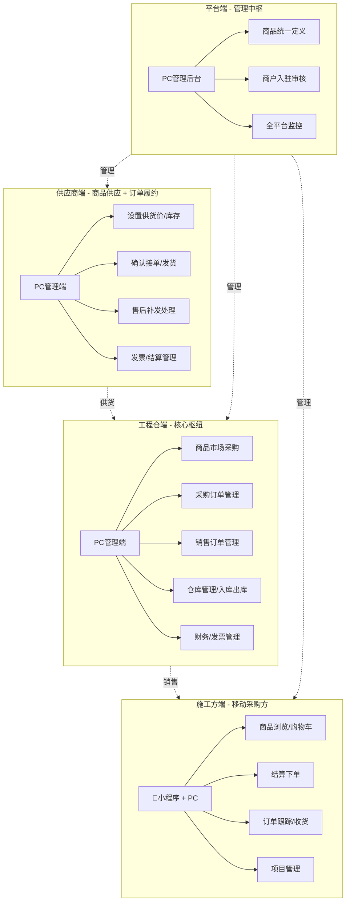
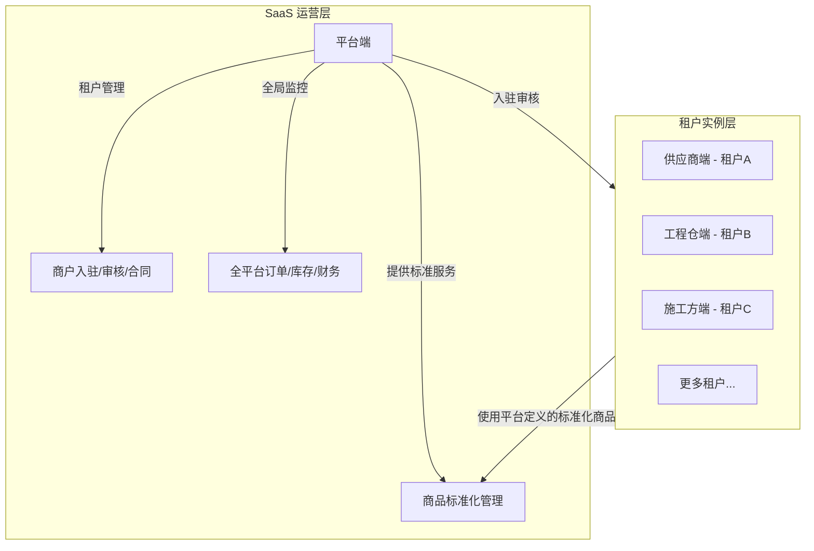
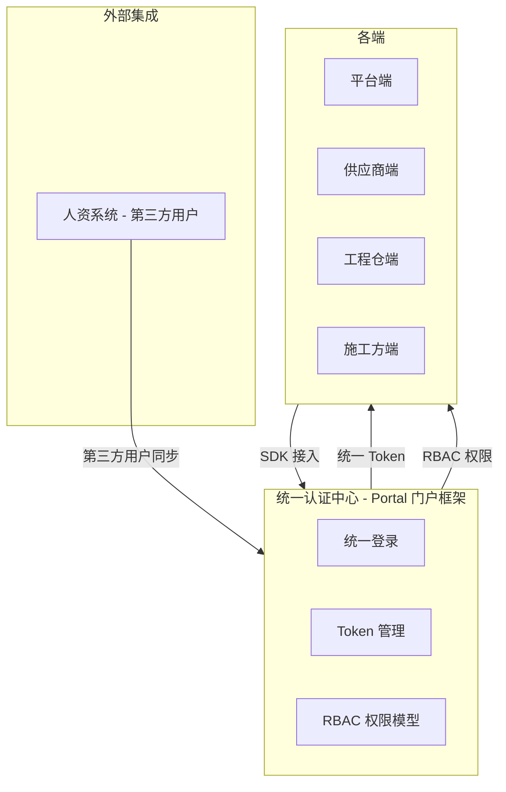
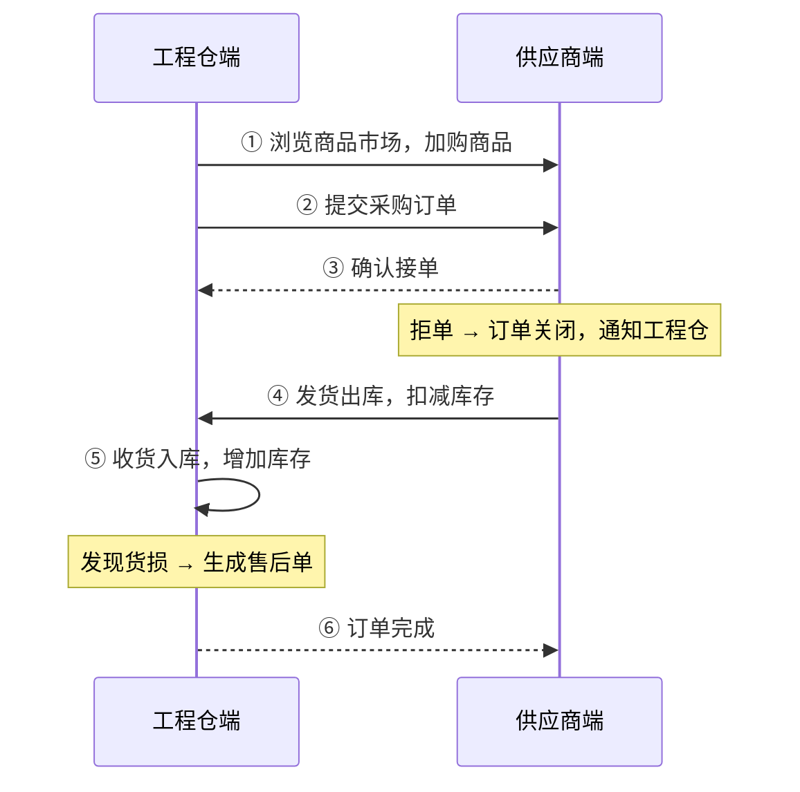
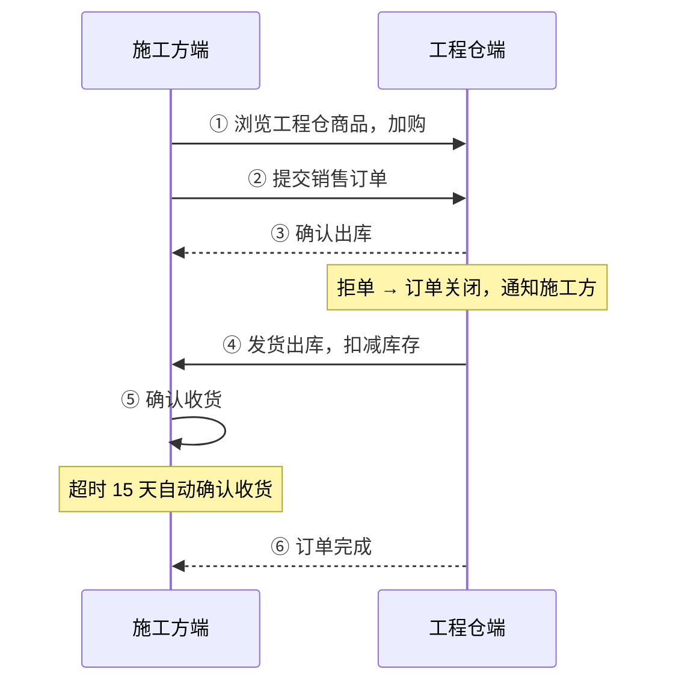
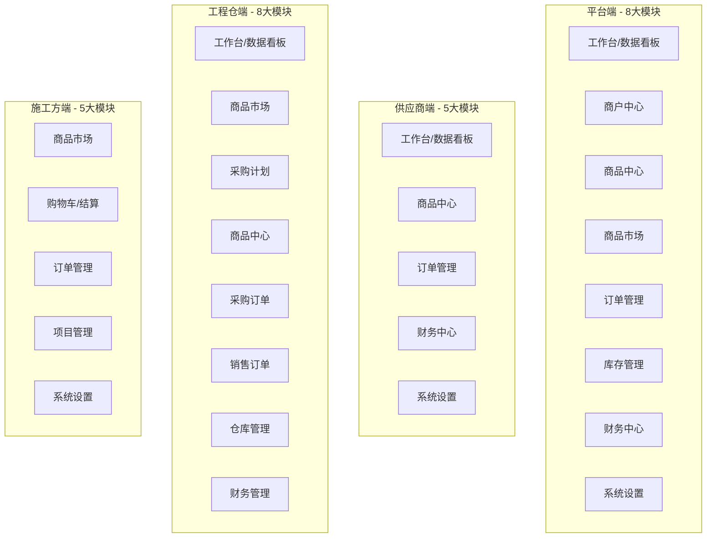
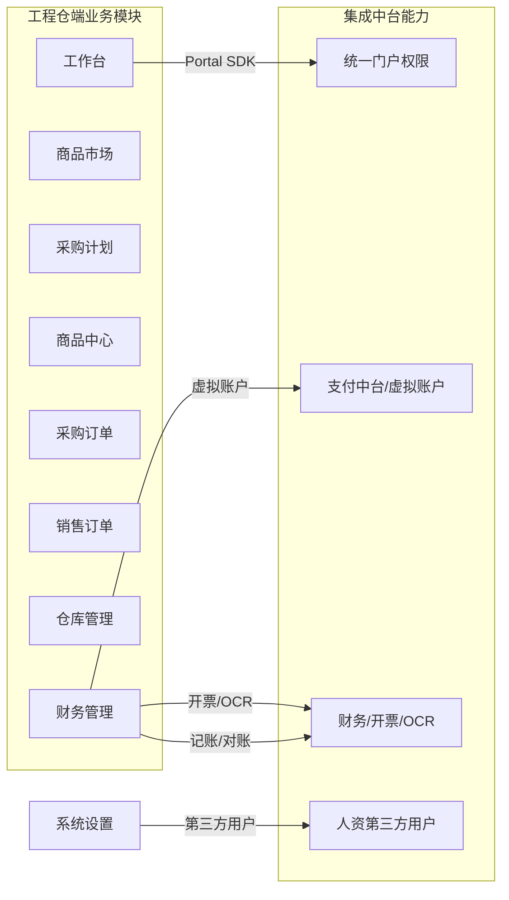

# 工程项目管理系统 - 项目总览

> 版本：v1.0 | 更新日期：2026-04-24

---

## 一、项目一句话定位

> **一个连接建材供应商、工程仓库、施工方的数字化采供协同平台，解决建材行业"熟人生意"的在线化问题。**

---

## 二、四个端，一张网

### 各端角色一句话

| 端 | 一句话描述 | 技术栈 |
|:---|:---------|:------|
| **平台端** | 管商品、管商户、看全局，不参与交易 | Vue3 + TS + Vite |
| **供应商端** | 上架商品、接单发货、开发票 | Vue3 + TS + Vite |
| **工程仓端** | 买货入库、卖货出库、管库存（双交易角色） | Vue3 + TS + Vite |
| **施工方端** | 工地上手机下单买东西 | 📱 UniApp + 小程序 |

---

## 三、系统SaaS架构体系

### 3.1 四端租户模型

工程项目管理系统采用**多租户 SaaS 架构**，平台端作为 SaaS 运营方，供应商端 / 工程仓端 / 施工方端为租户实例：

| 层级 | 角色 | 核心职责 |
|:----|:----|:--------|
| **SaaS运营层**（平台端） | 平台运营方 | 商品标准化定义、商户入驻审核、全局数据监控 |
| **租户实例层**（供应商/工程仓/施工方） | 企业客户 | 在平台标准框架内使用业务功能，数据按租户隔离 |

### 3.2 数据隔离策略

| 数据类型 | 隔离级别 | 策略说明 |
|:--------|:--------|:--------|
| 商品主数据（分类/属性/SPU/SKU） | ✅ 全局共享 | 平台统一定义，所有租户只读引用，一份标准 |
| 供应链数据（供货价/库存） | 🔒 租户隔离 | 供应商→工程仓之间按供货关系可见 |
| 交易数据（订单/售后） | 🔒 参与方可见 | 仅订单双方 + 平台端只读 |
| 财务数据（发票/结算） | 🔒 租户隔离 | 各端自管，平台端全量只读查看 |
| 用户数据（账号/角色/权限） | 🔒 租户隔离 | 每个租户独立管理自己的员工账号和权限 |

### 3.3 统一认证体系拓扑

各端通过 **Portal SDK** 接入统一认证体系，不再各自开发登录/权限模块。人资系统创建的第三方用户也通过门户框架统一管理。

---

## 四、双向交易链路

工程仓端在整个系统中承担**双重交易角色**，是两条核心交易链路的枢纽：

| 链路 | 方向 | 角色 | 说明 |
|:----|:----|:----|:----|
| **链路一（采购）** | 工程仓 ← 供应商 | 工程仓作为 **采购方** | 从供应商处采购建材商品 |
| **链路二（销售）** | 工程仓 → 施工方 | 工程仓作为 **销售方** | 向施工方销售库存商品 |

### 4.1 采购链路完整流程

| 环节 | 操作方 | 动作 | 系统事件 |
|:----|:------|:----|:--------|
| 浏览加购 | 工程仓 | 浏览商品市场 → 加入购物车 | — |
| 提交订单 | 工程仓 | 结算提交 | 供应商端出现待接单订单 |
| 接单确认 | 供应商 | 确认接单 / 拒单（需说明原因） | 订单状态变更，通知工程仓 |
| 发货出库 | 供应商 | 确认发货，更新物流 | 订单状态→已发货，扣减库存 |
| 收货入库 | 工程仓 | 确认收货 | 订单状态→已完成，增加库存 |
| 售后处理 | 双方 | 货损登记 → 补发/退款 | 生成售后单 |

### 4.2 销售链路完整流程

| 环节 | 操作方 | 动作 | 系统事件 |
|:----|:------|:----|:--------|
| 浏览加购 | 施工方 | 浏览商品 → 加入购物车 | — |
| 提交订单 | 施工方 | 结算提交 | 工程仓端出现待确认订单 |
| 确认出库 | 工程仓 | 确认出库 / 拒单 | 订单状态变更，通知施工方 |
| 发货出库 | 工程仓 | 确认发货，更新物流 | 订单状态→已发货，扣减库存 |
| 确认收货 | 施工方 | 确认收货 | 订单状态→已完成 |
| 超时收货 | 系统 | 15 天未确认 → 自动确认 | 系统自动完成订单 |

---

## 五、产品架构设计

### 5.1 四端功能模块树

### 5.2 各端模块边界

| 模块 | 平台端 | 供应商端 | 工程仓端 | 施工方端 |
|:----|:-----:|:--------:|:--------:|:--------:|
| 工作台/数据看板 | ✅ | ✅ | ✅ | — |
| 商户中心 | ✅ | — | — | — |
| 商品中心（SPU/SKU） | ✅ 管理 | ✅ 查看 | ✅ 查看 | ✅ 查看 |
| 商品市场（上下架/采购） | ✅ | — | ✅ 采购 | ✅ 采购 |
| 购物车/结算 | — | — | ✅ | ✅ |
| 采购计划 | — | — | ✅ | — |
| 采购订单 | ✅ 监控 | ✅ 履约 | ✅ 管理 | — |
| 销售订单 | ✅ 监控 | — | ✅ 管理 | ✅ 管理 |
| 仓库/库存管理 | ✅ 监控 | ✅ 管理 | ✅ 管理 | — |
| 财务中心 | ✅ 全量 | ✅ 自管 | ✅ 自管 | — |
| 系统设置/权限 | ✅ | ✅ | ✅ | ✅ |

### 5.3 中台能力集成架构

工程仓端除了自身业务模块外，还需集成多个中台能力：

---

## 六、跨系统协同

### 6.1 数据归属与可见范围

| 数据类型 | 定义方 | 维护方 | 消费方 | 可见范围 |
|:--------|:------:|:------:|:------:|:--------|
| 商品分类 | 平台端 | 平台端 | 全部 | 全部可见 |
| SPU/SKU | 平台端 | 平台端 | 全部 | 全部可见 |
| 供货价 | 供应商端 | 供应商端 | 工程仓端 | 工程仓可见，施工方不可见 |
| 采购价 | 工程仓端 | 工程仓端 | 供应商端 | 双方可见 |
| 销售价 | 平台端 | 工程仓端 | 施工方端 | 施工方可见 |
| 库存 | 供应商端 | 供应商端 | 工程仓端 | 工程仓实时同步 |
| 订单数据 | — | 参与方 | 参与方 | 仅订单双方 + 平台端 |
| 发票数据 | 各端自管 | 各端 | 平台端 | 平台端全量查看 |
| 商户信息 | 平台端 | 各端 | 平台端 | 平台端审核管理 |

### 6.2 跨系统通信规则

| 场景 | 通信方式 | 实时性 | 说明 |
|:----|:--------|:------:|------|
| 商品定义变更 | 端内同步 | 实时 | 平台发布后各端立即生效 |
| 供货价变更 | 端内同步 | 实时 | 供应商修改后工程仓可见 |
| 订单状态变更 | 跨端通知 | 实时 | 一方操作→对方状态更新 |
| 库存变更 | 跨端同步 | 实时 | 供应商更新→工程仓同步 |
| 售后处理 | 跨端操作 | 实时 | 申请→处理→通知 |
| 结算对账 | 定期汇总 | 按周/月 | 财务数据周期性同步 |

### 6.3 跨系统异常场景

| 场景 | 影响范围 | 处理方案 |
|:----|:--------|---------|
| 供应商下架商品 | 工程仓不可采购 | 已加入购物车→提示已下架；已有订单不受影响 |
| 平台删除SKU | 所有端不可用 | 已关联的供货关系→标记失效；已有订单不受影响 |
| 供应商库存不足 | 工程仓下单后缺货 | 供应商确认时发现库存不足→联系工程仓协商 |
| 工程仓关闭 | 施工方下单中断 | 施工方无法选择该工程仓；已有订单继续履约 |
| 发票重复关联 | 财务数据不一致 | 系统禁止重复关联，提示已关联的订单号 |

---

## 七、核心概念

| 概念 | 说明 |
|:----|------|
| **三状态分离** | 订单主状态/支付状态/发货状态独立运行，互不阻塞。**先发货后付款** 是核心生意特征 |
| **商品两段定义** | 平台统一定义标准商品（分类→属性→SPU→SKU）；供应商自行设置供货价和库存 |
| **线下生意适配** | 不做在线支付强校验，只做状态记录；物流信息非必填，支持自有配送 |

---

## 八、功能规模

| 端 | 模块数 | 功能点数 | 核心功能 |
|:---|:------:|:--------:|---------|
| 平台端 | 8大模块 | 54个 | 商品定义、商户入驻审核、全平台监控、角色权限 |
| 供应商端 | 5大模块 | 31个 | 商品中心、订单管理、发票结算、系统设置 |
| 工程仓端 | 8大模块 | 51个 | 商品市场、采购/销售订单、仓库管理、财务中心 |
| 施工方端 | 5大模块 | 28个 | 商品市场、购物车、订单管理、项目管理 |
| **合计** | **26** | **164个** | |

---

## 九、关键术语速查

| 术语 | 说明 |
|:----|------|
| 采购订单 | 工程仓→供应商的采购单据 |
| 销售订单 | 施工方→工程仓的采购单据 |
| SPU | 标准产品单元，商品定义最上层 |
| SKU | 库存量单位，最小可售商品 |
| 供货价 | 供应商设置的销售单价，仅工程仓可见 |
| BOM | 物料清单/基装包组合 |
| 货损 | 运输/收货过程中的货物损坏 |
| 结算单 | 按周期生成的对账单 |

---

## 十、相关文档入口

| 文档 | 说明 |
|:----|------|
| [系统功能说明书](系统功能说明书.md) | 各系统详细功能说明 |
| [版本迭代记录](版本迭代记录.md) | 产品发布版本历史 |
| [跨部门协同PRD](跨部门协同PRD.md) | 跨部门/跨系统协同总体架构 |
| [PRD/工程仓端/prd.md](PRD/工程仓端/prd.md) | 工程仓端完整 PRD |
| [PRD/供应商端/prd.md](PRD/供应商端/prd.md) | 供应商端完整 PRD |
