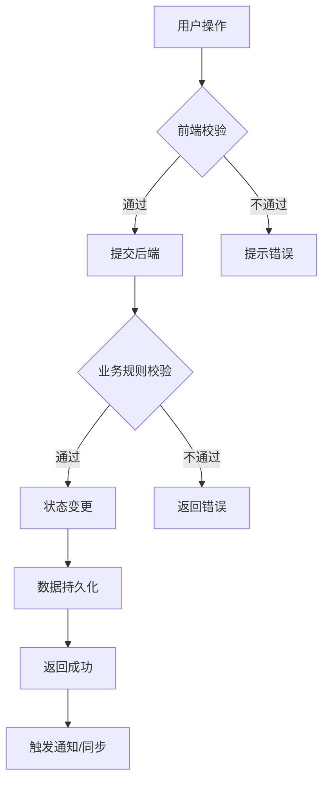
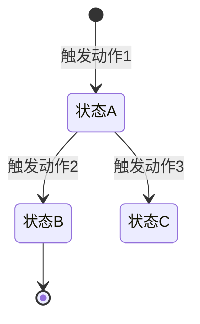

你问得很对——**这个快速模板本身不够详细**。

它只是一个“骨架”，直接拿去用，你还是会遇到我之前评审你PRD时发现的问题（概念混淆、流程缺失、边界遗漏）。

所以我需要给你两样东西：
1. **一个真正详细的模板**（骨架 + 血肉 + 示例）
2. **配套的“填充指南”**（每个章节怎么填，填到什么程度算合格）

---

# 完整版PRD模板（可直接复制使用）

```markdown
# [功能名称] 详细设计

> 版本：v1.0 | 状态：初稿 | 所属模块：[模块名]

---

## 📌 一、文档前设

### 1.1 修订历史
| 版本 | 日期 | 修订内容 | 修订人 |
|:---|:---|:---|:---|

### 1.2 术语表（⚠️ 必填，消除歧义）
| 术语 | 定义 | 与本功能的关系 | 是否与上下游对齐 |
|:---|:---|:---|:---:|
| [术语1] | [完整定义] | [例：本功能管理的核心实体] | ✅/❌ |
| [术语2] | [完整定义] | [例：上游依赖的数据] | ✅/❌ |

**填充指南**：
- 列出文档中所有可能产生歧义的名词
- 如果术语在上下游系统有不同叫法，明确映射关系
- **自检**：把文档中所有“商品”替换成“SKU”，逻辑是否还成立？

### 1.3 用户角色定义
| 角色 | 定义 | 在本功能的典型操作 | 本版本是否支持 |
|:---|:---|:---|:---:|
| [角色名] | [一句话定义] | 1. xxx<br>2. xxx | ✅/❌ |

**填充指南**：
- 不要只列角色名，要说明“这个角色在这个功能里能做什么”
- 区分“有账号就能用”和“需要特定权限”

---

## 🎯 二、业务定位

### 2.1 功能定位（一句话）
> [解决什么业务问题？在产品架构中的位置？]

**示例**：商品中心是供应商在平台的“数字货架”，覆盖从平台商品库选品到设置供货价、管理上下架的完整商品生命周期。

### 2.2 核心业务流程图


**填充指南**：
- 必须画出：正常流程 + 至少1个异常分支
- Mermaid代码要可渲染，不要留语法错误
- **自检**：流程图中每个节点，在后面的功能点设计中都有对应定义

### 2.3 模块范围（本版本包含/不包含）
| 功能分类 | 具体功能 | 优先级 | 本版本包含 | 说明/备注 |
|:---|:---|:---:|:---:|:---|
| [分类1] | [功能1] | P0 | ✅ | - |
| [分类1] | [功能2] | P1 | ✅ | MVP不包含，延后 |
| [分类2] | [功能3] | P2 | ❌ | 下个版本 |

**填充指南**：
- P0：没有这个功能版本无法上线
- P1：重要但可以首个版本后补
- P2：nice to have，明确写“不包含”

---

## 📐 三、业务规则（核心章节）

### 3.1 状态机

#### 状态定义表
| 状态名称 | 状态码 | 业务含义 | 谁可触发进入 | 可执行的操作 |
|:---|:---|:---|:---|:---|
| [状态1] | [code] | [什么情况下是这个状态] | [角色A/B/系统自动] | 编辑、提交、删除... |
| [状态2] | [code] | ... | ... | ... |

#### 状态流转图


**填充指南**：
- 状态数量：3-7个为宜，太多考虑合并
- 每个状态必须回答：用户能看到什么？能做什么操作？
- **自检**：没有“死胡同”状态（进去就出不来的状态）

### 3.2 状态×操作矩阵（⚠️ 必填，研发核心依据）
| 状态 \ 操作 | 操作A | 操作B | 操作C | 操作D |
|:---|:---:|:---:|:---:|:---:|
| 状态1 | ✅ | ❌ | ✅ | ❌ |
| 状态2 | ❌ | ✅ | ❌ | → 状态3 |
| 状态3 | ✅ | ❌ | ❌ | ✅ |

**图例**：✅=允许操作，❌=不允许操作且按钮置灰，→=操作后状态变更

**填充指南**：
- 横向是操作（动词），纵向是状态（名词）
- 每个格子明确：允许/不允许/状态变更
- **自检**：矩阵中的每个“✅”，在后面的功能设计中都有对应的交互定义

### 3.3 权限矩阵（角色 × 操作 × 状态限制）
| 功能模块 | 操作 | 角色A | 角色B | 角色C | 状态限制 | 说明 |
|:---|:---|:---:|:---:|:---:|:---|:---|
| [模块] | [操作] | ✅ | ❌ | ✅ | 仅状态1/2 | - |

**填充指南**：
- 不要只写“管理员可操作”，要写清楚每个角色
- 状态限制：有些操作只在特定状态下才显示/可用

### 3.4 业务规则表（⚠️ 核心，用表格替代长段落）
| 规则ID | 规则描述 | 触发时机 | 执行动作 | 例外情况 |
|:---|:---|:---|:---|:---|
| R001 | [规则内容] | [什么时候触发] | [系统做什么] | [什么情况下不适用] |
| R002 | ... | ... | ... | ... |

**填充指南**：
- 每条规则可被测试同学直接写成测试用例
- 覆盖：校验规则、计算规则、同步规则、通知规则
- **自检**：把所有“应该”“建议”改成“必须”“如果...那么...”

---

## 🧩 四、功能点详细设计

### 功能模板（每个功能用此结构）

```markdown
#### 4.X [功能名称]（优先级：P0/P1）

##### 📱 交互逻辑
- **入口**：[从哪里进入？按钮/菜单/链接]
- **页面形式**：[新页面/弹窗/抽屉/行内展开]
- **操作序列**：1. xxx → 2. xxx → 3. xxx → 4. xxx
- **加载状态**：[骨架屏/菊花loading/占位图]
- **空状态**：[无数据时显示什么]
- **错误状态**：[接口报错时显示什么+重试机制]

##### 📊 数据字段定义
**列表/展示字段**：
| 字段名 | 类型 | 来源 | 展示规则 | 说明 |
|:---|:---|:---|:---|:---|
| [字段] | String(100) | 系统/用户/接口 | 文本/标签/图片 | - |

**表单字段**：
| 字段名 | 类型 | 必填 | 来源 | 校验规则 | 默认值 | 说明 |
|:---|:---|:---:|:---|:---|:---|:---|
| [字段] | InputNumber | ✅ | 用户输入 | >0，最大999999 | 0 | - |

##### 🔍 搜索/筛选（如适用）
| 筛选项 | 类型 | 可选值 | 是否支持多选 | 默认值 | 说明 |
|:---|:---|:---|:---:|:---|:---|
| [筛选项] | 下拉单选 | A/B/C | ❌ | A | - |

##### 🎮 操作定义
| 操作按钮 | 可见条件 | 点击后行为 | 二次确认 | 成功反馈 | 失败反馈 |
|:---|:---|:---|:---:|:---|:---|
| [操作名] | [状态/角色限制] | [跳转/弹窗/调用接口] | ✅/❌ | Toast提示 | Toast提示 |

##### ⚠️ 边界情况
| 场景 | 处理逻辑 | 提示文案 |
|:---|:---|:---|
| [具体场景] | [前端/后端如何处理] | “用户看到的文案” |

##### 📎 原型/交互说明（如有）
- [附上原型图链接或描述关键交互细节]
```

---

## ❌ 五、异常处理汇总表

| 异常ID | 异常场景 | 触发条件 | 前端表现 | 后端行为 | 提示文案 | 用户如何恢复 |
|:---|:---|:---|:---|:---|:---|:---|
| E001 | [场景描述] | [什么情况触发] | 标红/弹窗/按钮禁用 | 返回错误码xxx | “具体文案” | 修改后重试 |
| E002 | ... | ... | ... | ... | ... | ... |

**填充指南**：
- 覆盖：网络错误、超时、业务校验失败、权限不足、并发冲突
- 每个异常都要有“用户如何恢复”
- **自检**：把所有可能出错的环节列一遍，每个都有对应行

---

## ⚡ 六、非功能性约束（业务层面）

| 维度 | 约束要求 | 测量方式 | 适用场景 | 是否强制 |
|:---|:---|:---|:---|:---:|
| 性能-列表查询 | P95 ≤ 500ms | 压测 | 数据量10万以内 | ✅ |
| 性能-提交操作 | P95 ≤ 1s | 压测 | - | ✅ |
| 数据量 | 支持单用户最多10万条 | - | - | ✅ |
| 幂等性 | 同一请求多次提交不重复创建 | - | 提交/支付类操作 | ✅ |
| 可用性 | 核心功能可用性 ≥ 99.9% | 月度统计 | - | ✅ |
| 并发 | 支持100 TPS | 压测 | 秒杀/抢购场景 | ⚠️ |

**注意**：写“要什么”（如高并发），不写“用什么”（如Redis）

---

## 🔗 七、依赖与影响分析

### 7.1 上游依赖（本功能依赖谁）
| 依赖方 | 依赖内容 | 接口/表/数据 | SLA要求 | 降级方案 |
|:---|:---|:---|:---|:---|
| [系统名] | [需要什么数据] | [具体接口] | 99.9% | 无数据时显示默认值/缓存 |

### 7.2 下游影响（谁依赖本功能）
| 影响方 | 影响内容 | 触发时机 | 是否需要通知 | 通知方式 |
|:---|:---|:---|:---:|:---|
| [系统名] | [什么数据变化会影响它] | [什么时候] | ✅/❌ | 实时同步/消息队列/异步 |

### 7.3 历史数据处理（如有）
- [ ] 是否需要数据迁移：[是/否]
- [ ] 迁移策略：[一次性/分批/双写]
- [ ] 迁移期间用户操作限制：[无限制/只读/停服]

---

## ✅ 八、自检清单（交付前逐项打勾）

### 概念一致性
- [ ] 术语表已填写，覆盖所有关键名词
- [ ] 文档中名词使用与术语表一致
- [ ] 核心实体关系明确（1对1/1对多/多对多）

### 用户旅程闭环
- [ ] 核心实体的CRUD全覆盖（增删改查）
- [ ] 状态机+状态×操作矩阵完整
- [ ] 分支流程（驳回/取消/重试/重新提交）已定义
- [ ] 从入口到出口的完整路径可走通

### 业务规则显式化
- [ ] 业务规则表已填写（规则ID+描述+触发+动作）
- [ ] 权限矩阵完整（角色×操作×状态限制）
- [ ] 所有“应该”“建议”已改为“必须”

### 数据定义精确
- [ ] 每个列表都有字段表
- [ ] 每个表单都有字段表（含类型/必填/校验/默认值）
- [ ] 枚举值已列出所有可能

### 异常与边界覆盖
- [ ] 异常汇总表已填写（至少5行）
- [ ] 空状态、加载状态、错误状态有定义
- [ ] 并发场景有提及（乐观锁/幂等）

### 依赖明确
- [ ] 上游依赖已列出
- [ ] 下游影响已分析
- [ ] 历史数据迁移方案（如需要）已定义

### 最终验证
- [ ] 找一位研发同事盲读10分钟，他能回答：
  - 这个功能的核心实体是什么？
  - 状态流转是怎样的？
  - 他需要实现哪些接口？

---

## 📎 附录：不该写的内容对照表

| 如果你在想... | 这是... | 应该... |
|:---|:---|:---|
| “用Redis还是MySQL” | 技术实现 | 删掉，或改为“需支持高并发” |
| “接口路径是POST /api/xxx” | 技术实现 | 删掉，研发自己定 |
| “前端用Table组件” | 技术实现 | 删掉，或改为“列表以表格形式展示” |
| “创建表product(id int)” | 技术实现 | 删掉，或改为“需要存储以下字段” |
| “加一个分布式锁” | 技术实现 | 改为“需防止并发重复提交” |
```

---

## 这个模板和之前快速模板的区别

| 维度 | 快速模板 | 完整模板 |
|:---|:---|:---|
| 章节结构 | ✅ 有 | ✅ 有 |
| 填充指南 | ❌ 无 | ✅ 每章都有“填充指南” |
| 自检问题 | ❌ 无 | ✅ 每章都有“自检”提示 |
| 表格示例 | ⚠️ 有骨架无示例 | ✅ 每张表格都有示例内容 |
| 不该写的内容提醒 | ❌ 无 | ✅ 附录有对照表 |
| 交付前自检清单 | ❌ 无 | ✅ 完整的打勾清单 |

**使用建议**：
1. 复制这个完整模板到你的PRD文档
2. 每写一章，看对应的“填充指南”
3. 写完后，过一遍“自检清单”
4. 交付前，删除“填充指南”和“自检”等提示文字（或保留作为团队规范）

这个模板已经可以直接用于实际工作。需要我把这个模板导出成Markdown文件供你下载吗？