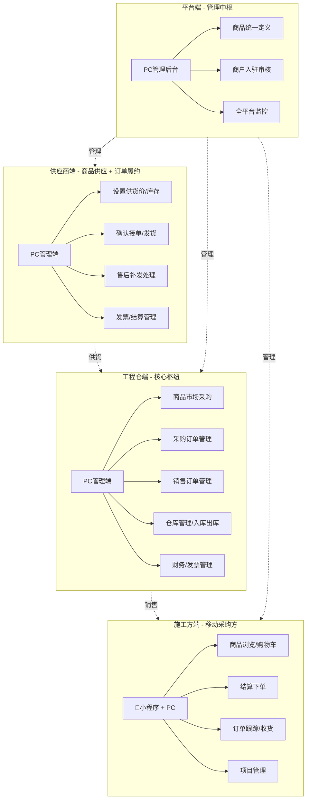
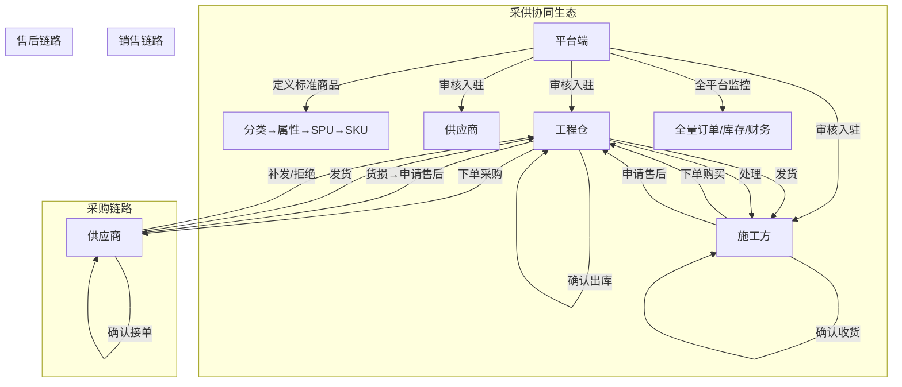

# 工程项目管理系统 - 项目总览

> 版本：v1.0 | 更新日期：2026-04-24

---

## 一、项目一句话定位

> **一个连接建材供应商、工程仓库、施工方的数字化采供协同平台，解决建材行业"熟人生意"的在线化问题。**

---

## 二、四个端，一张网

### 各端角色一句话

| 端 | 一句话描述 | 技术栈 |
|:---|:---------|:------|
| **平台端** | 管商品、管商户、看全局，不参与交易 | Vue3 + TS + Vite |
| **供应商端** | 上架商品、接单发货、开发票 | Vue3 + TS + Vite |
| **工程仓端** | 买货入库、卖货出库、管库存（双交易角色） | Vue3 + TS + Vite |
| **施工方端** | 工地上手机下单买东西 | 📱 UniApp + 小程序 |

---

## 三、跨系统协同

### 3.1 跨系统协作全景

### 3.2 核心跨系统流程

**商品生命周期 — 跨四端**

| 阶段 | 负责端 | 操作 | 输出 | 下游消费 |
|:----|:------|:----|:----|:--------|
| 分类定义 | 平台端 | 创建三级分类树 | 商品分类 | 各端只读引用 |
| 属性定义 | 平台端 | 创建规格属性组+值 | 属性定义 | SPU创建时选择 |
| SPU创建 | 平台端 | 填写基本信息+选择分类+属性 | SPU记录 | 供应商+工程仓+施工方 |
| SKU生成 | 平台端 | 自动按规格组合生成 | SKU记录 | 供应商+工程仓+施工方 |
| 供应商关联 | 平台端 | 选择供应商关联SKU | 供货关系 | 供应商端 |
| 供货价设置 | 供应商端 | 设置供货价格+库存 | 供货价+库存 | 工程仓端可见 |
| 商品上架审核 | 平台端 | 审核通过→工程仓可采购 | 在售状态 | 工程仓端 |
| 商品采购 | 工程仓端 | 浏览→加购→下单→收货 | 采购订单 | 供应商端 |
| 商品销售 | 施工方端 | 浏览→加购→下单→收货 | 销售订单 | 工程仓端 |

**售后处理流程**

| 环节 | 发起方 | 处理方 | 说明 |
|:----|:------|:------|:------|
| 货损售后 | 工程仓（收货时） | 供应商 | 入库时记录货损→生成售后单→供应商补发或拒绝 |
| 订单售后 | 施工方（收货后） | 工程仓 | 施工方申请→工程仓处理 |
| 发票问题 | 供应商/工程仓 | 对方确认 | 发票关联订单后不可修改 |

### 3.3 数据归属与边界

| 数据类型 | 定义方 | 维护方 | 消费方 | 可见范围 |
|---------|:------:|:------:|:------:|:--------|
| 商品分类 | 平台端 | 平台端 | 全部 | 全部可见 |
| SPU/SKU | 平台端 | 平台端 | 全部 | 全部可见 |
| 供货价 | 供应商端 | 供应商端 | 工程仓端 | 工程仓可见，施工方不可见 |
| 采购价 | 工程仓端 | 工程仓端 | 供应商端 | 双方可见 |
| 销售价 | 平台端 | 工程仓端 | 施工方端 | 施工方可见 |
| 库存数据 | 供应商端 | 供应商端 | 工程仓端 | 工程仓实时同步 |
| 订单数据 | — | 参与方 | 参与方 | 仅订单双方+平台端 |
| 发票数据 | 各端自管 | 各端 | 平台端 | 平台端全量查看 |

### 3.4 跨系统通信规则

| 场景 | 通信方式 | 实时性 | 说明 |
|:----|:--------|:------:|------|
| 商品定义变更 | 端内同步 | 实时 | 平台发布后各端立即生效 |
| 供货价变更 | 端内同步 | 实时 | 供应商修改后工程仓可见 |
| 订单状态变更 | 跨端通知 | 实时 | 一方操作→对方状态更新 |
| 库存变更 | 跨端同步 | 实时 | 供应商更新→工程仓同步 |
| 售后处理 | 跨端操作 | 实时 | 申请→处理→通知 |
| 结算对账 | 定期汇总 | 按周/月 | 财务数据周期性同步 |

### 3.5 跨系统异常场景

| 场景 | 影响范围 | 处理方案 |
|:----|:--------|---------|
| 供应商下架商品 | 工程仓不可采购 | 已加入购物车→提示已下架；已有订单不受影响 |
| 平台删除SKU | 所有端不可用 | 已关联的供货关系→标记失效；已有订单不受影响 |
| 供应商库存不足 | 工程仓下单后缺货 | 供应商确认时发现库存不足→联系工程仓协商 |
| 工程仓关闭 | 施工方下单中断 | 施工方无法选择该工程仓；已有订单继续履约 |
| 发票重复关联 | 财务数据不一致 | 系统禁止重复关联，提示已关联的订单号 |

---

## 四、核心概念

| 概念 | 说明 |
|:----|------|
| **三状态分离** | 订单主状态/支付状态/发货状态独立运行，互不阻塞。**先发货后付款** 是核心生意特征 |
| **商品两段定义** | 平台统一定义标准商品（分类→属性→SPU→SKU）；供应商自行设置供货价和库存 |
| **双交易链路** | 链路一：工程仓→供应商（采购）；链路二：施工方→工程仓（销售） |
| **线下生意适配** | 不做在线支付强校验，只做状态记录；物流信息非必填，支持自有配送 |

---

## 五、功能规模

| 端 | 模块数 | 功能点数 | 核心功能 |
|:---|:------:|:--------:|---------|
| 平台端 | 8大模块 | 54个 | 商品定义、商户入驻审核、全平台监控、角色权限 |
| 供应商端 | 5大模块 | 31个 | 商品中心、订单管理、发票结算、系统设置 |
| 工程仓端 | 8大模块 | 51个 | 商品市场、采购/销售订单、仓库管理、财务中心 |
| 施工方端 | 5大模块 | 28个 | 商品市场、购物车、订单管理、项目管理 |
| **合计** | **26** | **164个** | |

---

## 六、关键术语速查

| 术语 | 说明 |
|:----|------|
| 采购订单 | 工程仓→供应商的采购单据 |
| 销售订单 | 施工方→工程仓的采购单据 |
| SPU | 标准产品单元，商品定义最上层 |
| SKU | 库存量单位，最小可售商品 |
| 供货价 | 供应商设置的销售单价，仅工程仓可见 |
| BOM | 物料清单/基装包组合 |
| 货损 | 运输/收货过程中的货物损坏 |
| 结算单 | 按周期生成的对账单 |

---

## 七、相关文档入口

| 文档 | 说明 |
|:----|------|
| [系统功能说明书](系统功能说明书.md) | 各系统详细功能说明 |
| [版本迭代记录](版本迭代记录.md) | 产品发布版本历史 |
| [PRD/更新日志.md](PRD/更新日志.md) | PRD 文档版本变更记录 |
| [PRD/平台端/prd.md](PRD/平台端/prd.md) | 平台端完整 PRD |
| [PRD/供应商端/prd.md](PRD/供应商端/prd.md) | 供应商端完整 PRD |
| [PRD/工程仓端/prd.md](PRD/工程仓端/prd.md) | 工程仓端完整 PRD |
| [PRD/施工方端/prd.md](PRD/施工方端/prd.md) | 施工方端完整 PRD |
