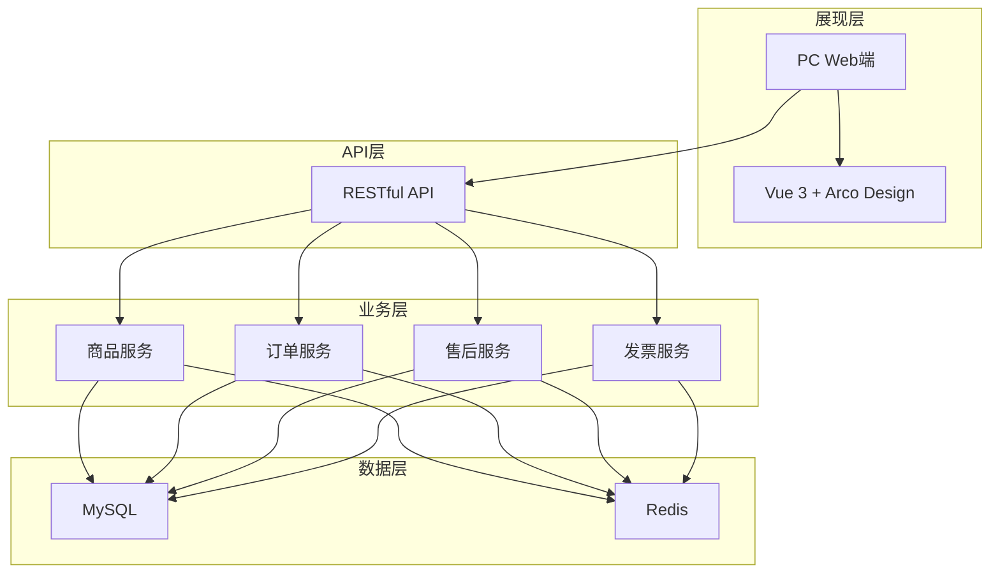

# 供应商端 - 系统概览与架构

> 版本：v1.0  
> 文档状态：初稿  
> 所属章节：第一章

## 版本历史

| 版本 | 日期 | 修订内容 |
|:----:|:----:|---------|
| v1.0 | 2026-04-24 | 初始创建 |

---

## 一、功能定位

### 1.1 系统定位

供应商端是工程仓采供一体化平台的**商品供应方核心端口**，承担**供货+履约**双重角色：

> 📸 **系统登录界面** — 供应商端 PC 管理后台入口
> 

```
┌─────────────────────────────────────────────────────────────┐
│                    供应商端（商品供应+订单履约）                │
├─────────────────────────────────────────────────────────────┤
│                                                              │
│  角色一：作为商品供应方                                        │
│  ┌──────────────────┐    ┌──────────────────┐              │
│  │ 商品中心          │ →  │ 商品管理          │              │
│  │ 从平台选择/提交商品 │    │ 设置供货价/上下架   │              │
│  └──────────────────┘    └──────────────────┘              │
│                                                              │
│  角色二：作为订单履约方                                        │
│  ┌──────────────────┐    ┌──────────────────┐              │
│  │ 订单管理          │ →  │ 订单发货          │              │
│  │ 接单/取消/售后     │    │ 物流/打印/补发     │              │
│  └──────────────────┘    └──────────────────┘              │
│                                                              │
└─────────────────────────────────────────────────────────────┘
```

### 1.2 系统设计哲学

| 原则 | 说明 |
|------|------|
| **熟人生意** | 先发货后付款是常态，系统不做强支付校验 |
| **商品标准化** | 从平台商品库选择标准SPU/SKU，供应商仅配置供货价 |
| **履约闭环** | 从接单到发货到补发，全链路可追溯 |
| **财务合规** | 发票-支付-结算三流合一 |

### 1.3 核心价值

- **订单协同**：与工程仓实时订单同步，减少电话/微信沟通成本
- **物流透明**：多物流单号跟踪，配送状态实时更新
- **资金安全**：托管账户+分账机制，货款安全有保障
- **财务合规**：发票-支付-对账三流合一，满足财税合规要求

> 📸 **工作台概览** — 供应商端登录后首页，展示核心运营数据
> 

---

## 二、技术架构

### 2.1 整体架构分层

> 📸 **系统架构图** — 供应商端整体技术架构分层
> 



### 2.2 技术选型

| 技术栈 | 选型 | 用途 |
|-------|------|------|
| 前端框架 | Vue 3.x + TypeScript | PC管理后台 |
| UI组件库 | Arco Design 2.x | 统一UI风格 |
| 后端框架 | Spring Boot 3.x | 微服务架构 |
| 数据库 | MySQL 8.x | 核心业务数据 |
| 缓存 | Redis 7.x | 分布式锁/缓存 |

---

## 三、功能模块树

```
供应商端
├── 首页/工作台
│   └── 数据概览 (P1)
├── 商户信息
│   ├── 主体信息查看 (P1)
│   ├── 主体信息编辑 (P1)
│   └── 合同列表 (P2)
├── 商品中心
│   ├── 商品列表 (P0)
│   │   ├── 新增商品 (P0)
│   │   ├── 编辑商品 (P0)
│   │   ├── 商品详情 (P0)
│   │   └── 商品上下架 (P0)
│   └── 库存管理
│       ├── 库存查询 (P1)
│       └── 库存流水 (P1)
├── 订单管理
│   ├── 订单列表 (P0)
│   │   ├── 订单详情 (P0)
│   │   ├── 确认订单 (P0)
│   │   ├── 取消订单 (P1)
│   │   ├── 订单发货 (P0)
│   │   └── 发货打印 (P0)
│   └── 售后管理
│       ├── 售后列表 (P1)
│       ├── 货损处理 (P1)
│       ├── 补发处理 (P1)
│       └── 拒绝补发 (P2)
├── 财务中心
│   ├── 发票管理
│   │   ├── 发票列表 (P1)
│   │   ├── 新增发票 (P1)
│   │   ├── 关联订单 (P1)
│   │   ├── 发票详情 (P1)
│   │   └── 下载发票 (P2)
│   ├── 待结算 (P1)
│   └── 结算单 (P1)
└── 系统设置
    ├── 账号列表 (P1)
    ├── 员工管理 (P1)
    ├── 角色列表 (P1)
    └── 权限配置 (P1)
```

---

## 四、角色定义

| 角色 | 系统标识 | 层级 | 核心场景 | 使用端 |
|------|---------|:----:|---------|:------:|
| 管理员 | admin | 管理层 | 账号/角色/权限全局管理 | PC |
| 业务员 | operator | 操作层 | 商品管理、订单处理 | PC |
| 仓管员 | warehouse | 操作层 | 订单发货、库存查询 | PC |
| 财务人员 | finance | 操作层 | 发票管理、结算对账 | PC |
| 客服 | service | 操作层 | 售后处理、补发管理 | PC |

---

## 五、非功能性需求

| 维度 | 要求 | 衡量标准 |
|-----|------|---------|
| 性能 | 列表页初次加载<3s，操作响应<1s | Lighthouse评分>85 |
| 可用性 | 核心功能可用性>99.5% | 月度可用性统计 |
| 安全 | RBAC权限控制，数据按商户隔离 | 权限验证100%覆盖 |
| 可扩展 | 业务模块可按需增减 | 模块解耦设计 |

