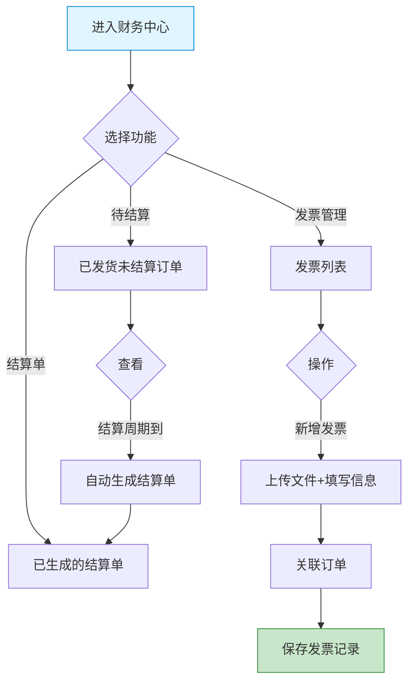

# 供应商端 - 财务中心功能详细设计

> 版本：v1.0  
> 文档状态：初稿  
> 所属章节：第八章

## 版本历史

| 版本 | 日期 | 修订内容 | 修订人 |
|:----:|:----:|---------|:-----:|
| v1.0 | 2026-04-24 | 初始创建，覆盖7个功能点的详细设计 | PM |
| v2.0 | 2026-04-24 | 重构为新版11章模板，新增核心设计原则、Mermaid流程图、权限矩阵、非功能性需求、异常汇总表、接口依赖建议 | PM |

<!-- ============================================================ -->
<!-- PRD六层模型：                                                    -->
<!--                                                              -->
<!-- 核心层(必写)： 功能概述 → 设计原则 → 业务规则(含流程图) → 功能点详情   -->
<!-- 扩展层(推荐)： 权限矩阵 → 非功能性需求 → 异常汇总 → 接口依赖      -->
<!-- 治理层(状态模块必写)： 状态流转图 → 状态治理矩阵 → 版本历史       -->
<!-- ============================================================ -->

---

## 一、功能概述

### 1.1 功能定位

财务中心是供应商端的**财务管理模块**，涵盖发票管理、待结算、结算单三大核心能力。供应商通过财务中心管理已发货订单的结算和发票开具。

### 1.2 核心概念

| 概念 | 说明 | 示例 |
|:----|------|------|
| 进项发票 | 供应商开给工程仓的发票 | - |
| 待结算 | 已发货但尚未进入结算周期的订单集合 | - |
| 结算单 | 按结算周期生成的对账单 | - |

### 1.3 目标用户

- **管理员**：管理发票和查看结算
- **财务**（核心用户）：管理发票上传和结算对账

### 1.4 模块范围

| 功能分类 | 主要功能 | 优先级 |
|:--------|---------|:------:|
| 发票管理 | 发票列表、新增、关联、详情、下载 | P1-P2 |
| 结算管理 | 待结算列表、结算单列表 | P1 |

---

## 二、核心设计原则

> **财务中心遵循"记录驱动结算"原则——所有财务操作以订单执行记录为依据。**

### 2.1 发票订单关联原则

- 一笔订单只能关联一个发票
- 发票已关联不可重复关联
- 发票上传后关联订单，形成完整财务链路

### 2.2 结算周期原则

- 结算周期按自然月
- 已发货且工程仓确认收货的订单进入待结算
- 结算单生成后不可修改

---

## 三、业务规则

### 3.1 发票规则

- 一笔订单只能关联一个发票
- 发票已关联不可重复关联
- 发票上传文件格式：PDF/JPG/PNG，大小不超过10MB

### 3.2 结算规则

- 结算周期按自然月
- 已发货且工程仓已确认收货的订单进入待结算
- 结算单生成后不可修改

### 3.3 核心业务流程图

---

## 四、权限矩阵

| 功能模块 | 具体操作 | 管理员 | 财务 | 说明 |
|:--------|---------|:------:|:----:|------|
| **发票管理** | 查看列表 | ✅ | ✅ | - |
| | 新增发票 | ✅ | ✅ | - |
| | 关联订单 | ✅ | ✅ | - |
| | 下载发票 | ✅ | ✅ | - |
| **待结算** | 查看列表 | ✅ | ✅ | - |
| **结算单** | 查看列表 | ✅ | ✅ | - |

---

## 五、非功能性需求

| 接口/场景 | P95要求 |
|:---------|:-------:|
| 发票列表查询 | ≤ 500ms |
| 发票上传 | ≤ 2s（含文件上传） |
| 待结算列表 | ≤ 500ms |
| 结算单列表 | ≤ 500ms |

---

## 六、功能点详细设计

### 6.1 发票列表（P1）

查看供应商已开具的所有发票。字段：发票号码/关联订单/发票金额/开票日期/状态(有效/无效)。

### 6.2 新增发票（P1）

#### 交互逻辑

1. 上传发票文件 → 自动上传
2. 填写发票号码、发票金额
3. 选择关联订单（下拉选择）
4. 提交 → 生成发票记录

#### 原子字段定义

| 字段 | 必填 | 来源 | 校验规则 |
|:----|:----|:----:|:----|:--------|
| 发票文件 | 是 | 上传 | PDF/JPG/PNG ≤10MB |
| 发票号码 | 是 | 输入 | 非空 |
| 发票金额 | 是 | 输入 | >0 |
| 关联订单 | 是 | Select | 已存在订单 |

#### 边界情况覆盖

| 场景 | 处理逻辑 | 提示文案 |
|:----|:--------|---------|
| 发票号码重复 | 后端校验 | "发票号码已存在" |
| 文件过大 | 前端拦截 | "文件不能超过10MB" |

### 6.3 关联订单（P1）

点击"关联订单"→弹出订单选择弹窗→选择未关联订单→确认→更新发票状态。

### 6.4 待结算列表（P1）

展示已发货但未结算的订单列表。字段：订单编号/工程仓/订单金额/已发货日期/结算状态(待结算/已结算)。

### 6.5 结算单列表（P1）

展示已生成的结算记录。字段：结算单编号/结算周期/结算金额/订单数量/状态(待确认/已确认)。

---

## 七、异常处理汇总表

| 异常场景 | 前端处理 | 提示文案 |
|:--------|:--------|---------|
| 发票文件>10M | 前端拦截 | "文件不能超过10MB" |
| 文件格式不支持 | 前端拦截 | "仅支持PDF/JPG/PNG格式" |
| 发票号码重复 | 后端校验 | "发票号码已存在" |
| 订单已关联发票 | 后端校验 | "该订单已关联发票" |
| 结算单加载失败 | Toast | "结算数据加载失败" |

---

## 八、接口需求说明

| 接口 | 用途 | 性能要求 |
|:----|:----|:--------:|
| 发票列表 | 发票列表 |
| 新增发票 | 新增发票 |
| 关联订单 | 关联订单 |
| 待结算列表 | 待结算列表 |
| 结算单列表 | 结算单列表 |
