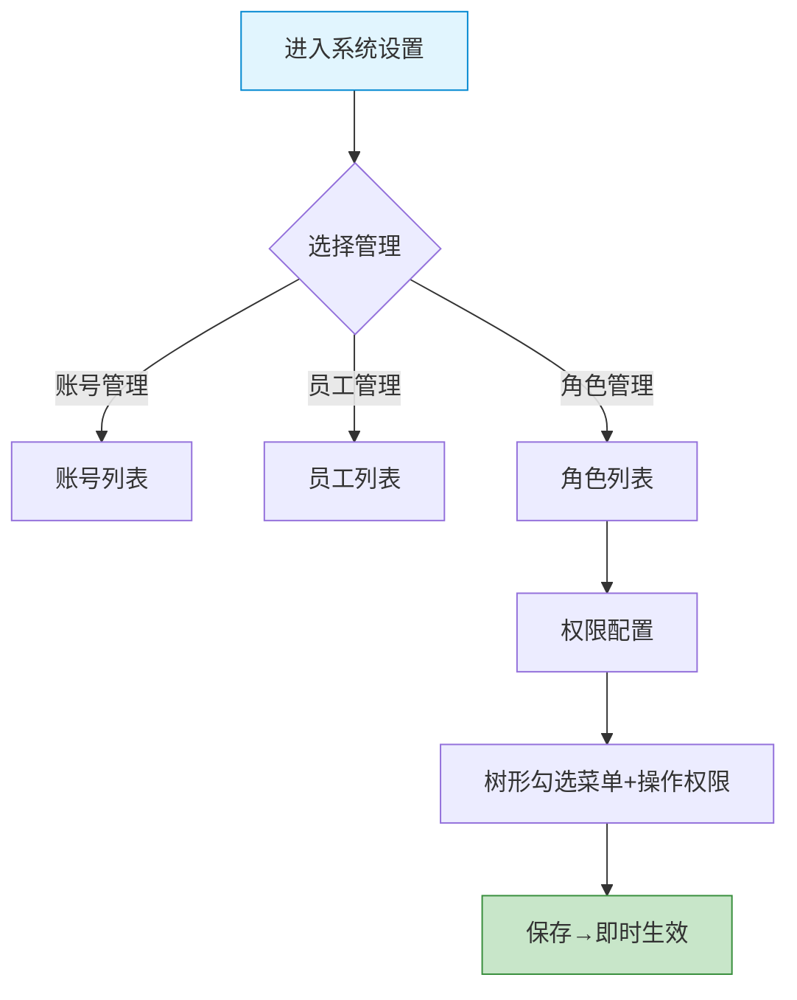

# 供应商端 - 系统设置功能详细设计

> 版本：v1.0  
> 文档状态：初稿  
> 所属章节：第九章

## 版本历史

| 版本 | 日期 | 修订内容 | 修订人 |
|:----:|:----:|---------|:-----:|
| v1.0 | 2026-04-24 | 初始创建，覆盖4个功能点的详细设计 | PM |
| v2.0 | 2026-04-24 | 重构为新版11章模板，新增核心设计原则、Mermaid流程图、权限矩阵、非功能性需求、异常汇总表、接口依赖建议 | PM |

<!-- ============================================================ -->
<!-- PRD六层模型：                                                    -->
<!--                                                              -->
<!-- 核心层(必写)： 功能概述 → 设计原则 → 业务规则(含流程图) → 功能点详情   -->
<!-- 扩展层(推荐)： 权限矩阵 → 非功能性需求 → 异常汇总 → 接口依赖      -->
<!-- 治理层(状态模块必写)： 状态流转图 → 状态治理矩阵 → 版本历史       -->
<!-- ============================================================ -->

---

## 一、功能概述

### 1.1 功能定位

系统设置是供应商端的**管理配置模块**，提供账号管理、员工管理、角色管理和权限配置能力。

### 1.2 核心概念

| 概念 | 说明 | 示例 |
|:----|------|------|
| 账号 | 供应商的登录账号，对应具体员工 | 张三的登录账号 |
| 角色 | 权限集合，不同角色拥有不同的操作权限 | 管理员/业务员/仓管员 |
| 权限配置 | 为角色勾选具体的功能操作权限 | 菜单+按钮粒度 |

### 1.3 目标用户

- **管理员**（核心用户）：管理所有账号、员工和角色权限
- **业务员/仓管员/财务/客服**：被管理对象

### 1.4 模块范围

| 功能分类 | 主要功能 | 优先级 |
|:--------|---------|:------:|
| 账号管理 | 账号列表 | P1 |
| 员工管理 | 员工列表 | P1 |
| 角色管理 | 角色列表、权限配置 | P1 |

---

## 二、核心设计原则

> **系统设置遵循RBAC权限模型——管理员可以精细化配置各角色的功能权限。**

### 2.1 RBAC原则

- 预设角色：管理员、业务员、仓管员、财务、客服
- 角色权限按功能菜单+按钮粒度配置
- 一个员工可拥有多个角色

### 2.2 账号员工分离原则

- 一个员工只能有一个账号
- 账号创建后自动以员工手机号为登录名
- 员工离职后在员工管理标记离职状态

---

## 三、业务规则

### 3.1 账号规则

- 一个员工只能有一个账号
- 账号创建后自动以员工手机号为登录名
- 账号状态：启用/禁用

### 3.2 角色规则

- 预设角色：管理员、业务员、仓管员、财务、客服
- 角色权限按功能菜单+按钮粒度配置
- 一个员工可拥有多个角色

### 3.3 权限树结构（参考）

```
供应商端
├── 工作台: 数据概览查看
├── 商户信息: 查看、编辑
├── 商品中心
│   ├── 商品列表: 查看、新增、编辑、上下架
│   ├── 库存查询: 查看
│   └── 库存流水: 查看
├── 订单管理
│   ├── 订单列表: 查看、确认、取消、发货
│   ├── 售后管理: 查看、处理补发
│   └── 发货打印: 操作
├── 财务中心
│   ├── 发票管理: 查看、新增、关联、下载
│   ├── 待结算: 查看
│   └── 结算单: 查看
└── 系统设置
    ├── 账号列表: 查看、新增、禁用
    ├── 员工管理: 查看、新增、编辑、离职
    ├── 角色列表: 查看、新增、编辑
    └── 权限配置: 配置
```

### 3.4 核心业务流程图



---

## 四、权限矩阵

| 功能模块 | 具体操作 | 管理员 | 其他角色 | 说明 |
|:--------|---------|:------:|:--------:|------|
| **账号管理** | 查看/新增/禁用 | ✅ | ❌ | 仅管理员 |
| **员工管理** | 查看/新增/编辑/离职 | ✅ | ❌ | 仅管理员 |
| **角色管理** | 查看/新增/编辑 | ✅ | ❌ | 仅管理员 |
| **权限配置** | 配置角色权限 | ✅ | ❌ | 仅管理员 |

---

## 五、非功能性需求

| 接口/场景 | P95要求 |
|:---------|:-------:|
| 账号/员工/角色列表查询 | ≤ 300ms |
| 权限配置保存 | ≤ 500ms |

---

## 六、功能点详细设计

### 6.1 账号列表（P1）

#### 交互逻辑

列表展示：账号名/所属员工/角色/状态/最后登录。支持新增/编辑/启用禁用。

#### 原子字段定义

| 字段 | 必填 | 来源 | 展示规则 |
|:----|:----|:----:|:----|:--------|
| 账号名 | 是 | 系统生成(手机号) | 文本 |
| 所属员工 | 是 | 员工关联 | 文本 |
| 角色 | 是 | 角色分配 | Tag标签 |
| 状态 | 是 | 系统 | 开关(启用/禁用) |
| 最后登录 | 否 | 系统记录 | YYYY-MM-DD HH:mm |

---

### 6.2 员工管理（P1）

展示员工姓名/手机号/岗位/状态(在职/离职)。支持新增/编辑/标记离职。

### 6.3 角色列表（P1）

展示角色名称/角色编码/员工数/操作。支持新增/编辑角色。

### 6.4 权限配置（P1）

#### 交互逻辑

1. 点击"权限配置" → 弹出权限树弹窗
2. 按菜单+按钮粒度勾选权限
3. 保存 → 角色权限更新生效

#### 边界情况覆盖

| 场景 | 处理逻辑 |
|:----|:--------|
| 保存权限配置 | 即时生效，下次请求时刷新权限 |
| 取消配置 | 关闭弹窗，不保存 |

---

## 七、异常处理汇总表

| 异常场景 | 提示文案 |
|:--------|---------|
| 账号创建失败 | "账号创建失败，请检查输入" |
| 员工手机号重复 | "手机号已被其他员工使用" |
| 权限配置保存失败 | "权限保存失败，请重试" |

---

## 八、接口需求说明

| 接口 | 用途 | 性能要求 |
|:----|:----|:--------:|
| 账号列表 | 账号列表 |
| 创建账号 | 创建账号 |
| 启用/禁用 | 启用/禁用 |
| 员工列表 | 员工列表 |
| 角色列表 | 角色列表 |
| 权限配置保存 | 权限配置保存 |
