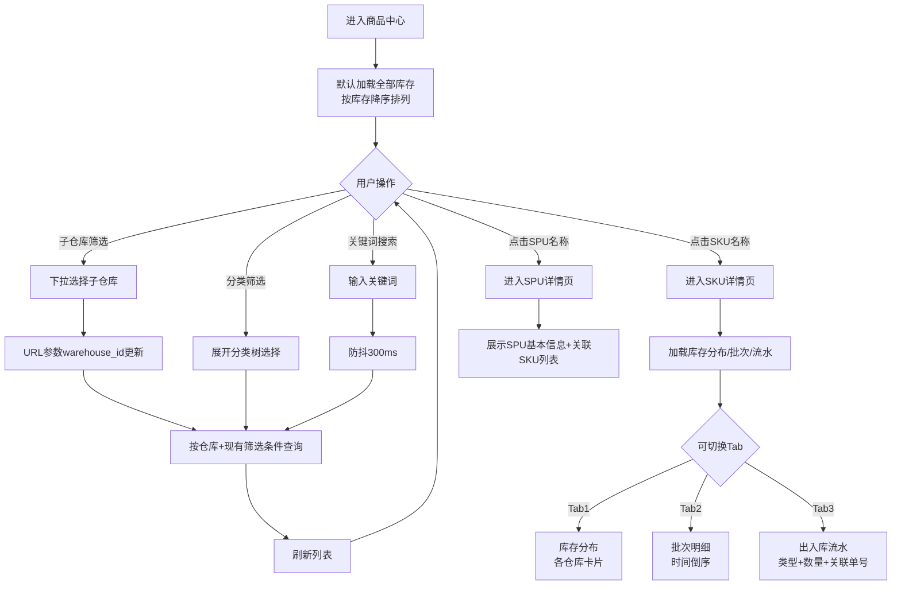

# 工程仓端 - 商品中心功能详细设计

> 版本：v2.0  
> 文档状态：已定稿  
> 所属章节：第八章

## 版本历史

| 版本 | 日期 | 修订内容 | 修订人 |
|:----:|:----:|---------|:-----:|
| v1.0 | 2026-04-24 | 初始创建，覆盖商品中心全部4个功能点 | PM |
| v2.0 | 2026-04-24 | 重构为新版11章模板，新增设计原则、流程图、权限矩阵、非功能性需求、异常汇总表、接口依赖建议 | PM |

<!-- ============================================================ -->
<!-- PRD六层模型：                                                    -->
<!--                                                              -->
<!-- 核心层(必写)： 功能概述 → 设计原则 → 业务规则(含流程图) → 功能点详情   -->
<!-- 扩展层(推荐)： 权限矩阵 → 非功能性需求 → 异常汇总 → 接口依赖      -->
<!-- 治理层(状态模块必写)： 状态流转图 → 状态治理矩阵 → 版本历史       -->
<!-- ============================================================ -->

---

## 一、功能概述

### 1.1 功能定位

商品中心是工程仓管理**库存商品**的核心模块，展示工程仓各子仓库内的商品信息、库存分布、SPU/SKU详情。商品中心解决"我们有什么货、货在哪、有多少"的问题，是采购员了解库存、仓管员管理库存的统一入口。

### 1.2 核心概念

| 概念 | 说明 | 示例 |
|:----|------|------|
| 库存商品 | 已入库到工程仓各子仓库中的商品 | 在仓的"海螺325水泥" |
| 库存分布 | 同一SKU在不同子仓库的库存数量 | A仓100袋，B仓50袋 |
| SPU | 商品标准定义信息 | 名称、品牌、分类、规格模板 |
| SKU | 具体规格商品的库存详情 | 50kg装的库存+批次+流水 |
| 库存预警 | 库存低于阈值时红色提醒 | 库存<10时红色标红 |

### 1.3 目标用户

- **采购员**：了解现有库存，辅助采购决策
- **仓管员**：查看所管仓库的库存商品情况
- **主管**：全局了解工程仓库存状况

### 1.4 模块范围

| 功能分类 | 主要功能 | 涉及角色 |
|:--------|---------|---------|
| 库存查询 | 库存商品列表、按仓库筛选、按分类筛选、搜索 | 采购员、仓管员、主管 |
| 商品详情 | SPU详情（名称/品牌/分类/规格） | 采购员、仓管员 |
| SKU详情 | 库存分布、批次明细、出入库流水 | 采购员、仓管员 |

---

## 二、核心设计原则

> **商品中心遵循"数据实时展示、只读不写"原则，库存数据来自仓库管理模块的事务操作。**

### 2.1 数据一致性原则

- 所有库存数据来自仓库管理模块（入库/出库/盘点/调拨）的真实事务操作
- 商品中心本身不做任何库存写操作，是纯只读展示模块
- 每次进入页面时从服务端获取最新数据，不做本地缓存

### 2.2 库存预警原则

- 库存 ≤ 安全库存阈值（可配置，默认10）时红色标红
- 预警商品在列表中置顶显示
- 库存为0的商品仍在列表中展示（灰色），排在末尾

---

## 三、业务规则

### 3.1 库存展示规则

- **默认视图**：展示工程仓所有子仓库的库存商品汇总，按商品（SKU）聚合展示库存总量
- **仓库筛选**：选择指定子仓库→仅展示该仓库存，筛选条件缓存在URL参数中
- **排序规则**：默认按库存数量降序排列，库存为0排在末尾（灰色）
- **库存预警**：库存≤安全库存阈值时红色标红，预警商品在列表置顶

### 3.2 数据一致性规则

- 库存数量随入库/出库操作实时更新
- 每次进入商品中心页面时从服务端获取最新数据
- 并发操作时使用 version 字段乐观锁防止超卖（入库/出库时）

### 3.3 核心业务流程图

#### 流程图1：库存商品查询全流程

---

## 四、权限矩阵

| 功能模块 | 具体操作 | 采购员 | 仓管员 | 主管 | 说明 |
|:--------|---------|:------:|:------:|:----:|------|
| **库存商品列表** | 查看列表 | ✅ | ✅ | ✅ | - |
| | 仓库筛选 | ✅ | ✅ | ✅ | - |
| | 分类筛选 | ✅ | ✅ | ✅ | - |
| | 关键词搜索 | ✅ | ✅ | ✅ | - |
| **SPU详情** | 查看详情 | ✅ | ✅ | ✅ | 只读 |
| **SKU详情** | 库存分布 | ✅ | ✅ | ✅ | - |
| | 批次明细 | ✅ | ✅ | ✅ | - |
| | 出入库流水 | ✅ | ✅ | ✅ | - |

---

## 五、非功能性需求

### 5.1 性能要求

| 接口/场景 | 指标 | P95要求 | 说明 |
|:---------|:----|:-------:|------|
| 库存商品列表 | 响应时间 | ≤ 300ms | 含库存实时查询 |
| SPU详情 | 响应时间 | ≤ 300ms | 关联SKU列表查询 |
| SKU库存分布 | 响应时间 | ≤ 200ms | 按仓库维度聚合 |
| 批次明细 | 响应时间 | ≤ 300ms | 含分页 |
| 出入库流水 | 响应时间 | ≤ 300ms | 含分页 |

### 5.2 埋点需求

| 页面 | 事件名 | 触发时机 | 上报字段 |
|:----|:------|---------|---------|
| 商品列表 | inventory_list_view | 进入列表页 | `warehouseId`, `categoryId` |
| 商品列表 | inventory_search | 执行搜索 | `keyword`, `resultCount` |
| 商品列表 | warehouse_filter | 切换仓库 | `warehouseId` |
| SKU详情 | sku_detail_view | 进入SKU详情 | `skuId`, `activeTab` |

---

## 六、功能点详细设计

### 6.1 库存商品列表（P0）

#### 交互逻辑

1. 页面加载：默认展示全部库存商品（按库存降序排列）
2. 仓库筛选：下拉选择子仓库 → 刷新列表显示该仓库存
3. 分类筛选：分类树选择 → 按分类过滤商品
4. 搜索：输入关键词（防抖300ms） → 搜索商品名称/SKU编码
5. 点击商品名称：跳转SKU库存详情页
6. 点击SPU名称：跳转SPU详情页
7. 支持导出当前筛选结果（V2）

#### 原子字段定义

| 字段 | 必填 | 来源 | 校验规则 | 展示规则 | 默认值 |
|:----|:----|:----:|:----|:--------|:--------|:-----:|
| 子仓库筛选 | 否 | 仓库接口 | - | Select下拉 | 全部 |
| 分类筛选 | 否 | 分类接口 | - | TreeSelect树 | 全部 |
| 商品名称 | 是 | 库存接口 | 非空 | 超链接跳转SKU详情 | - |
| SKU编码 | 是 | 库存接口 | 非空 | 文本 | - |
| 规格属性 | 否 | 库存接口 | - | 标签形式 | - |
| 当前库存 | 是 | 库存接口 | ≥0 | 预警值红色加粗，0灰色 | - |
| 安全库存 | 是 | 库存接口 | ≥0 | 数字 | 10 |
| 所属仓库 | 是 | 仓库接口 | 非空 | 文本 | - |

#### 边界情况覆盖

| 场景 | 处理逻辑 | 提示文案 |
|:----|:--------|---------|
| 加载失败 | 重试按钮 | "加载失败，请重试" |
| 仓库无商品 | 空状态 | "该仓库暂无库存商品" |
| 搜索无结果 | 空状态 | "未找到匹配的商品" |
| 筛选条件丢失 | URL参数无效时重置为默认 | - |

---

### 6.2 SPU详情查看（P1）

#### 交互逻辑

1. 页面加载：获取SPU详情 → 展示SPU基本信息
2. 规格属性区：展示该SPU下的所有规格属性及可选值
3. 关联SKU列表：展示该SPU下的所有SKU及各仓库库存

#### 原子字段定义

| 字段 | 必填 | 来源 | 展示规则 |
|:----|:----|:----:|:----|:--------|
| SPU名称 | 是 | 商品接口 | 完整名称，标题字体 |
| 品牌 | 是 | 商品接口 | 标签展示 |
| 所属分类 | 是 | 商品接口 | 完整分类路径 |
| 规格属性 | 否 | 商品接口 | 属性名+值标签组 |
| 商品主图 | 否 | 商品接口 | 缩略图展示 |
| 关联SKU列表 | 是 | 库存接口 | 表格展示各SKU库存 |

#### 边界情况覆盖

| 场景 | 处理逻辑 | 提示文案 |
|:----|:--------|---------|
| SPU不存在 | 404页面 | "该商品不存在" |
| 无关联SKU | 空状态提示 | "该SPU下暂无SKU" |
| 主图加载失败 | 默认占位图 | - |

---

### 6.3 SKU库存详情（P0）

#### 交互逻辑

1. 页面加载：获取SKU ID → 多Tab展示
2. Tab1 - 库存分布：各子仓库的库存数量+预警状态卡片
3. Tab2 - 批次明细：该SKU所有入库批次记录（时间倒序）
4. Tab3 - 出入库流水：该SKU的库存变动记录流水

#### 原子字段定义

**Tab1-库存分布：**
| 字段 | 来源 | 展示规则 |
|:----|:----|:----|:--------|
| 子仓库名称 | 仓库接口 | 卡片标题 |
| 当前库存 | 库存接口 | 预警值红色，0灰色 |
| 状态 | 前端计算 | 正常/预警/无货（标签） |

**Tab2-批次明细：**
| 字段 | 来源 | 展示规则 |
|:----|:----|:----|:--------|
| 批次号 | 批次接口 | 文本 |
| 入库时间 | 批次接口 | YYYY-MM-DD HH:mm |
| 入库数量 | 批次接口 | 数字 |
| 当前剩余 | 前端计算 | 数字 |
| 有效期 | 批次接口 | YYYY-MM-DD |

**Tab3-出入库流水：**
| 字段 | 来源 | 展示规则 |
|:----|:----|:----|:--------|
| 流水时间 | 流水接口 | YYYY-MM-DD HH:mm |
| 类型 | 流水接口 | 入库(绿)/出库(红)图标 |
| 数量 | 流水接口 | +入库/-出库 |
| 关联单号 | 流水接口 | 超链接跳转 |
| 操作人 | 流水接口 | 姓名 |

#### 边界情况覆盖

| 场景 | 处理逻辑 | 提示文案 |
|:----|:--------|---------|
| SKU不存在 | 404页面 | "该SKU不存在" |
| 库存分布无数据 | 空状态 | "该SKU暂无库存" |
| 批次无数据 | 空状态 | "暂无批次记录" |
| 流水无数据 | 空状态 | "暂无出入库记录" |

---

## 七、异常处理汇总表

| 异常场景 | 触发条件 | 处理方式 | 提示文案 |
|:--------|:--------|:--------|:--------|---------|
| 列表加载失败 | 接口超时 | 重试按钮 | - | "加载失败，请重试" |
| 仓库无商品 | 筛选后列表=0 | 空状态 | 空列表 | "该仓库暂无库存商品" |
| 搜索无结果 | 查询返回空 | 空状态 | 空列表 | "未找到匹配的商品" |
| SKU不存在 | 参数无效 | 404页面 | 返回404 | "该SKU不存在" |
| 库存分布无数据 | 该SKU无库存 | 空状态 | 返回空 | "该SKU暂无库存" |
| 图片加载失败 | 网络异常 | 默认占位图 | - | - |

---

## 八、接口需求说明

| 接口用途 | 核心能力要求 |
|:----|:----|:-------------|:--------:|
| 库存商品列表 | 库存商品列表 |
| SKU库存分布 | SKU库存分布 |
| 批次明细 | 批次明细 |
| 出入库流水 | 出入库流水 |
| SPU详情 | SPU详情 |

