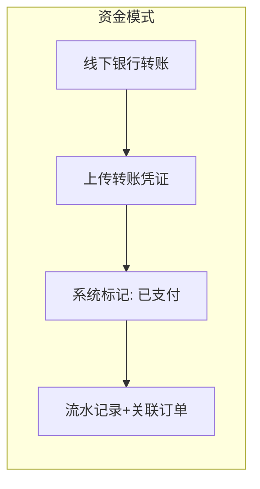
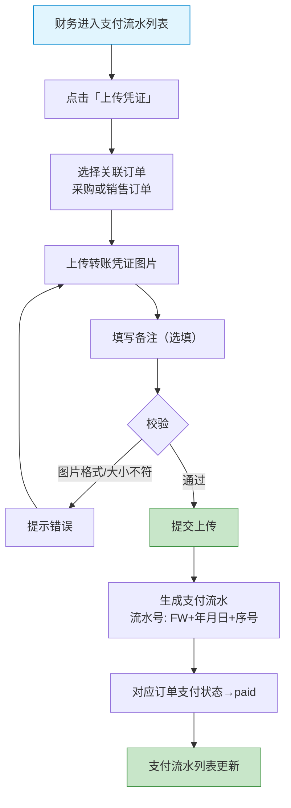

# 工程仓端 - 财务中心功能详细设计

> 版本：v2.0  
> 文档状态：已定稿  
> 所属章节：第十二章

## 版本历史

| 版本 | 日期 | 修订内容 | 修订人 |
|:----:|:----:|---------|:-----:|
| v1.0 | 2026-04-24 | 初始创建，覆盖财务中心全部4个功能点 | PM |
| v2.0 | 2026-04-24 | 重构为新版11章模板，新增设计原则、流程图、权限矩阵、非功能性需求、异常汇总表、接口依赖 | PM |

<!-- ============================================================ -->
<!-- PRD六层模型：                                                    -->
<!--                                                              -->
<!-- 核心层(必写)： 功能概述 → 设计原则 → 业务规则(含流程图) → 功能点详情   -->
<!-- 扩展层(推荐)： 权限矩阵 → 非功能性需求 → 异常汇总 → 接口依赖      -->
<!-- 治理层(状态模块必写)： 状态流转图 → 状态治理矩阵 → 版本历史       -->
<!-- ============================================================ -->

---

## 一、功能概述

### 1.1 功能定位

财务中心负责工程仓的资金流水记录、发票管理和对账管理。**核心原则：不做在线支付，只做凭证记录和状态标记**。财务中心解决"钱从哪来、钱到哪去、票怎么对"的问题，完全适配线下生意场景。

### 1.2 核心概念

| 概念 | 说明 | 示例 |
|:----|------|------|
| 支付流水 | 线下转账的凭证记录 | 上传银行转账截图 |
| 进项发票 | 供应商开给工程仓的发票（收票） | 供应商开具的增值税发票 |
| 销项发票 | 工程仓开给施工方的发票（开票） | 工程仓开具的发票 |
| 对账单 | 与供应商/施工方的往来账款汇总 | 月度对账单 |
| 凭证 | 线下转账的证明文件 | 银行回单截图 |

### 1.3 目标用户

- **财务**（核心）：上传凭证、管理发票、对账
- **主管**：查看财务数据和报表

### 1.4 工程仓资金模式

> **线下转账、线上记账**——不做在线支付，不接三方支付网关，不做资金托管，不做自动分账。

### 1.5 模块范围

| 功能分类 | 主要功能 | 涉及角色 |
|:--------|---------|---------|
| 支付流水 | 流水列表、上传凭证、凭证查看 | 财务、主管 |
| 进项发票 | 进项发票列表、上传发票 | 财务 |
| 销项发票 | 销项发票列表、上传发票 | 财务 |
| 对账管理 | 对账单列表、生成对账单、对账详情 | 财务、主管 |

---

## 二、核心设计原则

> **财务中心遵循"凭证驱动、线下闭环"原则。**

### 2.1 凭证驱动

- 所有资金变动以**上传凭证**为触发条件，不依赖第三方支付回调
- 凭证上传后系统自动生成流水号（FW+年月日+序号）
- 凭证图片作为法律效力的证明依据

### 2.2 线下闭环

- 系统内所有"支付"操作为标记操作，实际资金走线下银行转账
- 不做在线支付、不接三方网关、不做自动分账

### 2.3 发票与订单弱关联

- 发票以文件上传方式管理，不强制关联订单
- 进项票关联采购订单（推荐），销项票关联销售订单（推荐）
- 对账时手工匹配发票与流水

---

## 三、业务规则

### 3.1 支付流水规则

- **凭证上传**：财务上传线下转账凭证图片 → 系统生成支付流水
- **流水生成**：自动生成流水号（FW+年月日+序号）
- **关联订单**：一条流水必须关联一个采购或销售订单
- **状态标记**：上传成功后对应订单支付状态→paid
- **图片限制**：jpg/png，单张≤10MB
- **流水只读**：上传后不可修改，可补充说明

### 3.2 发票规则

- **进项发票**：供应商开给工程仓，财务上传存档
- **销项发票**：工程仓开给施工方，财务上传存档
- **上传内容**：发票图片/PDF + 发票号码 + 金额 + 税率 + 开票日期
- **关联订单**：可选关联采购/销售订单

### 3.3 对账规则

- **对账周期**：支持月度/季度/自定义
- **数据来源**：支付流水 + 发票数据 + 订单金额
- **对账方式**：系统生成对账单 → 财务手工核对 → 标记"已对账"
- **差异处理**：核对发现差异 → 手工备注 + 线下沟通

### 3.4 核心业务流程图

#### 流程图1：支付凭证上传→标记已支付

---

## 四、权限矩阵

| 功能模块 | 具体操作 | 财务 | 主管 | 说明 |
|:--------|---------|:----:|:----:|------|
| **支付流水** | 查看流水列表 | ✅ | ✅ | - |
| | 上传凭证 | ✅ | ✅ | - |
| | 查看凭证详情 | ✅ | ✅ | - |
| **进项发票** | 查看进项发票列表 | ✅ | ✅ | - |
| | 上传进项发票 | ✅ | ❌ | 仅财务操作 |
| **销项发票** | 查看销项发票列表 | ✅ | ✅ | - |
| | 上传销项发票 | ✅ | ❌ | 仅财务操作 |
| **对账管理** | 查看对账单列表 | ✅ | ✅ | - |
| | 生成对账单 | ✅ | ❌ | - |
| | 标记对账 | ✅ | ❌ | - |

---

## 五、非功能性需求

### 5.1 性能要求

| 接口/场景 | 指标 | P95要求 | 说明 |
|:---------|:----|:-------:|------|
| 流水列表 | 响应时间 | ≤ 300ms | 含关联订单信息 |
| 上传凭证 | 响应时间 | ≤ 2s | 含图片上传+流水生成 |
| 发票列表 | 响应时间 | ≤ 300ms | - |
| 对账单生成 | 响应时间 | ≤ 3s | 含数据聚合计算 |

### 5.2 安全要求

| 风险点 | 预期防护策略 |
|:------|---------|---------|
| 凭证图片泄露 | 访问权限控制 | 仅财务和主管可查看凭证原图 |
| 上传文件安全 | 文件类型校验 | 仅允许jpg/png/pdf，后端MIME校验 |
| 流水篡改 | 流水只读设计 | 上传后不可修改，可追加备注 |

---

## 六、功能点详细设计

### 6.1 支付流水列表（P0）

#### 交互逻辑

1. 页面加载：获取支付流水列表（时间倒序）→ 渲染表格
2. 筛选：按时间范围 + 订单类型（采购/销售） + 关键词搜索
3. 点击流水号 → 查看流水详情（凭证图片可放大）
4. 点击"上传凭证" → 跳转上传页面
5. 关联订单号可点击 → 跳转对应订单详情

#### 原子字段定义

| 字段 | 必填 | 来源 | 展示规则 |
|:----|:----|:----:|:----|:--------|
| 流水号 | 是 | 系统生成 | FW+年月日+序号 |
| 关联订单号 | 是 | 用户关联 | 超链接可跳转 |
| 关联类型 | 是 | 用户选择 | 采购/销售标签 |
| 凭证图片 | Array<URL> | 是 | 上传 | 缩略图+放大 |
| 金额 | 是 | 关联订单 | 红色加粗 |
| 支付方/收款方 | 是 | 关联订单 | 文本 |
| 上传时间 | 是 | 系统记录 | YYYY-MM-DD HH:mm |
| 上传人 | 是 | 系统记录 | 文本 |

#### 边界情况覆盖

| 场景 | 处理逻辑 |
|:----|:--------|
| 无流水记录 | 空状态"暂无支付流水" |
| 凭证图片加载失败 | 默认占位图 |
| 关联订单已取消 | 流水仍保留，订单号置灰+标记"已取消" |

---

### 6.2 上传凭证（P0）

#### 交互逻辑

1. 选择订单类型：采购订单 / 销售订单
2. 搜索选择具体订单 → 自动填充金额+对方名称
3. 上传凭证图片（可多张，最多5张）
4. 填写备注（选填，200字）
5. 提交 → 生成流水 → 订单支付状态→paid

#### 原子字段定义

| 字段 | 必填 | 来源 | 校验规则 |
|:----|:----|:----:|:----|:--------|
| 订单类型 | 是 | 用户选择 | 采购/销售 |
| 关联订单 | 是 | 订单搜索 | 订单必须存在 |
| 凭证图片 | Array<File> | 是 | 用户上传 | jpg/png ≤10MB，最多5张 |
| 备注 | Text(200) | 否 | 用户输入 | 最大200字 |

#### 边界情况覆盖

| 场景 | 处理逻辑 | 提示文案 |
|:----|:--------|---------|
| 图片超10MB | 前端拦截 | "单张图片不能超过10M" |
| 图片超5张 | 前端拦截 | "最多上传5张凭证图片" |
| 重复上传 | 允许追加（不覆盖已有流水） | - |
| 提交失败 | Toast提示 | "上传失败，请重试" |

---

### 6.3 进项/销项发票列表（P1）

#### 交互逻辑

1. 页面加载：获取发票列表（时间倒序）→ 渲染表格
2. 筛选：时间范围 + 发票状态 + 关键词搜索
3. 点击发票号码 → 查看发票详情（图片/PDF预览）
4. 点击"上传发票" → 跳转上传页面

#### 原子字段定义

| 字段 | 必填 | 来源 | 展示规则 |
|:----|:----|:----:|:----|:--------|
| 发票号码 | 是 | 用户填写 | 文本 |
| 发票金额 | 是 | 用户填写 | 数字 |
| 税率 | 是 | 用户填写 | 如13% |
| 开票日期 | 是 | 用户选择 | YYYY-MM-DD |
| 关联订单 | 否 | 可选关联 | 超链接 |
| 发票文件 | 是 | 上传 | 图片/PDF预览 |

---

### 6.4 对账管理（P2）

#### 交互逻辑

1. 对账列表：展示所有对账单（按周期倒序）
2. 生成对账单：选择周期 → 系统聚合数据 → 生成
3. 对账详情：展示流水+发票+订单金额对比
4. 手工核对 → 标记"已对账"或"有差异"

#### 边界情况覆盖

| 场景 | 处理逻辑 | 提示文案 |
|:----|:--------|---------|
| 对账周期内无数据 | 提示无数据 | "该周期内无交易数据" |
| 金额不一致 | 红色高亮显示差额 | - |

---

## 七、异常处理汇总表

| 异常场景 | 触发条件 | 处理方式 | 提示文案 |
|:--------|:--------|:--------|:--------|---------|
| 上传凭证→图片超10MB | 文件大小超限 | 前端拦截 | - | "单张图片不能超过10M" |
| 上传凭证→文件类型错误 | 非jpg/png | 前端拦截 | MIME校验 | "仅支持jpg/png格式" |
| 上传失败 | 网络异常 | Toast提示 | - | "上传失败，请重试" |
| 发票号码重复 | 已存在相同号码 | 提示 | 返回已存在 | "该发票号码已存在" |
| 对账无数据 | 周期内无交易 | 提示 | - | "该周期内无交易数据" |

---

## 八、接口需求说明

| 接口用途 | 核心能力要求 |
|:----|:----|:-------------|:--------:|
| 支付流水列表 | 支付流水列表 |
| 上传凭证 | 上传凭证 |
| 发票列表 | 发票列表 |
| 上传发票 | 上传发票 |
| 生成对账单 | 生成对账单 |
| 对账列表 | 对账列表 |

